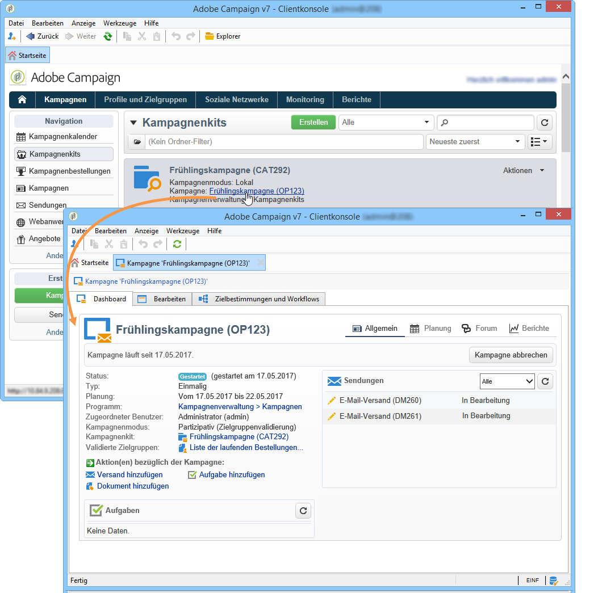

# Auf Kampagnen zugreifen{#accessing-campaigns}

Sobald eine Kampagne bestellt, die Bestellung validiert und das Verfügbarkeitsdatum erreicht wurde, kann sie ausgeführt werden.

Je nach Kampagnentyp und ausgewählten Optionen geschieht dies auf zentraler oder lokaler Ebene.

## Auf die Kampagne zugreifen {#accessing-the-campaign}

Nach abgeschlossener Validierung und Erreichen des Verfügbarkeitsdatums wird die Kampagne lokal erstellt und die lokalen Benutzer werden über die Verfügbarkeit per E-Mail informiert.

Sie wird im Detail der entsprechenden Bestellung angezeigt und kann bearbeitet werden. Über ihr nun vollständiges Dashboard kann die Kampagne lokal verwaltet werden.

Auch über die Kampagnenübersicht in der Rubrik **[!UICONTROL Kampagnen]** besteht Zugriff auf die jeweilige Kampagne.

## Verfügbare Parameter {#available-settings}

Lokalstellen können den Inhalt der Kampagne an die lokalen Bedürfnisse anpassen. Hierzu stehen ihnen alle Elemente des Kampagnen-Dashboards zur Verfügung. Zur lokalen Anpassung werden insbesondere der Zielgruppen-Workflow und gegebenenfalls der Inhalt der Sendungen abgeändert.

## Kampagnenausführung {#campaign-execution}

Jede Lokalstelle kann den Kampagnen-Workflow ausführen und entsprechend der Validierungskonfiguration in der Kampagnen-Vorlage die jeweiligen Validierungen vornehmen.
