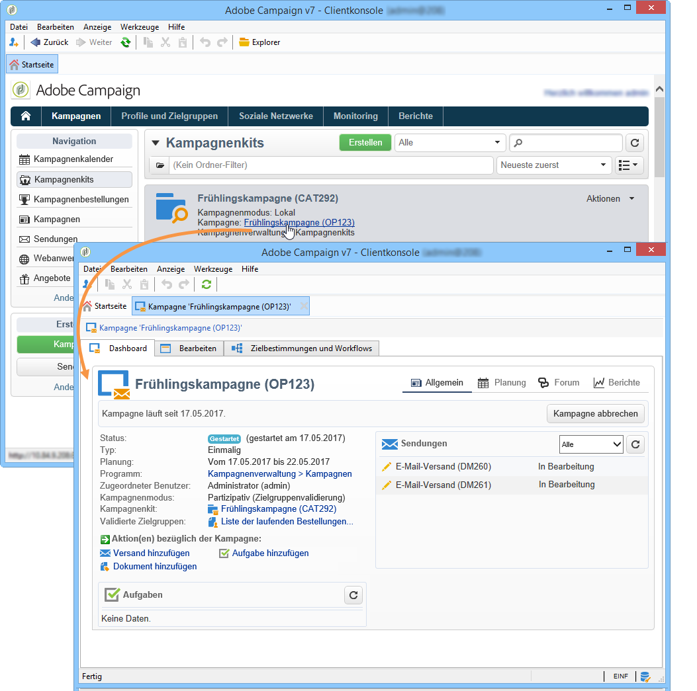

# Zugriff auf Kampagnen{#accessing-campaigns}

Sobald eine Kampagne bestellt, die Bestellung validiert und das Verfügbarkeitsdatum erreicht wurde, kann sie ausgeführt werden.

Je nach Kampagnentyp und ausgewählten Optionen geschieht dies auf zentraler oder lokaler Ebene.

## Zugriff auf eine Kampagne {#accessing-the-campaign}

Nach abgeschlossener Validierung und Erreichen des Verfügbarkeitsdatums wird die Kampagne lokal erstellt und kann verwendet werden. Lokale Benutzende werden über die Verfügbarkeit informiert.

Sie wird im Detail des entsprechenden Auftrags angezeigt und kann bearbeitet werden. Das vollständige Dashboard ermöglicht die lokale Verwaltung.

Auch über die Kampagnenübersicht in der Rubrik **[!UICONTROL Kampagnen]** besteht Zugriff auf die jeweilige Kampagne.

## Verfügbare Parameter {#available-settings}

Lokalstellen können den Inhalt der Kampagne an die lokalen Bedürfnisse anpassen. Hierzu stehen ihnen alle Elemente des Kampagnen-Dashboards zur Verfügung. Ihre Hauptaufgabe besteht darin, den Zielgruppenbestimmungs-Workflow anzupassen und möglicherweise die Versandinhalte zu personalisieren.

## Kampagnenausführung {#campaign-execution}

Jede Lokalstelle kann den Kampagnen-Workflow ausführen und entsprechend der Validierungskonfiguration in der Kampagnen-Vorlage die jeweiligen Validierungen vornehmen.
