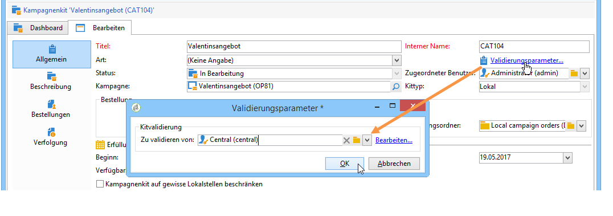
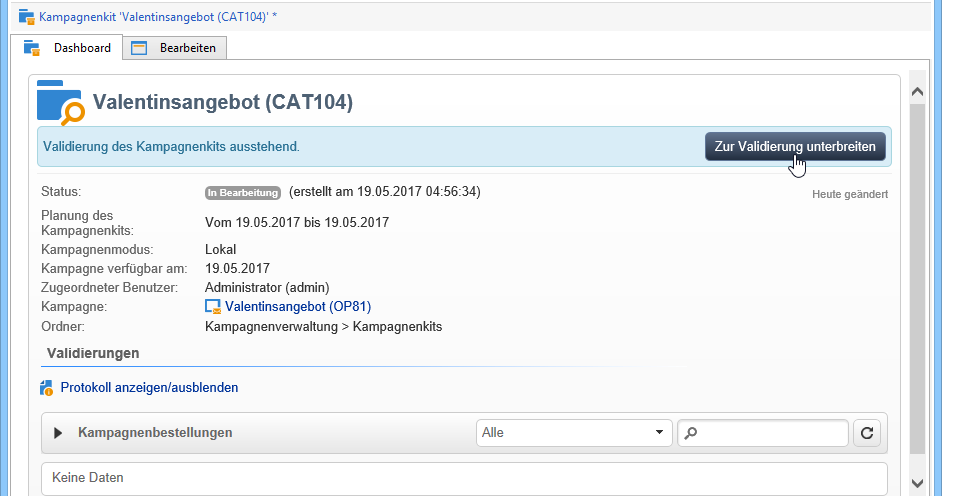
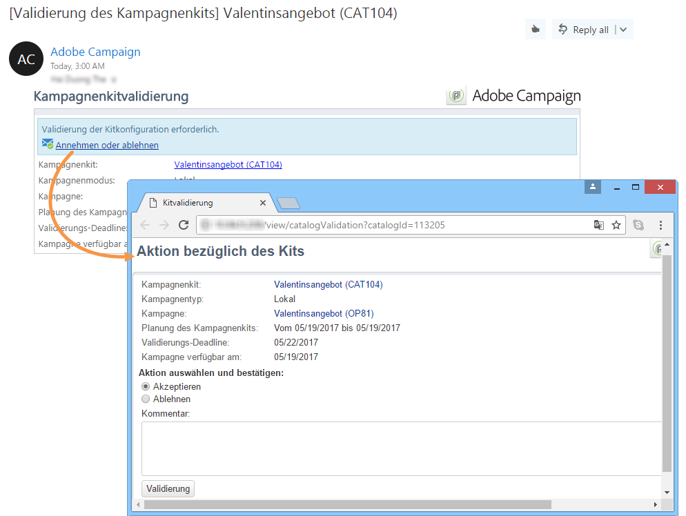
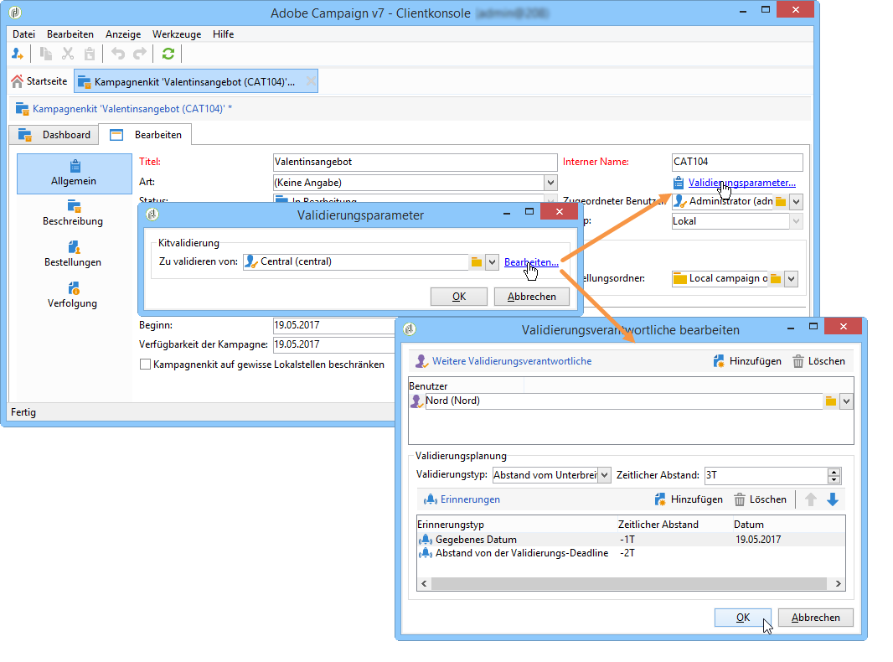
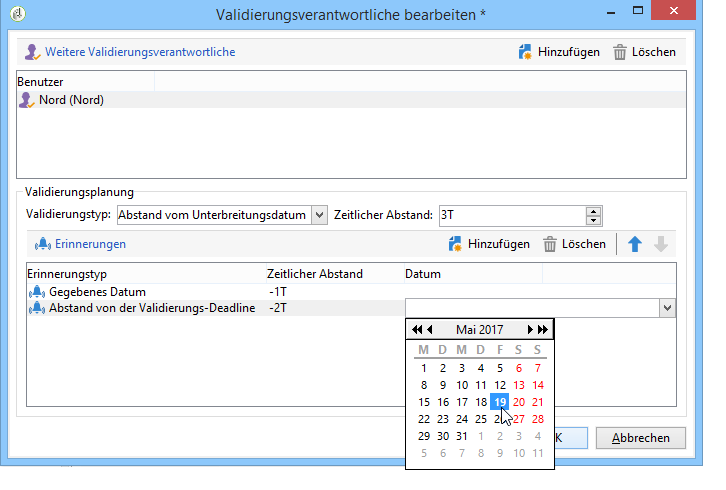
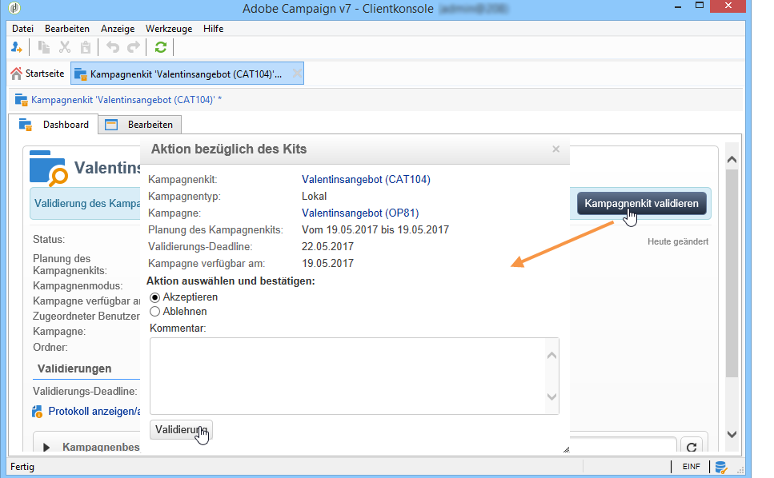

# Veröffentlichen des Kampagnenkits{#publishing-the-campaign-package}

Die Benutzenden der Zentralstelle veröffentlichen in der **[!UICONTROL Liste der Kampagnenkits]** die Kits, die den Lokalstellen zur Verfügung gestellt werden sollen.

Bevor sie in der Liste der Kampagnenkits veröffentlicht werden können, müssen die Kampagnenkits von der Zentralstelle genehmigt werden. Zu diesem Zweck können Sie Validierungsverantwortliche oder Gruppen von Validierungsverantwortlichen über den Link **[!UICONTROL Validierungsparameter]** im Kampagnenkit festlegen.

## Validierenden Benutzer bestimmen {#assigning-a-reviewer}

Um den Validierer anzugeben, klicken Sie auf den Link **[!UICONTROL Validierungsparameter...]** des Kampagnenkits und wählen Sie den jeweiligen Benutzer in der Dropdown-Liste aus.

Um den Validierungsprozess zu starten, klicken Sie auf die Schaltfläche **[!UICONTROL Zur Validierung unterbreiten]**.

Die für die Validierung verantwortliche Person erhält daraufhin eine Benachrichtigung zur Bestätigung der Verfügbarkeit dieses Kampagnenkits. Die Nachricht enthält einen Link zum Akzeptieren oder Ablehnen der Validierung per Web-Zugriff.

>[!NOTE]
>
>Auf Organisationseinheitsebene können Sie auch validierende Benutzer angeben, um Bestellungen zu validieren. Weitere Informationen hierzu finden Sie unter [Organisationseinheiten](about-distributed-marketing.md#organizational-entities).

## Weitere validierende Benutzer hinzufügen {#adding-other-reviewers}

Über den Link **[!UICONTROL Bearbeiten...]** im Tab **[!UICONTROL Validierungsparameter...]** des Kampagnenkits können weitere validierungsverantwortliche Benutzer hinzugefügt werden.

## Validierungszeitraum {#approval-periods}

Wenn nicht anders angegeben, muss die Validierung innerhalb von drei Tagen ab dem Unterbreitungsdatum erfolgen.

Im Fenster „Validierungsverantwortliche bearbeiten“ können Sie auch Erinnerungen einstellen, um eine oder mehrere Nachrichten zu senden, wenn ein Kampagnenkit nicht genehmigt wurde. Klicken Sie dazu zunächst auf den Link **[!UICONTROL Erinnerung hinzufügen]** und dann auf die Schaltfläche **[!UICONTROL Hinzufügen]**.

Erinnerungen können entweder an einem bestimmten Datum und/oder **x** Tage nach dem Übermittlungsdatum gesendet werden. Die Art der Erinnerung kann in der ersten Spalte der Tabelle mit den Erinnerungen konfiguriert werden. Im unten stehenden Beispiel erhalten die Validierungsverantwortlichen eine Erinnerungsnachricht einen Tag vor Ablauf der Validierungsfrist, also zwei Tage nach dem Unterbreitungsdatum, und eine zweite Erinnerung am 29.1.2014, also zwei Tage vor dem in der Spalte **[!UICONTROL Datum]** ausgewählten Datum.

Sobald diese Definition erfolgt ist und das Paket zur Validierung eingereicht wurde, wird der Ausführungsplan in der Registerkarte **[!UICONTROL Audit]** angezeigt. Er enthält die Bearbeitungsfrist, die basierend auf der vorherigen Konfiguration berechnet wurde, sowie die Termine aller konfigurierten Erinnerungen.

## Validierung über die Adobe Campaign-Konsole {#approving-via-the-adobe-campaign-console}

Wenn kein Validierungsverantwortlicher bestimmt wurde oder keiner der benachrichtigten Benutzer das Kit validiert hat, kann die Validierung direkt über die Schaltfläche **[!UICONTROL Kampagnenkit validieren]** des **[!UICONTROL Dashboards]** des Kampagnenkits oder über die Übersicht der Kits erfolgen.

Nach der Validierung wird die Kampagne veröffentlicht und der Liste hinzugefügt. Sobald das Verfügbarkeitsdatum erreicht ist, kann sie von Lokalstellen verwendet werden. Sofern bei der Kampagnenerstellung Lokalstellen angegeben wurden, werden die Benutzenden in der Benachrichtigungsliste über die Verfügbarkeit der Kampagne benachrichtigt. Wenn zuvor keine Entität angegeben wurde, ist die Kampagne standardmäßig für alle Lokalstellen verfügbar. Weitere Informationen hierzu finden Sie unter [Organisationseinheiten](about-distributed-marketing.md#organizational-entities).
