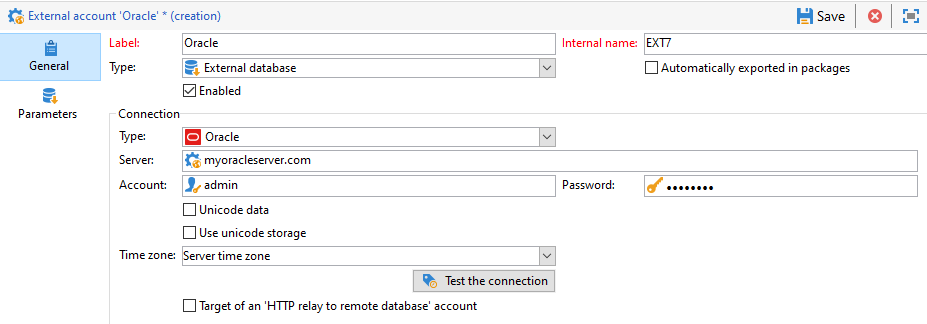

# Zugriff auf Oracle konfigurieren {#configure-access-to-oracle}


Verwenden Sie die [-Option (Federated Data Access](../../installation/using/about-fda.md) (FDA) von Campaign, um in einer externen Datenbank gespeicherte Informationen zu verarbeiten. Gehen Sie wie folgt vor, um den Zugriff auf Oracle zu konfigurieren.

1. Konfigurieren von Oracle unter [Linux](#oracle-linux) oder [Windows](#azure-windows)
1. Konfigurieren des Oracle [externen Kontos](#oracle-external) in Campaign

## Oracle unter Linux {#oracle-linux}

Die Verbindung zu einer externen Oracle-Datenbank über die FDA-Option erfordert die zusätzlichen unten aufgeführten Konfigurationen auf dem Adobe Campaign-Server:

1. Installieren Sie den vollständigen Oracle-Client für Ihre jeweilige Oracle-Version.
1. Fügen Sie der Installation Ihre TNS-Definitionen hinzu. Spezifizieren Sie diese Definitionen dazu in der Datei **tnsnames.ora** im Verzeichnis /etc/oracle. Wenn dieses Verzeichnis nicht vorhanden ist, erstellen Sie es.

   Erstellen Sie dann eine neue TNS_ADMIN-Umgebungsvariable: Exportieren Sie TNS_ADMIN=/etc/oracle und starten Sie das Gerät neu.

1. Integrieren Sie Oracle in Ihren Adobe Campaign-Server (nlserver). Dazu muss die Datei **customer.sh** im Navigationsbaum des Adobe Campaign-Servers im Ordner &quot;nl6&quot; vorhanden sein; und die Datei muss die Links zu den Oracle-Bibliotheken enthalten.

   Beispiel für einen Client in 11.2:

   ```
   export ORACLE_HOME=/usr/lib/oracle/11.2
   export TNS_ADMIN=/etc/oracle
   export LD_LIBRARY_PATH=$ORACLE_HOME/client64/lib:$LD_LIBRARY_PATH
   ```

   >[!NOTE]
   >
   >Diese Werte (insbesondere ORACLE_HOME) hängen von den Installations-Repositorys ab. Stellen Sie sicher, dass Sie Ihre Baumstruktur überprüfen, bevor Sie auf diese Werte verweisen.

1. Installieren Sie die für Oracle nötigen Bibliotheken:

   * **libclntsh.so**

     ```
     cd /usr/lib/oracle/<version>/client<architecture>/lib
     ln -s libclntsh.so.<version> libclntsh.so
     ```

   * **libaio1**

     ```
     apt install libaio1
     or
     yum install libaio1
     ```

1. In Campaign Classic können Sie dann Ihr externes [!DNL Oracle]-Konto konfigurieren. Weiterführende Informationen zur Konfiguration Ihres externen Kontos finden Sie in [diesem Abschnitt](#oracle-external).

## Oracle unter Windows {#oracle-windows}

Die Verbindung zu einer externen Oracle-Datenbank über die FDA-Option erfordert die zusätzlichen unten aufgeführten Konfigurationen auf dem Adobe Campaign-Server:

1. Installieren Sie den Oracle-Client.

1. Erstellen Sie im Ordner C:Oracle eine Datei **tnsnames.ora**, die Ihre TNS-Definition enthält.

1. Fügen Sie eine Umgebungsvariable TNS_ADMIN mit dem Wert C:Oracle hinzu und starten Sie den Computer neu.

1. In Campaign Classic können Sie dann Ihr externes [!DNL Oracle]-Konto konfigurieren. Weiterführende Informationen zur Konfiguration Ihres externen Kontos finden Sie in [diesem Abschnitt](#oracle-external).

## Externes Oracle-Konto {#oracle-external}

Mit dem externen [!DNL Oracle] -Konto können Sie Ihre Campaign-Instanz mit Ihrer externen Oracle-Datenbank verbinden.

1. Wählen Sie in **[!UICONTROL Explorer]** die Option **[!UICONTROL Administration]** &quot;>&quot; **[!UICONTROL Plattform]** &quot;>&quot; **[!UICONTROL Externe Konten]**.

1. Wählen Sie **[!UICONTROL Neu]**.

1. Wählen Sie **[!UICONTROL Externe Datenbank]** als **[!UICONTROL Typ]** Ihres externen Kontos aus.

1. Konfigurieren Sie das externe **[!UICONTROL Oracle]**-Konto. Geben Sie dazu Folgendes an:

   * **[!UICONTROL Typ]**: Oracle

   * **[!UICONTROL Server]**: Name des DNS

   * **[!UICONTROL Konto]**: Name des Benutzers

   * **[!UICONTROL Passwort]**: Passwort des Benutzerkontos

   * **[!UICONTROL Zeitzone]**: Zeitzone des Servers

   
