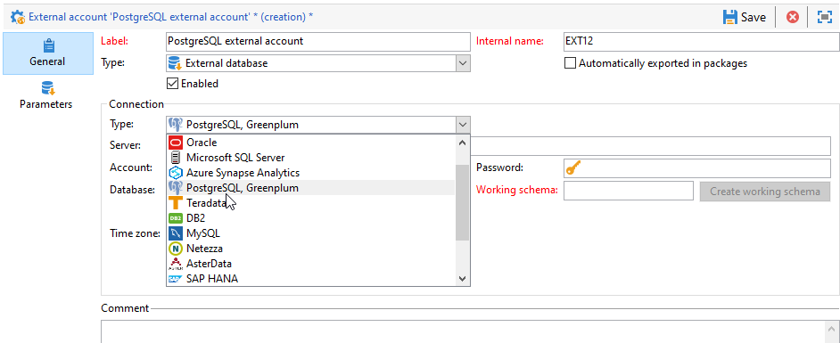

# Zugriff auf PostgreSQL konfigurieren {#configure-fda-postgresql}

Verwenden Sie die **-Option (Federated Data Access** (FDA) von Campaign, um in einer externen PostgreSQL-Datenbank gespeicherte Informationen zu verarbeiten.

## PostgreSQL-Konfiguration {#postgresql-configuration}

Zuerst müssen Sie Libpq installieren. Mit libpq können Clientprogramme Abfragen an den PostgreSQL-Backend-Server senden und die Ergebnisse dieser Abfragen empfangen.

Gehen Sie wie folgt vor, um den Zugriff auf [!DNL PostgreSQL] zu konfigurieren:

* Führen Sie für CentOS den folgenden `sudo apt-get -y install libpq-dev` aus.

* Führen Sie unter Linux den folgenden Befehl `yum install postgresql-devel` aus.

* Für Windows wird Libpq über `libpq.dll` implementiert, das in der Adobe Campaign-Installation enthalten ist.

In Adobe Campaign können Sie dann Ihr externes [!DNL PostgreSQL]-Konto konfigurieren. Weiterführende Informationen zur Konfiguration Ihres externen Kontos finden Sie in [diesem Abschnitt](#postgresql-external).

## Externes PostgreSQL-Konto {#postgresql-external}

>[!NOTE]
>
> PostgreSQL ist unter CentOS 7 und 6 verfügbar.

Sie müssen ein [!DNL PostgreSQL] externes Konto erstellen, um Ihre Campaign-Instanz mit Ihrer [!DNL PostgreSQL] externen Datenbank zu verbinden.

1. Klicken Sie **[!UICONTROL Campaign-]** auf **[!UICONTROL Administration]** &quot;>&quot; **[!UICONTROL Plattform]** &quot;>&quot; **[!UICONTROL Externe Konten]**.

1. Wählen Sie **[!UICONTROL Neu]** aus.

1. Wählen Sie **[!UICONTROL Externe Datenbank]** als **[!UICONTROL Typ]** Ihres externen Kontos aus.

1. Wählen **[!UICONTROL unter &quot;]**&quot; [!DNL PostgreSQL, Greenplum] aus der Dropdown **[!UICONTROL Typ]** aus.

   

1. Konfigurieren Sie die **[!UICONTROL PostgreSQL]** Authentifizierung für externe Konten:

   * **[!UICONTROL Server]**: URL des [!DNL PostgreSQL].

   * **[!UICONTROL Konto]**: Name des Benutzers.

   * **[!UICONTROL Password]**: Kennwort für Benutzerkonto.

   * **[!UICONTROL Datenbank]**: Name der Datenbank (optional).

   * **[!UICONTROL Arbeitsschema]**: Name Ihres Arbeitsschemas. [Weitere Informationen](https://www.postgresql.org/docs/current/ddl-schemas.html)

   * **[!UICONTROL Zeitzone]**: Die Zeitzone wird in [!DNL PostgreSQL] festgelegt. [Weitere Informationen](https://www.postgresql.org/docs/7.2/timezones.html)

1. Klicken Sie auf den Tab **[!UICONTROL Parameter]** und dann auf die Schaltfläche **[!UICONTROL Funktionen bereitstellen]**, um Funktionen zu erstellen.

   >[!NOTE]
   >
   >Damit alle Funktionen verfügbar sind, müssen Sie die Adobe Campaign SQL-Funktionen in der Remote-Datenbank erstellen. Weiterführende Informationen dazu finden Sie auf dieser [Seite](../../configuration/using/adding-additional-sql-functions.md).

1. Klicken Sie **[!UICONTROL Speichern]** wenn Ihre Konfiguration abgeschlossen ist.

Der Connector unterstützt die folgenden Optionen:

| Option | Beschreibung |
|:-:|:-:|
| PGSQL_CONNECT_TIMEOUT | Maximale Wartezeit auf Verbindung in Sekunden.  Weiterführende Informationen hierzu finden Sie in der [Dokumentation zu PostgreSQL](https://www.postgresql.org/docs/12/libpq-connect.html#LIBPQ-CONNECT-CONNECT-TIMEOUT). |
| PGSQL_KEEPALIVES_IDLE | Anzahl der Sekunden Inaktivität, nach denen das TCP eine Keepalive-Nachricht an den Server senden sollte.  Weiterführende Informationen hierzu finden Sie in der [Dokumentation zu PostgreSQL](https://www.postgresql.org/docs/12/libpq-connect.html#LIBPQ-KEEPALIVES-IDLE). |
| PGSQL_KEEPALIVES_INTVL | Anzahl der Sekunden, nach denen die TCP-Keepalive-Nachricht, die nicht vom Server quittiert wurde, erneut übertragen werden soll.   Weiterführende Informationen hierzu finden Sie in der [Dokumentation zu PostgreSQL](https://www.postgresql.org/docs/12/libpq-connect.html#LIBPQ-KEEPALIVES-INTERVAL). |
| PGSQL_KEEPALIVES_CNT | Anzahl der TCP-Keepalives, die verloren gehen können, bevor die Verbindung des Clients zum Server als inaktiv angesehen wird.  Weiterführende Informationen hierzu finden Sie in der [Dokumentation zu PostgreSQL](https://www.postgresql.org/docs/12/libpq-connect.html#LIBPQ-KEEPALIVES-COUNT). |
