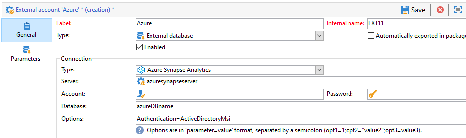

# Zugriff auf Azure Synapse konfigurieren {#configure-access-to-azure-synapse}


Verwenden von Campaign [Federated Data Access](../../installation/using/about-fda.md) (FDA), um in externen Datenbanken gespeicherte Informationen zu verarbeiten. Gehen Sie wie folgt vor, um den Zugriff auf **Microsoft Azure synapse Analytics**.

1. Konfigurieren von Azure synapse on [CentOS](#azure-centos), [Windows](#azure-windows) oder [Debian](#azure-debian)
1. Azure synapse konfigurieren [externes Konto](#azure-external) in Campaign

## Azure Synapse unter CentOS {#azure-centos}

>[!CAUTION]
>
>* Sie benötigen Root-Berechtigungen, um einen ODBC-Treiber zu installieren.
>* Red Hat Enterprise ODBC-Treiber von Microsoft können auch mit CentOS verwendet werden, um eine Verbindung zum SQL-Server herzustellen.
>* Version 13.0 funktioniert mit Red Hat 6 und 7.

Gehen Sie wie folgt vor, um Azure synapse unter CentOS zu konfigurieren:

1. Installieren Sie zunächst den ODBC-Treiber. Sie finden ihn auf dieser [Seite](https://www.microsoft.com/en-us/download/details.aspx?id=50420).

   >[!NOTE]
   >
   >Dies gilt ausschließlich für Version 13 des ODBC-Treibers.

   ```
   sudo su
   curl https://packages.microsoft.com/config/rhel/6/prod.repo > /etc/yum.repos.d/mssql-release.repo
   exit
   # Uninstall if already installed Unix ODBC driver
   sudo yum remove unixODBC-utf16 unixODBC-utf16-devel #to avoid conflicts
   
   sudo ACCEPT_EULA=Y yum install msodbcsql
   
   sudo ACCEPT_EULA=Y yum install mssql-tools
   echo 'export PATH="$PATH:/opt/mssql-tools/bin"' >> ~/.bash_profile
   echo 'export PATH="$PATH:/opt/mssql-tools/bin"' >> ~/.bashrc
   source ~/.bashrc
   
   # the Microsoft driver expects unixODBC to be here /usr/lib64/libodbc.so.1, so add soft links to the '.so.2' files
   cd /usr/lib64
   sudo ln -s libodbccr.so.2   libodbccr.so.1
   sudo ln -s libodbcinst.so.2 libodbcinst.so.1
   sudo ln -s libodbc.so.2     libodbc.so.1
   
   # Set the path for unixODBC
   export ODBCINI=/usr/local/etc/odbc.ini
   export ODBCSYSINI=/usr/local/etc
   source ~/.bashrc
   
   #Add a DSN information to /etc/odbc.ini
   sudo vi /etc/odbc.ini
   
   #Add the following:
   [Azure Synapse Analytics]
   Driver      = ODBC Driver 13 for SQL Server
   Description = Azure Synapse Analytics DSN
   Trace       = No
   Server      = [insert your server here]
   ```

1. Bei Bedarf können Sie unixODBC-Entwicklungskopfzeilen installieren, indem Sie den folgenden Befehl ausführen:

   ```
   sudo yum install unixODBC-devel
   ```

1. Nach der Installation der Treiber können Sie Ihren ODBC-Treiber testen und überprüfen und Ihre Datenbank bei Bedarf abfragen. Führen Sie den folgenden Befehl aus:

   ```
   /opt/mssql-tools/bin/sqlcmd -S yourServer -U yourUserName -P yourPassword -q "your query" # for example -q "select 1"
   ```

1. In Campaign können Sie dann Ihre [!DNL Azure Synapse] externes Konto. Weitere Informationen zur Konfiguration Ihres externen Kontos finden Sie unter [diesem Abschnitt](#azure-external).

1. Da Azure Synapse Analytics über den TCP-Port 1433 kommuniziert, müssen Sie diesen Port in Ihrer Firewall öffnen. Verwenden Sie den folgenden Befehl:

   ```
   firewall-cmd --permanent --add-rich-rule='rule family="ipv4" source address="[server_ip_here]/32" port port="1433" protocol="tcp" accept'
   # you can ping your hostname and the ping command will translate the hostname to IP address which you can use here
   ```

   >[!NOTE]
   >
   >Um Kommunikation von Azure Synapse Analytics aus zu ermöglichen, müssen Sie eventuell Ihre öffentliche IP zur Zulassungsliste hinzufügen. Lesen Sie dazu die [Azure-Dokumentation](https://docs.microsoft.com/en-us/azure/sql-database/sql-database-firewall-configure#use-the-azure-portal-to-manage-server-level-ip-firewall-rules).

1. Führen Sie bei &quot;iptables&quot; den folgenden Befehl aus:

   ```
   iptables -A OUTPUT -p tcp -d [server_hostname_here] --dport 1433 -j ACCEPT
   ```

## Azure Synapse unter Windows {#azure-windows}

>[!NOTE]
>
>Dies gilt ausschließlich für Version 13 des ODBC-Treibers; Adobe Campaign Classic kann aber auch SQL Server Native Client-Treiber 11.0 und 10.0 verwenden.

So konfigurieren Sie Azure Synapse unter Windows:

1. Installieren Sie zunächst den Microsoft ODBC-Treiber. Sie finden sie unter [diese Seite](https://www.microsoft.com/en-us/download/details.aspx?id=50420).

1. Wählen Sie die folgenden zu installierenden Dateien aus:

   ```
   your_language\your_architecture\msodbcsql.msi (i.e: English\X64\msodbcsql.msi)
   ```

1. Sobald der ODBC-Treiber installiert ist, können Sie ihn bei Bedarf testen. Weiterführende Informationen hierzu finden Sie auf dieser [Seite](https://docs.microsoft.com/en-us/sql/connect/odbc/windows/system-requirements-installation-and-driver-files?view=sql-server-ver15#installing-microsoft-odbc-driver-for-sql-server).

1. In Campaign Classic können Sie dann Ihr externes [!DNL Azure Synapse]-Konto konfigurieren. Weitere Informationen zur Konfiguration Ihres externen Kontos finden Sie unter [diesem Abschnitt](#azure-external).

1. Da Azure Synapse Analytics über den TCP-Port 1433 kommuniziert, müssen Sie diesen Port in der Windows Defender Firewall öffnen. Weitere Informationen hierzu finden Sie in der [Windows-Dokumentation](https://docs.microsoft.com/en-us/windows/security/threat-protection/windows-firewall/create-an-outbound-program-or-service-rule).

## Azure Synapse unter Debian {#azure-debian}

**Voraussetzungen:**

* Sie benötigen Stammberechtigungen, um einen ODBC-Treiber zu installieren.
* Zur Installation des msodbcsql-Packages ist curl erforderlich. Führen Sie den folgenden Befehl aus, wenn Sie curl nicht installiert haben:

  ```
  sudo apt-get install curl
  ```

So konfigurieren Sie Azure Synapse unter Debian:

1. Installieren Sie zunächst den Microsoft ODBC-Treiber für SQL Server. Verwenden Sie folgende Befehle, um den ODBC-Treiber 13.1 für SQL Server zu installieren:

   ```
   sudo su
   curl https://packages.microsoft.com/keys/microsoft.asc | apt-key add -
   curl https://packages.microsoft.com/config/debian/8/prod.list > /etc/apt/sources.list.d/mssql-release.list
   exit
   sudo apt-get update
   sudo ACCEPT_EULA=Y apt-get install msodbcsql
   ```

1. Wenn Sie den Fehler **&quot;Der Methodentreiber /usr/lib/apt/methods/https konnte nicht gefunden werden&quot;** beim Aufruf von **sudo apt-get update** erhalten, müssen Sie diesen Befehl ausführen:

   ```
   sudo apt-get install apt-transport-https ca-certificates
   ```

1. Installieren Sie jetzt &quot;mssql-tools&quot; mit den folgenden Befehlen. &quot;mssql-tools&quot; sind erforderlich, um das Dienstprogramm Bulk Copy Program (BCP) zu nutzen und Abfragen auszuführen.

   ```
   sudo ACCEPT_EULA=Y apt-get install mssql-tools
   echo 'export PATH="$PATH:/opt/mssql-tools/bin"' >> ~/.bash_profile
   echo 'export PATH="$PATH:/opt/mssql-tools/bin"' >> ~/.bashrc
   source ~/.bashrc
   ```

1. Bei Bedarf können Sie unixODBC-Entwicklungskopfzeilen installieren, indem Sie den folgenden Befehl ausführen:

   ```
   sudo yum install unixODBC-devel
   ```

1. Nach der Installation der Treiber können Sie Ihren ODBC-Treiber testen und überprüfen und Ihre Datenbank bei Bedarf abfragen. Führen Sie den folgenden Befehl aus:

   ```
   /opt/mssql-tools/bin/sqlcmd -S yourServer -U yourUserName -P yourPassword -q "your query" # for example -q "select 1"
   ```

1. In Campaign Classic können Sie nun Ihr externes [!DNL Azure Synapse]-Konto konfigurieren. Weitere Informationen zur Konfiguration Ihres externen Kontos finden Sie unter [diesem Abschnitt](#azure-external).

1. Um &quot;iptables&quot; unter Debian zu konfigurieren und die Verbindung mit Azure Synapse Analytics sicherzustellen, aktivieren Sie mit dem folgenden Befehl den ausgehenden TCP-Port 1433 für Ihren Hostname:

   ```
   iptables -A OUTPUT -p tcp -d [server_hostname_here] --dport 1433 -j ACCEPT
   ```

   >[!NOTE]
   >
   >Um Kommunikation von Azure Synapse Analytics aus zu ermöglichen, müssen Sie eventuell Ihre öffentliche IP zur Zulassungsliste hinzufügen. Lesen Sie dazu die [Azure-Dokumentation](https://docs.microsoft.com/en-us/azure/sql-database/sql-database-firewall-configure#use-the-azure-portal-to-manage-server-level-ip-firewall-rules).

## Externes azure synapse-Konto {#azure-external}

Über das externe [!DNL Azure Synapse]-Konto können Sie Ihre Campaign-Instanz mit Ihrer externen Azure Synapse-Datenbank verbinden.

So erstellen Sie Ihre [!DNL Azure Synapse] Gehen Sie wie folgt vor:

1. Von Campaign **[!UICONTROL Explorer]** klicken **[!UICONTROL Administration]** &#39;>&#39; **[!UICONTROL Plattform]** &#39;>&#39; **[!UICONTROL Externe Konten]**.

1. Wählen Sie **[!UICONTROL Neu]** aus.

1. Wählen Sie **[!UICONTROL Externe Datenbank]** als **[!UICONTROL Typ]** Ihres externen Kontos aus.

   

1. under **[!UICONTROL Konfiguration]** auswählen **[!UICONTROL azure synapse Analytics]** von **[!UICONTROL Typ]** Dropdown-Liste.

   

1. Konfigurieren Sie die [!DNL Azure Synapse] externes Konto:

   * Für die Standardauthentifizierung müssen Sie Folgendes angeben:

      * **[!UICONTROL Server]**: URL des Azure Synapse-Servers

      * **[!UICONTROL Konto]**: Name des Benutzers

      * **[!UICONTROL Passwort]**: Passwort des Benutzerkontos

      * **[!UICONTROL Datenbank]**: Name der Datenbank

     

   * Für die systemzugeordnete verwaltete Identitätsauthentifizierung müssen Sie Folgendes angeben:

      * **[!UICONTROL Server]**: URL des Azure Synapse-Servers

      * **[!UICONTROL Datenbank]**: Name der Datenbank

      * **[!UICONTROL Optionen]**: Fügen Sie die folgende Syntax hinzu `Authentication=ActiveDirectoryMsi`

     

1. Klicken Sie auf **[!UICONTROL Speichern]**.

Der Connector unterstützt die folgenden Optionen:

| Option | Beschreibung  |
|---|---|
| Authentifizierung | Vom Connector unterstützte Authentifizierungstyp. Aktuell unterstützter Wert: ActiveDirectoryMSI. </br>Weitere Informationen finden Sie unter [SQL doc](https://docs.microsoft.com/en-us/sql/connect/odbc/using-azure-active-directory?view=sql-server-ver15#example-connection-strings) (Beispiel für Verbindungszeichenfolgen n°8). |
