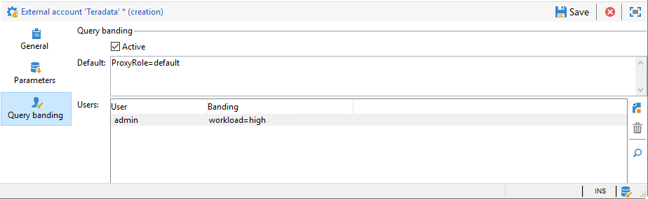

# Zugriff auf Teradata konfigurieren {#configure-access-to-teradata}

Verwenden Sie die Option &quot;Kampagne [Federated Data Access](../../installation/using/about-fda.md) (FDA)&quot;, um in externen Datenbanken gespeicherte Informationen zu verarbeiten. Gehen Sie wie folgt vor, um den Zugriff auf Teradata zu konfigurieren.

1. Installieren und Konfigurieren von [Teradata-Treibern](#teradata-config)
1. Teradata- [Externe Konto](#teradata-external) in Kampagne konfigurieren
1. Einrichten [zusätzlicher Konfigurationen](#teradata-additional-configurations) für Teradata- und Kampagne-Server

## Teradata-Konfiguration {#teradata-config}

Sie müssen die Treiber für Teradata installieren, damit eine Verbindung zur Kampagne hergestellt werden kann.

1. Installieren Sie den [ODBC-Treiber für Teradata](https://downloads.teradata.com/download/connectivity/odbc-driver/linux).

   Er besteht aus drei Packages, die in der folgenden Reihenfolge auf Red Hat (oder CentOS)/Suse installiert werden können:

   * TeraGSS
   * tdicu1510 (Installation mit setup_wrapper.sh)
   * tdodbc1510 (Installation mit setup_wrapper.sh)

1. Konfigurieren Sie den ODBC-Treiber. Die Konfiguration kann in den Standarddateien ausgeführt werden: **/etc/odbc.ini** für allgemeine Parameter und /etc/odbcinst.ini zur Deklarierung der Treiber:

   * **/etc/odbc.ini**

      ```
      [ODBC]
      InstallDir=/etc/
      ```

      &quot;InstallDir&quot; entspricht dem Pfad der Datei **odbcinst.ini**.

   * **/etc/odbcinst.ini**

      ```
      [ODBC DRIVERS]
      teradata=Installed
      
      [teradata]
      Driver=/opt/teradata/client/15.10/lib64/tdata.so
      APILevel=CORE
      ConnectFunctions=YYY
      DriverODBCVer=3.51
      SQLLevel=1
      ```

1. Spezifizieren Sie die Umgebungsvariablen des Adobe Campaign-Servers:

   * **LD_LIBRARY_PATH**: /opt/teradata/client/15.10/lib64 und /opt/teradata/client/15.10/odbc_64/lib.
   * **ODBCINI**: Pfad der odbc.ini-Datei (z. B. /etc/odbc.ini).
   * **NLSPATH**: Pfad der opermsgs.cat-Datei (/opt/teradata/client/15.10/msg/opermsgs.cat)

>[!NOTE]
>
>Die Verbindung zu einer externen Teradata-Datenbank in FDA erfordert zusätzliche Konfigurationsschritte auf dem Adobe Campaign-Server. [Mehr dazu](#teradata-additional-configurations).


## Externes Teradata-Konto{#teradata-external}

Über das externe Teradata-Konto können Sie Ihre Kampagneninstanz mit Ihrer externen Teradata-Datenbank verbinden.

1. From Campaign **[!UICONTROL Explorer]**, click **[!UICONTROL Administration]** / **[!UICONTROL Platform]** / **[!UICONTROL External accounts]**.

1. Klicken Sie auf **[!UICONTROL Neu]** und wählen Sie **[!UICONTROL Externe Datenbank]** als **[!UICONTROL Typ]** aus.

   

1. Zum Konfigurieren des externen **[!UICONTROL Teradata]**-Kontos müssen Sie Folgendes angeben:

   * **[!UICONTROL Typ]**: Wählen Sie den **[!UICONTROL Teradata]** -Typ.

   * **[!UICONTROL Server]**: URL oder Name des Teradata-Servers

   * **[!UICONTROL Konto]**: Name des Kontos, das für den Zugriff auf die Teradata-Datenbank verwendet wird

   * **[!UICONTROL Kennwort]**: Kennwort für die Verbindung zur Teradata-Datenbank

   * **[!UICONTROL Datenbank]**: Name der Datenbank (optional)

   * **[!UICONTROL Optionen]**: Optionen, die über Teradata weitergegeben werden sollen. Verwenden Sie das folgende Format: &#39;parameter=value&#39;. Verwenden Sie eine Halbspalte als Trennzeichen zwischen Werten.

   * **[!UICONTROL Zeitzone]**: Zeitzone in Teradata eingestellt. [Mehr dazu](#timezone)

### Query Banding

Wenn sich mehrere Adobe Campaign-Benutzer mit demselben externen FDA-Teradata-Konto verbinden, können Sie im Tab **[!UICONTROL Query Banding]** einen Satz von Schlüssel/Wert-Paaren für eine Sitzung festlegen.



Wenn diese Option konfiguriert ist, sendet Adobe Campaign jedes Mal, wenn ein Kampagnen-Benutzer eine Abfrage in der Teradata-Datenbank ausführt, Metadaten, die aus einer Liste von Schlüsseln bestehen, die diesem Benutzer zugeordnet sind. Diese Daten können dann von Teradata-Administratoren zu Prüfzwecken oder zur Verwaltung von Zugriffsrechten verwendet werden.

>[!NOTE]
>
>Weitere Informationen zu **[!UICONTROL Query Banding]** finden Sie im [Teradata-Handbuch](https://docs.teradata.com/reader/cY5B~oeEUFWjgN2kBnH3Vw/a5G1iz~ve68yTMa24kVjVw).

Gehen Sie wie folgt vor, um die Abfrage zu konfigurieren:

1. Verwenden Sie den **[!UICONTROL Standardwert]** , um ein Standardband für die Abfrage einzugeben, das verwendet wird, wenn ein Benutzer über kein zugehöriges Abfragen-Band verfügt. Wenn dieses Feld leer gelassen wird, können Benutzer ohne Abfrage Teradata nicht verwenden.

1. Verwenden Sie das Feld **[!UICONTROL Benutzer]** , um für jeden Benutzer ein Abfrage-Band anzugeben. Sie können so viele Schlüssel/Wert-Paare hinzufügen, wie Sie benötigen, z. B. priority=1;workload=high. Wenn dem Benutzer kein Abfrage-Band zugewiesen ist, wird das Feld &quot; **[!UICONTROL Standard]** &quot;angewendet.

1. Markieren Sie die Option **[!UICONTROL Aktiv]**, um diese Funktion zu aktivieren.

#### Fehlerbehebung bei externen Konten {#external-account-troubleshooting}

Wenn beim Testen der Verbindung der Fehler **TIM-030008 Datum &#39;2&#39;: fehlende Zeichen (iRc = -53)** auftritt, stellen Sie sicher, dass der ODBC-Treiber korrekt installiert ist und LD_LIBRARY_PATH (Linux)/PATH (Windows) für den Campaign-Server festlegt wurde.

Der Fehler **ODB-240000 ODBC-Fehler: [Microsoft][ODBC Driver Manager]-Datenquellenname nicht gefunden und kein Standardtreiber angegeben.** tritt unter Windows auf, wenn Sie einen 16.X-Treiber verwenden. Adobe Campaign erwartet, dass Teradata in odbcinst.ini den Namen „{teradata}“ hat.

* Ab Kampagne 18.10 können Sie ODBCDRiverName=&quot;Teradata Database ODBC Driver 16.10&quot; in den Optionen des Externen Kontos hinzufügen. Die Versionsnummer kann sich ändern. Führen Sie odbcad32.exe aus und gehen Sie zum Treiber-Tab, um den genauen Namen abzurufen.

* Wenn Sie eine ältere Version der Kampagne verwenden, müssen Sie den Teradata-Abschnitt von odbcinst.ini, der von der Treiberinstallation erstellt wurde, in einen neuen Abschnitt mit dem Namen Teradata kopieren. In diesem Fall kann Regedit verwendet werden. If your base is in latin1, you will have to add **APICharSize=1** in the options.

## Ergänzende Konfigurationen {#teradata-additional-configurations}

<!--
### Compatibility {#teradata-compatibility}

**Based in Unicode**

| Database version | Driver version |  Minimal Campaign version required |  Note |
|:-:|:-:|:-:|:-:|
| 15  |  15 |  Campaign Classic 17.9 | Under Linux: Queries with timestamp may fail (fixed in build 8937 for 18.4 and 8977 for 18.10) In debug mode, warnings relative to bad memory usage in the driver may occur. |
| 15  | 16  | Campaign Classic 17.9  | Recommended setup for a Teradata 15 database under Linux.  |
|  16 | 16  | Campaign Classic 18.10 |  Unicode characters with surrogate pairs are not fully handled. Using surrogate characters in data should work. Using surrogates in a filtering condition of a query will not work without this change. |
| 16  |  15 |  Campaign Classic 19.0 |  &nbsp; |

**Based in Latin1**

Versions previous to Adobe Campaign Classic 17.9 only supported Teradata Latin-1 database.

Starting from Adobe Campaign Classic 17.9, we now support by default Teradata database in Unicode.

Customers with a Latin-1 Teradata database migrating to a recent Campaign Classic release will have to add the parameter APICharSize=1 in the options of the external account.
-->

### Benutzerkonfiguration {#user-configuration}

Für die externe Datenbank sind die folgenden Rechte erforderlich: Erstellen/Ablegen/Ausführen von benutzerdefinierten Prozeduren, Erstellen/Ablegen/Einfügen/Auswählen von Tabellen. Möglicherweise müssen Sie auch Benutzermodusfunktionen erstellen, wenn Sie die Funktionen md5 und sha2 in Ihrer Adobe Campaign-Instanz verwenden möchten.

Stellen Sie sicher, dass Sie die richtige Zeitzone konfigurieren. Sie sollte mit der Zeitzone übereinstimmen, die in dem externen Konto eingestellt wird, das in der Adobe Campaign-Instanz erstellt wurde.

Adobe Campaign legt keinen Schutzmodus (Fallback) für die Objekte fest, die in der Datenbank erstellt werden. Möglicherweise müssen Sie einen Standardwert für den Benutzer festlegen, über den sich Adobe Campaign mit der Teradata-Datenbank verbindet. Folgende Abfrage wird dabei verwendet:

| Standard-Fallback deaktivieren |
| :-: |
| ```MODIFY USER $login$ AS NO FALLBACK;``` |

### MD5-Installation {#md5-installation}

Wenn Sie MD5-Funktionen in Ihrer Adobe Campaign-Instanz verwenden möchten, müssen Sie die Benutzermodusfunktion in Ihrer Teradata-Datenbank von dieser [Seite](https://downloads.teradata.com/download/extensibility/md5-message-digest-udf) aus installieren (md5_20080530.zip).

Der sha1-Wert der heruntergeladenen Datei lautet wie folgt: 65cc0bb6935f72fcd84fef1ebcd64c00115dfd1e.

Installieren von MD5:

1. Entpacken Sie die Datei md5_20080530.zip.

1. Wechseln Sie zum Verzeichnis „md5/src“.

1. Stellen Sie mit BTEQ eine Verbindung zu Ihrer Teradata-Datenbank her.

1. Führen Sie den folgenden bteq-Befehl aus:

   ```
   .run file = hash_md5.btq
   ```

### SHA-2-Installation {#sha2-installation}

Wenn Sie SHA-2-Funktionen in Ihrer Adobe Campaign-Instanz verwenden möchten, müssen Sie die Benutzermodusfunktion in Ihrer Teradata-Datenbank von dieser [Seite](https://github.com/akuroda/teradata-udf-sha2/archive/v1.0.zip) aus installieren (teradata-udf-sha2-1.0.zip).

Der SHA-1-Wert der heruntergeladenen Datei lautet wie folgt: e87438d37424836358bd3902cf1adeb629349780.

Installieren von SHA-2:

1. Entpacken Sie die Datei teradata-udf-sha2-1.0.zip.

1. Wechseln Sie zum Verzeichnis „teradata-udf-sha2-1.0/src“.

1. Stellen Sie mit BTEQ eine Verbindung zu Ihrer Teradata-Datenbank her.

1. Führen Sie die beiden folgenden BTEQ-Befehle aus:

   ```
   .run file = hash_sha256.sql
   .run file = hash_sha512.sql
   ```

### UDF_UTF16TO8-Installation {#UDF-UTF16TO8-installation}

Wenn Sie udf_utf16to8-Funktionen in Ihrer Adobe Campaign-Instanz verwenden möchten, müssen Sie die Benutzermodusfunktion in Ihrer Teradata-Datenbank über das **Teradata-Unicode-Toolkit** auf dieser [Seite](https://downloads.teradata.com/download/tools/unicode-tool-kit) installieren (utk_release1.7.0.0.zip).

Der SHA-1-Wert der heruntergeladenen Datei lautet wie folgt: e58235f434f52c71316a577cb48e20b97d24f470.

Installieren von udf_utf16to8:

1. Entpacken Sie die Datei utk_release1.7.0.0.zip.

1. Suchen Sie in den extrahierten Dateien nach udf_utf16to8.o und navigieren Sie zum Verzeichnis, das die Datei enthält. Es sollte diesen Namen aufweisen: utk_release1.7.0.0/utk_release1.7.0.0/04 TranslationUDFs/01 Teradata UDFs/suselinux-x8664/udf_installation/.

1. Stellen Sie mit BTEQ eine Verbindung zu Ihrer Teradata-Datenbank her.

1. Geben Sie den folgenden BTEQ-Befehl ein:

   ```
   REPLACE FUNCTION udf_utf16to8 (
   inputString VARCHAR(8000) CHARACTER SET UNICODE
   ) RETURNS VARCHAR(16000) CHARACTER SET LATIN
   LANGUAGE C
   NO SQL
   EXTERNAL NAME 'CO!i18n103!udf_utf16to8.o!F!udf_utf16to8'
   PARAMETER STYLE SQL;
   
   -- Test: should return 410042
   SELECT CAST(Char2HexInt(UDF_UTF16to8(_UNICODE'004100000042'XC)) AS VARCHAR(100));
   ```

## Campaign-Serverkonfiguration für Linux {#campaign-server-linux}

Für die Treiberinstallation ist Folgendes erforderlich:

* Teradata-ODBC-Treiber, den Sie auf dieser [Seite](https://downloads.teradata.com/download/connectivity/odbc-driver/linux) finden

* Teradata-Tools und -Dienstprogramme (für Massenladevorgänge), die Sie auf dieser [Seite](https://downloads.teradata.com/download/tools/teradata-tools-and-utilities-linux-installation-package-0) finden

Dateinamen und SHA-1:

* tdodbc1620__linux_indep.16.20.00.00-1.tar.gz 121fdd978b56fe1304fc5cb7819741b0847f44fd

* TeradataToolsAndUtilitiesBase__linux_indep.16.20.01.00.tar.gz b 29d0af5ffd8dcf68a9dbbaa6f8639387b19c563

Wenn für Ihre Linux-Distribution kein Paket vorhanden ist, können Sie die Installation wie beschrieben auf einem CentOS 7 vornehmen (z. B. mit Docker) und dann den Inhalt von „/opt/teradata“ auf Ihren Adobe Campaign-Server kopieren.

### ODBC-Treiberinstallation {#odbc-installation}

Installieren des ODBC-Treibers:

1. Entpacken Sie die Datei tdodbc1620__linux_indep.16.20.00.00-1.tar.gz.

1. Wechseln Sie zum Verzeichnis „tdodbc1620“.

1. Möglicherweise müssen Sie das Setup-Skript korrigieren:

   ```
   "sed -i s/16.10/16.20/ setup_wrapper.sh".
   ```

1. Führen Sie setup_wrapper.sh aus.

### Installation von Teradata-Tools und -Dienstprogrammen {#teradata-tools-installation}

Installieren der Tools:

1. Entpacken Sie die Datei TeradataToolsAndUtilitiesBase__linux_indep.16.20.01.00.tar.gz.

1. Wechseln Sie zum Verzeichnis „TeradataToolsAndUtilitiesBase/Linux/i386-x8664/tdicu“.

1. Führen Sie setup_wrapper.sh aus.

1. Wechseln Sie zum Verzeichnis „TeradataToolsAndUtilitiesBase/Linux/i386-x8664/cliv2“.

1. Führen Sie setup_wrapper.sh aus.

1. Wechseln Sie zum Verzeichnis „TeradataToolsAndUtilitiesBase/Linux/i386-x8664/tptbase“.

1. Führen Sie setup_wrapper.sh aus.

1. In „/opt/teradata/client/16.20/lib64“ sollte die Datei libtelapi.so verfügbar sein.

## Campaign-Serverkonfiguration für Windows {#campaign-server-windows}

Zunächst müssen Sie Teradata-Tools und Dienstprogramme für Windows herunterladen. Sie können sie von dieser [Seite](https://downloads.teradata.com/download/tools/teradata-tools-and-utilities-windows-installation-package) herunterladen.

Installieren Sie unbedingt den ODBC-Treiber und die Teradata Parallel Transporter Base. telapi.dll wird installiert, was für Massenladevorgänge in die Teradata-Datenbank verwendet wird.

Stellen Sie sicher, dass der Pfad des Treibers und der Dienstprogramme in der PATH-Variablen steht, die während der Ausführung von nlserver verwendet wird. Der Standardpfad lautet „C:\Program Files (x86)\Teradata\Client\15.10\bin“ unter Windows 32 Bit oder „C:\Program Files\Teradata\Client\15.10\bin“ unter Windows 64 Bit.

## Zeitzone {#timezone}

Teradata verwendet Zeitzonennamen, die nicht dem Standard entsprechen. Sie finden die Liste auf der [Teradata-Website](https://docs.teradata.com/reader/rgAb27O_xRmMVc_aQq2VGw/oGKvgl7gCeBMTGrp59BnwA). Adobe Campaign versucht, die in der externen Konfiguration angegebene Zeitzone so umzuwandeln, dass sie von Teradata verstanden wird. Wenn keine Entsprechung gefunden wird, wird nach der nächstgelegenen GMT+X- (oder GMT-X)-Zeitzone für die Sitzung gesucht und eine Warnung im Protokoll vermerkt.

Die Konvertierung erfolgt durch Lesen einer Datei namens teradata_timezones.txt, die sich im folgenden datakit-Verzeichnis befinden sollte: /usr/local/neolane/nl6/datakit under Linux. Wenn Sie diese Datei bearbeiten, wenden Sie sich an das Adobe Campaign-Team, um die Änderungen im Quellcode vorzunehmen. Andernfalls wird diese Datei bei der nächsten Campaign-Aktualisierung überschrieben.

Die für die Verbindung verwendete Zeitzone wird angezeigt, wenn nlserver mit -verbose ausgeführt wird, z. B.:

```
15:04:04 >   ODB-240007 Teradata: will use 'Europe Central' as session time zone.
```

Wenn die verwendete Zeitzone nicht die richtige ist, kann eine Option mit dem Namen &quot;TimeZoneName&quot; im externen Konto hinzugefügt werden. Verwenden Sie in diesem Fall den Wert von Teradata, z. B. &quot;TimeZoneName=Europe Central&quot;.

Bei Massenladevorgängen oder Schnellladevorgängen (Fast Load) in Teradata-Dokumenten kann Campaign die Zeitzone nicht angeben. Es wird daher empfohlen, die Standardzeitzone des Benutzers festzulegen, über den Campaign die Verbindung herstellt:

```
MODIFY USER $login$ AS TIME ZONE = 'Europe Central';
```
