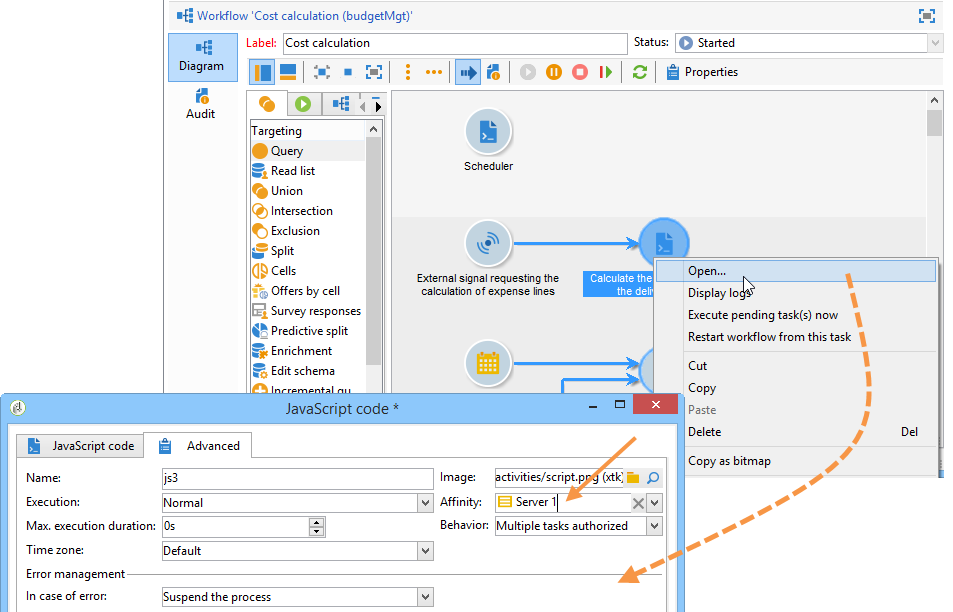

# Campaign-Server konfigurieren{#configuring-campaign-server}

Im folgenden Abschnitt werden serverseitige Konfigurationen beschrieben, die entsprechend Ihren Anforderungen und Ihren Umgebung durchgeführt werden können.

>[!IMPORTANT]
>
>Diese Konfigurationen müssen von Administratoren und nur für **lokale** Hostingmodelle durchgeführt werden.
>
>Bei **gehosteten** Bereitstellungen können serverseitige Einstellungen nur von der Adobe konfiguriert werden. Einige Einstellungen können jedoch in der Systemsteuerung eingerichtet werden (z. B. IP-Zulassungsliste oder URL-Berechtigungen).

Weitere Informationen finden Sie in den folgenden Abschnitten:

* [Control Panel-Dokumentation](https://docs.adobe.com/content/help/de-DE/control-panel/using/control-panel-home.html)
* [Hosting-Modelle](../../installation/using/hosting-models.md)
* [Campaign Classic-On-Premise- und gehostete Funktionsmatrix](https://helpx.adobe.com/de/campaign/kb/acc-on-prem-vs-hosted.html)
* [Konfigurationsschritte](../../installation/using/about-hybrid-and-hosted-models.md) für Hybrid- und gehostete Modelle)

Campaign Classic-Konfigurationsdateien werden im Installationsordner des Adobe Campaigns im **conf** -Ordner gespeichert. Die Konfiguration erstreckt sich über zwei Dateien:

* **serverConf.xml**: allgemeine Konfiguration für alle Instanzen. Diese Datei enthält die technischen Parameter des Adobe Campaign-Servers: diese werden von allen Instanzen freigegeben. Die Beschreibung einiger dieser Parameter ist nachfolgend beschrieben. Die verschiedenen Knoten und Parameter, die in diesem [Abschnitt](../../installation/using/the-server-configuration-file.md)aufgeführt sind.
* **config-`<instance>`.xml** (wobei **instance** der Name der Instanz ist): spezifische Konfiguration der Instanz. Wenn Sie Ihren Server für mehrere Instanzen freigeben, geben Sie bitte die für jede Instanz spezifischen Parameter in die entsprechende Datei ein.

## Definieren von Sicherheitszonen {#defining-security-zones}

### Sicherheitszonen {#about-security-zones}

Jeder Operator muss mit einer Zone verknüpft sein, um sich bei einer Instanz anzumelden, und die IP-Adresse des Betreibers muss in die Adressen oder Adresssätze aufgenommen werden, die in der Sicherheitszone definiert sind. Die Sicherheitszonenkonfiguration wird in der Konfigurationsdatei des Adobe Campaign-Servers ausgeführt.

Operatoren werden über ihr Profil in der Konsole (&quot; **[!UICONTROL Administration&quot;> &quot;Zugriffsverwaltung&quot;> &quot;Operatoren]** &quot;) mit einer Sicherheitszone verknüpft. In [diesem Abschnitt erfahren Sie, wie Sie Zonen mit Operatoren der Kampagne verknüpfen](#linking-a-security-zone-to-an-operator).

### Sicherheitszonen erstellen {#creating-security-zones}

Eine Zone ist definiert durch:

* einen oder mehrere IP-Adressbereiche (IPv4 und IPv6)
* einen technischen Namen, der mit jedem IP-Adressenbereich verknüpft ist

Die Sicherheitszonen sind miteinander verbunden, was bedeutet, dass die Definition einer neuen Zone innerhalb einer anderen Zone die Anzahl der Operatoren verringert, die sich bei ihr anmelden können, während die den einzelnen Operatoren zugewiesenen Rechte erhöht werden.

Zonen müssen während der Serverkonfiguration in der Datei &quot; **serverConf.xml** &quot;definiert werden. Alle in der Datei **serverConf.xml** verfügbaren Parameter sind in diesem [Abschnitt](../../installation/using/the-server-configuration-file.md)aufgeführt.

Jede Zone definiert Rechte wie:

* HTTP-Verbindung anstelle von HTTPS
* Fehleranzeige (Java-Fehler, JavaScript, C++ usw.)
* Report und webApp-Vorschau
* Authentifizierung über Anmeldung/Kennwort
* Nicht sicherer Verbindungsmodus

>[!NOTE]
>
>**Jeder Operator muss mit einer Zone** verbunden sein. Wenn die IP-Adresse des Operators zu dem durch die Zone definierten Bereich gehört, kann sich der Operator bei der Instanz anmelden.\
>Die IP-Adresse des Betreibers kann in mehreren Zonen definiert werden. In diesem Fall erhält der Betreiber die für jede Zone verfügbaren **Rechte** .

Die vordefinierte **Datei &quot;serverConf.xml** &quot;umfasst drei Bereiche: **public, VPN und LAN**.

>[!NOTE]
>
>**Die vordefinierte Konfiguration ist sicher**. Vor der Migration von einer früheren Version von Adobe Campaign kann es jedoch erforderlich sein, die Sicherheit vorübergehend zu reduzieren, um die neuen Regeln zu migrieren und zu genehmigen.

Beispiel zum Definieren einer Zone in der Datei **serverConf.xml** :

```
<securityZone allowDebug="false" allowHTTP="false" label="Public Network" name="public">
<subNetwork label="All addresses" mask="*" name="all"/>

<securityZone allowDebug="true" allowHTTP="false" label="Private Network (VPN)"
              name="vpn" showErrors="true">

  <securityZone allowDebug="true" allowEmptyPassword="true" allowHTTP="true"
                allowUserPassword="false" label="Private Network (LAN)" name="lan"
                sessionTokenOnly="true" showErrors="true">
    <subNetwork label="Lan 1" mask="192.168.0.0/16" name="lan1"/>
    <subNetwork label="Lan 2" mask="172.16.0.0/12" name="lan2"/>
    <subNetwork label="Lan 3" mask="10.0.0.0/8" name="lan3"/>
    <subNetwork label="Localhost" mask="127.0.0.1/16" name="locahost"/>
    <subNetwork label="Lan (IPv6)" mask="fc00::/7" name="lan6"/>
    <subNetwork label="Localhost (IPv6)" mask="::1/128" name="localhost6"/>
  </securityZone>

</securityZone>
</securityZone>
```

Alle Rechte, die eine Zone definieren, lauten wie folgt:

* **allowDebug**: aktiviert die Ausführung einer WebApp im Debug-Modus
* **allowEmptyPassword**: eine Verbindung zu einer Instanz ohne Kennwort autorisiert
* **allowHTTP**: eine Sitzung ohne Verwendung des HTTPS-Protokolls erstellt werden kann
* **allowUserPassword**: Das Sitzungstoken kann das folgende Formular &quot;`<login>/<password>`&quot; haben
* **sessionTokenOnly**: das Sicherheitstoken in der Verbindungs-URL nicht erforderlich ist
* **showErrors**: Fehler auf Serverseite werden weitergeleitet und angezeigt

>[!IMPORTANT]
>
>In einer Zonendefinition verringert jedes Attribut mit dem **Wert &quot;true&quot;** die Sicherheit.

Wenn Sie das Message Center verwenden und mehrere Ausführungsinstanzen vorliegen, müssen Sie eine zusätzliche Sicherheitszone erstellen, in der das Attribut **sessionTokenOnly** als **true** definiert ist, wobei nur die erforderlichen IP-Adressen hinzugefügt werden müssen. Weitere Informationen zum Konfigurieren von Instanzen finden Sie in [diesem Dokument](../../message-center/using/creating-a-shared-connection.md).

### Bewährte Verfahren für Sicherheitszonen {#best-practices-for-security-zones}

In der Definition der **lan** -Sicherheitszone kann eine IP-Adressenmaske hinzugefügt werden, die den technischen Zugriff definiert. Dieser Zusatz ermöglicht den Zugriff auf alle Instanzen, die auf dem Server gehostet werden.

```
<securityZone allowDebug="true" allowEmptyPassword="false" allowHTTP="true"
                    allowUserPassword="false" label="Private Network (LAN)" name="lan"
                    sessionTokenOnly="true" showErrors="true">
        <subNetwork label="Lan 1" mask="192.168.0.0/16" name="lan1"/>
        <subNetwork label="Lan 2" mask="172.16.0.0/12" name="lan2"/>
        <subNetwork label="Lan 3" mask="10.0.0.0/8" name="lan3"/>
        <subNetwork label="Localhost" mask="127.0.0.1/16" name="locahost"/>
        <subNetwork label="Lan (IPv6)" mask="fc00::/7" name="lan6"/>
        <subNetwork label="Localhost (IPv6)" mask="::1/128" name="localhost6"/>
  
        <!-- Customer internal IPs -->
        <subNetwork id="internalNetwork" mask="a.b.c.d/xx"/>

      </securityZone>
```

Es wird empfohlen, IP-Adressbereiche direkt in der Konfigurationsdatei zu definieren, die der Instanz zugeordnet ist, damit Operatoren nur auf eine bestimmte Instanz zugreifen können.

In der **`config-<instance>.xml`** Datei:

```
  <securityZone name="public">
   ...
    <securityZone name="vpn">
      <subNetwork id="cus1" mask="a.b.c.d/xx"/>
```

### Subnetzwerke und Stellvertreter in einer Sicherheitszone {#sub-networks-and-proxies-in-a-security-zone}

Der **Proxy** -Parameter kann in einem **subNetwork** -Element verwendet werden, um die Verwendung des Proxys in einer Sicherheitszone festzulegen.

Wenn ein Proxy referenziert wird und eine Verbindung über diesen Proxy eingeht (sichtbar über den HTTP X-Forwarded-For-Header), ist der verifizierte Bereich der Clients des Proxys und nicht der des Proxys.

>[!IMPORTANT]
>
>Wenn ein Proxy konfiguriert ist und es möglich ist, ihn zu überschreiben (oder nicht vorhanden), kann die IP-Adresse, die getestet wird, gefälscht werden.
>
>Außerdem werden jetzt Relais wie Stellvertreter generiert. Sie können daher die IP-Adresse 127.0.0.1 zur Liste der Proxys in Ihrer Sicherheitszonenkonfiguration hinzufügen.
>
>Beispiel: &quot; `<subnetwork label="Lan 1" mask="192.168.0.0/16" name="lan1" proxy="127.0.0.1,10.100.2.135" />`&quot;.

Es können verschiedene Fälle auftreten:

* Ein Unternetzwerk wird direkt in der Sicherheitszone referenziert und es wird kein Proxy konfiguriert: Benutzer des Unternetzes können direkt eine Verbindung zum Adobe Campaign-Server herstellen.

   

* Ein Proxy wird für ein Unternetzwerk in der Sicherheitszone angegeben: Benutzer dieses Unternetzes können über diesen Proxy auf den Adobe Campaign-Server zugreifen.

   

* Ein Proxy ist in einem Teilnetzwerk einer Sicherheitszone enthalten: Benutzer, die über diesen Proxy Zugriff haben, können unabhängig von ihrer Herkunft auf den Adobe Campaign-Server zugreifen.

   

Die IP-Adressen von Proxys, die auf den Adobe Campaign-Server zugreifen können, müssen sowohl im **`<subnetwork>`** betreffenden als auch im ersten Teilnetzwerk eingegeben werden **`<subnetwork name="all"/>`**. Beispiel: Hier für einen Proxy mit der IP-Adresse 10.131.146.102:

```
<securityZone allowDebug="false" allowHTTP="false" label="Public Network" 
                      name="public">
    <subNetwork label="All addresses" mask="*" name="all"
                      proxy="10.131.146.102,127.0.0.1, ::1"/>

    <securityZone allowDebug="true" allowHTTP="false" label="Private Network (VPN)" 
                      name="vpn" showErrors="true">
        <securityZone allowDebug="true" allowEmptyPassword="false" allowHTTP="true" 
                      allowUserPassword="false" label="Private Network (LAN)" 
                      name="lan" sessionTokenOnly="true" showErrors="true">
            <subNetwork label="Lan proxy" mask="10.131.193.182" name="lan3" 
                      proxy="10.131.146.102,127.0.0.1, ::1"/>
            <subNetwork label="Lan 1" mask="192.168.0.0/16" name="lan1" 
                      proxy="127.0.0.1, ::1"/>

        </securityZone>
    </securityZone>
</securityZone>
```

### Sicherheitszone mit einem Benutzer verknüpfen {#linking-a-security-zone-to-an-operator}

Sobald Zonen definiert sind, muss jeder Operator mit einem von ihnen verknüpft sein, um sich bei einer Instanz anmelden zu können, und die IP-Adresse des Betreibers muss in die Adressen oder Adressbereiche, auf die in der Zone verwiesen wird, aufgenommen werden.

Die technische Konfiguration der Zonen erfolgt in der Konfigurationsdatei des Kampagne Server: **serverConf.xml**.

Zuvor müssen Sie den Beginn konfigurieren, indem Sie die vordefinierte **[!UICONTROL Sicherheitszone]** -Auflistung so konfigurieren, dass eine Beschriftung mit dem in der Datei &quot; **serverConf.xml** &quot;definierten internen Namen der Zone verknüpft wird.

Diese Konfiguration erfolgt im Kampagne Explorer:

1. Klicken Sie auf den Knoten **[!UICONTROL Administration > Plattform > Auflistungen]** .
1. Wählen Sie die Auflistung **[!UICONTROL Sicherheitszone (securityZone)]** aus.

   

1. Klicken Sie für jede in der Konfigurationsdatei des Servers definierte Sicherheitszone auf die **[!UICONTROL Hinzufügen]** .
1. Geben Sie im Feld **[!UICONTROL Interner Name]** den Namen der Zone ein, die in der Datei &quot; **serverConf.xml** &quot;definiert ist. Es entspricht dem Attribut **@name** des `<securityzone>` Elements. Geben Sie die mit dem internen Namen verknüpfte Beschriftung in das **** Feld &quot;Beschriftung&quot;ein.

   

1. Klicken Sie auf OK und speichern Sie die Änderungen.

Sobald die Zonen definiert und die Auflistung der **[!UICONTROL Sicherheitszone]** konfiguriert sind, müssen Sie jeden Operator mit einer Sicherheitszone verknüpfen:

1. Klicken Sie auf den Knoten **[!UICONTROL Administration > Zugriffsverwaltung > Operatoren]** .
1. Wählen Sie den Operator aus, mit dem Sie eine Sicherheitszone verknüpfen möchten, und klicken Sie auf die Registerkarte &quot; **[!UICONTROL Bearbeiten]** &quot;.
1. Rufen Sie die Registerkarte **[!UICONTROL Zugriffsrechte]** auf und klicken Sie auf die **[!UICONTROL Zugriffsparameter bearbeiten ...]** Link.

   

1. Wählen Sie einen Bereich aus der Dropdown-Liste &quot; **[!UICONTROL Autorisierte Verbindungszone]** &quot;aus

   

1. Klicken Sie auf **[!UICONTROL OK]** und speichern Sie die Änderungen, um diese Änderungen anzuwenden.

## Tomcat konfigurieren {#configuring-tomcat}

### Standardanschluss für Tomcat {#default-port-for-tomcat}

Wenn der 8080-Listening-Anschluss des Tomcat-Servers bereits mit einer anderen Anwendung besetzt ist, die für Ihre Konfiguration erforderlich ist, müssen Sie den 8080-Port durch einen kostenlosen ersetzen (z. B. 8090). Um sie zu ändern, bearbeiten Sie die **Datei &quot;server.xml** &quot;im Ordner **/tomcat-7/conf** des Installationsordners des Adobe Campaigns.

Ändern Sie dann den Anschluss der JSP-Relaisseiten. Ändern Sie dazu die **Datei &quot;serverConf.xml** &quot;im Ordner **/conf** des Installationsordners des Adobe Campaigns. Alle in der Datei **serverConf.xml** verfügbaren Parameter sind in diesem [Abschnitt](../../installation/using/the-server-configuration-file.md)aufgeführt.

```
<serverConf>
   ...
   <web controlPort="8005" httpPort="8090"...
   <url ... targetUrl="http://localhost:8090"...
```

### Ordner in Tomcat zuordnen {#mapping-a-folder-in-tomcat}

Um kundenspezifische Einstellungen zu definieren, können Sie eine **Datei &quot;user_Kontexte.xml** &quot;im Ordner &quot; **/tomcat-7/conf** &quot;erstellen, die auch die Datei &quot; **Kontexte.xml** &quot;enthält.

Diese Datei enthält die folgenden Informationen:

```
 <Context path='/foo' docBase='../customers/foo'   crossContext='true' debug='0' reloadable='true' trusted='false'/>
```

Bei Bedarf kann dieser Vorgang serverseitig reproduziert werden.

## Personalisieren von Versand-Parametern {#personalizing-delivery-parameters}

Die Versand-Parameter werden in der Konfigurationsdatei &quot; **serverConf.xml** &quot;definiert. Alle in der Datei **serverConf.xml** verfügbaren Parameter sind in diesem [Abschnitt](../../installation/using/the-server-configuration-file.md)aufgeführt.

Allgemeine Serverkonfigurationen und -befehle werden in der [Kampagne-Serverkonfiguration](../../installation/using/campaign-server-configuration.md)ausführlich beschrieben.

Je nach Bedarf und Einstellungen können Sie außerdem die folgenden Konfigurationen durchführen.

### SMTP-Relais {#smtp-relay}

Das MTA-Modul fungiert als systemeigener E-Mail-Transfer-Agent für SMTP-Übertragungen (Port 25).

Es ist jedoch möglich, ihn durch einen Server zu ersetzen, wenn Ihre Sicherheitsrichtlinien dies erfordern. In diesem Fall ist der globale Durchsatz der Relaisdurchsatz (vorausgesetzt, dass der Relaisserver-Durchsatz niedriger ist als der Durchsatz des Adobe Campaigns).

In diesem Fall werden diese Parameter durch Konfiguration des SMTP-Servers im **`<relay>`** Abschnitt festgelegt. Sie müssen die IP-Adresse (oder den Host) des SMTP-Servers angeben, der zum Übertragen von E-Mails verwendet wird, und den zugehörigen Anschluss (standardmäßig 25).

```
<relay address="192.0.0.3" port="25"/>
```

>[!IMPORTANT]
>
>Dieser Betriebsmodus setzt erhebliche Einschränkungen für Versand voraus, da er den Durchsatz aufgrund der intrinsischen Performance des Relaisservers (Latenz, Bandwith...) stark reduzieren kann. Darüber hinaus wird die Fähigkeit, synchrone Versand-Fehler zu qualifizieren (durch Analyse des SMTP-Traffics erkannt), begrenzt sein, und das Senden ist nicht möglich, wenn der Server nicht verfügbar ist.

### MTA-untergeordnete Prozesse {#mta-child-processes}

Es ist möglich, die Population von untergeordneten Prozessen (maxSpareServers standardmäßig 2) zu steuern, um die Übertragungsleistung entsprechend der CPU-Leistung der Server und der verfügbaren Netzwerkressourcen zu optimieren. Diese Konfiguration ist im Abschnitt der **`<master>`** MTA-Konfiguration auf jedem einzelnen Computer vorzunehmen.

```
<master dataBasePoolPeriodSec="30" dataBaseRetryDelaySec="60" maxSpareServers="2" minSpareServers="0" startSpareServers="0">
```

Weitere Informationen finden Sie unter Optimierung des [E-Mail-Versands](../../installation/using/email-deliverability.md#email-sending-optimization).

### Verwalten des ausgehenden SMTP-Traffics mit Affinitäten {#managing-outbound-smtp-traffic-with-affinities}

>[!IMPORTANT]
>
>Die Konfiguration der Affinität muss von einem Server zum anderen kohärent sein. Es wird empfohlen, sich für die Konfiguration der Affinität an die Adobe zu wenden, da Konfigurationsänderungen auf allen Anwendungsservern, auf denen die MTA ausgeführt wird, repliziert werden sollten.

Sie können den ausgehenden SMTP-Traffic durch Affinitäten mit IP-Adressen verbessern.

Gehen Sie hierzu wie folgt vor:

1. Geben Sie die Affinitäten im **`<ipaffinity>`** Abschnitt der Datei &quot; **serverConf.xml** &quot;ein.

   Eine Affinität kann mehrere verschiedene Namen haben: um sie zu trennen, verwenden Sie die **;** Zeichen.

   Beispiel:

   ```
    IPAffinity name="mid.Server;WWserver;local.Server">
             <IP address="XX.XXX.XX.XX" heloHost="myserver.us.campaign.net" publicId="123" excludeDomains="neo.*" weight="5"/
   ```

   Informationen zur Ansicht der entsprechenden Parameter finden Sie in der Datei &quot; **serverConf.xml** &quot;.

1. Um die Auswahl der Affinitäten in den Dropdown-Listen zu aktivieren, müssen Sie die Affinitäten in der **IPAffinity-Auflistung** hinzufügen.

   

   >[!NOTE]
   >
   >Auflistungen sind in [diesem Dokument](../../platform/using/managing-enumerations.md)detailliert.

   Anschließend können Sie die zu verwendende Affinität auswählen, wie unten für Typologien dargestellt:

   

   >[!NOTE]
   >
   >Sie können auch auf die [Versand-Serverkonfiguration](../../installation/using/email-deliverability.md#delivery-server-configuration)verweisen.

## URL-Genehmigungen {#url-permissions}

Die Liste der URLs, die standardmäßig von JavaScript-Codes (Workflows usw.) über Ihre Campaign Classic-Instanzen aufgerufen werden können, ist begrenzt. Diese URLs ermöglichen das ordnungsgemäße Funktionieren der Instanzen.

Standardmäßig sind Instanzen nicht berechtigt, eine Verbindung zu externen URLs herzustellen. Es ist jedoch möglich, einige externe URLs zur Liste autorisierter URLs hinzuzufügen, damit Ihre Instanz eine Verbindung zu ihnen herstellen kann. Dadurch können Sie zwischen Ihren Campaign-Instanzen und externen Systemen, wie z. B. SFTP-Servern oder Websites, eine Verbindung herstellen, um den Datei- und/oder Datentransfer zu ermöglichen.

Nach dem Hinzufügen einer URL wird sie in der Konfigurationsdatei der Instanz referenziert (serverConf.xml).

Wie Sie URL-Berechtigungen verwalten können, hängt von Ihrem Hostmodell ab:

* **Hybrid** oder **Vor-Ort**: fügen Sie die URLs hinzu, die in der Datei **&quot;serverConf.xml&quot;zulässig sind**. Ausführliche Informationen finden Sie im folgenden Abschnitt.
* **gehostet**: fügen Sie die URLs hinzu, die über die **Systemsteuerung** zulässig sind. Weitere Informationen finden Sie in der [entsprechenden Dokumentation](https://docs.adobe.com/content/help/de-DE/control-panel/using/instances-settings/url-permissions.html).

Bei **Hybrid** - und **On-Premise** -Hostmodellen muss der Administrator auf eine neue **urlPermission** in der Datei &quot; **serverConf.xml** &quot;verweisen. Alle in der Datei **serverConf.xml** verfügbaren Parameter sind in diesem [Abschnitt](../../installation/using/the-server-configuration-file.md)aufgeführt.

Es gibt drei Modi für den Verbindungsschutz:

* **Blockierung**: alle URLs, die nicht zur Zulassungsliste gehören, mit einer Fehlermeldung blockiert werden. Dies ist der Standardmodus nach einem Postupgrade.
* **Zulässig**: alle URLs, die nicht zur Zulassungsliste gehören, sind zulässig.
* **Warnung**: alle URLs, die nicht zur Zulassungsliste gehören, sind zulässig, der JS-Interpreter gibt jedoch eine Warnung aus, sodass der Administrator sie erfassen kann. In diesem Modus werden Warnmeldungen für JST-310027 hinzugefügt.

```
<urlPermission action="warn" debugTrace="true">
  <url dnsSuffix="abc.company1.com" urlRegEx=".*" />
  <url dnsSuffix="def.partnerA_company1.com" urlRegEx=".*" />
  <url dnsSuffix="xyz.partnerB_company1.com" urlRegEx=".*" />
</urlPermission>
```

>[!IMPORTANT]
>
>Standardmäßig verwendet der Client eines neuen Kunden den **Blockierungsmodus**. Wenn sie eine neue URL zulassen müssen, sollten sie sich an ihren Administrator wenden, um sie der Zulassungsliste hinzuzufügen.
>
>Vorhandene Kunden, die von einer Migration kommen, können den **Warnmodus** eine Weile lang verwenden. In der Zwischenzeit müssen sie den ausgehenden Traffic analysieren, bevor sie die URLs autorisieren. Sobald die Liste autorisierter URLs definiert ist, sollten sie sich an ihren Administrator wenden, um die URLs zur Zulassungsliste hinzuzufügen und den **Blockierungsmodus** zu aktivieren.

## Dynamische Seitensicherheit und Relais {#dynamic-page-security-and-relays}

Standardmäßig sind alle dynamischen Seiten automatisch mit dem **lokalen** Tomcat-Server des Computers verknüpft, dessen Webmodul gestartet wurde. Diese Konfiguration wird in den **`<url>`** Abschnitt der Abfrage-Relaiskonfiguration für die Datei &quot; **ServerConf.xml** &quot;eingegeben. Alle in der Datei **serverConf.xml** verfügbaren Parameter sind in diesem [Abschnitt](../../installation/using/the-server-configuration-file.md)aufgeführt.

die Ausführung der dynamischen Seite auf einem **Remote** -Server weiterleiten; wenn das Webmodul auf dem Computer nicht aktiviert ist. Dazu müssen Sie den **localhost** durch den Namen des Remote-Computers für JSP und JSSP, Webanwendungen, Berichte und Zeichenfolgen ersetzen.

Weitere Informationen zu den verschiedenen verfügbaren Parametern finden Sie in der Konfigurationsdatei &quot; **serverConf.xml** &quot;.

Für JSP-Seiten lautet die Standardkonfiguration:

```
<url relayHost="true" relayPath="true" targetUrl="http://localhost:8080" urlPath="*.jsp"/>
```

Adobe Campaign verwendet die folgenden JSP-Seiten:

* /nl/jsp/**soaprouter.jsp**: Client-Konsolen- und Webdienstverbindungen (SOAP-APIs),
* /nl/jsp/**m.jsp**: mirrorseiten,
* /nl/jsp/**logon.jsp**: Webbasierter Zugriff auf Berichte und die Bereitstellung der Client-Konsole,
* /nl/jsp/**s.jsp** : Einsatz von viralem Marketing (Sponsoring und soziale Netzwerke).

Die für den Mobile App Kanal verwendeten JSSPs lauten wie folgt:

* nms/mobile/1/registerIOS.jssp
* nms/mobile/1/registerAndroid.jssp

**Beispiel:**

Es ist möglich, Clientmaschinenverbindungen von außen zu verhindern. Dazu beschränken Sie einfach die Ausführung von **soaprouter.jsp** und genehmigen nur die Ausführung von Mirrorseiten, viralen Links, Webformularen und öffentliche Ressourcen.

Die Parameter lauten wie folgt:

```
<url IPMask="<IP_addresses>" deny=""     hostMask="" relayHost="true"  relayPath="true"  targetUrl="http://localhost:8080" timeout="" urlPath="*.jsp"/>
<url IPMask="<IP_addresses>" deny=""     hostMask="" relayHost="true"  relayPath="true"  targetUrl="http://localhost:8080" timeout="" urlPath="*.jssp"/> 
<url IPMask=""               deny=""     hostMask="" relayHost="true" relayPath="true" targetUrl="http://localhost:8080" timeout="" urlPath="m.jsp"/>
<url IPMask=""               deny=""     hostMask="" relayHost="true" relayPath="true" targetUrl="http://localhost:8080" timeout="" urlPath="s.jsp"/>
<url IPMask=""               deny=""     hostMask="" relayHost="true" relayPath="true" targetUrl="http://localhost:8080" timeout="" urlPath="webForm.jsp"/>
<url IPMask=""               deny=""     hostMask="" relayHost="true"  relayPath="true"  targetUrl="http://localhost:8080" timeout="" urlPath="/webApp/pub*"/>
<url IPMask=""               deny=""     hostMask="" relayHost="true"  relayPath="true"  targetUrl="http://localhost:8080" timeout="" urlPath="/jssp/pub*"/>
<url IPMask=""               deny=""     hostMask="" relayHost="true"  relayPath="true"  targetUrl="http://localhost:8080" timeout="" urlPath="/strings/pub*"/>
<url IPMask=""               deny=""     hostMask="" relayHost="true"  relayPath="true"  targetUrl="http://localhost:8080" timeout="" urlPath="/interaction/pub*"/>
<url IPMask=""               deny="true" hostMask="" relayHost="false" relayPath="false" targetUrl="http://localhost:8080" timeout="" urlPath="*.jsp"/>
<url IPMask=""               deny="true" hostMask="" relayHost="false" relayPath="false" targetUrl="http://localhost:8080" timeout="" urlPath="*.jssp"/>
```

In diesem Beispiel fällt der **`<IP_addresses>`** Wert mit der Liste der IP-Adressen (durch Kommas getrennt) zusammen, die für die Verwendung des Relais-Moduls für diese Maske berechtigt sind.

>[!NOTE]
>
>Die Werte sind entsprechend Ihrer Konfiguration und Ihren Netzwerkeinschränkungen anzupassen, insbesondere wenn für Ihre Installation spezifische Konfigurationen entwickelt wurden.

## Eingrenzen autorisierter externer Befehle {#restricting-authorized-external-commands}

>[!NOTE]
>
>Die folgende Konfiguration ist nur für lokale Installationen erforderlich.

Ab Build 8780 können technische Administratoren die Liste autorisierter externer Befehle einschränken, die in Adobe Campaign verwendet werden können.

Dazu müssen Sie eine Textdatei mit der Liste von Befehlen erstellen, die Sie vermeiden möchten, z. B.:

```
ln
dd
openssl
curl
wget
python
python3
perl
ruby
sh
```

>[!IMPORTANT]
>
>Diese Liste ist nicht erschöpfend.

Im **exec** -Knoten der Serverkonfigurationsdatei müssen Sie auf die zuvor erstellte Datei im **Attribut blocklistFile** verweisen.

**Nur** für Linux: in der Serverkonfigurationsdatei sollten Sie einen Benutzer angeben, der externe Befehle ausführen soll, um Ihre Sicherheitskonfiguration zu verbessern. Dieser Benutzer wird im **exec** -Knoten der Konfigurationsdatei festgelegt. Alle in der Datei **serverConf.xml** verfügbaren Parameter sind in diesem [Abschnitt](../../installation/using/the-server-configuration-file.md)aufgeführt.

>[!NOTE]
>
>Wenn kein Benutzer angegeben ist, werden alle Befehle im Benutzerkontext der Adobe Campaign-Instanz ausgeführt. Der Benutzer muss sich von dem Benutzer, der Adobe Campaign ausführt, unterscheiden.

Beispiel:

```
<serverConf>
 <exec user="theUnixUser" blocklistFile="/pathtothefile/blocklist"/>
</serverConf>
```

Dieser Benutzer muss zur untergeordneten Liste des Adobe Campaign-Operators &quot;neolane&quot;hinzugefügt werden.

>[!IMPORTANT]
>
>Sie sollten kein benutzerdefiniertes Sudo verwenden. Ein Standard-Sudo muss auf dem System installiert sein.

## Verwalten von HTTP-Kopfzeilen {#managing-http-headers}

Standardmäßig werden nicht alle HTTP-Header wiedergegeben. Sie können bestimmte Kopfzeilen in den Antworten, die durch Relais gesendet werden, hinzufügen. Gehen Sie dazu wie folgt vor:

1. Wechseln Sie zur Datei &quot; **serverConf.xml** &quot;. Alle in der Datei **serverConf.xml** verfügbaren Parameter sind in diesem [Abschnitt](../../installation/using/the-server-configuration-file.md)aufgeführt.
1. Wechseln Sie im **`<relay>`** Knoten zur Liste der wiedergegebenen HTTP-Header.
1. hinzufügen eines **`<responseheader>`** Elements mit den folgenden Attributen:

   * **name**: Kopfzeilenname
   * **Wert**: Wertname.

   Beispiel:

   ```
   <responseHeader name="Strict-Transport-Security" value="max-age=16070400; includeSubDomains"/>
   ```

## Redundante Verfolgung {#redundant-tracking}

Werden mehrere Server für die Weiterleitung verwendet, müssen sie über SOAP-Aufrufe miteinander kommunizieren können, um Informationen über die zu umgeleitenden URLs freizugeben. Zum Zeitpunkt des Beginns des Versands sind möglicherweise nicht alle Umleitungsserver verfügbar; Sie verfügen daher möglicherweise nicht über den gleichen Informationsstand.

>[!NOTE]
>
>Bei Verwendung der Standard- oder Unternehmensarchitektur muss der Hauptanwendungsserver berechtigt sein, Verfolgungsinformationen auf jedem Computer hochzuladen.

Die URLs der redundanten Server müssen in der Umleitungskonfiguration über die Datei &quot; **serverConf.xml** &quot;angegeben werden. Alle in der Datei **serverConf.xml** verfügbaren Parameter sind in diesem [Abschnitt](../../installation/using/the-server-configuration-file.md)aufgeführt.

**Beispiel:**

```
<spareserver enabledIf="$(hostname)!='front_srv1'" id="1" url="http://front_srv1:8080" />
<spareserver enabledIf="$(hostname)!='front_srv2'" id="2" url="http://front_srv2:8080" />
```

Die **enableIf** -Eigenschaft ist optional (standardmäßig leer) und ermöglicht es Ihnen, die Verbindung nur zu aktivieren, wenn das Ergebnis true lautet. Auf diese Weise erhalten Sie auf allen Umleitungsservern eine identische Konfiguration.

Um den Hostnamen des Computers abzurufen, führen Sie den folgenden Befehl aus: **hostname -s**.

## Verwalten von öffentliche Ressourcen {#managing-public-resources}

Öffentliche Ressourcen finden Sie unter [Verwalten von öffentliche Ressourcen](../../installation/using/deploying-an-instance.md#managing-public-resources).

Sie werden im Ordner **/var/res/instance** des Installationsordners des Adobe Campaigns gespeichert.

Die passende URL lautet: **http://server/res/instance** , wobei **instance** der Name der Verfolgungsinstanz ist.

Sie können einen anderen Ordner angeben, indem Sie der Datei &quot; **conf-`<instance>`.xml** &quot;einen Knoten hinzufügen, um die Datenspeicherung auf dem Server zu konfigurieren. Dies bedeutet, dass die folgenden Zeilen hinzugefügt werden:

```
<serverconf>
  <shared>
    <dataStore hosts="media*" lang="fra">
      <virtualDir name="images" path="/var/www/images"/>
     <virtualDir name="publicFileRes" path="$(XTK_INSTALL_DIR)/var/res/$(INSTANCE_NAME)/"/>
    </dataStore>
  </shared>
</serverconf>
```

In diesem Fall sollte die neue URL für die öffentliche Ressourcen im oberen Bereich des Bereitstellungsassistenten auf diesen Ordner verweisen.

## Workflows und Affinitäten mit hoher Verfügbarkeit {#high-availability-workflows-and-affinities}

Sie können mehrere Workflow-Server (wfserver) konfigurieren und auf zwei oder mehr Computern verteilen. Wenn Sie diesen Architekturtyp auswählen, konfigurieren Sie den Verbindungsmodus der Lastenausgleicher entsprechend dem Adobe Campaign-Zugriff.

Wählen Sie für den Zugriff über das Internet den **Lastenausgleichsmodus** aus, um die Verbindungszeiten zu begrenzen.

Wählen Sie beim Zugriff über die Adobe Campaign-Konsole den **Hash** - oder **sticky** -IP-Modus. Auf diese Weise können Sie die Verbindung zwischen dem Rich-Client und dem Server aufrechterhalten und beispielsweise verhindern, dass eine Benutzersitzung während eines Import- oder Exportvorgangs unterbrochen wird.

Sie können die Ausführung eines Workflows oder einer Workflow-Aktivität auf einem bestimmten Computer erzwingen. Dazu müssen Sie eine oder mehrere Affinitäten für den betreffenden Workflow oder die betreffende Aktivität definieren.

1. Erstellen Sie die Affinitäten des Workflows oder der Aktivität, indem Sie sie in das Feld &quot; **[!UICONTROL Affinität]** &quot;eingeben.

   Sie können die Affinitäten frei wählen. Achten Sie jedoch darauf, keine Leerzeichen oder Satzzeichen zu verwenden. Wenn Sie verschiedene Server verwenden, geben Sie unterschiedliche Namen an.

   

   

   Die Dropdown-Liste enthält zuvor verwendete Affinitäten. Es wird mit der Zeit mit den verschiedenen eingegebenen Werten abgeschlossen.

1. Öffnen Sie die **Datei &quot;nl6/conf/config-`<instance>.xml`** &quot;.
1. Ändern Sie die Zeile, die mit dem **[!UICONTROL wfserver]** -Modul übereinstimmt, wie folgt:

   ```
   <wfserver autoStart="true" affinity="XXX,"/>
   ```

   Wenn Sie mehrere Affinitäten definieren, müssen diese durch Kommas ohne Leerzeichen getrennt werden:

   ```
   <wfserver autoStart="true" affinity="XXX,YYY,"/>
   ```

   Das Komma nach dem Namen der Affinität ist erforderlich, um Workflows auszuführen, für die keine Affinität definiert ist.

   Wenn Sie nur Workflows ausführen möchten, für die eine Affinität definiert ist, fügen Sie am Ende der Liste Ihrer Affinitäten kein Komma hinzu. Ändern Sie beispielsweise die Zeile wie folgt:

   ```
   <wfserver autoStart="true" affinity="XXX"/>
   ```

## Automatischer Prozessneustart {#automatic-process-restart}

Standardmäßig werden die verschiedenen Adobe Campaign-Prozesse jeden Tag um 6 Uhr (Serverzeit) automatisch neu gestartet.

Sie können diese Konfiguration jedoch ändern.

Gehen Sie dazu zur Datei &quot; **serverConf.xml** &quot;im **conf** -Repository Ihrer Installation. Alle in der Datei **serverConf.xml** verfügbaren Parameter sind in diesem [Abschnitt](../../installation/using/the-server-configuration-file.md)aufgeführt.

Jeder in dieser Datei konfigurierte Prozess verfügt über ein **processRestartTime** -Attribut. Sie können den Wert dieses Attributs ändern, um die Startzeit jedes Prozesses entsprechend Ihren Anforderungen anzupassen.

>[!IMPORTANT]
>
>Löschen Sie dieses Attribut nicht. Alle Prozesse müssen jeden Tag neu gestartet werden.

## Beschränkungen für hochladbare Dateien {#limiting-uploadable-files}

Mit einem neuen Attribut **uploadAllowList** können Sie die Dateitypen einschränken, die auf dem Adobe Campaign-Server hochgeladen werden können.

Dieses Attribut ist im **dataStore** -Element der Datei &quot; **serverConf.xml** &quot;verfügbar. Alle in der Datei **serverConf.xml** verfügbaren Parameter sind in diesem [Abschnitt](../../installation/using/the-server-configuration-file.md)aufgeführt.

Der Standardwert dieses Attributs ist **.+** und ermöglicht das Hochladen beliebiger Dateitypen.

Um die möglichen Formate einzuschränken, müssen Sie den Attributwert durch einen gültigen regulären Java-Ausdruck ersetzen. Sie können mehrere Werte eingeben, indem Sie sie durch ein Komma trennen.

Beispiel: **uploadAllowList=&quot;.*.png,*.jpg&quot;** ermöglicht das Hochladen von PNG- und JPG-Formaten auf den Server. Andere Formate werden nicht akzeptiert.

>[!IMPORTANT]
>
>In Internet Explorer muss der vollständige Dateipfad vom regulären Ausdruck überprüft werden.

## Proxy-Verbindungskonfiguration {#proxy-connection-configuration}

Wenn Sie den Dateiserver über einen Proxy (z. B. mit einer Dateiübertragungs-Workflow-Aktivität) mit der Kampagne nach außen verbinden müssen, müssen Sie den Bereich &quot;proxyConfig&quot;des &quot;serverConf&quot;über einen Befehl konfigurieren. Die folgenden Proxyverbindungen sind möglich: HTTP, HTTPS, FTP, SFTP. Alle in der Datei **serverConf.xml** verfügbaren Parameter sind in diesem [Abschnitt](../../installation/using/the-server-configuration-file.md)aufgeführt.

>[!NOTE]
>
>Ab 20.2 sind die HTTP- und HTTPS-Protokollparameter nicht mehr verfügbar. In den folgenden Informationen werden diese Parameter immer noch erwähnt, da sie für frühere Builds einschließlich 9032 weiterhin verfügbar sind.
>
>SOCKS-Proxys werden nicht unterstützt.

Verwenden Sie den folgenden Befehl:

```
nlserver config -setproxy:[protocol]/[serverIP]:[port]/[login][:‘https’|'http’]
```

Protokollparameter können &quot;http&quot;, &quot;https&quot;oder &quot;ftp&quot;lauten.

Wenn Sie FTP für denselben Anschluss wie HTTP/HTTPS-Traffic festlegen, können Sie Folgendes verwenden:

```
nlserver config -setproxy:http/198.51.100.0:8080/user
```

Die Optionen &quot;http&quot;und &quot;https&quot;werden nur verwendet, wenn der Protokollparameter &quot;ftp&quot;ist, und geben an, ob das Tunneln am angegebenen Port über HTTPS oder über HTTP durchgeführt wird.

Wenn Sie verschiedene Anschlüsse für FTP/SFTP und HTTP/HTTPS-Datenverkehr über den Proxyserver verwenden, sollten Sie den FTP-Protokollparameter festlegen.


Beispiel:

```
nlserver config -setproxy:ftp/198.51.100.0:8080/user:’http’
```

Geben Sie dann das Kennwort ein.

HTTP-Verbindungen werden im Parameter proxyHTTP definiert:

```
<proxyConfig enabled=“1” override=“localhost*” useSingleProxy=“0”>
<proxyHTTP address=“198.51.100.0" login=“user” password=“*******” port=“8080”/>
</proxyConfig>
```

HTTPS-Verbindungen werden im Parameter proxyHTTPS definiert:

```
<proxyConfig enabled=“1" override=“localhost*” useSingleProxy=“0">
<proxyHTTPS address=“198.51.100.0” login=“user” password=“******” port=“8080"/>
</proxyConfig>
```

FTP-/FTPS-Verbindungen werden im Parameter proxyFTP definiert:

```
<proxyConfig enabled=“1" override=“localhost*” useSingleProxy=“0">
<proxyFTP address=“198.51.100.0” login=“user” password=“******” port=“5555" https=”true”/>
</proxyConfig>
```

Wenn Sie denselben Proxy für mehrere Verbindungstypen verwenden, wird nur das proxyHTTP mit useSingleProxy auf &quot;1&quot;oder &quot;true&quot;festgelegt.

Wenn Sie interne Verbindungen haben, die durch den Proxy gehen sollen, fügen Sie sie im Parameter override hinzu.

Wenn Sie die Proxyverbindung vorübergehend deaktivieren möchten, setzen Sie den Parameter enabled auf &quot;false&quot;oder &quot;0&quot;.
