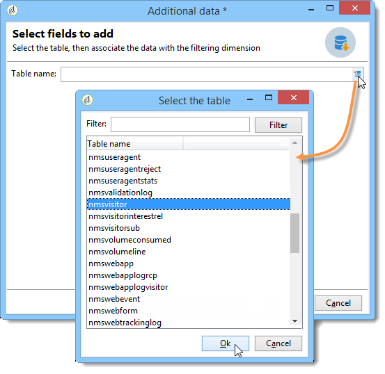

# Herstellung der Datenbankverbindung {#connecting-to-the-database}

Um eine Verbindung mit der externe Datenbank zu ermöglichen, müssen Sie die Verbindungsparameter angeben, d. h. die gewünschte Datenquelle und den Namen der Tabelle mit den zu ladenden Daten.

>[!CAUTION]
>
>Der Adobe Campaign-Benutzer benötigt spezifische Berechtigungen für die externe Datenbank und den Adobe Campaign-Anwendungs-Server, um Daten aus einer externen Datenbank verarbeiten zu können. Weiterführende Informationen finden Sie im Abschnitt [Zugriffsberechtigungen auf Remote-Datenbank](../../installation/using/remote-database-access-rights.md).
>
>Um Fehlfunktionen zu verhindern, müssen Benutzer, die auf geteilte Remote-Daten zugreifen, von getrennten Arbeitsplätzen aus arbeiten.

## Geteilte Verbindung erstellen {#creating-a-shared-connection}

Sie können auf eine gemeinsam genutzte externe Datenbank über Adobe Campaign zugreifen, vorausgesetzt die Verbindung ist aktiv.

1. Die Konfiguration muss zuvor über den Knoten **[!UICONTROL Administration > Plattform > Externe Konten]** durchgeführt werden.
1. Klicken Sie auf die Schaltfläche **[!UICONTROL Neu]** und wählen Sie als Typ **[!UICONTROL Externe Datenbank]** aus.
1. Definieren Sie die Parameter **[!UICONTROL Verbindung]** für die externe Datenbank.

   Bei Verbindungen zu einer **ODBC**-Datenbank muss das Feld **[!UICONTROL Server]** den Namen der ODBC-Datenquelle und nicht den Server-Namen enthalten. Abhängig von den verwendeten Datenbanken sind möglicherweise zusätzliche Konfigurationen erforderlich. Siehe Abschnitt [Spezifische Konfigurationen nach Datenbanktyp](../../installation/using/configure-fda.md).

1. Klicken Sie nach der Eingabe der Parameter zur Bestätigung auf die Schaltfläche **[!UICONTROL Verbindung testen]**.

   

1. Deselektieren Sie nötigenfalls die Option **[!UICONTROL Aktiviert]**, um den Zugriff auf diese Datenbank zu deaktivieren, ohne ihre Konfiguration zu löschen.
1. Damit Adobe Campaign auf diese Datenbank zugreifen kann, müssen Sie die SQL-Funktionen bereitstellen. Klicken Sie auf **[!UICONTROL Parameter]** und dann **[!UICONTROL Bereitstellen von Funktionen]** Schaltfläche.

   

Auf der Registerkarte **[!UICONTROL Parameter]** können Sie spezifische Arbeits-Tablespaces für die Tabellen und den Index definieren.

## Herstellen einer temporären Verbindung {#creating-a-temporary-connection}

Sie können eine Verbindung zu einer externen Datenbank direkt über Workflow-Aktivitäten definieren. In diesem Fall befindet er sich in einer lokalen externen Datenbank, die für die Verwendung in einem aktuellen Workflow reserviert ist. Er wird nicht in den externen Konten gespeichert. Diese Art der pünktlichen Verbindung kann für verschiedene Aktivitäten des Workflows erstellt werden, insbesondere für die **[!UICONTROL Abfrage]**, die **[!UICONTROL Laden (RDBMS)]**, die **[!UICONTROL Anreicherung]** oder **[!UICONTROL Aufspaltung]** -Aktivität.

>[!CAUTION]
>
>Diese Art der Konfiguration wird nicht empfohlen, kann jedoch regelmäßig zur Datenerfassung verwendet werden. Sie sollten jedoch ein externes Konto erstellen, wie im Abschnitt [Geteilte Verbindung erstellen](#creating-a-shared-connection) Abschnitt.

Gehen Sie in der Abfrageaktivität zur Erstellung einer periodischen Verbindung zu einer externen Datenbank beispielsweise folgendermaßen vor:

1. Klicken Sie auf **[!UICONTROL Daten hinzufügen...]** und wählen Sie die Option **[!UICONTROL Externe Daten]** aus.
1. Wählen Sie die Option **[!UICONTROL Datenquelle lokal definieren]**.

   

1. Wählen Sie aus der Dropdown-Liste die Zieldatenbank-Engine aus. Geben Sie den Namen des Servers und die Authentifizierungsparameter ein.

   Geben Sie auch den Namen der externen Datenbank an.

   

   Klicken Sie auf die Schaltfläche **[!UICONTROL Weiter]**.

1. Wählen Sie die Tabelle aus, in der die Daten gespeichert sind.

   Sie können den Namen der Tabelle direkt in das entsprechende Feld eingeben oder auf das Bearbeiten-Symbol klicken, um eine Liste mit Datenbanktabellen zu öffnen.

   

1. Klicken Sie auf **[!UICONTROL Hinzufügen]** -Schaltfläche, um ein oder mehrere Abstimmfelder zwischen den Daten der externen Datenbank und den Daten der Adobe Campaign-Datenbank zu definieren. Die **[!UICONTROL Ausdruck bearbeiten]** Symbole der **[!UICONTROL Remote-Feld]** und **[!UICONTROL Lokales Feld]** bietet Zugriff auf die Liste der Felder der einzelnen Tabellen.

   

1. Spezifizieren Sie nötigenfalls eine Filterbedingung und den Datensortierungsmodus.
1. Wählen Sie die zusätzlichen Daten aus, die in der externen Datenbank erfasst werden sollen. Doppelklicken Sie dazu auf die Felder, die Sie hinzufügen möchten, um sie im **[!UICONTROL Ausgabespalten]**.

   

   Klicken Sie zur Bestätigung der Konfiguration auf **[!UICONTROL Beenden]**.

## Sichere Verbindung {#secure-connection}

>[!NOTE]
>
>Eine sichere Verbindung ist nur bei PostgreSQL verfügbar.

Sie können durch das Konfigurieren eines externen FDA-Kontos eine sichere Verbindung für den Zugriff auf eine externe Datenbank herstellen.

Fügen Sie dazu &quot;**:ssl**&quot; nach der Serveradresse und Adresse des verwendeten Ports. Beispiel: **192 168 0,52:4501:ssl**.

Die Daten werden dadurch unter Verwendung des sicheren SSL-Protokolls gesendet.

## Zusätzliche Konfigurationen {#additional-configurations}

Nötigenfalls können Sie das Schema zur Datenverarbeitung in einer externe Datenbank erstellen. Ebenso ermöglicht Ihnen Adobe Campaign das Definieren eines Mappings für die Daten in einer externen Tabelle. Diese Konfigurationen sind allgemeiner Art und werden nicht auf einzelne Workflows angewendet.

>[!NOTE]
>
>Weiterführende Informationen zur Erstellung von Schemata in Adobe Campaign und zur Definition eines neuen Daten-Mappings finden Sie auf [dieser Seite](../../configuration/using/about-schema-edition.md).
