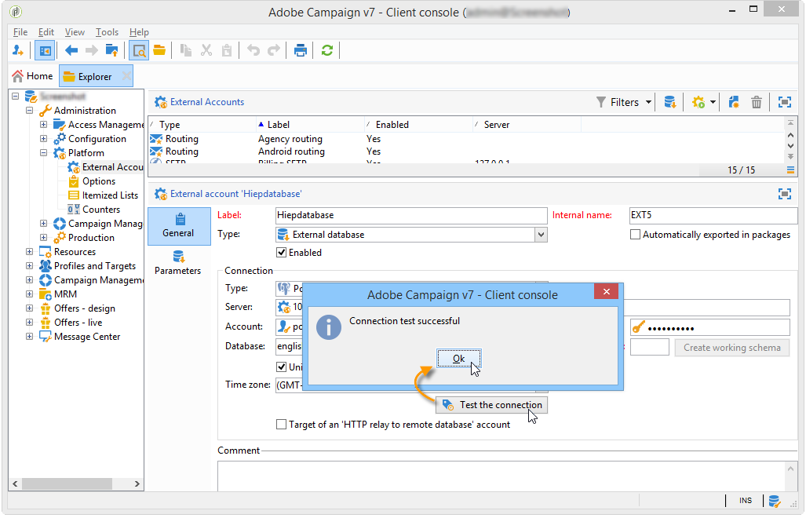
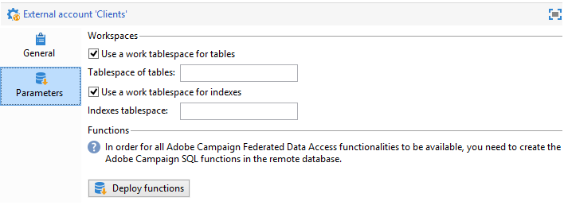
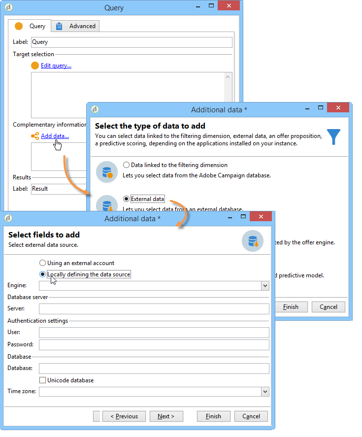
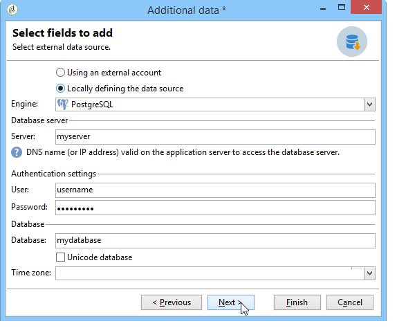
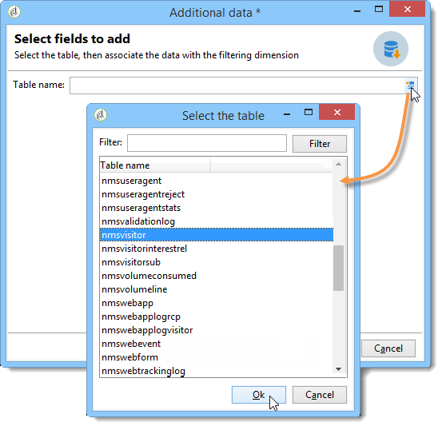
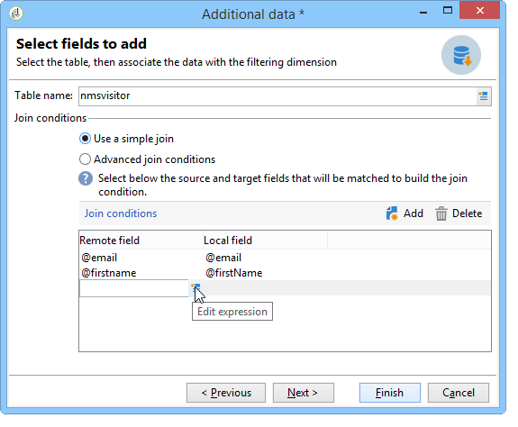
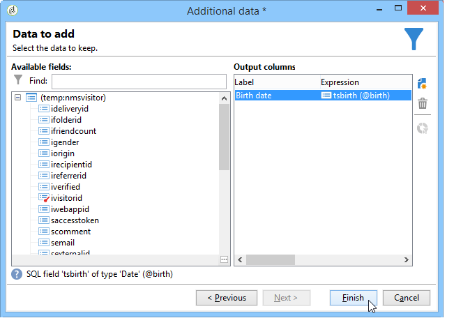

# Herstellung der Datenbankverbindung {#connecting-to-the-database}

Um eine Verbindung mit der externe Datenbank zu ermöglichen, müssen Sie die Verbindungsparameter angeben, d. h. die gewünschte Datenquelle und den Namen der Tabelle mit den zu ladenden Daten.

>[!CAUTION]
>
>Der Adobe Campaign-Benutzer benötigt spezifische Berechtigungen für die externe Datenbank und den Adobe Campaign-Anwendungs-Server, um Daten aus einer externen Datenbank verarbeiten zu können. Weiterführende Informationen finden Sie im Abschnitt [Zugriffsberechtigungen auf Remote-Datenbank](../../installation/using/remote-database-access-rights.md).
>
>Um Fehlfunktionen zu verhindern, müssen Benutzer, die auf geteilte Remote-Daten zugreifen, von getrennten Arbeitsplätzen aus arbeiten.

## Geteilte Verbindung erstellen {#creating-a-shared-connection}

Sie können auf eine gemeinsam genutzte externe Datenbank über Adobe Campaign zugreifen, vorausgesetzt die Verbindung ist aktiv.

1. Die Konfiguration muss zuvor über den Knoten **[!UICONTROL Administration > Plattform > Externe Konten]** durchgeführt werden.
1. Klicken Sie auf die Schaltfläche **[!UICONTROL Neu]** und wählen Sie als Typ **[!UICONTROL Externe Datenbank]** aus.
1. Definieren Sie die Parameter **[!UICONTROL Verbindung]** für die externe Datenbank.

   Bei Verbindungen mit einer Datenbank vom **ODBC**-Typ muss das Feld **[!UICONTROL Server]** den Namen der ODBC-Datenquelle und nicht den Servernamen enthalten. Darüber hinaus können je nach verwendeter Datenbank bestimmte zusätzliche Konfigurationen erforderlich sein. Siehe Abschnitt [Spezifische Konfigurationen nach Datenbanktyp](../../installation/using/configure-fda.md).

1. Klicken Sie nach der Eingabe der Parameter zur Bestätigung auf die Schaltfläche **[!UICONTROL Verbindung testen]**.

   

1. Deselektieren Sie nötigenfalls die Option **[!UICONTROL Aktiviert]**, um den Zugriff auf diese Datenbank zu deaktivieren, ohne ihre Konfiguration zu löschen.
1. Um Adobe Campaign Zugriff auf diese Datenbank zu erlauben, müssen Sie die SQL-Funktionen bereitstellen. Klicken Sie dazu auf den Tab **[!UICONTROL Parameter]** und danach auf die Schaltfläche **[!UICONTROL Funktionen freigeben]**.

   

Auf der Registerkarte **[!UICONTROL Parameter]** können Sie spezifische Arbeits-Tablespaces für die Tabellen und den Index definieren.

## Herstellen einer temporären Verbindung {#creating-a-temporary-connection}

Sie können eine Verbindung zu einer externen Datenbank direkt über Workflow-Aktivitäten definieren. In diesem Fall befindet sie sich in einer lokalen externen Datenbank, die für die Verwendung in einem aktuellen Workflow reserviert ist. Sie wird nicht in den externen Konten gespeichert. Diese Art der pünktlichen Verbindung kann für verschiedene Aktivitäten des Workflows erstellt werden, insbesondere für die Aktivität **[!UICONTROL Abfrage]**, das **[!UICONTROL Laden (RDBMS)]** die Aktivität **[!UICONTROL Anreicherung]** oder die Aktivität **[!UICONTROL Aufspaltung]**.

>[!CAUTION]
>
>Diese Art der Konfiguration wird nicht empfohlen, kann aber regelmäßig verwendet werden, um Daten abzurufen. Dennoch sollten Sie ein externes Konto gemäß der Beschreibung in Abschnitt [Erstellen einer geteilten Verbindung](#creating-a-shared-connection) erstellen.

Gehen Sie in der Abfrageaktivität zur Erstellung einer periodischen Verbindung zu einer externen Datenbank beispielsweise folgendermaßen vor:

1. Klicken Sie auf **[!UICONTROL Daten hinzufügen...]** und wählen Sie die Option **[!UICONTROL Externe Daten]** aus.
1. Wählen Sie die Option **[!UICONTROL Datenquelle lokal definieren]**.

   

1. Wählen Sie die Zieldatenbank-Engine in der Dropdown-Liste aus. Geben Sie den Namen des Servers und die Authentifizierungsparameter an.

   Geben Sie auch den Namen der externen Datenbank an.

   

   Klicken Sie auf die Schaltfläche **[!UICONTROL Weiter]**.

1. Wählen Sie die Tabelle aus, in der die Daten gespeichert sind.

   Sie können den Namen der Tabelle direkt in das entsprechende Feld eingeben oder auf das Bearbeiten-Symbol klicken, um eine Liste mit Datenbanktabellen zu öffnen.

   

1. Klicken Sie auf die Schaltfläche **[!UICONTROL Hinzufügen]**, um ein oder mehrere Abstimmungsfelder zwischen den Daten der externen Datenbank und den Daten in der Adobe Campaign-Datenbank zu definieren. Über die Symbole **[!UICONTROL Ausdruck bearbeiten]** der Option **[!UICONTROL Remote-Feld]** und **[!UICONTROL Lokales Feld]** erhalten Sie Zugriff auf die Liste mit den Feldern einer jeden Tabelle.

   

1. Spezifizieren Sie nötigenfalls eine Filterbedingung und den Datensortierungsmodus.
1. Wählen Sie zusätzlich in der externen Datenbank zu sammelnden Daten aus. Doppelklicken Sie dazu auf die Felder, die Sie hinzufügen möchten, damit sie in den **[!UICONTROL Ausgabespalten]** angezeigt werden.

   

   Klicken Sie zur Bestätigung der Konfiguration auf **[!UICONTROL Beenden]**.

## Sichere Verbindung {#secure-connection}

>[!NOTE]
>
>Eine sichere Verbindung ist nur bei PostgreSQL verfügbar.

Sie können durch das Konfigurieren eines externen FDA-Kontos eine sichere Verbindung für den Zugriff auf eine externe Datenbank herstellen.

Fügen Sie dazu nach der Serveradresse und der Adresse des verwendeten Ports &quot;**:ssl**&quot; hinzu. Beispiel: **192.168.0.52:4501:ssl**.

Die Daten werden dadurch unter Verwendung des sicheren SSL-Protokolls gesendet.

## Zusätzliche Konfigurationen {#additional-configurations}

Bei Bedarf können Sie das Schema für die Verarbeitung von Daten in einer externen Datenbank erstellen. Ebenso können Sie mit Adobe Campaign die Zuordnung zu den Daten in einer externen Tabelle definieren. Diese Konfigurationen sind allgemein und gelten nicht ausschließlich für Workflows.

>[!NOTE]
>
>Weiterführende Informationen zur Erstellung von Schemata in Adobe Campaign und zur Definition eines neuen Daten-Mappings finden Sie auf [dieser Seite](../../configuration/using/about-schema-edition.md).
