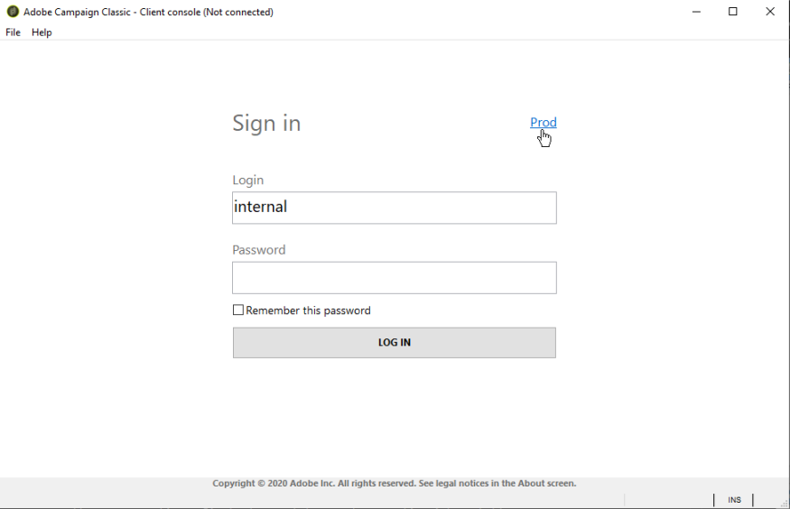

# Erstellen einer Instanz und Anmelden{#creating-an-instance-and-logging-on}

Gehen Sie wie folgt vor, um eine neue Instanz und Adobe Campaign Datenbank zu erstellen:

1. Erstellen die Verbindung.
1. Melden Sie sich an, um die zugehörige Instanz zu erstellen.
1. Erstellen und konfigurieren Sie die Datenbank.

>[!NOTE]
>
>Nur der **interne** Bezeichner kann diese Vorgänge ausführen. Weiterführende Informationen hierzu finden Sie in [diesem Abschnitt](../../installation/using/configuring-campaign-server.md#internal-identifier).

Wenn die Adobe Campaign Konsole gestartet wird, greifen Sie auf eine Log-in Seite zu.

Gehen Sie wie folgt vor, um eine neue Instanz zu erstellen:

1. Klicken Sie auf den Link in der oberen rechten Ecke der Berechtigungsfelder, um auf das Fenster zur Verbindungskonfiguration zuzugreifen. Dieser Link kann entweder **[!UICONTROL Neu...]** oder einem vorhandenen Instanznamen.

   

1. Klicken Sie auf **[!UICONTROL Hinzufügen > Verbindung]** und geben Sie die Bezeichnung und URL des Adobe Campaign-Anwendungs-Servers ein.

   

1. Geben Sie per URL eine Verbindung zum Adobe Campaign-Anwendungs-Server an. Verwenden Sie entweder einen DNS oder einen Alias des Computers oder Ihre IP-Adresse.

   Beispielsweise können Sie den `https://<machine>.<domain>.com` Typ URL.

   >[!CAUTION]
   >
   >Verwenden Sie für die Verbindung URL nur folgende Zeichen: `[a-z]`, `[A-Z]`, `[0-9]` und Bindestriche (-) oder Punkte.

1. Klicken Sie auf **[!UICONTROL &quot;OK]** &quot;, um die Einstellungen zu bestätigen: Sie können jetzt mit der Instanz Erstellung beginnen.
1. Geben Sie im Fenster Verbindung **[!UICONTROL Einstellungen]** die **interne** Log-in und deren Kennwort für die Verbindung mit dem Adobe Campaign Applikation Server ein. Sobald die Verbindung hergestellt ist, greifen Sie auf die Assistent für die Erstellung der Instanz zu, um eine neue Instanz zu deklarieren
1. Geben Sie in das **[!UICONTROL Feld &quot;Name]** &quot; den **Instanz** Namen ein. Da dieser Name zum Generieren einer Konfigurationsdatei **config-`<instance>`.xml** verwendet wird und in den Befehlszeilenparametern verwendet wird, um die Instanz zu identifizieren, stellen Sie sicher, dass Sie einen Kurznamen ohne Sonderzeichen wählen. Beispiel: **eMarketing**.

   

   Der Name der Instanz, die dem Domänennamen hinzugefügt wird, darf 40 Zeichen nicht überschreiten. Auf diese Weise können Sie die Größe von &quot;Nachrichten-ID&quot;-Headern einschränken und verhindern, dass Nachrichten insbesondere von Tools wie SpamAssassin als Spam eingestuft werden.

1. Im **[!UICONTROL DNS-Masken]** die **Liste der DNS-Masken** an die die Instanz angehängt werden soll. Der Adobe Campaign-Server verwendet den Hostnamen, der in den HTTP-Anfragen angezeigt wird, um zu bestimmen, welche Instanz erreicht werden soll.

   Der Hostname ist zwischen der Zeichenfolge enthalten. **https://** und dem ersten Schrägstrich **/** der Serveradresse.

   Sie können eine Liste von durch Kommas getrennten Werten definieren.

   Das? und &#42; Zeichen können als Platzhalter verwendet werden, um ein oder mehrere Zeichen zu ersetzen (DNS, portieren usw.). Bei Instanz funktioniert der **Demowert&#42;** mit &quot;https://demo&quot; ebenso wie mit &quot;https://demo:8080&quot; und Linear &quot;https://demo2&quot;.

   Die verwendeten Namen müssen in Ihrem DNS definiert werden. Sie können die Entsprechung zwischen einem DNS-Namen und einer IP-Adresse auch in der **Datei c:/windows/system32/drivers/etc/hosts** unter Windows und in der **Datei /etc/hosts** unter Linux angeben. Sie müssen daher die Verbindungseinstellungen ändern, um diesen DNS-Namen zu verwenden, bestellen eine Verbindung zu Ihrem ausgewählten Instanz herzustellen.

   Der Server muss insbesondere beim Hochladen von Bildern in E-Mails mit diesem Namen identifiziert werden.

   Darüber hinaus muss der Server über diesen Namen und nach Möglichkeit über eine Loopback-Adresse - 127.0.0.1 - eine Verbindung zu sich selbst herstellen können, um insbesondere den Export von Berichten im PDF-Format zu ermöglichen.

1. Im **[!UICONTROL Sprache]** Dropdown-Liste, wählen Sie die **Instanzensprache**: Englisch (US), Englisch (UK), Französisch oder Japanisch.

   Unterschiede zwischen US-amerikanischem Englisch und britischem Englisch werden im Abschnitt [diesem Abschnitt](../../platform/using/adobe-campaign-workspace.md#date-and-time).

   >[!CAUTION]
   >
   >Die Instanzsprache kann nach diesem Schritt nicht mehr geändert werden. Adobe Campaign-Instanzen sind nicht mehrsprachig: Sie können die Benutzeroberfläche nicht von einer Sprache in eine andere wechseln.

1. Klicken Sie auf **[!UICONTROL &quot;OK]** &quot;, um Instanz Deklaration zu bestätigen. Melden Sie sich ab und wieder an, um die Datenbank zu deklarieren.

   >[!NOTE]
   >
   >Die Instanz kann über die Befehlszeile erstellt werden. Weitere Informationen hierzu finden Sie in den [Befehl Zeilen](../../installation/using/command-lines.md).
