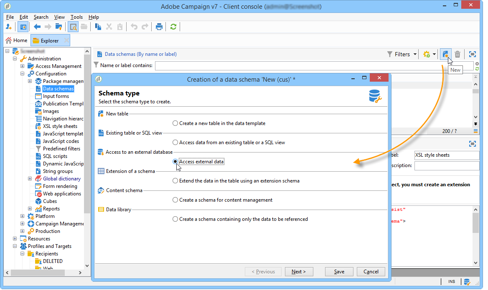
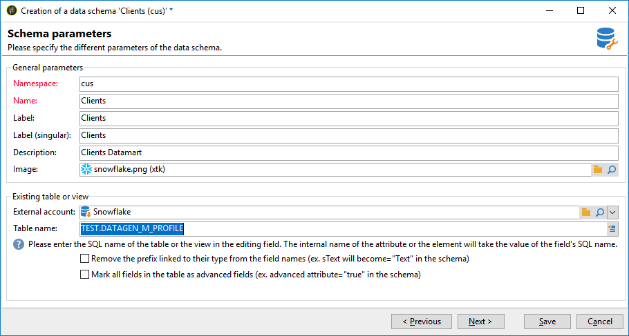
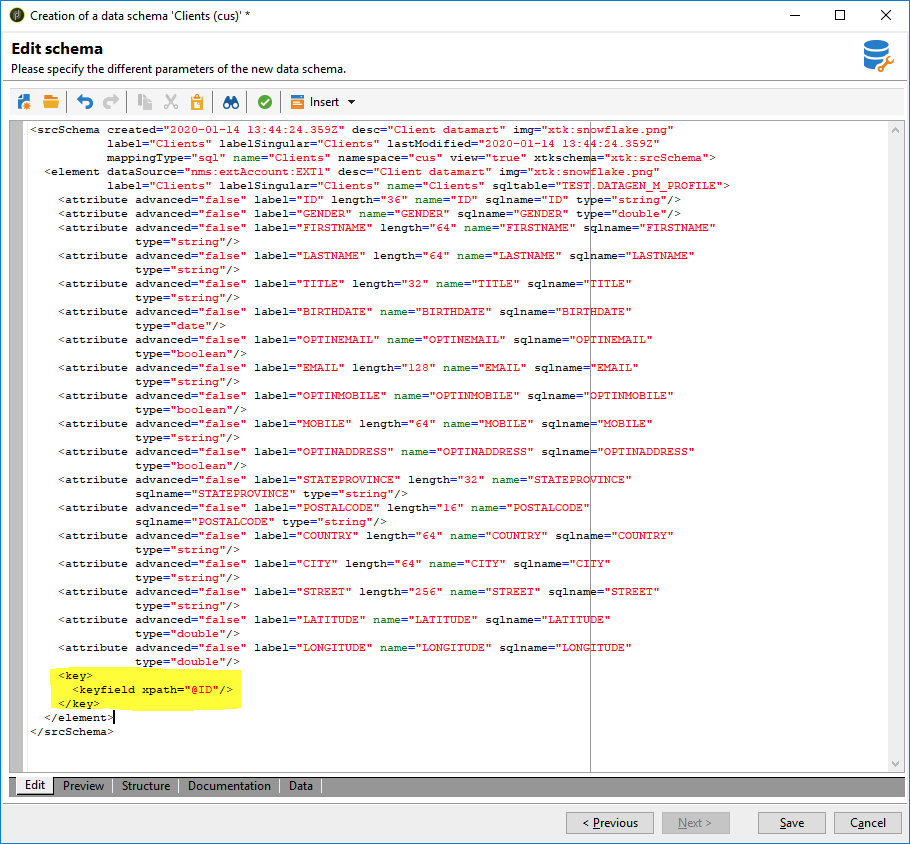

# Erstellen des Datenschemas {#creating-the-data-schema}

So erstellen Sie ein Schema für eine externe Datenbank:

1. Klicken Sie auf die Schaltfläche **[!UICONTROL Neu]** über der Liste der Datenschemata und wählen Sie **[!UICONTROL Auf externe Daten zugreifen]**.

   

1. Geben Sie einen **[!UICONTROL Namespace]** und **[!UICONTROL Name]** für das Schema ein und wählen Sie das **[!UICONTROL Externes Konto]** aus, das die Verbindung zur Datenbank ermöglicht. Dies ermöglicht den Zugriff auf die Liste der in der externen Datenbank verfügbaren Tabellen.

   

1. Wählen Sie im Feld **[!UICONTROL Tabellenname]** die Tabelle aus, die die zu erfassenden Daten enthält.

   Bei Snowflake können Sie hier Ihre Ansichten auswählen, ob dem Datenbankbenutzer die richtigen Berechtigungen gewährt wurden. Beachten Sie, dass Adobe Campaign bei Verwendung von Ansichten das XML-Schema nicht automatisch generieren kann, sondern selbst erstellen muss. Weitere Informationen zu Ansichten finden Sie in der [Dokumentation zu Snowflake](https://docs.snowflake.com/en/user-guide/views-introduction.html).

   

1. Klicken Sie zur Bestätigung auf **[!UICONTROL OK]**. Adobe Campaign erkennt die Struktur der ausgewählten Tabelle automatisch und erstellt das logische Schema. Beachten Sie, dass Adobe Campaign keine Verknüpfungen generiert.

1. Klicken Sie auf **[!UICONTROL Speichern]**, um die Erstellung zu bestätigen.

   >[!CAUTION]
   >
   >Bei Snowflake ist ein Primärschlüssel obligatorisch.

   

Die Indexe werden beim Mapping einer Tabelle automatisch erstellt (Standard- oder FDA-Mapping).
