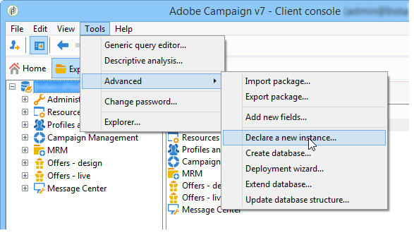

# Erstellen neuer Instanzen{#creating-new-instances}

Sobald Adobe Campaign installiert und die Instanz erstellt wurde, können Sie eine neue Instanz über die Konsole hinzufügen. Mit diesem Erstellungsmodus können Sie Tracking-Instanzen erstellen, ohne auf die Konsole zugreifen zu müssen.

Melden Sie sich dazu bei einer vorhandenen Datenbank an und führen Sie die folgenden Schritte aus:

1. Deklaration einer neuen Instanz

   Gehen Sie **[!UICONTROL Tools > Erweitert > Neue Instanz deklarieren…]**, um den Assistenten zu starten.

   

   Geben Sie die Parameter der neuen Instanz an. Weitere Informationen hierzu finden Sie unter [Instanz erstellen und anmelden](../../installation/using/creating-an-instance-and-logging-on.md).
