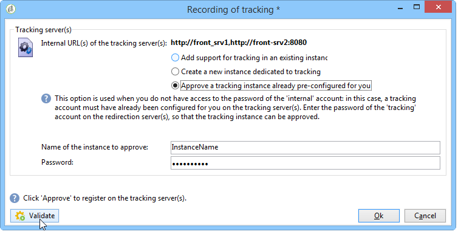
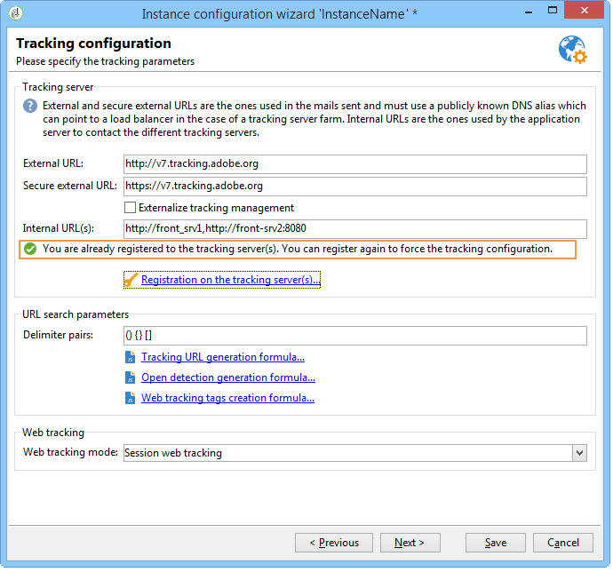
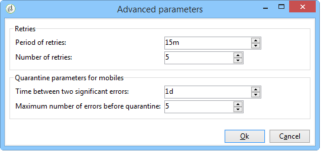

# Bereitstellen einer Instanz{#deploying-an-instance}

>[!NOTE]
>
>Serverseitige Konfigurationen können nur von Adobe für Bereitstellungen ausgeführt werden, die von Adobe gehostet werden. Weitere Informationen zu den verschiedenen Bereitstellungen finden Sie im Abschnitt [Hosting-Modelle](../../installation/using/hosting-models.md) oder in [diesem Artikel](https://helpx.adobe.com/de/campaign/kb/acc-on-prem-vs-hosted.html).

## Bereitstellungsassistent {#deployment-wizard}

Ein grafischer Assistent, der in der Adobe Campaign-Client-Konsole verfügbar ist, ermöglicht es Ihnen, die Parameter der Instanz zu definieren, mit der Sie eine Verbindung herstellen möchten.

Um den Bereitstellungsassistenten Beginn, wählen Sie &quot; **Extras&quot;> &quot;Erweitert&quot;> &quot;Bereitstellungsassistent&quot;**.


Die Konfigurationsschritte lauten wie folgt:

1. [Allgemeine Parameter](#general-parameters)
1. [Parameter für den E-Mail-Kanal](#email-channel-parameters)
1. [Verwalten von gekürzten E-Mails](#managing-bounced-emails)
1. [Verfolgungskonfiguration](#tracking-configuration)
1. [Parameter für mobile Kanal](#mobile-channel-parameters)
1. [Regionale Einstellungen](#regional-settings)
1. [Internetzugang](#access-from-the-internet)
1. [Verwalten von öffentliche Ressourcen](#managing-public-resources)
1. [Daten bereinigen](#purging-data)

## Allgemeine Parameter {#general-parameters}

Im ersten Schritt des Bereitstellungsassistenten können Sie allgemeine Informationen zur Instanz eingeben.


### Allgemeine Informationen {#general-information}

Im unteren Bereich des Fensters können Sie die zu aktivierenden Optionen auswählen.

* **[!UICONTROL Bei der Rechnungsstellung]** verwendete Kunden-ID: Dies kann der Name der Instanz und die Versionsnummer sein.
* **[!UICONTROL Allgemeiner Name des Kunden]** : Geben Sie eine Zeichenfolge mit dem Namen Ihrer Firma ein. Diese Informationen können in den Links zur Abmeldung verwendet werden.
* **[!UICONTROL Namensraum]** : Geben Sie einen kurzen Bezeichner in Kleinbuchstaben ein. Ziel ist es, im Falle einer Aktualisierung zwischen Ihrer spezifischen Konfiguration und der werkseitigen Konfiguration zu unterscheiden. Der Standard-Namensraum ist **cus** - für den Kunden.

### Technische Optionen {#technical-options}

Im unteren Bereich des Fensters können Sie die zu aktivierenden Optionen auswählen.

Folgende Optionen stehen zur Verfügung:

* **[!UICONTROL Email-Kanal]** : , um E-Mail-Versand zu aktivieren. Weitere Informationen finden Sie unter [E-Mail-Kanal-Parameter](#email-channel-parameters).
* **[!UICONTROL Verfolgung]** : Aktivieren der Verfolgung der Population der Zielgruppe (öffnet und klickt). Siehe [Tracking-Konfiguration](#tracking-configuration).
* **[!UICONTROL Verwalten von gekürzten E-Mails]** : Zum Definieren des POP-Kontos, das zum Abholen eingehender E-Mails verwendet wird. Weitere Informationen finden Sie unter Verwalten von [gekürzten E-Mails](#managing-bounced-emails).
* **[!UICONTROL LDAP-Integration]** : Zum Konfigurieren der Benutzerauthentifizierung über einen LDAP-Ordner. Siehe [Verbindung über LDAP](../../installation/using/connecting-through-ldap.md)herstellen.

## Parameter für den E-Mail-Kanal {#email-channel-parameters}

Im folgenden Schritt können Sie die Informationen definieren, die in den Nachrichtenkopfzeilen angezeigt werden sollen.

Diese Parameter können in Versandvorlagen und für jeden Versand einzeln überladen werden (sofern die Benutzer über die erforderlichen Rechte verfügen).

### Parameter für ausgelieferte E-Mails {#parameters-for-delivered-emails}


Geben Sie die folgenden Parameter an:

* **[!UICONTROL Name]** des Absenders: Name des Absenders,
* **[!UICONTROL Absenderadresse]** : Anschrift des Absenders,
* **[!UICONTROL Antwortadressetext]** : Der Name, der angepasst werden kann und verwendet wird, wenn der Empfänger in der E-Mail-Client-Software auf die Schaltfläche **[!UICONTROL Antworten]** klickt,
* **[!UICONTROL Antwortadresse]** : Die E-Mail-Adresse, die verwendet wird, wenn der Empfänger auf die Schaltfläche **[!UICONTROL Antworten]** in der E-Mail-Client-Software klickt,
* **[!UICONTROL Fehleradresse]** : E-Mail-Adresse von Fehlermeldungen. Dies ist die technische Adresse, die für die Bearbeitung von Absprungpost verwendet wird, einschließlich E-Mails, die vom Adobe Campaign-Server aufgrund nicht vorhandener Zielgruppen-Adressen empfangen wurden.

In addition to this, you can specify the **masks** authorized for the sender address and the error address. Bei Angabe von mehr als einer Maske sind die Masken durch Kommata zu trennen. Hierbei handelt es sich um eine optionale Konfiguration. Wenn Felder eingegeben werden, prüft Adobe Campaign zum Zeitpunkt des Versands (während der Analyse, ob die Adresse keine Variablen enthält), dass die Adressen gültig sind. Dieser Betriebsmodus stellt sicher, dass keine Adressen verwendet werden, die Probleme mit Versänden auslösen könnten. Absenderadressen sind auf dem Versandserver zu konfigurieren.

### In Adressen zugelassene Zeichen {#characters-authorized-in-addresses}

<!--This window enables you to define, for all email campaigns, the delivery and address-quality management options.-->

In der Adobe Campaign-Datenbank müssen alle E-Mail-Adressen wie folgt erstellt werden: `x@y.z`. Die Zeichen **x**, **y** und **z** dürfen nicht leer sein und dürfen keine nicht autorisierten Zeichen enthalten.

Hier können Sie die autorisierten Zeichen (&#39;Datenrichtlinie&#39;) im E-Mail-Feld der Datenbank definieren. Zeichen, die nicht in der Liste enthalten sind, sind verboten und werden daher verweigert, wenn Informationen in der Datenbank über die Schnittstelle, über ein Web-Formular und auch Importieren von Daten.

Es stehen zwei Listen zur Verfügung: **Nur** Europäer oder nur **USA**. Bei Bedarf können weitere Zeichen hinzugefügt werden.

### Versandparameter {#delivery-parameters}

Die **erweiterten Parameter...** über den Link können Sie auf die Optionen, Versand und Quarantänen zugreifen.


In diesem Fenster können Sie für alle E-Mail-Kampagnen die Verwaltungsoptionen für Versand und Adresse definieren.

Folgende Optionen stehen zur Verfügung:

* **[!UICONTROL Dauer der Meldungen]** : Nach diesem Zeitpunkt wird der Versand gestoppt (standardmäßig 5 Tage),
* **[!UICONTROL Gültigkeitsdauer]** der Online-Ressourcen: Zeitraum, für den Informationen aus dem Empfänger-Profil aufbewahrt werden, um Mirrorseiten zu generieren,
* **[!UICONTROL Empfänger ausschließen, die nicht mehr kontaktiert]** werden möchten: Wenn diese Option aktiviert ist, werden keine auf der Blacklist Empfänger kontaktiert.
* **[!UICONTROL Dubletten]** automatisch ignorieren: Wenn diese Option aktiviert ist, wird kein Versand an Duplikat-Adressen vorgenommen.

### Wiederholungsparameter {#retry-parameters}

Die Informationen zu den Wiedereinziehungen sind in den Feldern **Wiederherstellungszeiträume** und **Anzahl der Wiedereinziehungen** angegeben: wenn ein Empfänger unerreichbar ist, z. B. wenn der Posteingang voll ist, versucht das Programm standardmäßig, ihn 5-mal zu kontaktieren, wobei ein einstündiger Abstand zwischen jedem Versuch (während der maximalen Versand-Zeit) eingehalten wird. Diese Werte können an Ihre Anforderungen angepasst werden.

### Quarantäne {#quarantine-parameters}

In Bezug auf die Quarantäne stehen folgende Konfigurationsoptionen zur Verfügung:

* **[!UICONTROL Dauer zwischen zwei bedeutenden Fehlern]** : Geben Sie einen Wert (&quot;1d&quot;) standardmäßig ein: 1 Tag), um die Zeit zu definieren, die die Anwendung wartet, bevor der Fehlerzähler im Falle eines Fehlers inkrementiert wird,
* **[!UICONTROL Maximale Anzahl der Fehler vor der Quarantäne]** : Sobald dieser Wert erreicht ist, wird die E-Mail-Adresse unter Quarantäne gestellt (standardmäßig &quot;5&quot;: die Adresse wird beim sechsten Fehler in Quarantäne gestellt). Dies bedeutet, dass der Kontakt automatisch von den nächsten Sendungen ausgeschlossen wird.

## Verwalten von gekürzten E-Mails {#managing-bounced-emails}

Absprungmail ist äußerst wichtig, um Versand-Fehler zu qualifizieren. Diese Fehler werden im Ordner &quot;NP@I&quot;kategorisiert, sobald die Regeln ihre Ursache ermittelt haben.

Dieser Schritt ist nur verfügbar, wenn im ersten Schritt des Bereitstellungsassistenten die Verwaltungsoptionen für **E-Mail-Kanal** und **Absprung-Mail** ausgewählt wurden. Refer to [General parameters](#general-parameters).

In dieser Phase können Sie Einstellungen für die Verwaltung von Absprungmeldungen definieren.


### POP-Konto zum Abrufen eingehender E-Mails {#pop-account-used-to-retrieve-incoming-mails}

Geben Sie die Parameter an, mit denen eine Verbindung zum Konto zum Abrufen eingehender E-Mails hergestellt werden soll.

* **[!UICONTROL Beschriftung]** : Name, der alle unten angegebenen Parameter enthält,
* **[!UICONTROL Server]** : Server, der zum Abrufen der Absprungmail (eingehende E-Mail) verwendet wird,
* **[!UICONTROL Sicherheit]** : Wählen Sie bei Bedarf in der Dropdown-Liste **[!UICONTROL SSL]** aus.
* **[!UICONTROL Hafen]** : Serveranschluss (im Allgemeinen 110),
* **[!UICONTROL Konto]** : Name des Kontos, das für die Absprungmail verwendet wird,
* **[!UICONTROL Kennwort]** : Kennwort für das Konto.

Nachdem Sie die POP-Einstellungen angegeben haben, klicken Sie auf **Testen** , um sicherzustellen, dass sie korrekt sind.

### Nicht verarbeitete Absprungmeldungen {#unprocessed-bounce-mails}

Absprünge werden automatisch nach Adobe Campaign verarbeitet. Dabei werden die unter &quot; **Administration&quot;> &quot;Kampagnenverwaltung&quot;> &quot;Verwaltung für nicht bereitgestellte Versand&quot;> &quot;-Protokollqualifizierung** &quot;aufgelisteten Regeln angewendet. For more on this, refer to [Bounce mail management](../../delivery/using/understanding-delivery-failures.md#bounce-mail-management).

Nicht verarbeitete Absprünge werden nicht in der Adobe Campaign-Oberfläche angezeigt. Sie werden automatisch gelöscht, es sei denn, sie werden mithilfe der folgenden Felder in ein Drittanbieter-Postfach übertragen:

* **[!UICONTROL Anschrift]** : Füllen Sie dieses Feld aus, um alle Fehlermeldungen (verarbeitet oder unverarbeitet), die von der Adobe Campaign-Plattform erfasst wurden, an eine Drittanbieter-Adresse zu übertragen.
* **[!UICONTROL Fehleradresse]** : Füllen Sie dieses Feld aus, um nur die Fehlermeldungen an eine Adresse eines Drittanbieters zu übertragen, für die der InMail-Prozess nicht qualifiziert war.
* **[!UICONTROL SMTP-Server]** : Server, der zum Senden der nicht verarbeiteten Absprungs-E-Mails verwendet wird.

>[!IMPORTANT]
>
>Um unverarbeitete Absprung-E-Mails weiterzuleiten, empfiehlt Adobe, nur das Feld **[!UICONTROL Adresse für Fehler]** auszufüllen. Stellen Sie jedoch sicher, dass die verwendete Adresse regelmäßig überprüft wird, da dies zu einer starken Belastung Ihres Mailservers führen könnte. Weitere Informationen erhalten Sie von Ihrem Kundenbetreuer.

## Verfolgungskonfiguration {#tracking-configuration}

Im nächsten Schritt können Sie die Verfolgung für die Instanz konfigurieren. Die Instanz muss bei den Tracking-Servern deklariert und registriert werden.

Dieser Schritt wird nur angeboten, wenn auf der ersten Seite des Bereitstellungsassistenten die Optionen **E-Mail-Kanal** und **Verfolgung** ausgewählt sind. Refer to [General parameters](#general-parameters).

Detailliertere Informationen zur Web-Verfolgung (Tracking-Modus, Erstellen und Einfügen von Tags...) finden Sie in [diesem Dokument](../../configuration/using/about-web-tracking.md).

### Grundprinzip {#operating-principle}

Wenn Sie die Verfolgung für eine Instanz aktivieren, werden die URLs in den Versänden beim Senden geändert, um die Verfolgung zu aktivieren.

* Die auf dieser Seite des Bereitstellungsassistenten eingegebenen Informationen zu externen URLs (ob sicher oder nicht) werden zum Erstellen der neuen URL verwendet. Zusätzlich zu diesen Informationen enthält der geänderte Link Folgendes: die Bezeichner des Versands, des Empfängers und der URL.

   Verfolgungsinformationen werden von Adobe Campaign auf dem/den Tracking-Server(en) erfasst, um die Profil des Empfängers und die mit dem Versand verknüpften Daten zu bereichern (Registerkarten &quot; **[!UICONTROL Verfolgung]** &quot;).

   Informationen zu internen URLs werden nur vom Adobe Campaign-Anwendungsserver verwendet, um den/die Tracking-Server/s zu kontaktieren.

   For more on this, refer to [Tracking server](#tracking-server).

* Nachdem die URLs konfiguriert wurden, müssen Sie die Verfolgung aktivieren. Dazu muss die Instanz auf den/den Tracking-Servern registriert sein.

   For more on this, refer to [Saving tracking](#saving-tracking).

### Tracking-Server {#tracking-server}


Um die Effizienz der Verfolgung in diesem Fall zu gewährleisten, müssen die folgenden Informationen angezeigt werden:
<!--With Mid-sourcing architecture, you can externalize tracking management. To do this:-->

* **[!UICONTROL Externe URL]** und/oder **[!UICONTROL sichere externe URL]** : Geben Sie die Umleitungs-URL ein, die in der zu sendenden E-Mail verwendet werden soll.
* **[!UICONTROL Interne URL(s)]** : URLs, die nur vom Adobe Campaign-Server verwendet werden, um mit den Tracking-Servern Kontakt aufzunehmen, um Protokolle zu sammeln und die URLs hochzuladen. Es ist nicht erforderlich, sie mit der Instanz zu verknüpfen.

   Wenn Sie keine URL angeben, wird die Tracking-URL standardmäßig verwendet.

Mit der Mid-Sourcing-Architektur können Sie das Tracking-Management externalisieren. Gehen Sie dazu wie folgt vor:

1. Wählen Sie die Option **[!UICONTROL Externalize-Tracking-Management]** : auf diese Weise können Sie einen Mid-Sourcing-Server als Tracking-Server verwenden.
1. Füllen Sie die Felder **[!UICONTROL Externe Konto]** und **[!UICONTROL Instanzname]** aus, um eine Verbindung zum Mid-Sourcing-Server herzustellen.

   Weitere Informationen finden Sie unter [Mid-Sourcing-Server](../../installation/using/mid-sourcing-server.md).

1. Klicken Sie auf die Schaltfläche &quot;Verfolgungsinstanz **** aktivieren&quot;, um die Verbindung zum Server zu genehmigen.

   

### Speichern der Verfolgung {#saving-tracking}

Sobald die URLs ausgefüllt sind, müssen Sie den Tracking-Server registrieren.

Klicken Sie auf den Link **Registrierung auf dem/den Tracking-Server(n)** und wählen Sie dann eine der verfügbaren Optionen aus.


Es gibt drei mögliche Architekturtypen für die Implementierung der Verfolgung:

1. **Hinzufügen Unterstützung der Verfolgung in einer vorhandenen Instanz**

   Diese Auswahl trifft zu, wenn die Instanz bereits für andere Anforderungen erstellt wurde (MTA-Server usw.). auf Servern, die als Tracking-Server verwendet werden.

   

   Geben Sie das Kennwort für das **interne** Konto auf den Umleitungsservern ein, um die Verfolgungsinstanz zu konfigurieren.

   >[!NOTE]
   >
   >Wenn mehrere Tracking-Server verwendet werden, müssen sie alle denselben Namen und dasselbe Kennwort verwenden.

   Geben Sie den Namen der Instanz und das Kennwort ein.

1. **Neue Instanz für die Verfolgung erstellen**

   Diese Option ist nützlich, wenn Verfolgungsinstanzen für die Verfolgung reserviert sind und keine anderen Anwendungsmodule haben.

   

   Geben Sie das Kennwort für das **interne** Konto auf den Umleitungsservern ein, um die Verfolgungsinstanz zu konfigurieren.

   >[!NOTE]
   >
   >Wenn mehrere Tracking-Server konfiguriert sind, müssen sie alle dasselbe Kennwort verwenden.

   Geben Sie den Namen der Instanz, das Kennwort und alle zugehörigen DNS-Masken wie **[!UICONTROL Kampagne*]** an.

1. **Validieren einer bereits vorkonfigurierten Verfolgungsinstanz**

   Diese Option wird verwendet, wenn Sie nicht über das Kennwort für das **interne** Konto verfügen. In diesem Fall ist ein Verfolgungskonto für Sie auf den/den Tracking-Servern vorkonfiguriert. Geben Sie das Kennwort des Verfolgungskontos der Umleitungsserver ein, um die Verfolgungsinstanz zu validieren.

   

   Geben Sie den Namen der zu validierenden Instanz an.

Klicken Sie auf **Genehmigen** , um den Aufzeichnungsvorgang mit dem Tracking-Server Beginn.

Im vorherigen Fenster wird die Registrierung auf der Ebene des Tracking-Servers durch eine Meldung bestätigt:



Die mit URL-Suchen verknüpften Parameter **dürfen bei einer Standardinstallation nicht geändert** werden. Für alle anderen Parameter wenden Sie sich bitte an Adobe.

## Parameter für mobile Kanal {#mobile-channel-parameters}

Im nächsten Schritt können Sie Standardeinstellungen für Versand zu Mobiltelefonen (SMS und WAP Push) definieren.

>[!NOTE]
>
>Der mobile Kanal ist optional: dieser Schritt wird nur angezeigt, wenn er gekauft wurde. Prüfen Sie diesbezüglich Ihren Lizenzvertrag.


### Standardkonto für SMS-Versand {#default-account-for-sms-delivery}

Folgende Angaben sind erforderlich:

* **[!UICONTROL Beschriftung]** : Geben Sie einen Namen für dieses SMS/Wap Push-Konto ein. Sie können beispielsweise den Namen Ihres Routers verwenden.
* Für **[!UICONTROL Server]**-, **[!UICONTROL Port]**-, **[!UICONTROL Account]**-, **[!UICONTROL Password]**-, **[!UICONTROL Connector]************** -, Send-Endpunkt, Reception-EndpunktNotification-Endpunktfelder: Wenden Sie sich für die erforderlichen Einstellungen an Ihren Dienstleister.

### Parameter der gesendeten SMS {#parameters-of-sms-sent}

In der Dropdown-Liste **Priorität** : Wählen Sie &quot;Normal&quot;, &quot;Hoch&quot;oder &quot;Dringend&quot;, um sie auf die zu sendenden Nachrichten anzuwenden.

### Erweiterte Parameter {#advanced-parameters}

Die **erweiterten Parameter...** über den Link können Sie auf die Optionen für Wiederholung und Quarantäne zugreifen.



Informationen zu weiteren Zustellversuchen finden Sie in den Feldern **weitere Zustellversuche** und **Anzahl weitere Zustellversuche** : Wenn ein Mobilgerät unerreichbar ist, versucht das Programm es standardmäßig 5-mal in Abständen von mindestens 15 Minuten (für den maximalen Versand) erneut. Diese Werte können an Ihre Bedürfnisse angepasst werden.

In Bezug auf die Quarantäne stehen folgende Konfigurationsoptionen zur Verfügung:

* **[!UICONTROL Zeit zwischen zwei bedeutenden Fehlern]** : Geben Sie einen Standardwert ein (standardmäßig &quot;1d&quot;): Tag), um die Zeit zu definieren, die die Anwendung wartet, bevor der Fehlerzähler auf einen Fehler erhöht wird.
* **[!UICONTROL Maximale Anzahl der Fehler vor der Quarantäne]** : Sobald dieser Wert erreicht ist, wird die Mobiltelefonnummer unter Quarantäne gestellt (standardmäßig &quot;5&quot;: die Nummer wird beim sechsten Fehler in Quarantäne gestellt). Das bedeutet, dass der Kontakt automatisch von zukünftigen Versänden ausgeschlossen wird.

## Regionale Einstellungen {#regional-settings}

In dieser Phase können Sie Voreinstellungen für Datenrichtlinien einbeziehen.


* **[!UICONTROL Betrachten Sie alle Telefonnummern als internationale]** : Wenn diese Option aktiviert ist, wendet die Anwendung das internationale Format auf Telefonnummern an (das Länderpräfix ist dann obligatorisch, da die Anzahl der Ziffern nicht überprüft wird, bevor die Formatierung angewendet wird). Wenn diese Option nicht ausgewählt ist, müssen Sie der internationalen Telefonnummer das Präfix &quot;+&quot;oder &quot;00&quot;selbst voranstellen.
* **[!UICONTROL Alle Telefonnummern im internationalen Format]** speichern: Diese Option betrifft nur **inländische** Telefonnummern, die importiert oder bearbeitet werden. Legen Sie fest, ob Sie ein internes Format (z. B. 425 555 0150) oder ein internationales Format (z. B. +1 425 555 0150)

## Access from the Internet {#access-from-the-internet}

>[!IMPORTANT]
>
>Aus Datenschutzgründen empfehlen wir die Verwendung von HTTPS für alle externen Ressourcen.

In diesem Schritt können Sie Zugriffs-URLs für im Adobe Campaign angezeigte Seiten definieren.

Hier müssen Sie auch die Veröffentlichungsoptionen angeben, die mit Webformularen verknüpft sind.


### Im Web angezeigte Server {#servers-exposed-on-the-web}

Verwenden Sie diese Seite, um die Server-URLs für Folgendes zu füllen:

1. Greifen Sie auf den im Internet angezeigten Anwendungsserver zu: Abonnement-/Abmeldung-Formulare, Extranet usw.
1. Greifen Sie auf den Anwendungsserver zu, wenn Ressourcen nicht im Web bereitgestellt werden: Formulare, Intranet, Bestätigungsseiten.
1. Greifen Sie auf die Mirrorseiten der Versand zu.

   Eine Mirrorseite ist eine dynamische Seite, auf der der Inhalt der E-Mail angezeigt wird. Der Zugriff erfolgt über einen Link, der in die Meldung eingefügt wird, die an den Empfänger gesendet wird, und kann personalisierte Elemente enthalten. Die Mirrorseite gibt dem Empfänger die Möglichkeit, die Nachricht in einem Internetbrowser anstelle der E-Mail-Software zu lesen, unabhängig vom Format des Versands (Text oder HTML). Mirrorseiten werden jedoch nur für einen bestimmten Versand generiert, wenn der erforderliche HTML-Inhalt definiert wurde.

Mit Adobe Campaign können Sie zwischen diesen drei URLs unterscheiden, um die Last über mehrere Plattformen zu verteilen.

## Verwalten von öffentliche Ressourcen {#managing-public-resources}

>[!IMPORTANT]
>
>Aus Datenschutzgründen empfehlen wir die Verwendung von HTTPS für alle externen Ressourcen.

Damit die Bilder von Empfängern gesehen werden können, müssen die in E-Mails und öffentlichen Ressourcen verwendeten Bilder, die mit Kampagnen verknüpft sind, auf einem extern zugänglichen Server gespeichert sein. Sie können dann externen Empfängern oder Operatoren zur Verfügung stehen.


Für diesen Schritt müssen Sie Folgendes eingeben:

1. Die neue öffentliche Ressourcen-URL. Weitere Informationen finden Sie im Abschnitt [Öffentliche Ressourcen-URL](#public-resources-url) .
1. Der Bilderkennungsmodus in einem Versand. Weitere Informationen finden Sie im Abschnitt zur [Versand-Bilderkennung](#delivery-image-detection) .
1. Veröffentlichungsoptionen. For more information, refer to the [Publication modes](#publication-modes) section.

Öffentliche Ressourcen können über den Knoten **Administration > Ressourcen > Online > Öffentliche Ressourcen** der Adobe Campaign-Struktur aufgerufen werden. Sie werden in einer Bibliothek gesammelt und können in E-Mails eingeschlossen, aber auch in Kampagnen oder Aufgaben und in Content-Management verwendet werden.


### Öffentliche Ressourcen-URL {#public-resources-url}

Im ersten Feld können Sie den Beginn der URL angeben, die nach dem Hochladen für die Ressourcen verwendet wird. Nach dem Hochladen sind die Ressourcen über diese neue URL verfügbar.

In einem Versand können Sie Bilder verwenden, die in der öffentliche Ressource-Bibliothek gespeichert sind, oder andere lokale Bilder oder Bilder, die auf einem Server gespeichert sind.

* Bei E-Mail-Bildern verwenden Sie die URL **https://** server **/res/img** .

   Dieser Wert kann für jeden Versand überschrieben werden.

* Bei öffentliche Ressourcen die URL **https://** server **/res/** instance ****, wobei **instance**der Name der Verfolgungsinstanz ist.

### Versand-Bilderkennung {#delivery-image-detection}

In einem Versand können Sie Bilder verwenden, die in der öffentliche Ressource-Bibliothek gespeichert sind, oder andere lokale Bilder oder Bilder, die auf einem Server gespeichert sind.

Mithilfe der **URL-Masken** für Felder können Sie die Liste der URL-Masken festlegen, die beim automatischen Hochladen von Bildern übersprungen werden sollen. Wenn Sie beispielsweise Bilder verwenden, die auf einer von außen zugänglichen Site gespeichert sind, insbesondere auf einer Internetseite, können Sie die Site-URL in dieses Feld eingeben.


Sie können mehrere URL-Masken durch ein Komma voneinander trennen.

* Informationen zur Verwendung und Verwaltung von Bildern in E-Mails finden Sie in [diesem Abschnitt](../../delivery/using/defining-the-email-content.md#adding-images).
* Im Versand-Assistent haben die von diesen URLs aufgerufenen Bilder den Status &quot;Ignoriert&quot;.

### Veröffentlichungsmodus {#publication-modes}

Im unteren Bereich des Assistenten können Sie die Veröffentlichungsoptionen für öffentliche Ressourcen und Bilder auswählen. Diese Optionen stehen auch für Webformulare und Umfragen zur Verfügung.

Die folgenden Veröffentlichungsmodi stehen zur Verfügung:

* Tracking-Server

   Die Ressourcen werden automatisch auf die verschiedenen Tracking-Server kopiert. Sie werden in der Schritt- [Verfolgungskonfiguration](#tracking-configuration)konfiguriert.

* Andere Adobe Campaign-Server

   Sie können einen weiteren Adobe Campaign-Server verwenden, auf den die Ressourcen kopiert werden.

   Serverseitig müssen Sie eine neue Instanz mit folgendem Befehl erstellen, um einen dedizierten Adobe Campaign-Server zu verwenden:

   ```
   nlserver config -addtrackinginstance:<trackingA>/<trackingA*>
   ```

   Geben Sie dann das Kennwort ein.

   Die Parameter der dedizierten Server werden in den Feldern **[!UICONTROL Medien-URL(s)]**, **[!UICONTROL Kennwort]** und **[!UICONTROL Instanzname]** angegeben.

   

* Manuelles Veröffentlichungsskript (nur für öffentliche Ressourcen)

   

   Sie können die Bilder mithilfe eines Skripts veröffentlichen:

   * Sie müssen dieses Skript erstellen: Der Inhalt hängt von Ihrer Konfiguration ab.
   * Das Skript wird durch den folgenden Befehl aufgerufen:

      ```
      [INSTALL]/copyToFrontal.vbs "$(XTK_INSTALL_DIR)\var\<instance>\upload\" "img1,img2,img3"
      ```

      wobei `[INSTALL]` der Zugriffspfad zum Installationsordner des Adobe Campaigns angegeben ist.

   * Stellen Sie unter Unix sicher, dass das Skript ausführbar ist.

Für Bilder müssen sie aus dem Ordner &quot;images&quot;kopiert werden, der über die Option **NmsDelivery_ImageSubDirectory** angegeben wurde, und auf einen oder mehrere Frontalserver. Diese Server speichern die Bilder, um sie über die neue konfigurierte URL zugänglich zu machen.

Im Ereignis der Veröffentlichung auf einem Adobe Campaign-Server ohne manuelles Veröffentlichungsskript werden die Bilder eines Versands standardmäßig im Ordner gespeichert `$(XTK_INSTALL_DIR)/var/res/img/ directory`. Die entsprechende URL lautet wie folgt: **`https://server/res/img`**.

`XTK_INSTALL_DIR)/var/res/$(INSTANCE_NAME)`. Die entsprechende URL lautet wie folgt: **`https://server/res/instance`** wobei instance der Name der Verfolgungsinstanz ist.

>[!NOTE]
>
>Es ist möglich, den Ordner der öffentliche Ressource Datenspeicherung zu ändern. For more on this, refer to [Managing public resources](#managing-public-resources).

### Synchronisieren von öffentliche Ressourcen {#synchronizing-public-resources}

Mit dieser Funktion können Sie öffentliche Ressourcen **auf mehreren Reserveservern** synchronisieren.

Wenn auf dem Tracking-Server keine öffentliche Ressource vorhanden ist oder die Ressource einen 404-Fehler zurückgibt, versucht der Tracking-Server, die Ressource auf einem der Reserveserver zu finden.

Das Deklarieren und Konfigurieren von Reserveservern muss in der Datei &quot; **serverConf.xml** &quot;des Marketing-Servers erfolgen. Alle in der Datei **serverConf.xml** verfügbaren Parameter sind in diesem [Abschnitt](../../installation/using/the-server-configuration-file.md)aufgeführt.

**Erklärung**

```
<redirection>
<spareServer enabledIf="" id="" url=""/>
</redirection>
```

**Konfiguration**

Für jede zu synchronisierende öffentliche Ressource müssen Sie dem `<url>` Element im `<relay>` Teil ein Statusattribut hinzufügen:

Das Statusattribut kann einen von drei Werten haben:

* reserve: Die öffentliche Ressource wird synchronisiert

* normal: Vorhandenes Verhalten (ohne Synchronisierung)

* schwarze Liste: Die URL ist auf der Blacklist, wenn der Fehler &quot;404&quot;zurückgegeben wird. Die Dauer (in Sekunden) der schwarzen Liste wird durch ein **timeout** -Attribut definiert, dessen Standardwert 60 s ist.

Die vordefinierte Konfiguration der Synchronisierung lautet:

```
(extracted from the serverConf.xml file)

<redirection P3PCompactPolicy="CAO DSP COR CURa DEVa TAIa OUR BUS IND UNI COM NAV"
databaseId="" defLogCount="30" expirationURL="" maxJobsInCache="100"
startRedirection="true" startRedirectionInModule="true" trackWebVisitors="false" trackingPassword="">
<spareServer enabledIf="" id="1" url=""/>
</redirection>

....


<relay debugRelay="false" forbiddenCharsInAuthority="?#.@/:" forbiddenCharsInPath="?#/"
           modDir="index.html" startRelay="false" startRelayInModule="true" timeout="60">
   <url IPMask="" deny="" hostMask="" relayHost="true" relayPath="true" status="normal" targetUrl="https://localhost:8080" timeout="" urlPath="/view/*"/>
      <url IPMask="" deny="" hostMask="" relayHost="true" relayPath="true" status="blacklist" targetUrl="https://localhost:8080" timeout="" urlPath="*.jsp"/>
      <url IPMask="" deny="" hostMask="" relayHost="true" relayPath="true" status="blacklist" targetUrl="https://localhost:8080" timeout="" urlPath="*.jssp"/>
      <url IPMask="" deny="" hostMask="" relayHost="true" relayPath="true" status="blacklist" targetUrl="https://localhost:8080" timeout="" urlPath="/webApp/*"/>
      <url IPMask="" deny="" hostMask="" relayHost="true" relayPath="true" status="blacklist" targetUrl="https://localhost:8080" timeout="" urlPath="/report/*"/>
      <url IPMask="" deny="" hostMask="" relayHost="true" relayPath="true" status="blacklist" targetUrl="https://localhost:8080" timeout="" urlPath="/jssp/*"/>
      <url IPMask="" deny="" hostMask="" relayHost="true" relayPath="true" status="normal" targetUrl="https://localhost:8080" timeout="" urlPath="/strings/*"/>
      <url IPMask="" deny="" hostMask="" relayHost="true" relayPath="true" status="normal" targetUrl="https://localhost:8080" timeout="" urlPath="/interaction/*"/>
      <url IPMask="" deny="" hostMask="" relayHost="true" relayPath="true" status="normal" targetUrl="https://localhost:8080" timeout="" urlPath="/barcode/*"/>

      <url IPMask="" deny="" hostMask="" relayHost="false" relayPath="false" status="spare" targetUrl="" timeout="" urlPath="/favicon.*"/>
      <url IPMask="" deny="" hostMask="" relayHost="false" relayPath="false" status="spare" targetUrl="" timeout="" urlPath="/*.html"/>
      <url IPMask="" deny="" hostMask="" relayHost="false" relayPath="false" status="spare" targetUrl="" timeout="" urlPath="/*.png"/>
      <url IPMask="" deny="" hostMask="" relayHost="false" relayPath="false" status="spare" targetUrl="" timeout="" urlPath="/*.jpg"/>

 </relay>
```

## Daten bereinigen {#purging-data}

In der letzten Phase des Bereitstellungsassistenten können Sie das automatische Bereinigen veralteter Daten konfigurieren. Die Werte werden in Tagen angegeben.


Daten werden automatisch über den Arbeitsablauf zur Datenbankbereinigung gelöscht. Weitere Informationen zur Konfiguration und zum Betrieb dieses Workflows sowie zu den gelöschten Elementen finden Sie in diesem [Dokument](../../production/using/database-cleanup-workflow.md).
