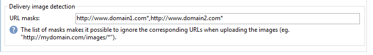

# Bereitstellen einer Instanz{#deploying-an-instance}

>[!NOTE]
>
>Serverseitige Konfigurationen können nur von Adobe für Bereitstellungen durchgeführt werden, die von Adobe gehostet werden. Weitere Informationen zu den verschiedenen Implementierungen finden Sie im Abschnitt [Hosting-Modelle](../../installation/using/hosting-models.md) oder [diese Seite](../../installation/using/capability-matrix.md).

## Bereitstellungsassistent {#deployment-wizard}

Adobe Campaign bietet einen grafischen Assistenten, der in der Adobe Campaign-Clientkonsole verfügbar ist und die Parameter der Instanz definiert, mit der Sie eine Verbindung herstellen werden.

Um den Softwareverteilungs-Assistenten zu starten, wählen Sie **Tools > Erweitert > Bereitstellungsassistent**.


Die Konfigurationsschritte lauten wie folgt:

1. [Allgemeine Parameter](#general-parameters)
1. [Parameter für den E-Mail-Kanal](#email-channel-parameters)
1. [Bounce Messages verwalten](#managing-bounced-emails)
1. [Tracking-Konfiguration](#tracking-configuration)
1. [Mobile-Kanal-Parameter](#mobile-channel-parameters)
1. [Regionale Parameter](#regional-settings)
1. [Internetzugang](#access-from-the-internet)
1. [Verwaltung öffentlicher Ressourcen](#managing-public-resources)
1. [Daten bereinigen](#purging-data)

## Allgemeine Parameter {#general-parameters}

Im ersten Schritt des Softwareverteilungs-Assistenten können Sie allgemeine Informationen zur Instanz eingeben.


### Allgemeine Informationen {#general-information}

Im unteren Bereich des Fensters können Sie die zu aktivierenden Optionen auswählen.

* **[!UICONTROL In der Abrechnung verwendete Kunden-ID]** : Dies kann der Name der Instanz und die Versionsnummer sein.
* **[!UICONTROL Allgemeiner Name des Kunden]** : Geben Sie eine Zeichenfolge mit dem Namen Ihres Unternehmens ein. Diese Informationen können in den Abmelde-Links verwendet werden.
* **[!UICONTROL Namespace]** : Geben Sie eine kurze Kennung in Kleinbuchstaben ein. Ziel ist es, im Falle eines Upgrades zwischen Ihrer spezifischen Konfiguration und der Werkskonfiguration zu unterscheiden. Der Standard-Namespace ist **cus** - für Kunden.

### Technische Optionen {#technical-options}

Im unteren Bereich des Fensters können Sie die zu aktivierenden Optionen auswählen.

Folgende Optionen stehen zur Verfügung:

* **[!UICONTROL Email-Kanal]** : , um den E-Mail-Versand zu aktivieren. Siehe [E-Mail-Kanal-Parameter](#email-channel-parameters).
* **[!UICONTROL Tracking]** : Aktivierung der Nachverfolgung der Zielpopulation (Öffnungen und Klicks). Siehe [Tracking-Konfiguration](#tracking-configuration).
* **[!UICONTROL Bounce Messages verwalten]** : Definiert das POP-Konto, das zum Abruf der eingehenden E-Mail verwendet wird. Siehe [Bounce Messages verwalten](#managing-bounced-emails).
* **[!UICONTROL LDAP-Integration]** : Konfigurieren der Benutzerauthentifizierung über einen LDAP-Ordner. Siehe [Verbindung über LDAP](../../installation/using/connecting-through-ldap.md).

## Parameter für den E-Mail-Kanal {#email-channel-parameters}

Im folgenden Schritt werden die Informationen definiert, die in den Kopfzeilen der Nachrichten angezeigt werden sollen.

Diese Parameter können in Versandvorlagen und für jeden Versand einzeln überschrieben werden (sofern die Benutzer über die erforderlichen Berechtigungen verfügen).

### Parameter der gesendeten E-Mails {#parameters-for-delivered-emails}


Geben Sie die folgenden Parameter an:

* **[!UICONTROL Name des Absenders]** : Geben Sie den Namen des Absenders ein.
* **[!UICONTROL Absenderadresse]** : Geben Sie die E-Mail-Adresse des Absenders ein. Wenn Sie E-Mails aus Adobe Campaign senden, wird die **Absenderadresse** Postfach wird nicht überwacht und Marketing-Benutzer können nicht auf dieses Postfach zugreifen. Adobe Campaign bietet außerdem keine Möglichkeit zur automatischen Antwort- oder automatischen Weiterleitungs-E-Mails, die in diesem Postfach empfangen wurden. Weitere Informationen zu Best Practices für die Zustellbarkeit [in dieser Dokumentation](https://experienceleague.adobe.com/docs/deliverability-learn/deliverability-best-practice-guide/additional-resources/campaign/ac-starting-new-platform.html){_blank}.

* **[!UICONTROL Text der Antwortadresse]** : Geben Sie den Namen ein, der verwendet wird, wenn der Empfänger auf die **[!UICONTROL Antwort]** Schaltfläche.
* **[!UICONTROL Antwortadresse]** : Geben Sie die E-Mail-Adresse ein, die verwendet werden soll, wenn der Empfänger auf die **[!UICONTROL Antwort]** in der E-Mail-Client-Software. Der Zweck der **Antwortadresse** -Feld ist der Zeitpunkt, zu dem der Empfänger auf eine andere Adresse als die **Absenderadresse**.  Diese Adresse muss eine gültige E-Mail-Adresse sein, mit einem überwachten Postfach verknüpft und vom Kunden gehostet werden.  Es kann sich beispielsweise um ein Support-Postfach handeln. `customer-care@customer.com`: E-Mails werden gelesen und beantwortet.

* **[!UICONTROL Fehleradresse]** : Geben Sie die E-Mail-Adresse der fehlerhaften Nachrichten ein. Dies ist die technische Adresse, die für die Verarbeitung von Bounce Messages verwendet wird, einschließlich E-Mails, die vom Adobe Campaign-Server aufgrund nicht vorhandener Zieladressen empfangen wurden. Diese Adresse muss eine gültige E-Mail-Adresse sein, mit einem überwachten Postfach verknüpft und vom Kunden gehostet werden. Es kann sich beispielsweise um ein Bounce-Postfach handeln. `errors@customer.com`.


Darüber hinaus können Sie die **Masken** für die Absenderadresse und die Fehleradresse autorisiert. Bei Angabe von mehr als einer Maske sind die Masken durch Kommata zu trennen. Hierbei handelt es sich um eine optionale Konfiguration. Wenn Felder eingegeben werden, prüft Adobe Campaign zum Zeitpunkt des Versands (während der Analyse, ob die Adresse keine Variablen enthält), ob die Adressen gültig sind. Dieser Betriebsmodus stellt sicher, dass keine Adressen verwendet werden, die Probleme beim Versand von Triggern verursachen könnten. Absenderadressen sind auf dem Versandserver zu konfigurieren.

>[!NOTE]
>
>* Diese Einstellungen werden in den Optionen der Campaign-Plattform gespeichert. [Weitere Informationen](../../installation/using/configuring-campaign-options.md).
> 
>* Bei Konfigurationen mit mehreren Branding-Themen können Sie die Fehleradresse anpassen und diese Konfiguration über das externe E-Mail-Routing-Konto überschreiben. [Weitere Informationen](../../installation/using/external-accounts.md#email-routing-external-account).
>


### Zulässige Zeichen in den Adressen {#characters-authorized-in-addresses}

<!--This window enables you to define, for all email campaigns, the delivery and address-quality management options.-->

In der Adobe Campaign-Datenbank müssen alle E-Mail-Adressen wie folgt erstellt werden: `x@y.z`. Die **x**, **y** und **z** darf nicht leer sein und darf keine nicht autorisierten Zeichen enthalten.

Hier können Sie die autorisierten Zeichen (&#39;data policy&#39;) im E-Mail-Feld der Datenbank definieren. Zeichen, die nicht in der Liste enthalten sind, sind verboten und werden daher bei der Eingabe von Informationen in die Datenbank über die Benutzeroberfläche, über ein Webformular und auch beim Import von Daten abgelehnt.

Zwei Listen sind verfügbar: **Nur europäische** oder **Nur USA**. Bei Bedarf können weitere Zeichen hinzugefügt werden.

### Versandparameter {#delivery-parameters}

Die **Erweiterte Parameter...** -Link bietet Zugriff auf Versandoptionen, mit einem erneuten Versuch verbundene Parameter und Quarantänen.


In diesem Fenster können Sie für alle E-Mail-Kampagnen die Managementoptionen für Versand und Adressenqualität definieren.

Folgende Optionen stehen zur Verfügung:

* **[!UICONTROL Versandlaufzeit der Nachrichten]** : Danach wird der Versand gestoppt (standardmäßig 5 Tage).
* **[!UICONTROL Gültigkeitsdauer der Online-Ressourcen]** : Zeitraum, für den Informationen aus dem Empfängerprofil aufbewahrt werden, um Mirrorseiten zu erzeugen.
* **[!UICONTROL Empfänger ausschließen, die nicht mehr kontaktiert werden möchten]** : Wenn diese Option aktiviert ist, werden die Empfänger der Blockierungsliste nicht kontaktiert.
* **[!UICONTROL Dubletten automatisch ignorieren]** : Wenn diese Option aktiviert ist, erfolgt kein Versand an doppelte Adressen.

>[!NOTE]
>
>Wenn Sie bei gehosteten oder hybriden Installationen ein Upgrade auf [Verbesserter MTA](../../delivery/using/sending-with-enhanced-mta.md), die **[!UICONTROL Versandlaufzeit der Nachrichten]** wird nur verwendet, wenn auf **3,5 Tage oder weniger**. Wenn Sie einen Wert von mehr als 3,5 Tagen definieren, wird dieser nicht berücksichtigt.

### Wiederholungsparameter {#retry-parameters}

Die Informationen über Wiedereinziehungen sind im Abschnitt **Wiederherstellungsfristen** und **Anzahl der Wiedereinziehungen** -Felder: Wenn ein Empfänger nicht erreichbar ist, z. B. wenn sein Posteingang voll ist, versucht das Programm standardmäßig, ihn fünfmal zu kontaktieren, wobei zwischen jedem Versuch (während der maximalen Versandzeit) ein Zeitintervall von einer Stunde eingehalten wird. Diese Werte können Ihren Bedürfnissen entsprechend geändert werden.

>[!NOTE]
>
>Wenn Sie bei gehosteten oder hybriden Installationen ein Upgrade auf [Verbesserter MTA](../../delivery/using/sending-with-enhanced-mta.md)festgelegt ist, werden die Wiederholungsparameter der Kampagne nicht mehr verwendet. Weitere Zustellversuche aufgrund von Softbounces und die Zeitdauer zwischen ihnen werden durch den Enhanced MTA bestimmt, basierend auf Typ und Prioritätsstufe der Bounce-Antworten, die von der E-Mail-Domain der Nachricht zurückgegeben werden.

### Quarantäneparameter {#quarantine-parameters}

In Bezug auf die Quarantäne stehen folgende Konfigurationsoptionen zur Verfügung:

* **[!UICONTROL Dauer zwischen zwei signifikanten Fehlern]** : Geben Sie einen Wert ein (standardmäßig &quot;1d&quot;): 1 Tag), um die Wartezeit zu definieren, bevor die Anwendung den Fehlerzähler im Fall eines Fehlers inkrementiert,
* **[!UICONTROL Maximale Anzahl an Fehlern vor der Quarantäne]** : Sobald dieser Wert erreicht ist, wird die E-Mail-Adresse unter Quarantäne gestellt (standardmäßig &quot;5&quot;): die Adresse beim sechsten Fehler unter Quarantäne gestellt wird). Dies bedeutet, dass der Kontakt automatisch von den nächsten Sendungen ausgeschlossen wird.

## Bounce Messages verwalten {#managing-bounced-emails}

Bounce Messages sind äußerst wichtig, um Versandfehler zu qualifizieren. Diese Fehler werden in die Kategorie NP@I eingeordnet, sobald die Regeln ihre Ursache ermittelt haben.

Dieser Schritt ist nur verfügbar, wenn die Variable **Email-Kanal** und **Bounce Message** Die Verwaltungsoptionen werden im ersten Schritt des Softwareverteilungs-Assistenten ausgewählt. Siehe [Allgemeine Parameter](#general-parameters).

In dieser Phase können Sie Einstellungen für die Verwaltung von Bounce Messages definieren.


### POP-Konto zum Abrufen eingehender E-Mails {#pop-account-used-to-retrieve-incoming-mails}

Geben Sie die Parameter an, mit denen eine Verbindung zum Konto zum Abrufen eingehender E-Mails hergestellt werden soll.

* **[!UICONTROL Titel]** : Name, der alle unten angegebenen Parameter enthält
* **[!UICONTROL Server]** : Server, der zum Abrufen der Bounce Message (eingehender E-Mail) verwendet wird,
* **[!UICONTROL Sicherheit]** : Wählen Sie bei Bedarf **[!UICONTROL SSL]** aus der Dropdown-Liste,
* **[!UICONTROL Port]** : Server-Anschluss (im Allgemeinen 110),
* **[!UICONTROL Konto]** : Name des für die Bounce Message verwendeten Kontos,
* **[!UICONTROL Passwort]** : Kennwort für das Konto.

Nachdem die POP-Einstellungen angegeben wurden, klicken Sie auf **Test** um sicherzustellen, dass sie korrekt sind.

### Unverarbeitete Bounce-E-Mails {#unprocessed-bounce-mails}

Absprünge werden automatisch von Adobe Campaign verarbeitet, wobei die im Abschnitt **Administration > Campaign Management > Unzustellbarkeitsverwaltung > Versandlogqualifizierung** Knoten. Weitere Informationen hierzu finden Sie unter [Bounce-Message-Verwaltung](../../delivery/using/understanding-delivery-failures.md#bounce-mail-management).

Nicht verarbeitete Bounces werden nicht in der Adobe Campaign-Benutzeroberfläche angezeigt. Sie werden automatisch gelöscht, es sei denn, sie werden mithilfe der folgenden Felder in ein Drittanbieter-Postfach übertragen:

* **[!UICONTROL Weiterleitungsadresse]** : Füllen Sie dieses Feld aus, um alle von der Adobe Campaign-Plattform erfassten Fehlermeldungen (verarbeitet oder nicht verarbeitet ) an eine Drittanbieteradresse zu übertragen.
* **[!UICONTROL Fehlerbehebung]** : Füllen Sie dieses Feld aus, um nur die Fehlermeldungen an eine Drittanbieteradresse zu übertragen, die der inMail-Prozess nicht qualifizieren konnte.
* **[!UICONTROL SMTP-Server]** : Server, der zum Senden der nicht verarbeiteten Bounce-E-Mails verwendet wird.

>[!IMPORTANT]
>
>Um nicht verarbeitete Bounce Messages weiterzuleiten, empfiehlt Adobe, nur die **[!UICONTROL Fehlerbehebung]** -Feld. Stellen Sie jedoch sicher, dass die verwendete Adresse regelmäßig überprüft wird, da dies zu einer starken Belastung des E-Mail-Servers führen könnte. Weitere Informationen erhalten Sie von Ihrem Kundenbetreuer.

## Tracking-Konfiguration {#tracking-configuration}

Im nächsten Schritt können Sie das Tracking für die Instanz konfigurieren. Die Instanz muss deklariert und bei den Tracking-Servern registriert werden.

Dieser Schritt wird nur angeboten, wenn die Variable **Email-Kanal** und **Tracking** werden auf der ersten Seite des Softwareverteilungs-Assistenten ausgewählt. Siehe [Allgemeine Parameter](#general-parameters).

Weiterführende Informationen zum Webtracking (Tracking-Modus, Erstellen und Einfügen von Tags usw.) finden Sie im Abschnitt . [dieses Dokuments](../../configuration/using/about-web-tracking.md).

### Grundprinzip {#operating-principle}

Wenn Sie das Tracking in einer Instanz aktivieren, werden die URLs in den Sendungen geändert, um das Tracking zu aktivieren.

* Die Informationen zu externen URLs (ob sicher oder nicht), die auf dieser Seite des Softwareverteilungs-Assistenten eingegeben wurden, werden zum Erstellen der neuen URL verwendet. Neben diesen Informationen enthält der geänderte Link: die IDs des Versands, des Empfängers und der URL.

  Tracking-Informationen werden von Adobe Campaign auf den Tracking-Servern erfasst, um die Empfängerprofile und die mit dem Versand verknüpften Daten anzureichern ( **[!UICONTROL Tracking]** Registerkarten).

  Informationen zu internen URLs werden nur vom Adobe Campaign-Anwendungsserver verwendet, um den/die Tracking-Server(s) zu kontaktieren.

  Weitere Informationen hierzu finden Sie unter [Tracking-Server](#tracking-server).

* Nach der Konfiguration der URLs müssen Sie das Tracking aktivieren. Dazu muss die Instanz auf den Tracking-Servern registriert sein.

  Weitere Informationen hierzu finden Sie unter [Tracking speichern](#saving-tracking).

### Tracking-Server {#tracking-server}


Um die Effizienz des Trackings in dieser Instanz zu gewährleisten, müssen die folgenden Informationen angezeigt werden:
<!--With Mid-sourcing architecture, you can externalize tracking management. To do this:-->

* **[!UICONTROL Externe URL]** und/oder **[!UICONTROL Externe URL sichern]** : Geben Sie die Umleitungs-URL ein, die in der zu sendenden E-Mail verwendet werden soll.
* **[!UICONTROL Interne URL(s)]** : URLs, die nur vom Adobe Campaign-Server verwendet werden, um den/die Tracking-Server zu kontaktieren, um Protokolle zu erfassen und die URLs hochzuladen. Es ist nicht erforderlich, sie mit der Instanz zu verknüpfen.

  Wenn Sie keine URL angeben, wird die Tracking-URL standardmäßig verwendet.

Mit der Mid-Sourcing-Architektur können Sie die Tracking-Verwaltung externalisieren. Gehen Sie dazu wie folgt vor:

1. Auswählen der Option **[!UICONTROL Externes Tracking-Management]** : Auf diese Weise können Sie einen Mid-Sourcing-Server als Tracking-Server verwenden.
1. Füllen Sie die **[!UICONTROL Externes Konto]** und **[!UICONTROL Instanzname]** -Felder, um eine Verbindung zum Mid-Sourcing-Server herstellen zu können.

   Weitere Informationen finden Sie unter [Mid-Sourcing-Server](../../installation/using/mid-sourcing-server.md).

1. Klicken Sie auf **[!UICONTROL Aktivieren der Tracking-Instanz]** -Schaltfläche, um die Verbindung zum Server zu genehmigen.

   

### Tracking speichern {#saving-tracking}

Sobald die URLs ausgefüllt sind, müssen Sie den Tracking-Server registrieren.

Klicken Sie auf den Link **Registrierung auf dem/den Tracking-Server(n)** und wählen Sie dann eine der verfügbaren Optionen aus.


Es gibt drei mögliche Architekturtypen für die Implementierung von Tracking:

1. **Unterstützung für Tracking in einer vorhandenen Instanz hinzufügen**

   Diese Auswahl trifft zu, wenn die Instanz bereits für andere Anforderungen erstellt wurde (MTA-Server usw.) auf Servern, die als Tracking-Server verwendet werden.

   

   Geben Sie das Kennwort für die **intern** -Konto auf den Umleitungs-Server hinzufügen, um die Tracking-Instanz zu konfigurieren.

   >[!NOTE]
   >
   >Wenn mehrere Tracking-Server verwendet werden, müssen alle denselben Namen und dasselbe Kennwort verwenden.

   Geben Sie den Namen der Instanz und das Kennwort an.

1. **Erstellen Sie eine neue Instanz für das Tracking.**

   Diese Option ist nützlich, wenn Tracking-Instanzen für die Verfolgung reserviert sind und keine anderen Anwendungsmodule haben.

   

   Geben Sie das Kennwort für die **intern** -Konto auf den Umleitungs-Server hinzufügen, um die Tracking-Instanz zu konfigurieren.

   >[!NOTE]
   >
   >Wenn mehrere Tracking-Server konfiguriert sind, müssen alle dasselbe Kennwort verwenden.

   Geben Sie den Namen der Instanz, das Kennwort und alle zugehörigen DNS-Masken an, z. B. **[!UICONTROL Kampagne*]**.

1. **Validieren einer bereits für Sie vorkonfigurierten Tracking-Instanz**

   Diese Option wird verwendet, wenn Sie nicht über das Kennwort für die **intern** Konto; In diesem Fall ist ein Tracking-Konto für Sie auf den Tracking-Servern vorkonfiguriert. Geben Sie das Kennwort des Trackingkontos der Weiterleitungsserver ein, um die Tracking-Instanz zu validieren.

   

   Geben Sie den Namen der zu validierenden Instanz an.

Klicken **Genehmigen** , um den Aufnahmevorgang mit dem Tracking-Server zu starten.

Im vorherigen Fenster wird die Registrierung auf Tracking-Server-Ebene durch eine Meldung bestätigt:


Die mit URL-Suchen verknüpften Parameter **darf nicht geändert werden** für eine Standardinstallation. Für alle anderen Parameter kontaktieren Sie bitte die Adobe.

## Mobile-Kanal-Parameter {#mobile-channel-parameters}

Im nächsten Schritt werden die Standardeinstellungen für den Mobiltelefon-Versand (SMS und WAP Push) festgelegt.

>[!NOTE]
>
>Der mobile Kanal ist optional: Diese Phase wird nur angezeigt, wenn sie erworben wurde. Prüfen Sie diesbezüglich Ihren Lizenzvertrag.


### Standardkonto für das SMS-Routing {#default-account-for-sms-delivery}

Folgende Angaben sind erforderlich:

* **[!UICONTROL Titel]** : Geben Sie einen Namen für dieses SMS-/Wap Push-Konto ein. Beispielsweise können Sie den Namen Ihres Routers verwenden.
* Für **[!UICONTROL Server]**, **[!UICONTROL Port]**, **[!UICONTROL Konto]**, **[!UICONTROL Passwort]**, **[!UICONTROL Connector]**, **[!UICONTROL Send Endpoint]**, **[!UICONTROL Reception Endpoint]**, **[!UICONTROL Benachrichtigungsendpunkt]** -Felder: Wenden Sie sich für die erforderlichen Einstellungen an Ihren Dienstleister.

### Parameter für ausgehende SMS {#parameters-of-sms-sent}

Im **Priorität** Dropdown-Liste: Wählen Sie &quot;Normal&quot;, &quot;Hoch&quot;oder &quot;Dringend&quot; aus, um sie auf die zu sendenden Nachrichten anzuwenden.

### Erweiterte Parameter {#advanced-parameters}

Die **Erweiterte Parameter...** -Link ermöglicht Ihnen den Zugriff auf die Optionen für Neuversuche und Quarantäne.


Informationen zu weiteren Zustellversuchen finden Sie im Abschnitt **Versuchszeitraum** und **Anzahl weiterer Versuche** -Felder: Wenn ein Mobiltelefon nicht erreichbar ist, wird das Programm standardmäßig in Intervallen von mindestens 15 Minuten (für den maximalen Bereitstellungszeitraum) fünf Mal erneut versuchen. Diese Werte können Ihren Bedürfnissen entsprechend angepasst werden.

In Bezug auf die Quarantäne stehen folgende Konfigurationsoptionen zur Verfügung:

* **[!UICONTROL Zeit zwischen zwei signifikanten Fehlern]** : Geben Sie einen Standardwert ein (standardmäßig &quot;1d&quot;): day), um die Wartezeit zu definieren, bevor der Fehlerzähler auf einen Fehler erhöht wird.
* **[!UICONTROL Maximale Anzahl an Fehlern vor der Quarantäne]** : Sobald dieser Wert erreicht ist, wird die Mobiltelefonnummer unter Quarantäne gestellt (standardmäßig &quot;5&quot;): die Nummer beim sechsten Fehler unter Quarantäne gestellt wird). Dadurch wird der Kontakt automatisch aus künftigen Sendungen ausgeschlossen.

## Regionale Parameter {#regional-settings}

In dieser Phase können Sie Voreinstellungen für Datenrichtlinien einbeziehen.


* **[!UICONTROL Betrachten Sie alle Telefonnummern als internationale Telefonnummern.]** : Wenn diese Option aktiviert ist, wendet die Anwendung das internationale Format auf Telefonnummern an (das Länderpräfix ist dann obligatorisch, da die Anzahl der Ziffern vor der Formatierung nicht markiert wird). Wenn diese Option nicht aktiviert ist, müssen Sie der internationalen Telefonnummer das Präfix &quot;+&quot;oder &quot;00&quot;selbst voranstellen.
* **[!UICONTROL Alle Telefonnummern im internationalen Format speichern]** : Diese Option betrifft nur **national** Telefonnummern, die importiert oder bearbeitet werden. Definieren Sie, ob Sie ein einzelnes Format (z. B. 425 555 0150) oder das internationale Format (z. B. +1 425 555 0150)

## Internetzugang {#access-from-the-internet}

>[!IMPORTANT]
>
>Aus Datenschutzgründen empfehlen wir die Verwendung von HTTPS für alle externen Ressourcen.

In diesem Schritt können Sie Zugriffs-URLs für Adobe Campaign-Seiten definieren, die im Internet verfügbar sind.

Hier müssen Sie auch die Veröffentlichungsoptionen angeben, die mit Webformularen verknüpft sind.


### Server im Internet verfügbar gemacht {#servers-exposed-on-the-web}

Auf dieser Seite können Sie die Server-URLs folgendermaßen ausfüllen:

1. Greifen Sie auf den im Internet angezeigten Anwendungsserver zu: Anmelde-/Abmeldeformulare, Extranet usw.
1. Greifen Sie auf den Anwendungsserver für Ressourcen zu, die nicht im Internet verfügbar sind: Formulare, Intranet, Bestätigungsseiten.
1. Greifen Sie auf die Mirrorseiten der Sendungen zu.

   Eine Mirrorseite ist eine dynamische Seite, auf der der Inhalt der E-Mail angezeigt wird. Der Zugriff erfolgt über einen Link, der in die an den Empfänger gesendete Nachricht eingefügt wird und personalisierte Elemente enthalten kann. Die Mirrorseite gibt dem Empfänger die Möglichkeit, die Nachricht in einem Internet-Browser anstelle der E-Mail-Software zu lesen, unabhängig vom Versandformat (Text oder HTML). Mirrorseiten werden jedoch nur für einen bestimmten Versand generiert, wenn der erforderliche HTML-Inhalt definiert wurde.

Mit Adobe Campaign können Sie diese drei URLs unterscheiden, um die Last über mehrere Plattformen zu verteilen.


>[!NOTE]
>
>* Diese Einstellungen werden in den Optionen der Campaign-Plattform gespeichert. [Weitere Informationen](../../installation/using/configuring-campaign-options.md).
>* Bei Konfigurationen mit mehreren Branding-Elementen können Sie die URL der Mirrorseite anpassen und diese Konfiguration über das externe Konto E-Mail-Routing überschreiben. [Weitere Informationen](../../installation/using/configuring-campaign-options.md).


## Verwaltung öffentlicher Ressourcen {#managing-public-resources}

>[!IMPORTANT]
>
>Aus Datenschutzgründen empfehlen wir die Verwendung von HTTPS für alle externen Ressourcen.

Damit die Bilder von Empfängern gesehen werden können, müssen die in E-Mails und öffentlichen Ressourcen verwendeten Bilder, die mit Kampagnen verknüpft sind, auf einem extern zugänglichen Server gespeichert sein. Sie können dann externen Empfängern oder Benutzern zur Verfügung stehen.


Für diesen Schritt müssen Sie Folgendes eingeben:

1. Die neue URL der öffentlichen Ressource. Weitere Informationen finden Sie unter [URL öffentlicher Ressourcen](#public-resources-url) Abschnitt.
1. Der Bilderkennungsmodus in einem Versand. Weitere Informationen finden Sie im Abschnitt [Erkennung von Versandbildern](#delivery-image-detection) Abschnitt.
1. Veröffentlichungsoptionen. Weitere Informationen finden Sie im Abschnitt [Veröffentlichungsmodi](#publication-modes) Abschnitt.

Öffentliche Ressourcen sind über die **Administration > Ressourcen > Online > Öffentliche Ressourcen** -Knoten des Adobe Campaign-Baums. Sie werden in einer Bibliothek erfasst und können in E-Mails, aber auch in Kampagnen oder Aufgaben sowie im Content Management verwendet werden.


### URL öffentlicher Ressourcen {#public-resources-url}

Im ersten Feld können Sie den Beginn der URL angeben, die für die Ressourcen nach dem Hochladen verwendet wird. Nach dem Hochladen können die Ressourcen über diese neue URL aufgerufen werden.

In einem Versand können Sie Bilder verwenden, die in der Bibliothek der öffentlichen Ressource oder in einem anderen auf einem Server gespeicherten lokalen Bild oder Bild gespeichert sind.

* Bei E-Mail-Bildern muss die **https://** server **/res/img** URL.

  Dieser Wert kann bei jedem Versand überschrieben werden.

* Bei öffentlichen Ressourcen wird die URL **https://** server **/res/** instance ****where **instance**ist der Name der Tracking-Instanz.

### Erkennung der Bilder einer Sendung {#delivery-image-detection}

In einem Versand können Sie Bilder verwenden, die in der Bibliothek der öffentlichen Ressource oder in einem anderen auf einem Server gespeicherten lokalen Bild oder Bild gespeichert sind.

Das Feld **URL-Masken** ermöglicht die Angabe der Liste der URL-Masken, die beim automatischen Hochladen von Bildern übersprungen werden sollen. Wenn Sie beispielsweise Bilder verwenden, die auf einer von außen zugänglichen Site gespeichert sind, insbesondere auf einer Website, können Sie die Site-URL in dieses Feld eingeben.



Sie können mehrere URL-Masken angeben, indem Sie die einzelnen URLs durch ein Komma trennen.

* Informationen zur Verwendung und Verwaltung von Bildern in E-Mails finden Sie unter [diesem Abschnitt](../../delivery/using/defining-the-email-content.md#adding-images).
* Im Versand-Assistenten erhalten die über diese URLs aufgerufenen Bilder den Status &quot;Ignoriert&quot;.

### Veröffentlichungsmodi {#publication-modes}

Im unteren Bereich des Assistenten können Sie die Veröffentlichungsoptionen öffentlicher Ressourcen und Bilder auswählen.

Die folgenden Veröffentlichungsmodi sind verfügbar:

* Trackingserver

  Die Ressourcen werden automatisch auf die verschiedenen Tracking-Server kopiert. Sie werden im Schritt konfiguriert [Tracking-Konfiguration](#tracking-configuration).

* Andere Adobe Campaign-Server

  Sie können einen weiteren Adobe Campaign-Server verwenden, auf den die Ressourcen kopiert werden.

  Um serverseitig einen dedizierten Adobe Campaign-Server zu verwenden, müssen Sie mit dem folgenden Befehl eine neue Instanz erstellen:

  ```
  nlserver config -addtrackinginstance:<trackingA>/<trackingA*>
  ```

  Geben Sie dann das Kennwort ein.

  Die Parameter der dedizierten Server werden im Abschnitt **[!UICONTROL Medien-URL(s)]**, **[!UICONTROL Passwort]** und **[!UICONTROL Instanzname]** -Felder.

  

* Skript zur manuellen Veröffentlichung (nur für öffentliche Ressourcen)

  

  Sie können Bilder mithilfe eines Skripts veröffentlichen:

   * Sie müssen dieses Skript erstellen: Der Inhalt hängt von Ihrer Konfiguration ab.
   * Das Skript wird durch den folgenden Befehl aufgerufen:

     ```
     [INSTALL]/copyToFrontal.vbs "$(XTK_INSTALL_DIR)\var\<instance>\upload\" "img1,img2,img3"
     ```

     where `[INSTALL]` ist der Zugriffspfad zum Adobe Campaign-Installationsordner.

   * Stellen Sie in Unix sicher, dass das Skript ausführbar ist.

Bilder müssen aus dem Ordner &quot;Bilder&quot; kopiert werden, der über die Variable **NmsDelivery_ImageSubDirectory** -Option auf einen oder mehrere Frontalserver zugreifen. Diese Server speichern die Bilder, damit sie über die neue konfigurierte URL zugänglich sind.

Im Falle einer Veröffentlichung auf einem Adobe Campaign-Server ohne manuelles Veröffentlichungsskript werden die Bilder eines Versands standardmäßig im `$(XTK_INSTALL_DIR)/var/res/img/ directory`. Die entsprechende URL lautet: **`https://server/res/img`**.

`XTK_INSTALL_DIR)/var/res/$(INSTANCE_NAME)`. Die entsprechende URL lautet wie folgt: **`https://server/res/instance`** wobei instance der Name der Tracking-Instanz ist.

>[!NOTE]
>
>Es ist möglich, den Ordner des öffentlichen Ressourcenspeichers zu ändern. Weitere Informationen hierzu finden Sie unter [Verwaltung öffentlicher Ressourcen](#managing-public-resources).

### Synchronisieren öffentlicher Ressourcen {#synchronizing-public-resources}

Mit dieser Funktion können Sie **Synchronisieren öffentlicher Ressourcen** auf mehreren Ersatzservern.

Wenn keine öffentliche Ressource auf dem Tracking-Server vorhanden ist oder die Ressource einen 404-Fehler zurückgibt, versucht der Tracking-Server, die Ressource auf einem der Reservereserver zu finden.

Das Deklarieren und Konfigurieren von Reservereservern muss im Marketing-Server erfolgen. **serverConf.xml** -Datei. Alle in der **serverConf.xml** sind in dieser [Abschnitt](../../installation/using/the-server-configuration-file.md).

**Erklärung**

```
<redirection>
<spareServer enabledIf="" id="" url=""/>
</redirection>
```

**Konfiguration**

Für jede öffentliche Ressource, die synchronisiert werden muss, müssen Sie dem `<url>` -Element im `<relay>` part:

Das Statusattribut kann einer von drei Werten sein:

* reserve: Die öffentliche Ressource wird synchronisiert

* normal: Vorhandenes Verhalten (ohne Synchronisierung)

* Blacklist: Die URL wird der Blockierungsliste hinzugefügt, wenn ein 404-Fehler zurückgegeben wird. Die Dauer (in Sekunden) der URL, die sich in der Blockierungsliste befindet, wird durch eine **timeout** -Attribut, dessen Standardwert 60 s beträgt.

Die vordefinierte Konfiguration der Synchronisierung lautet:

```
(extracted from the serverConf.xml file)

<redirection P3PCompactPolicy="CAO DSP COR CURa DEVa TAIa OUR BUS IND UNI COM NAV"
databaseId="" defLogCount="30" expirationURL="" maxJobsInCache="100"
startRedirection="true" startRedirectionInModule="true" trackWebVisitors="false" trackingPassword="">
<spareServer enabledIf="" id="1" url=""/>
</redirection>

....


<relay debugRelay="false" forbiddenCharsInAuthority="?#.@/:" forbiddenCharsInPath="?#/"
           modDir="index.html" startRelay="false" startRelayInModule="true" timeout="60">
   <url IPMask="" deny="" hostMask="" relayHost="true" relayPath="true" status="normal" targetUrl="https://localhost:8080" timeout="" urlPath="/view/*"/>
      <url IPMask="" deny="" hostMask="" relayHost="true" relayPath="true" status="blacklist" targetUrl="https://localhost:8080" timeout="" urlPath="*.jsp"/>
      <url IPMask="" deny="" hostMask="" relayHost="true" relayPath="true" status="blacklist" targetUrl="https://localhost:8080" timeout="" urlPath="*.jssp"/>
      <url IPMask="" deny="" hostMask="" relayHost="true" relayPath="true" status="blacklist" targetUrl="https://localhost:8080" timeout="" urlPath="/webApp/*"/>
      <url IPMask="" deny="" hostMask="" relayHost="true" relayPath="true" status="blacklist" targetUrl="https://localhost:8080" timeout="" urlPath="/report/*"/>
      <url IPMask="" deny="" hostMask="" relayHost="true" relayPath="true" status="blacklist" targetUrl="https://localhost:8080" timeout="" urlPath="/jssp/*"/>
      <url IPMask="" deny="" hostMask="" relayHost="true" relayPath="true" status="normal" targetUrl="https://localhost:8080" timeout="" urlPath="/strings/*"/>
      <url IPMask="" deny="" hostMask="" relayHost="true" relayPath="true" status="normal" targetUrl="https://localhost:8080" timeout="" urlPath="/interaction/*"/>
      <url IPMask="" deny="" hostMask="" relayHost="true" relayPath="true" status="normal" targetUrl="https://localhost:8080" timeout="" urlPath="/barcode/*"/>

      <url IPMask="" deny="" hostMask="" relayHost="false" relayPath="false" status="spare" targetUrl="" timeout="" urlPath="/favicon.*"/>
      <url IPMask="" deny="" hostMask="" relayHost="false" relayPath="false" status="spare" targetUrl="" timeout="" urlPath="/*.html"/>
      <url IPMask="" deny="" hostMask="" relayHost="false" relayPath="false" status="spare" targetUrl="" timeout="" urlPath="/*.png"/>
      <url IPMask="" deny="" hostMask="" relayHost="false" relayPath="false" status="spare" targetUrl="" timeout="" urlPath="/*.jpg"/>

 </relay>
```

## Daten bereinigen {#purging-data}

Im letzten Schritt des Softwareverteilungs-Assistenten können Sie die automatische Bereinigung veralteter Daten konfigurieren. Die Werte werden in Tagen ausgedrückt.


Daten werden automatisch über den Workflow Datenbankbereinigung gelöscht. Weiterführende Informationen zur Konfiguration und Funktionsweise dieses Workflows sowie zu den gelöschten Elementen finden Sie in diesem Abschnitt [Dokument](../../production/using/database-cleanup-workflow.md).
