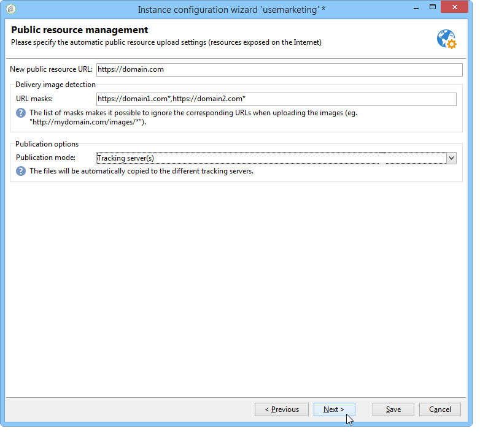

# Instanz bereitstellen{#deploying-an-instance}

>[!NOTE]
>
>Server-seitige Konfigurationen können nur von Adobe für Bereitstellungen durchgeführt werden, die von Adobe gehostet werden. Weitere Informationen zu den verschiedenen Bereitstellungen finden Sie im Abschnitt [Hosting](../../installation/using/hosting-models.md) oder auf [dieser Seite](../../installation/using/capability-matrix.md).

## Bereitstellungsassistent {#deployment-assistant}

Adobe Campaign bietet einen grafischen Assistenten, der in der Adobe Campaign-Client-Konsole verfügbar ist, um die Parameter der Instanz zu definieren, mit der Sie eine Verbindung herstellen möchten.

Wählen Sie zum Starten des Bereitstellungsassistenten **Tools > Erweitert > Bereitstellungsassistent** aus.


Die Konfiguration stellt sich wie folgt dar:

1. [Allgemeine Parameter](#general-parameters)
1. [Parameter für den E-Mail-Kanal](#email-channel-parameters)
1. [Verwalten von unzustellbaren E-Mails](#managing-bounced-emails)
1. [Tracking-Konfiguration](#tracking-configuration)
1. [Mobile-Kanalparameter](#mobile-channel-parameters)
1. [Regionale Parameter](#regional-settings)
1. [Zugang über das Internet](#access-from-the-internet)
1. [Verwaltung öffentlicher Ressourcen](#managing-public-resources)
1. [Daten bereinigen](#purging-data)

## Allgemeine Parameter {#general-parameters}

Im ersten Schritt des Bereitstellungsassistenten können Sie allgemeine Informationen zur Instanz eingeben.


### Allgemeine Informationen {#general-information}

Im unteren Bereich des Fensters können Sie die zu aktivierenden Optionen auswählen.

* **[!UICONTROL Kundenkennung für die Abrechnung]** : Dies können der Name der Instanz und die Versionsnummer sein.
* **[!UICONTROL Gebrauchsname des Kunden]** : Geben Sie eine Zeichenfolge mit dem Namen Ihres Unternehmens ein. Diese Informationen können in den Abmelde-Links verwendet werden.
* **[!UICONTROL Namespace]** : Geben Sie eine kurze Kennung in Kleinbuchstaben ein. Ziel ist es, im Falle eines Upgrades zwischen Ihrer spezifischen Konfiguration und der Werkskonfiguration zu unterscheiden. Der Standard-Namespace **cus** für den Kunden.

### Technische Optionen {#technical-options}

Im unteren Bereich des Fensters können Sie die zu aktivierenden Optionen auswählen.

Folgende Optionen stehen zur Verfügung:

* **[!UICONTROL E-Mail-]**: zum Aktivieren des E-Mail-Versands. Siehe [E-Mail-Kanalparameter](#email-channel-parameters).
* **[!UICONTROL Tracking]**: Zum Aktivieren des Trackings der Zielpopulation (Öffnungen und Klicks). Siehe [Tracking-Konfiguration](#tracking-configuration).
* **[!UICONTROL Umgang mit unzustellbaren E]** Mails: Zum Definieren des POP-Kontos für die Aufnahme eingehender E-Mails. Siehe [Verwalten von unzustellbaren E-Mails](#managing-bounced-emails).
* **[!UICONTROL LDAP-Integration]** : Zum Konfigurieren der Benutzerauthentifizierung über ein LDAP-Verzeichnis. Siehe [Verbindung über LDAP](../../installation/using/connecting-through-ldap.md).

## Parameter für den E-Mail-Kanal {#email-channel-parameters}

Mit dem folgenden Schritt können Sie die Informationen definieren, die in den Kopfzeilen der Nachricht angezeigt werden sollen.

Diese Parameter können in Versandvorlagen und einzeln für jeden Versand überladen werden (wenn die Benutzer über die erforderlichen Berechtigungen verfügen).

### Parameter der gesendeten E-Mails {#parameters-for-delivered-emails}


Geben Sie die folgenden Parameter an:

* **[!UICONTROL Absendername]** : Geben Sie den Absendernamen ein.
* **[!UICONTROL Absenderadresse]** : Geben Sie die E-Mail-Adresse des Absenders ein. Beim Senden von E-Mails über Adobe Campaign wird **Postfach „Absenderadresse** nicht überwacht und Marketing-Benutzer können nicht auf dieses Postfach zugreifen. Adobe Campaign bietet auch nicht die Möglichkeit, die in diesem Postfach empfangenen E-Mails automatisch zu beantworten oder weiterzuleiten. Weitere Informationen zu Best Practices für die Zustellbarkeit [in dieser Dokumentation](https://experienceleague.adobe.com/docs/deliverability-learn/deliverability-best-practice-guide/additional-resources/campaign/ac-starting-new-platform.html){_blank}.

* **[!UICONTROL Text der Antwortadresse]** : Geben Sie den Namen ein, der verwendet wird, wenn der Empfänger auf die Schaltfläche **[!UICONTROL Antworten]** klickt.
* **[!UICONTROL Antwortadresse]** : Geben Sie die E-Mail-Adresse ein, die verwendet werden soll, wenn der Empfänger in seiner E **[!UICONTROL Mail-Client-Software auf]** Schaltfläche Antworten klickt. Das Feld **Antwortadresse** dient dem Fall, dass der Empfänger an eine andere Adresse als die Absenderadresse **soll**.  Diese Adresse muss eine gültige E-Mail-Adresse sein, mit einer überwachten Mailbox verknüpft und vom Kunden gehostet werden.  Es kann sich beispielsweise um eine Support-Mailbox handeln, `customer-care@customer.com` der E-Mails gelesen und beantwortet werden.

* **[!UICONTROL Fehleradresse]** : Geben Sie die E-Mail-Adresse von fehlerhaften Nachrichten ein. Dies ist die technische Adresse, die für die Handhabung von Bounce Messages verwendet wird, einschließlich E-Mails, die vom Adobe Campaign-Server aufgrund nicht vorhandener Zieladressen empfangen wurden. Diese Adresse muss eine gültige E-Mail-Adresse sein, mit einer überwachten Mailbox verknüpft und vom Kunden gehostet werden. Es könnte sich z. B. um eine Bounce-Mailbox `errors@customer.com`. Diese Adresse kann für einen Versand oder in den Versandvorlagen auf der Registerkarte **SMTP** der Eigenschaften Versand / Versandvorlage geändert werden. [Weitere Informationen](../../delivery/using/email-parameters.md#managing-bounce-emails-managing-bounce-emails).


Darüber hinaus können Sie die für die Absenderadresse **Masken** und die Fehleradresse zulässigen angeben. Bei Angabe von mehr als einer Maske sind die Masken durch Kommata zu trennen. Hierbei handelt es sich um eine optionale Konfiguration. Wenn Felder eingegeben werden, prüft Adobe Campaign zum Zeitpunkt des Versands (bei der Analyse, ob die Adresse keine Variablen enthält), ob die Adressen gültig sind. Dieser Betriebsmodus stellt sicher, dass keine Adressen verwendet werden, die Probleme mit dem Versand von Triggern verursachen könnten. Absenderadressen sind auf dem Versandserver zu konfigurieren.

>[!NOTE]
>
>* Diese Einstellungen werden in den Campaign-Plattformoptionen gespeichert. [Weitere Informationen](../../installation/using/configuring-campaign-options.md).
> 
>* Bei Multi-Branding-Konfigurationen können Sie die Fehleradresse anpassen und diese Konfiguration über das externe E-Mail-Routing-Konto überschreiben. [Weitere Informationen](../../installation/using/external-accounts.md#email-routing-external-account).
>


### Zulässige Zeichen in den Adressen {#characters-authorized-in-addresses}

<!--This window enables you to define, for all email campaigns, the delivery and address-quality management options.-->

In der Adobe Campaign-Datenbank müssen alle E-Mail-Adressen wie folgt erstellt werden: `x@y.z`. Die Zeichen **x**, **y** und **z** dürfen nicht leer sein und keine nicht autorisierten Zeichen enthalten.

Hier können Sie die zulässigen Zeichen (&#39;data policy&#39;) im Feld E-Mail der Datenbank festlegen. Zeichen, die nicht in der Liste enthalten sind, werden bei der Eingabe von Informationen in die Datenbank über die Schnittstelle, ein Web-Formular und den Datenimport verboten und daher zurückgewiesen.

Es stehen zwei Listen zur Verfügung **(nur** oder **nur USA**. Bei Bedarf können weitere Zeichen hinzugefügt werden.

### Versandparameter {#delivery-parameters}

Über **Link Erweiterte Parameter…** können Sie auf Versandoptionen, Parameter für weitere Zustellversuche und Quarantänen zugreifen.


In diesem Fenster können Sie für alle E-Mail-Kampagnen die Optionen für die Verwaltung des Versands und der Adressqualität definieren.

Folgende Optionen stehen zur Verfügung:

* **[!UICONTROL Versanddauer von Nachrichten]** : Nach dieser Zeit wird der Versand gestoppt (standardmäßig 5 Tage).
* **[!UICONTROL Gültigkeitsdauer von Online-]**: Zeit, für die Informationen aus dem Empfängerprofil beibehalten werden, um Mirrorseiten zu generieren.
* **[!UICONTROL Empfänger ausschließen, die nicht mehr kontaktiert werden möchten]** : Wenn diese Option aktiviert ist, werden auf der Blockierungsliste keine Empfänger kontaktiert.
* **[!UICONTROL Dubletten automatisch ignorieren]** : Wenn diese Option aktiviert ist, erfolgt der Versand nicht an doppelte Adressen.

>[!NOTE]
>
>Bei gehosteten oder hybriden Installationen wird bei einem Upgrade auf [Enhanced MTA](../../delivery/using/sending-with-enhanced-mta.md) die **[!UICONTROL Versanddauer der Nachrichten]** nur verwendet, wenn sie auf **3,5 Tage oder weniger festgelegt ist**. Wenn Sie einen Wert von mehr als 3,5 Tagen definieren, wird dieser nicht berücksichtigt.

### Parameter erneut versuchen {#retry-parameters}

Die Informationen zu Wiederherstellungen finden Sie in den Feldern **Wiederherstellungszeiträume** und **Anzahl der Wiederherstellungen**: Wenn ein Empfänger nicht erreichbar ist, z. B. wenn sein Posteingang voll ist, versucht das Programm standardmäßig, ihn fünfmal zu kontaktieren, wobei zwischen den einzelnen Versuchen ein stündiges Intervall besteht (während der maximalen Versandzeit). Diese Werte können Ihren Bedürfnissen entsprechend geändert werden.

>[!NOTE]
>
>Wenn Sie bei gehosteten oder hybriden Installationen ein Upgrade auf den [Enhanced MTA](../../delivery/using/sending-with-enhanced-mta.md) durchgeführt haben, werden die Campaign-Wiederholungsparameter nicht mehr verwendet. Weitere Zustellversuche aufgrund von Softbounces sowie die Zeitdauer zwischen ihnen werden durch den Enhanced MTA bestimmt, basierend auf Typ und Prioritätsstufe der Bounce-Antworten, die von der E-Mail-Domain der Nachricht zurückgegeben werden.

### Quarantäne-Parameter {#quarantine-parameters}

In Bezug auf die Quarantäne stehen folgende Konfigurationsoptionen zur Verfügung:

* **[!UICONTROL Dauer zwischen zwei signifikanten Fehlern]** : Geben Sie einen Wert ein (standardmäßig „1d“: 1 Tag), um die Zeit zu definieren, die die Anwendung wartet, bevor der Fehlerzähler im Falle eines Fehlers inkrementiert wird,
* **[!UICONTROL Maximale Fehleranzahl vor der Quarantäne]** : Sobald dieser Wert erreicht ist, wird die E-Mail-Adresse unter Quarantäne gestellt (standardmäßig „5“: Die Adresse wird beim sechsten Fehler unter Quarantäne gestellt). Dies bedeutet, dass der Kontakt automatisch von den nächsten Sendungen ausgeschlossen wird.

## Verwalten von unzustellbaren E-Mails {#managing-bounced-emails}

Bounce Messages sind extrem wichtig, um Versandfehler zu qualifizieren. Diese Fehler werden in der Datei NP@I kategorisiert, sobald die Regeln ihre Ursache ermittelt haben.

Dieser Schritt ist nur verfügbar **wenn die Verwaltungsoptionen** E-Mail-Kanal **und Bounce-Mail** im ersten Schritt des Bereitstellungsassistenten ausgewählt sind. Siehe [Allgemeine Parameter](#general-parameters).

In diesem Schritt können Sie Einstellungen für die Verwaltung von Bounce Messages definieren.


### POP-Konto zum Abrufen eingehender E-Mails {#pop-account-used-to-retrieve-incoming-mails}

Geben Sie die Parameter an, mit denen eine Verbindung zum Konto zum Abrufen eingehender E-Mails hergestellt werden soll.

* **[!UICONTROL label]** : Name, der alle unten angegebenen Parameter enthält,
* **[!UICONTROL Server]** : Server zum Abrufen von Bounce Messages (eingehende E-Mails),
* **[!UICONTROL Sicherheit]** : Wählen Sie bei Bedarf **[!UICONTROL SSL]** aus der Dropdown-Liste aus,
* **[!UICONTROL Port]** : Server-Port (im Allgemeinen 110),
* **[!UICONTROL Konto]** : Name des für Bounce Messages verwendeten Kontos,
* **[!UICONTROL Kennwort]** : Dem Konto zugeordnetes Kennwort.

Nachdem die POP-Einstellungen angegeben wurden, klicken Sie auf **Test**, um sicherzustellen, dass sie korrekt sind.

### Unverarbeitete Bounce-E-Mails {#unprocessed-bounce-mails}

Bounces werden automatisch von Adobe Campaign verarbeitet, indem die im Knoten **Administration > Campaign Management > Unzustellbarkeitsverwaltung > Versandlogqualifizierung** aufgelisteten Regeln angewendet werden. Weitere Informationen hierzu finden Sie unter [Bounce-Message-Verwaltung](../../delivery/using/understanding-delivery-failures.md#bounce-mail-management).

Nicht verarbeitete Bounces werden nicht auf der Adobe Campaign-Benutzeroberfläche angezeigt. Sie werden automatisch gelöscht, es sei denn, sie werden mithilfe der folgenden Felder in ein Postfach eines Drittanbieters übertragen:

* **[!UICONTROL Weiterleitungsadresse]** : Füllen Sie dieses Feld aus, um alle Fehlermeldungen (verarbeitet oder nicht verarbeitet ), die von der Adobe Campaign-Plattform erfasst wurden, an eine Drittanbieteradresse zu übertragen.
* **[!UICONTROL Adresse für Fehler]** : Füllen Sie dieses Feld aus, um nur die Fehlermeldungen an eine Drittanbieteradresse zu übertragen, für die der inMail-Prozess nicht qualifiziert werden konnte.
* **[!UICONTROL SMTP-Server]** : Server, der zum Senden der nicht verarbeiteten Bounce Messages verwendet wird.

>[!IMPORTANT]
>
>Um nicht verarbeitete Bounce-E-Mails weiterzuleiten, empfiehlt Adobe nur das Ausfüllen des Felds **[!UICONTROL Adresse für Fehler]**. Achten Sie jedoch darauf, dass die verwendete Adresse regelmäßig überprüft wird, da dies den Mail-Server stark belasten könnte. Weitere Informationen erhalten Sie von Ihrem Kundenbetreuer.

## Tracking-Konfiguration {#tracking-configuration}

Im nächsten Schritt können Sie das Tracking für die Instanz konfigurieren. Die Instanz muss deklariert und bei den Trackingservern registriert sein.

Dieser Schritt wird nur angeboten, wenn die Optionen **E** Mail-Kanal und **Tracking** auf der ersten Seite des Bereitstellungsassistenten ausgewählt sind. Siehe [Allgemeine Parameter](#general-parameters).

Weitere Informationen zum Webtracking (Tracking-Modus, Erstellen und Einfügen von Tags …) finden Sie [diesem Dokument](../../configuration/using/about-web-tracking.md).

### Grundprinzip {#operating-principle}

Wenn Sie das Tracking für eine Instanz aktivieren, werden die URLs in den Sendungen während des Versands geändert, um das Tracking zu aktivieren.

* Die auf dieser Seite des Bereitstellungsassistenten eingegebenen Informationen zu externen URLs (unabhängig davon, ob sie sicher sind oder nicht) werden zum Erstellen der neuen URL verwendet. Neben diesen Informationen enthält der geänderte Link die Kennungen des Versands, den Empfänger und die URL.

  Tracking-Informationen werden von Adobe Campaign auf den Tracking-Servern erfasst, um Empfängerprofile und die mit dem Versand verknüpften Daten anzureichern (**[!UICONTROL Tracking]**-Registerkarten).

  Informationen zu internen URLs werden nur vom Adobe Campaign-Anwendungs-Server verwendet, um Kontakt mit dem/den Tracking-Server(n) aufzunehmen.

  Weitere Informationen hierzu finden Sie unter [Tracking-Server](#tracking-server).

* Nachdem die URLs konfiguriert wurden, müssen Sie das Tracking aktivieren. Dazu muss die Instanz auf dem/den Tracking-Server(n) registriert sein.

  Weitere Informationen hierzu finden Sie unter [Tracking speichern](#saving-tracking).

### Trackingserver {#tracking-server}


Um die Effizienz des Trackings in dieser Instanz zu gewährleisten, müssen die folgenden Informationen angezeigt werden:
<!--With Mid-sourcing architecture, you can externalize tracking management. To do this:-->

* **[!UICONTROL Externe URL]** und/oder **[!UICONTROL Sichere externe URL]** : Geben Sie die Umleitungs-URL ein, die in der zu sendenden E-Mail verwendet werden soll.
* **[!UICONTROL Interne URL(s)]** : URLs, die nur vom Adobe Campaign-Server zur Kontaktaufnahme mit dem/den Tracking-Server(n) verwendet werden, um Protokolle zu erfassen und die URLs hochzuladen. Es ist nicht erforderlich, sie mit der -Instanz zu verknüpfen.

  Wenn Sie keine URL angeben, wird standardmäßig die Tracking-URL verwendet.

Mit der Mid-Sourcing-Architektur können Sie die Tracking-Verwaltung externalisieren. Gehen Sie dazu wie folgt vor:

1. Wählen Sie die Option **[!UICONTROL Tracking-Verwaltung externalisieren]** aus: Hiermit können Sie einen Mid-Sourcing-Server als Tracking-Server verwenden.
1. Füllen Sie die Felder **[!UICONTROL Externes Konto]** und **[!UICONTROL Instanzname]** aus, um eine Verbindung zum Mid-Sourcing-Server herstellen zu können.

   Weitere Informationen finden Sie unter [Mid-Sourcing-Server](../../installation/using/mid-sourcing-server.md).

1. Klicken Sie auf die **[!UICONTROL Tracking-Instanz aktivieren]**, um die Verbindung zum Server zu genehmigen.

   

### Tracking speichern {#saving-tracking}

Nachdem die URLs ausgefüllt wurden, müssen Sie den Tracking-Server registrieren.

Klicken Sie auf den Link **Registrierung auf den Trackingservern** und wählen Sie dann eine der verfügbaren Optionen aus.


Es gibt drei mögliche Architekturtypen für die Implementierung des Trackings:

1. **Unterstützung für das Tracking in einer vorhandenen Instanz hinzufügen**

   Diese Auswahl gilt, wenn die Instanz bereits für andere Anforderungen (MTA-Server usw.) auf Servern erstellt wurde, die als Tracking-Server verwendet werden.

   

   Geben Sie das Passwort für das **interne** Konto auf den Weiterleitungsservern ein, um die Tracking-Instanz zu konfigurieren.

   >[!NOTE]
   >
   >Wenn mehrere Tracking-Server verwendet werden, müssen sie alle denselben Namen und dasselbe Kennwort verwenden.

   Geben Sie den Namen der Instanz und das Kennwort an.

1. **Erstellen Sie eine neue Instanz für das Tracking**

   Diese Option ist nützlich, wenn Tracking-Instanzen für das Tracking reserviert sind und keine anderen Anwendungsmodule haben.

   

   Geben Sie das Passwort für das **interne** Konto auf den Weiterleitungsservern ein, um die Tracking-Instanz zu konfigurieren.

   >[!NOTE]
   >
   >Wenn mehrere Tracking-Server konfiguriert sind, müssen sie alle dasselbe Passwort verwenden.

   Geben Sie den Namen der Instanz, das Kennwort und alle zugehörigen DNS-Masken an, z. B. **[!UICONTROL Campaign*]**.

1. **Validieren Sie eine bereits für Sie vorkonfigurierte Tracking-Instanz**

   Diese Option wird verwendet, wenn Sie kein Passwort für das **interne** Konto haben. In diesem Fall ist ein Tracking-Konto für Sie auf den Tracking-Servern vorkonfiguriert. Passwort des Tracking-Kontos der Weiterleitungsserver eingeben, um die Tracking-Instanz zu validieren.

   

   Geben Sie den Namen der zu validierenden Instanz an.

Klicken Sie **Genehmigen**, um den Aufzeichnungsprozess mit dem Tracking-Server zu starten.

Im vorigen Fenster wird die Registrierung auf der Ebene des Tracking-Servers durch eine Meldung bestätigt:


Die Parameter, die mit URL-**verknüpft sind (dürfen nicht geändert werden** für eine Standardinstallation. Für alle anderen Parameter kontaktieren Sie bitte Adobe.

## Mobile-Kanalparameter {#mobile-channel-parameters}

Im nächsten Schritt können Sie Standardeinstellungen für Sendungen an Mobilgeräte (SMS und WAP-Push) definieren.

>[!NOTE]
>
>Der Mobile-Kanal ist optional: Dieses Stadium wird nur angezeigt, wenn es gekauft wurde. Prüfen Sie diesbezüglich Ihren Lizenzvertrag.


### Standardkonto für das SMS-Routing {#default-account-for-sms-delivery}

Folgende Angaben sind erforderlich:

* **[!UICONTROL label]** : Geben Sie einen Namen für dieses SMS-/Wap-Push-Konto ein. Sie können beispielsweise den Namen Ihres Routers verwenden.
* Für die Felder **[!UICONTROL Server]**, **[!UICONTROL Port]**, **[!UICONTROL Account]**, **[!UICONTROL Password]**, **[!UICONTROL Connector]**, **[!UICONTROL Send Endpoint]**, **[!UICONTROL Reception Endpoint]**, **[!UICONTROL Notification Endpoint]** wenden Sie sich an Ihren Dienstleister.

### Parameter für ausgehende SMS {#parameters-of-sms-sent}

Wählen Sie in **Dropdown** Liste „Priorität“ die Option „Normal“, „Hoch“ oder „Dringend“ aus, um sie auf die zu sendenden Nachrichten anzuwenden.

### Erweiterte Parameter {#advanced-parameters}

Über **Link Erweiterte Parameter…** können Sie auf die Optionen für weitere Zustellversuche und Quarantäne zugreifen.


Informationen zu weiteren Zustellversuchen finden Sie in den Feldern **Zeitraum der weiteren Zustellversuche** und **Anzahl der weiteren Zustellversuche**: Wenn ein Mobiltelefon nicht erreichbar ist, versucht das Programm standardmäßig fünf Mal in Intervallen von mindestens 15 Minuten erneut (für den maximalen Versandzeitraum). Diese Werte können an Ihre Bedürfnisse angepasst werden.

In Bezug auf die Quarantäne stehen folgende Konfigurationsoptionen zur Verfügung:

* **[!UICONTROL Zeit zwischen zwei signifikanten Fehlern]** : Geben Sie einen Standardwert (standardmäßig „1d“: Tag) ein, um die Zeit zu definieren, die die Anwendung wartet, bevor der Fehlerzähler für einen Fehler inkrementiert wird.
* **[!UICONTROL Maximale Fehleranzahl vor der Quarantäne]** : Sobald dieser Wert erreicht ist, wird die Mobiltelefonnummer unter Quarantäne gestellt (standardmäßig „5“: Die Nummer wird beim sechsten Fehler unter Quarantäne gestellt). Das bedeutet, dass der Kontakt automatisch von zukünftigen Sendungen ausgeschlossen wird.

## Regionale Parameter {#regional-settings}

In diesem Schritt können Sie Datenrichtlinienvoreinstellungen einbeziehen.


* **[!UICONTROL Alle Telefonnummern als internationale Nummern behandeln]** : Wenn diese Option ausgewählt ist, wendet die Anwendung das internationale Format auf Telefonnummern an (das Länderpräfix ist dann obligatorisch, da die Anzahl der Ziffern vor der Formatierung nicht überprüft wird). Wenn diese Option nicht ausgewählt ist, müssen Sie der internationalen Telefonnummer selbst das Präfix &quot;+&quot; oder „00“ voranstellen.
* **[!UICONTROL Alle Telefonnummern im internationalen Format speichern]** : Diese Option betrifft nur **inländische** Telefonnummern, die importiert oder bearbeitet werden. Legen Sie fest, ob Sie ein Inlandsformat (z. B. 425 555 0150) oder das internationale Format (z. B. +1 425 555 0150) verwenden möchten

## Zugang über das Internet {#access-from-the-internet}

>[!IMPORTANT]
>
>Aus Datenschutzgründen empfehlen wir die Verwendung von HTTPS für alle externen Ressourcen.

In diesem Schritt können Sie Zugriffs-URLs für Adobe Campaign-Seiten definieren, die im Internet verfügbar gemacht werden.

Hier müssen Sie auch die Veröffentlichungsoptionen angeben, die mit Web-Formularen verknüpft sind.


### Im Web angezeigte Server {#servers-exposed-on-the-web}

Verwenden Sie diese Seite, um die Server-URLs zu füllen, um:

1. Zugreifen auf den im Internet bereitgestellten Anwendungsserver: Formulare zur An-/Abmeldung, Extranet usw.
1. Greifen Sie auf den Anwendungs-Server für Ressourcen zu, die nicht im Web verfügbar gemacht werden: Formulare, Intranet, Bestätigungsseiten.
1. Rufen Sie die Mirrorseiten der Sendungen auf.

   Eine Mirrorseite ist eine dynamische Seite, die den Inhalt der E-Mail anzeigt. Der Zugriff erfolgt über einen Link, der in die an den Empfänger gesendete Nachricht eingefügt wird und personalisierte Elemente enthalten kann. Die Mirrorseite gibt dem Empfänger die Möglichkeit, die Nachricht in einem Internet-Browser statt in der E-Mail-Software zu lesen, unabhängig vom Versandformat (Text oder HTML). Mirrorseiten werden jedoch nur dann für einen bestimmten Versand erzeugt, wenn der erforderliche HTML-Inhalt definiert wurde.

Mit Adobe Campaign können Sie diese drei URLs unterscheiden, um die Last auf mehrere Plattformen zu verteilen.


>[!NOTE]
>
>* Diese Einstellungen werden in den Campaign-Plattformoptionen gespeichert. [Weitere Informationen](../../installation/using/configuring-campaign-options.md).
>* Bei Multi-Branding-Konfigurationen können Sie die URL der Mirror-Seite anpassen und diese Konfiguration über das externe E-Mail-Routing-Konto überschreiben. [Weitere Informationen](../../installation/using/configuring-campaign-options.md).


## Verwaltung öffentlicher Ressourcen {#managing-public-resources}

>[!IMPORTANT]
>
>Aus Datenschutzgründen empfehlen wir die Verwendung von HTTPS für alle externen Ressourcen.

Um von außen sichtbar zu sein, müssen die in E-Mails verwendeten Bilder und die mit den Kampagnen verknüpften öffentlichen Ressourcen auf einem extern zugänglichen Server vorhanden sein. Sie können dann für externe Empfänger oder Benutzer verfügbar sein.



Für diesen Schritt müssen Sie Folgendes eingeben:

1. Die neue URL öffentlicher Ressourcen. Weitere Informationen finden Sie im Abschnitt [URL öffentlicher Ressourcen](#public-resources-url).
1. Der Bilderkennungsmodus in einem Versand. Weitere Informationen finden Sie im Abschnitt [Erkennung von Versandbildern](#delivery-image-detection) .
1. Veröffentlichungsoptionen. Weitere Informationen finden Sie im Abschnitt [Veröffentlichungsmodi](#publication-modes) .

Öffentliche Ressourcen sind im Knoten **Administration > Ressourcen > Online > Öffentliche Ressourcen** der Adobe Campaign-Baumstruktur verfügbar. Sie werden in einer Bibliothek gesammelt und können in E-Mails eingefügt, aber auch in Kampagnen oder Aufgaben sowie im Content-Management verwendet werden.


### URL öffentlicher Ressourcen {#public-resources-url}

Im ersten Feld können Sie den Beginn der URL angeben, die nach dem Hochladen für die Ressourcen verwendet wird. Nach dem Hochladen sind die Ressourcen über diese neue URL zugänglich.

In einem Versand können Sie Bilder verwenden, die in der öffentlichen Ressourcenbibliothek oder einem anderen lokalen Bild oder Bild gespeichert sind, das auf einem Server gespeichert ist.

* Für E-Mail-Bilder die URL {**}https://server**/res/img **.**

  Dieser Wert kann für jeden Versand überschrieben werden.

* Für öffentliche Ressourcen ist die URL **https://** server **/res/** instance ****wobei **instance**der Name der Tracking-Instanz ist.

### Erkennung der Bilder einer Sendung {#delivery-image-detection}

In einem Versand können Sie Bilder verwenden, die in der öffentlichen Ressourcenbibliothek oder einem anderen lokalen Bild oder Bild gespeichert sind, das auf einem Server gespeichert ist.

Im Feld **URL-Masken** können Sie die Liste der URL-Masken angeben, die beim automatischen Hochladen von Bildern übersprungen werden sollen. Wenn Sie beispielsweise Bilder verwenden, die auf einer von außen zugänglichen Site gespeichert sind, insbesondere auf einer Internet-Site, können Sie die Site-URL in dieses Feld eingeben.


Sie können mehrere URL-Masken mithilfe eines Kommas angeben, um jede davon zu trennen.

* Informationen zur Verwendung und Verwaltung von Bildern in E-Mails finden Sie [diesem Abschnitt](../../delivery/using/defining-the-email-content.md#adding-images).
* Im Versandassistenten haben die von diesen URLs aufgerufenen Bilder den Status „Ignoriert“.

### Veröffentlichungsmodi {#publication-modes}

Im unteren Bereich des Assistenten können Sie die Veröffentlichungsoptionen für öffentliche Ressourcen und Bilder auswählen.

Die folgenden Veröffentlichungsmodi sind verfügbar:

* Trackingserver

  Die Ressourcen werden automatisch auf die verschiedenen Tracking-Server kopiert. Sie werden im Schritt „Tracking[Konfiguration“ ](#tracking-configuration).

* Andere Adobe Campaign-Server

  Sie können einen oder mehrere Adobe Campaign-Server verwenden, auf die die Ressourcen kopiert werden.

  Um einen dedizierten Adobe Campaign-Server zu verwenden, müssen Sie Server-seitig eine neue Instanz mit folgendem Befehl erstellen:

  ```
  nlserver config -addtrackinginstance:<trackingA>/<trackingA*>
  ```

  Geben Sie dann das Kennwort ein.

  Die Parameter der dedizierten Server sind in den Feldern **[!UICONTROL Medien-URL(s)]**, **[!UICONTROL Passwort]** und **[!UICONTROL Instanzname]** angegeben.

  

* Script zur manuellen Veröffentlichung (nur für öffentliche Ressourcen)

  

  Sie können die Bilder mithilfe eines Skripts veröffentlichen:

   * Sie müssen dieses Skript erstellen. Sein Inhalt hängt von Ihrer Konfiguration ab.
   * Das Skript wird durch folgenden Befehl aufgerufen:

     ```
     [INSTALL]/copyToFrontal.vbs "$(XTK_INSTALL_DIR)\var\<instance>\upload\" "img1,img2,img3"
     ```

     wobei `[INSTALL]` der Zugriffspfad zum Adobe Campaign-Installationsordner ist.

   * Stellen Sie unter Unix sicher, dass das Skript ausführbar ist.

Bei Bildern müssen sie aus dem Ordner „images“, der über die Option **NmsDelivery_ImageSubDirectory** angegeben ist, auf einen oder mehrere Frontalserver kopiert werden. Diese Server speichern die Bilder, um sie über die neue konfigurierte URL zugänglich zu machen.

Bei einer Veröffentlichung auf einem Adobe Campaign-Server ohne manuelles Veröffentlichungsskript werden die Bilder eines Versands standardmäßig im `$(XTK_INSTALL_DIR)/var/res/img/ directory` gespeichert. Die entsprechende URL lautet: **`https://server/res/img`**.

`XTK_INSTALL_DIR)/var/res/$(INSTANCE_NAME)`. Die entsprechende URL lautet wie folgt: **`https://server/res/instance`** wobei die Instanz der Name der Tracking-Instanz ist.

>[!NOTE]
>
>Es ist möglich, das Verzeichnis der öffentlichen Ressourcenspeicher zu ändern. Weitere Informationen hierzu finden Sie unter &quot;[ öffentlicher Ressourcen](#managing-public-resources).

### Synchronisieren von öffentlichen Ressourcen {#synchronizing-public-resources}

Mit dieser Funktion können Sie **öffentliche Ressourcen** auf mehreren Ersatz-Servern synchronisieren.

Wenn keine öffentliche Ressource auf dem Trackingserver vorhanden ist oder die Ressource einen 404-Fehler zurückgibt, versucht der Trackingserver, die Ressource auf einem der Ersatz-Server zu finden.

Das Deklarieren und Konfigurieren von Ersatz-Servern muss in der Datei „serverConf.xml **des Marketing** Servers erfolgen. Alle in der Datei **serverConf.xml** verfügbaren Parameter werden in diesem [Abschnitt](../../installation/using/the-server-configuration-file.md) aufgeführt.

**Deklaration**

```
<redirection>
<spareServer enabledIf="" id="" url=""/>
</redirection>
```

**Konfiguration**

Für jede öffentliche Ressource, die synchronisiert werden muss, müssen Sie dem `<url>` im `<relay>` ein Statusattribut hinzufügen:

Das Statusattribut kann einen von drei Werten aufweisen:

* Ersatz: Die öffentliche Ressource ist synchronisiert

* normal: Vorhandenes Verhalten (ohne Synchronisierung)

* Blacklist: Die URL wird der Blockierungsliste hinzugefügt, wenn ein 404-Fehler zurückgegeben wird. Auf die Blockierungsliste setzen Die Dauer (in Sekunden) der URL in der wird durch ein **timeout“-** definiert, dessen Standardwert 60s ist.

Die vorkonfigurierte Konfiguration der Synchronisierung ist:

```
(extracted from the serverConf.xml file)

<redirection P3PCompactPolicy="CAO DSP COR CURa DEVa TAIa OUR BUS IND UNI COM NAV"
databaseId="" defLogCount="30" expirationURL="" maxJobsInCache="100"
startRedirection="true" startRedirectionInModule="true" trackWebVisitors="false" trackingPassword="">
<spareServer enabledIf="" id="1" url=""/>
</redirection>

....


<relay debugRelay="false" forbiddenCharsInAuthority="?#.@/:" forbiddenCharsInPath="?#/"
           modDir="index.html" startRelay="false" startRelayInModule="true" timeout="60">
   <url IPMask="" deny="" hostMask="" relayHost="true" relayPath="true" status="normal" targetUrl="https://localhost:8080" timeout="" urlPath="/view/*"/>
      <url IPMask="" deny="" hostMask="" relayHost="true" relayPath="true" status="blacklist" targetUrl="https://localhost:8080" timeout="" urlPath="*.jsp"/>
      <url IPMask="" deny="" hostMask="" relayHost="true" relayPath="true" status="blacklist" targetUrl="https://localhost:8080" timeout="" urlPath="*.jssp"/>
      <url IPMask="" deny="" hostMask="" relayHost="true" relayPath="true" status="blacklist" targetUrl="https://localhost:8080" timeout="" urlPath="/webApp/*"/>
      <url IPMask="" deny="" hostMask="" relayHost="true" relayPath="true" status="blacklist" targetUrl="https://localhost:8080" timeout="" urlPath="/report/*"/>
      <url IPMask="" deny="" hostMask="" relayHost="true" relayPath="true" status="blacklist" targetUrl="https://localhost:8080" timeout="" urlPath="/jssp/*"/>
      <url IPMask="" deny="" hostMask="" relayHost="true" relayPath="true" status="normal" targetUrl="https://localhost:8080" timeout="" urlPath="/strings/*"/>
      <url IPMask="" deny="" hostMask="" relayHost="true" relayPath="true" status="normal" targetUrl="https://localhost:8080" timeout="" urlPath="/interaction/*"/>
      <url IPMask="" deny="" hostMask="" relayHost="true" relayPath="true" status="normal" targetUrl="https://localhost:8080" timeout="" urlPath="/barcode/*"/>

      <url IPMask="" deny="" hostMask="" relayHost="false" relayPath="false" status="spare" targetUrl="" timeout="" urlPath="/favicon.*"/>
      <url IPMask="" deny="" hostMask="" relayHost="false" relayPath="false" status="spare" targetUrl="" timeout="" urlPath="/*.html"/>
      <url IPMask="" deny="" hostMask="" relayHost="false" relayPath="false" status="spare" targetUrl="" timeout="" urlPath="/*.png"/>
      <url IPMask="" deny="" hostMask="" relayHost="false" relayPath="false" status="spare" targetUrl="" timeout="" urlPath="/*.jpg"/>

 </relay>
```

## Daten bereinigen {#purging-data}

Im letzten Schritt des Bereitstellungsassistenten können Sie die automatische Bereinigung veralteter Daten konfigurieren. Die Werte werden in Tagen ausgedrückt.


Daten werden automatisch über den Datenbankbereinigungs-Workflow gelöscht. Weitere Informationen zur Konfiguration und Verwendung dieses Workflows sowie Details zu den gelöschten Elementen finden Sie in diesem [Dokument](../../production/using/database-cleanup-workflow.md).
