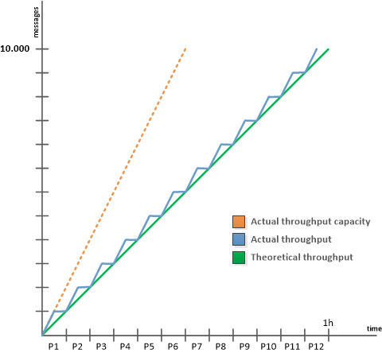

# Technische E-Mail-Konfigurationen{#email-deliverability}


## Übersicht {#overview}

Im folgenden Abschnitt finden Sie einen Überblick über die Konfiguration, die zum Steuern der Ausgabe von Adobe Campaign-Instanzen beim Versand von E-Mails erforderlich ist.

>[!NOTE]
>
>Einige Konfigurationen können von Adobe nur für Bereitstellungen durchgeführt werden, die von Adobe gehostet werden, z. B. für den Zugriff auf die Server- und Instanzkonfigurationsdateien. Weitere Informationen zu den verschiedenen Bereitstellungen finden Sie im Abschnitt [Hosting](../../installation/using/hosting-models.md) oder auf [dieser Seite](../../installation/using/capability-matrix.md).

Weiterführende Informationen zu den Konzepten und Best Practices in Bezug auf die Zustellbarkeit mit Adobe Campaign finden Sie in diesem [Abschnitt](../../delivery/using/about-deliverability.md).

Einen tieferen Einblick in das Thema der Zustellbarkeit, einschließlich aller technischen Empfehlungen zum effizienten Senden und Empfangen von E-Mails durch eine Adobe-Plattform, erhalten Sie im [Handbuch mit den Best Practices zur Zustellbarkeit von Adobe](https://experienceleague.adobe.com/docs/deliverability-learn/deliverability-best-practice-guide/introduction.html?lang=de).

## Grundprinzip {#operating-principle}

Es ist möglich, die Ausgabe einer oder mehrerer Adobe Campaign-Instanzen zu steuern, um die Anzahl der gesendeten E-Mails je nach Domain zu beschränken. Beispielsweise können Sie die Ausgabe für „yahoo.com“-Adressen auf 20.000 pro Stunde ****, während Sie für alle anderen Domains 100.000 Nachrichten pro Stunde konfigurieren.

Die Nachrichtenausgabe muss für jede von den Versand-Servern verwendete IP-Adresse gesteuert werden (**mta**). Mehrere **mta**, die auf mehreren Computern verteilt sind und zu verschiedenen Adobe Campaign-Instanzen gehören, können dieselbe IP-Adresse für den E-Mail-Versand verwenden: Es muss ein Prozess eingerichtet werden, um die Verwendung dieser IP-Adressen zu koordinieren.

Das Modul **stat** leitet alle Verbindungsanfragen und Nachrichten, die an die Mailserver gesendet werden sollen, für einen Satz von IP-Adressen weiter. Der Statistik-Server verfolgt Sendungen und kann den Versand basierend auf festgelegten Kontingenten aktivieren oder deaktivieren.


* Der Statistikserver (**stat**) ist mit einer Adobe Campaign-Datenbank verknüpft, um seine Konfiguration zu laden.
* Die Versand-Server (**mta**) verwenden eine UDP, um einen Statistik-Server zu kontaktieren, der nicht immer zu ihrer eigenen Instanz gehört.

### Versand-Server {#delivery-servers}

Das **mta**-Modul verteilt Nachrichten an seine untergeordneten **mtachild**-Module. Jedes **mtachild** bereitet Nachrichten vor, bevor es eine Autorisierung vom Statistikserver anfordert und sendet.

Zusammenfassend sind folgende Etappen zu durchlaufen:

1. Der **mta** wählt geeignete Nachrichten aus und weist ihnen ein verfügbares **mtachild** zu.
1. Der **mtachild** lädt alle zum Erstellen der Nachricht erforderlichen Informationen (Inhalt, Personalisierungselemente, Anhänge, Bilder usw.) und leitet die Nachricht an den **E-Mail-Traffic-Shaper** weiter.
1. Sobald der E-Mail-Traffic-Shaper die Autorisierung des Statistikservers (**smtp stat**) erhält, wird die Nachricht an den Empfänger gesendet.


### E-Mail-Server-Statistiken und Einschränkungen {#email-server-statistics-and-limitations}

Der Statistikserver verwaltet die folgenden Statistiken für jeden E-Mail-Server, der Nachrichten empfängt:

* Anzahl der offenen Point-in-Time-Verbindungen,
* Anzahl der in der letzten Stunde gesendeten Nachrichten,
* Rate erfolgreicher/abgelehnter Verbindungen,
* Rate der Verbindungen zu nicht erreichbaren Servern

Gleichzeitig lädt das Modul eine Liste von Einschränkungen für bestimmte E-Mail-Server:

* Maximale Anzahl simultaner Verbindungen,
* Maximale Nachrichtenanzahl pro Stunde,
* Maximale Nachrichtenanzahl pro Verbindung

### Verwalten von IP-Adressen {#managing-ip-addresses}

Der Statistikserver kann mehrere Instanzen oder mehrere Computer mit derselben öffentlichen IP-Adresse kombinieren. Sie ist daher nicht mit einer bestimmten Instanz verknüpft, sondern muss sich an eine Instanz wenden, um Einschränkungen pro Domain wiederherzustellen.

Versandstatistiken werden für jeden Ziel-MX und für jede Quell-IP gespeichert. Wenn beispielsweise die Zieldomäne 5 MX hat und die Plattform 3 verschiedene IP-Adressen verwenden kann, kann der Server bis zu 15 Reihen von Indikatoren für diese Domain verwalten.

Die Quell-IP-Adresse entspricht der öffentlichen IP-Adresse, d. h. der Adresse, wie sie vom Remote-E-Mail-Server angezeigt wird. Diese IP-Adresse kann sich von der Adresse des Rechners, der den **mta** hostet, unterscheiden, wenn ein NAT-Router vorhanden ist. Daher verwendet der Statistikserver eine Kennung, die mit der öffentlichen IP (**publicId**) übereinstimmt. Die Zuordnung zwischen der lokalen Adresse und dieser Kennung wird in der Konfigurationsdatei **serverConf.xml** deklariert. Alle in der Datei **serverConf.xml** verfügbaren Parameter werden in diesem [Abschnitt](../../installation/using/the-server-configuration-file.md) aufgeführt.

## Steuerung der Versandausgabe {#delivery-output-controlling}

Zum Versand von Nachrichten an E-Mail-Server fordert die **E-Mail Traffic Shaper**-Komponente eine Verbindung vom Statistikserver an. Sobald die Anfrage akzeptiert wird, wird die Verbindung geöffnet.

Vor dem Nachrichtenversand fordert das Modul „Token“ vom Server an. Dabei handelt es sich im Allgemeinen um Sätze mit mindestens 10 Token, wodurch die Anzahl der Abfragen an den Server reduziert wird.

Der Server speichert alle Statistiken zu Verbindungen und Sendungen. Im Falle eines Neustarts gehen die Informationen vorübergehend verloren: Jeder Client bewahrt eine lokale Kopie seiner Versandstatistiken auf und sendet sie regelmäßig (alle 2 Minuten) an den Server zurück. Der Server kann dann die Daten erneut aggregieren.

In den folgenden Abschnitten wird die Verarbeitung einer Nachricht durch die Komponente **E-Mail Traffic Shaper** beschrieben.

### Nachrichtenversand {#message-delivery}

Wenn eine Nachricht gesendet wird, gibt es drei mögliche Ergebnisse:

1. **Erfolg**: Die Nachricht wurde erfolgreich gesendet. Die Nachricht wird aktualisiert.
1. **Nachricht fehlgeschlagen**: Der kontaktierte Server hat die Nachricht für den ausgewählten Empfänger abgelehnt. Dieses Ergebnis entspricht den Rückgabe-Codes 550 bis 599, es können jedoch Ausnahmen definiert werden.
1. **Sitzung fehlgeschlagen** (ab 5.11): Wenn der **mta** eine Antwort für diese Nachricht erhält, wird die Nachricht abgebrochen (siehe [Nachrichtenabbruch](#message-abandonment)). Die Nachricht wird an einen anderen Pfad gesendet oder auf „Ausstehend“ gesetzt, wenn keine anderen Pfade verfügbar sind (siehe [Nachricht ausstehend](#message-pending)).

   >[!NOTE]
   >
   >Ein **Pfad** ist eine Verbindung zwischen dem Adobe Campaign **MTA** und dem Ziel **MTA**. Der Adobe Campaign **MTA** kann aus mehreren Start-IPs und mehreren Ziel-Domain-IPs wählen.

### Abbruch einer Nachricht {#message-abandonment}

Abgebrochene Nachrichten werden an den **mta** zurückgegeben und werden nicht mehr vom **mtachild** verwaltet.

Der **mta** entscheidet über das Verfahren für diese Nachricht (Wiederherstellung, Verlassen, Quarantäne usw.) je nach Antwort-Code und Regeln.

### Nachricht ausstehend {#message-pending}

Eine Nachricht wird angehalten, wenn sie in der aktiven Warteschlange eintrifft und es keine verfügbaren Pfade gibt.

Ein Pfad wird im Allgemeinen für einen variablen Zeitraum nach einem Verbindungsfehler als nicht verfügbar markiert. Der Zeitraum der Nichtverfügbarkeit hängt von der Häufigkeit und dem Alter der Fehler ab.

## Statistik-Server-Konfiguration {#statistics-server-configuration}

Der Statistikserver kann von mehreren Instanzen verwendet werden: Er muss unabhängig von den Instanzen konfiguriert werden, die ihn verwenden werden.

Definieren Sie zunächst die Adobe Campaign-Datenbank, die die Konfiguration hostet.

### Konfiguration starten {#start-configuration}

Standardmäßig wird für jede Instanz **Modul** stat“ gestartet. Wenn die Instanzen auf demselben Computer gepoolt werden oder wenn Instanzen dieselbe IP-Adresse verwenden, wird ein einzelner Statistik-Server verwendet: Die anderen müssen deaktiviert werden.

### Definition des Server-Ports {#definition-of-the-server-port}

Standardmäßig überwacht der Statistikserver Port 7777. Dieser Port kann in der Datei **serverConf.xml** geändert werden. Alle in der Datei **serverConf.xml** verfügbaren Parameter werden in diesem [Abschnitt](../../installation/using/the-server-configuration-file.md) aufgeführt.

```
<stat port="1234"/>
```

## MX-Konfiguration {#mx-configuration}

>[!IMPORTANT]
>
>Bei gehosteten oder hybriden Installationen werden die Versanddurchsatzregeln der **[!UICONTROL MX-Verwaltung]** nicht mehr verwendet, wenn Sie auf den [Enhanced MTA](../../delivery/using/sending-with-enhanced-mta.md) aktualisiert haben. Der Enhanced MTA verwendet seine eigenen MX-Regeln. Mit diesen kann Ihr Durchsatz anhand Ihrer historischen E-Mail-Reputation und dem Echtzeit-Feedback, das von den Domains stammt, von denen Sie E-Mails senden, angepasst werden.

### Über MX-Regeln {#about-mx-rules}

>[!NOTE]
>
>Dieser Abschnitt und die folgenden Abschnitte gelten nur für On-Premise-Installationen und gehostete/hybride Installationen, die den alten Campaign MTA verwenden.

MX-Regeln (Mail eXchanger) dienen zur Verwaltung der Kommunikation zwischen einem Sende- und einem Empfangs-Server.

Diese Regeln werden jeden Morgen um 6 Uhr (Serverzeit) automatisch neu geladen, um die Client-Instanz regelmäßig bereitzustellen.

Je nach Materialkapazitäten und internen Richtlinien akzeptieren ISP eine vordefinierte Anzahl an Verbindungen und Nachrichten pro Stunde. Diese Variablen können unter Umständen automatisch durch ISP-Systeme abgeändert werden, was von der Reputation der IP- und Sender-Domain abhängt. Über die Zustellbarkeitsplattform werden in Adobe Campaign pro ISP mehr als 150 spezifische Regeln und zusätzlich eine allgemeine Regel für andere Domains verwaltet.

Die maximale Verbindungsanzahl hängt nicht ausschließlich von der Anzahl der durch den MTA verwendeten öffentlichen IP-Adressen ab.

Wenn Sie z. B. fünf Verbindungen in den MX-Regeln festgelegt und zwei öffentliche IPs konfiguriert haben, könnte man annehmen, dass Sie für diese Domain nicht mehr als zehn Verbindungen gleichzeitig geöffnet haben können. Dem ist aber nicht so, tatsächlich bezieht sich die maximale Verbindungsanzahl auf einen Pfad, der eine Kombination aus einer unserer öffentlichen MTA-IPs und einer öffentlichen IP des Client-MTAs darstellt.

Im folgenden Beispiel hat der Benutzer zwei konfigurierte öffentliche IP-Adressen und yahoo.com als Domain.

```
user:~ user$ host -t mx yahoo.com
                yahoo.com mail is handled by 1 mta5.am0.yahoodns.net.
                yahoo.com mail is handled by 1 mta6.am0.yahoodns.net.
                yahoo.com mail is handled by 1 mta7.am0.yahoodns.net.
```

Aus den MX-Einträgen von yahoo.com geht hervor, dass yahoo.com drei Mail Exchanger aufweist. Um eine Verbindung zum Client-MX (Peer-MX) herzustellen, fragt der MTA dessen IP-Adresse im DNS ab.

```
user:~ user$ host -t a mta5.am0.yahoodns.net
                mta5.am0.yahoodns.net has address 98.136.216.26
                mta5.am0.yahoodns.net has address 98.136.217.202
                mta5.am0.yahoodns.net has address 98.138.112.38
                mta5.am0.yahoodns.net has address 66.196.118.37
                mta5.am0.yahoodns.net has address 63.250.192.46
                mta5.am0.yahoodns.net has address 66.196.118.240
                mta5.am0.yahoodns.net has address 98.136.217.203
                mta5.am0.yahoodns.net has address 98.138.112.35
```

Für diesen Eintrag kann der Benutzer 8 Peer-IP-Adressen kontaktieren. Da der Benutzer über 2 öffentliche IP-Adressen verfügt, erhält er 8 * 2 = 16 Kombinationen, um die E-Mail-Server von yahoo.com zu erreichen. Jede dieser Kombinationen wird als Pfad bezeichnet.

Der zweite MX-Eintrag stellt sich wie folgt dar:

```
user:~ user$ host -t a mta6.am0.yahoodns.net
                mta6.am0.yahoodns.net has address 98.138.112.38
                mta6.am0.yahoodns.net has address 98.136.216.26
                mta6.am0.yahoodns.net has address 63.250.192.46
                mta6.am0.yahoodns.net has address 66.196.118.35
                mta6.am0.yahoodns.net has address 98.136.217.203
                mta6.am0.yahoodns.net has address 98.138.112.32
                mta6.am0.yahoodns.net has address 98.138.112.37
                mta6.am0.yahoodns.net has address 66.196.118.33
```

4 dieser 8 IP-Adressen werden bereits im MTA5 verwendet (98.136.216.26, 98.138.112.38, 63.250.192.46 und 98.136.217.203). Mit diesem Eintrag kann der Benutzer vier neue IP-Adressen verwenden. Der dritte MX-Eintrag tut dasselbe.

Insgesamt stehen dem Benutzer sechzehn Remote-IP-Adressen zur Verfügung. In Kombination mit den zwei lokalen öffentlichen IPs stehen zweiunddreißig Pfade zum Erreichen der E-Mail-Server von yahoo.com zur Verfügung.

>[!NOTE]
>
>Wenn sich zwei MX-Einträge auf dieselbe IP-Adresse beziehen, wird diese als ein Pfad gezählt, nicht als zwei.

Im Folgenden finden Sie einige Beispiele für die Verwendung von MX-Regeln:


Im folgenden Beispiel ist der Benutzer für eine bestimmte Domain auf 10.000 Nachrichten pro Stunde beschränkt, aber die MTA-Durchsatzkapazität liegt höher als diese Begrenzung.

In diesem Fall wird der Traffic für jede Stunde in zwölf Abschnitte von jeweils fünf Minuten unterteilt, wobei die reale Begrenzung bei 833 Nachrichten pro Abschnitt liegt.

Diese Nachrichten werden so schnell wie möglich gesendet.



### MX-Verwaltung konfigurieren {#configuring-mx-management}

Die bei MX einzuhaltenden Regeln werden im Dokument **[!UICONTROL MX-Verwaltung]** des Knotens **[!UICONTROL Administration > Kampagnen-Management > Unzustellbarkeitsverwaltung > Mail-Regelsätze]** des Navigationsbaums definiert.

Wenn das **[!UICONTROL MX-]**-Dokument nicht im Knoten vorhanden ist, können Sie es manuell erstellen. Gehen Sie dazu wie folgt vor:

1. Erstellen Sie einen neuen Satz von E-Mail-Regeln.
1. Wählen Sie den **[!UICONTROL MX-]**.

   

1. Geben Sie **defaultMXRules** in das Feld **[!UICONTROL Interner Name]** ein.

Damit Änderungen berücksichtigt werden, müssen Sie den Statistikserver neu starten.

Um die Konfiguration neu zu laden, ohne den Statistikserver neu zu starten, verwenden Sie den folgenden Befehl auf dem Computer, der den Server hostet: `nlserver stat -reload`

>[!NOTE]
>
>Diese Befehlszeile ist **nlserver restart** vorzuziehen. Sie beugt dem Verlust vor dem Neustart abgerufener statistischer Daten vor und verhindert Spitzenbelastungszeiten, die im Widerspruch zu den in den MX-Regeln definierten Kontingenten stehen können.

### MX-Regeln konfigurieren {#configuring-mx-rules}

Das **[!UICONTROL MX-Management]**-Dokument listet alle Domains auf, die mit einer MX-Regel verknüpft sind.

Die erste Regel, deren MX-Maske mit dem gewünschten MX kompatibel ist, wird angewendet.

Für jede Regel stehen die folgenden Parameter zur Verfügung:

* **[!UICONTROL MX-Maske]**: Domain, auf die die Regel angewendet wird. Jede Regel definiert eine Adressenmaske des MX. Jeder MX, dessen Name dieser Adressenmaske entspricht, kommt somit infrage. Die Maske kann &quot;&#42;&quot; und &quot;?“ enthalten. Allgemeine Zeichen.

  So sind die Adressen

   * a.mx.yahoo.com
   * b.mx.yahoo.com
   * c.mx.yahoo.com

  mit folgenden Masken kompatibel:

   * &#42;.yahoo.com
   * ?.mx.yahoo.com

  Beispielsweise lautet bei der E-Mail-Adresse foobar@gmail.com die Domain gmail.com und der MX-Eintrag sieht folgendermaßen aus:

  ```
  gmail.com mail exchanger = 20 alt2.gmail-smtp-in.l.google.com.
  gmail.com mail exchanger = 10 alt1.gmail-smtp-in.l.google.com.
  gmail.com mail exchanger = 40 alt4.gmail-smtp-in.l.google.com.
  gmail.com mail exchanger = 5  gmail-smtp-in.l.google.com.
  gmail.com mail exchanger = 30 alt3.gmail-smtp-in.l.google.com.
  ```

  In diesem Fall wird die MX-Regel `*.google.com` verwendet. Wie zu sehen ist, stimmt die MX-Regelmaske nicht unbedingt mit der Domain in der E-Mail überein. Die MX-Regeln, die für E-Mail-Adressen von gmail.com angewendet werden, sind diejenigen mit der `*.google.com` Maske.

* **[!UICONTROL Kennungsbereich]**: Mit dieser Option können Sie die Kennungsbereiche (publicID) angeben, für die die Regel gilt. Folgende Angaben sind möglich:

   * Eine Zahl: Die Regel gilt nur für diese publicId,
   * Ein Zahlenbereich (**number1-number2**): Die Regel gilt für alle publicIds zwischen diesen beiden Zahlen.

  >[!NOTE]
  >
  >Wenn das Feld leer ist, gilt die Regel für alle Kennungen.

  Eine öffentliche ID ist eine interne Kennung einer öffentlichen IP, die von einem oder mehreren MTAs verwendet wird. Diese Art von Kennungen wird in der Datei **config-instance.xml** von MTA-Servern definiert.

  

* **[!UICONTROL Shared]**: definiert den Umfang der Eigenschaften für diese MX-Regel. Wenn diese Option aktiviert ist, werden alle Parameter für alle in der Instanz verfügbaren IPs freigegeben. Wenn diese Option deaktiviert ist, werden die MX-Regeln für jede IP definiert. Die maximale Anzahl von Nachrichten wird mit der Anzahl der verfügbaren IPs multipliziert.
* **[!UICONTROL Maximale Anzahl von Verbindungen]**: Maximale Anzahl gleichzeitiger Verbindungen zur Domain des Absenders.
* **[!UICONTROL Maximale Anzahl von Nachrichten]**: Maximale Anzahl von Nachrichten, die über eine Verbindung gesendet werden können. Wenn die Anzahl der Nachrichten diese Zahl überschreitet, wird die Verbindung geschlossen und eine neue geöffnet.
* **[!UICONTROL Nachrichten pro Stunde]**: Maximale Anzahl von Nachrichten, die in einer Stunde an die Domain des Absenders gesendet werden können.
* **[!UICONTROL Zeitüberschreitung der Verbindung]**: Zeitschwellenwert für die Verbindung mit einer Domain.

  >[!NOTE]
  >
  >Vor diesem Schwellenwert kann ein **Timeout** ausgegeben werden, was von Ihrer Windows-Version abhängt.

* **[!UICONTROL Zeitüberschreitungsdaten]**: maximale Wartezeit nach dem Senden des Nachrichteninhalts (Abschnitt DATA des SMTP-Protokolls).
* **[!UICONTROL Timeout]**: Maximale Wartezeit für andere Austausche mit dem SMTP-Server.
* **[!UICONTROL TLS]**: Das TLS-Protokoll, das die Verschlüsselung von E-Mail-Sendungen ermöglicht, kann selektiv aktiviert werden. Für jede MX-Maske stehen die folgenden Optionen zur Verfügung:

   * **[!UICONTROL Standardkonfiguration]**: Dies ist die allgemeine Konfiguration, die in der Konfigurationsdatei „serverConf.xml“ angegeben ist, die angewendet wird.

     >[!IMPORTANT]
     >
     >Es wird nicht empfohlen, die Standardkonfiguration zu ändern.

   * **[!UICONTROL Deaktiviert]** : Die Nachrichten werden systematisch ohne Verschlüsselung gesendet.
   * **[!UICONTROL Opportunistisch]** : Der Nachrichtenversand wird verschlüsselt, wenn der empfangende Server (SMTP) das TLS-Protokoll generieren kann.

Konfigurationsbeispiel:


>[!NOTE]
>
>Weiterführende Informationen zur Verwendung von MX-Servern mit Adobe Campaign finden Sie [diesem Abschnitt](../../installation/using/using-mx-servers.md).

### E-Mail-Formate verwalten {#managing-email-formats}

Sie können das Format der gesendeten Nachrichten definieren, sodass der angezeigte Inhalt automatisch entsprechend der Domain der Adresse jedes Empfängers angepasst wird.

Navigieren Sie dazu zum Dokument **[!UICONTROL Verwaltung von E-Mail]**, das sich unter **[!UICONTROL Administration]** > **[!UICONTROL Kampagnenverwaltung]** > **[!UICONTROL Unzustellbarkeitsverwaltung]** > **[!UICONTROL Mail-Regelsätze]** befindet.

Dieses Dokument enthält eine Liste aller vordefinierten Domains, die den von Adobe Campaign verwalteten japanischen Formaten entsprechen. Weitere Informationen dazu finden Sie in der entsprechenden [Dokumentation zu Campaign v8](https://experienceleague.adobe.com/de/docs/campaign/campaign-v8/send/emails/sending-emails-on-japanese-mobiles){target="_blank"}.


Mit dem **MIME structure** (Multipurpose Internet Mail Extensions) können Sie die Nachrichtenstruktur definieren, die an die verschiedenen E-Mail-Clients gesendet wird. Dabei stehen drei Optionen zur Verfügung:

* **Multipart**: Die Nachricht wird im Text- oder HTML-Format gesendet. Wenn das HTML-Format nicht akzeptiert wird, kann die Nachricht weiterhin im Textformat angezeigt werden.

  Standardmäßig lautet die mehrteilige Struktur **multipart/alternative**, sie wird jedoch automatisch **multipart/related**, wenn ein Bild zur Nachricht hinzugefügt wird. Bestimmte Anbieter erwarten standardmäßig das **multipart/related**-Format. Die Option **[!UICONTROL Multipart/related erzwingen]** setzt dieses Format auch dann fest, wenn kein Bild angehängt ist.

* **HTML**: Es wird nur eine HTML-Nachricht gesendet. Wenn das HTML-Format nicht akzeptiert wird, wird die Meldung nicht angezeigt.
* **Text**: Eine Nachricht im reinen Textformat wird gesendet. Der Vorteil von Textformatnachrichten ist ihre sehr geringe Größe.

Wenn die Option **[!UICONTROL Bildintegration]** aktiviert ist, werden diese direkt im Textkörper der E-Mail angezeigt. Die Bilder werden dann hochgeladen und die URL-Links werden durch ihren Inhalt ersetzt.

Diese Option wird insbesondere auf dem japanischen Markt für **Deco-mail**, **Decore Mail** oder **Decoration Mail** verwendet. Weitere Informationen finden Sie in der [ zu Campaign v8](https://experienceleague.adobe.com/de/docs/campaign/campaign-v8/send/emails/sending-emails-on-japanese-mobiles){target="_blank"}.

>[!IMPORTANT]
>
>Bilder in eine E-Mail einzufügen vergrößert ihre Größe erheblich.

## Konfiguration des Versand-Servers {#delivery-server-configuration}

### Uhrensynchronisation {#clock-synchronization}

Die Zeitgeber aller Server, aus denen sich die Adobe Campaign-Plattform zusammensetzt (einschließlich der Datenbank), müssen synchronisiert und ihre Systeme auf dieselbe Zeitzone eingestellt werden.

### Koordinaten des Statistikservers {#coordinates-of-the-statistics-server}

Die Adresse des Statistikservers ist im **mta** anzugeben.

Mit der **statServerAddress** des **mta**-Elements der Konfiguration können Sie die Adresse und die Nummer des zu verwendenden Ports angeben.

```
<mta statServerAddress="emailStatServer:7777">
   [...]
 </mta>
```

Um den Statistikserver auf demselben Computer zu verwenden, müssen Sie mindestens den Namen des Computers mit dem Wert &quot;**&quot;**:

```
 <mta statServerAddress="localhost">
```

>[!IMPORTANT]
>
>Wenn dieses Feld nicht ausgefüllt ist, **der** nicht gestartet.

### Liste der zu verwendenden IP-Adressen {#list-of-ip-addresses-to-use}

Die Konfiguration zur Traffic-Verwaltung befindet sich im **mta/child/smtp**-Element der Konfigurationsdatei.

Für jedes **IPAffinity**-Element müssen Sie die IP-Adressen deklarieren, die für den Computer verwendet werden können.

Beispiel:

```
<IPAffinity localDomain="<domain>" name="default">
  <IP address="192.168.0.11" publicId="1" weight="5"/>
  <IP address="192.168.0.12" heloHost="revdns1.campaign.com" publicId="2" weight="5"/>
  <IP address="192.168.0.13" publicId="3" weight="1"/>
</IPAffinity>
```

Die Parameter lauten wie folgt:

* **Adresse**: Dies ist die IP-Adresse des zu verwendenden MTA-Host-Computers.
* **heloHost**: Diese Kennung stellt die IP-Adresse dar, wie sie vom SMTP-Server angezeigt wird.

* **publicId**: Diese Informationen sind nützlich, wenn eine IP-Adresse von mehreren Adobe Campaign-**(MTAs** hinter einem NAT-Router gemeinsam genutzt wird. Der Statistikserver verwendet diese Kennung, um die Verbindungs- und Versandstatistiken zwischen diesem Ausgangspunkt und dem Zielserver zu speichern.
* **weight**: definiert die relative Häufigkeit der Nutzung der Adresse. Standardmäßig haben alle Adressen eine Gewichtung gleich 1.

>[!NOTE]
>
>In der Datei serverConf.xml müssen Sie sicherstellen, dass eine IP einem einzelnen Helohost mit einem eindeutigen Bezeichner (public_id) entspricht. Sie kann nicht mehreren Helphosts zugeordnet werden, was zu Problemen mit der Versanddrosselung führen könnte.

Im vorherigen Beispiel werden die Adressen unter normalen Bedingungen wie folgt verteilt:

    * „1“: 5 / (5+5+1) = 45%
    * „2“: 5 / (5+5+1) = 45%
    * „3“: 1 / (5+5+1) = 10%

Wenn beispielsweise die erste Adresse nicht für eine bestimmte MX verwendet werden kann, werden Nachrichten wie folgt gesendet:

    * „2“: 5 / (5+1) = 83%
    * „3“: 1 / (5+1) = 17%

* **includeDomains**: Hiermit können Sie diese IP-Adresse für E-Mails reservieren, die zu einer bestimmten Domain gehören. Dies ist eine Liste von Masken, die einen oder mehrere Platzhalter (&#39;&#42;&#39;) enthalten können. Wenn das Attribut nicht angegeben ist, können alle Domains diese IP-Adresse verwenden.

  Beispiel: **includeDomains=&quot;wanadoo.com,orange.com,yahoo.&#42;&quot;**

* **excludeDomains**: Schließt eine Liste von Domains für diese IP-Adresse aus. Dieser Filter wird nach dem Filter **includeDomains** angewendet.

  

## Optimierung des E-Mail-Versands {#email-sending-optimization}

Die interne Architektur des Adobe Campaign **MTA** wirkt sich auf die Konfiguration zur Optimierung des E-Mail-Versands aus. Im Folgenden finden Sie einige Tipps zur Verbesserung Ihrer Sendungen.

### Anpassen des maxWaitingMessages-Parameters {#adjust-the-maxwaitingmessages-parameter}

Der Parameter **maxWaitingMessages** gibt die höchste Anzahl von Nachrichten an, die vom **mtachild“ im Voraus vorbereitet**. Nachrichten werden erst aus dieser Liste gelöscht, nachdem sie gesendet oder verlassen wurden.

Dieser Parameter ist sehr wichtig und besonders kritisch, wenn Nachrichten nicht nach Domain sortiert werden.

Sobald der Schwellenwert **maxWorkingSetMb** (256) erreicht ist, stoppt der Versand-Server das Senden von Nachrichten. Die Leistung wird erheblich reduziert, bis **mtachild** wieder gestartet wird. Um dieses Problem zu umgehen, können Sie entweder den Schwellenwert des Parameters **maxWorkingSetMb** erhöhen oder den Schwellenwert des Parameters **maxWaitingMessages** verringern.

Der Parameter **maxWorkingSetMb** wird empirisch berechnet, indem die maximale Anzahl von Nachrichten mit der durchschnittlichen Nachrichtengröße multipliziert und das Ergebnis mit 2,5 multipliziert wird. Wenn beispielsweise eine Nachricht eine durchschnittliche Größe von 50 kB hat und der Parameter **maxWaitingMessages** 1.000 beträgt, wird durchschnittlich 125 MB Speicher verwendet.

### Anzahl der „mtachild“ anpassen {#adjust-the-number-of-mtachild}

Die Anzahl der untergeordneten Elemente sollte die Anzahl der Prozessoren im Rechner nicht überschreiten (ca. 1000 Sitzungen). Es wird empfohlen, nicht mehr als 8 **mtachild)**. Sie können dann die Anzahl der Nachrichten pro **Kind** (**maxMsgPerChild**) erhöhen, um eine ausreichende Lebensdauer zu erreichen.
