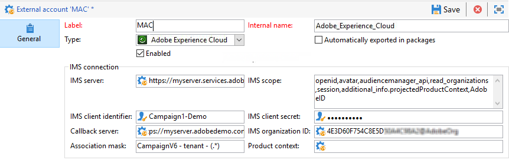
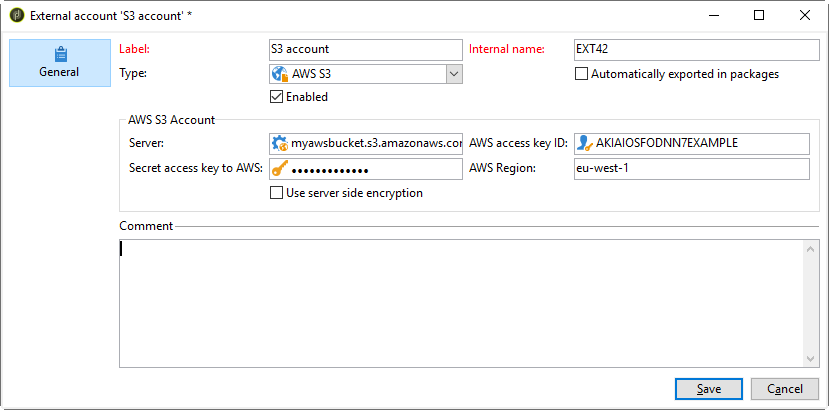

# Externe Konten{#external-accounts}

Adobe Campaign enthält eine Reihe vordefinierter externer Konten. Um Verbindungen zu externen Systemen einzurichten, können Sie neue Externe Konti erstellen.

Externe Konten werden von technischen Prozessen, wie technischen Workflows oder Kampagnen-Workflows, verwendet. Bei der Einrichtung eines Dateitransfers in einem Workflow oder bei einem Datenaustausch mit einer anderen Anwendung (Adobe Target, Experience Manager etc.) müssen Sie ein externes Konto auswählen.

Die folgenden externen Konten können eingerichtet werden:

* [Externes Routing-Konto](#routing-external-account)
* [Externes FTP-Konto](#ftp-external-account)
* [Externes Konto für eine externe Datenbank](#external-database-external-account)
* [Externes Web Analytics-Konto](#web-analytics-external-account)
* [Externes Facebook Connect-Konto](#facebook-connect-external-account)
* [Externes Konto der Ausführungsinstanz](#execution-instance-external-account)
* [Externes Adobe Experience Cloud-Konto](#adobe-experience-cloud-external-account)
* [Externes SFTP-Konto](#sftp-external-account)
* [Externes Adobe-Experience-Manager-Konto](#adobe-experience-manager-external-account)
* [Externes Amazon Simple Storage Service-Konto (S3)](#amazon-simple-storage-service--s3--external-account)
* [Externes Microsoft Dynamics CRM-Konto](#microsoft-dynamics-crm-external-account)
* [Externes Oracle On Demand-Konto](#oracle-on-demand-external-account)
* [Externes Salesforce CRM-Konto](#salesforce-crm-external-account)

## Externes Konto erstellen {#creating-an-external-account}

Gehen Sie wie folgt vor, um ein neues Externe Konto zu erstellen. Detaillierte Einstellungen hängen vom Typ des Externen Kontos ab.

1. From Campaign **[!UICONTROL Explorer]**, select **[!UICONTROL Administration]** &#39;>&#39; **[!UICONTROL Platform]** &#39;>&#39; **[!UICONTROL External accounts]**.

   

1. Klicken Sie auf die Schaltfläche **[!UICONTROL Neu]**.

   

1. Enter a **[!UICONTROL Label]** and an **[!UICONTROL Internal Name]**.
1. Wählen Sie den **[!UICONTROL Typ]** des externen Kontos aus, den Sie erstellen möchten.
1. Konfigurieren Sie den Zugriff auf das Konto, indem Sie die Anmeldeinformationen entsprechend dem gewählten externen Kontotyp angeben.

   Die nötigen Informationen werden normalerweise vom Anbieter des Servers bereitgestellt, mit dem Sie eine Verbindung herstellen möchten.

1. Aktivieren Sie die Option **[!UICONTROL Aktiviert]** , um die Verbindung zu aktivieren.
1. Wählen Sie **[!UICONTROL Speichern]** aus.

Das Externe Konto wird erstellt und der Liste &quot;Externe Konti&quot;hinzugefügt.

## Externes Konto für Bounce Messages {#bounce-mails-external-account}

Das externe Konto **Bounce Messages** gibt das externe POP3-Konto an, das für die Verbindung mit dem E-Mail-Dienst verwendet werden soll. Weiterführende Informationen dazu finden Sie auf dieser [Seite](../../workflow/using/inbound-emails.md).

Alle Server, die für den POP3-Zugriff konfiguriert sind, können für den Empfang von Antwortsendungen verwendet werden.


Um das externe Konto für **[!UICONTROL Bounce-Messages (defaultPopAccount)]** zu konfigurieren, benötigen Sie folgende Informationen:

* **[!UICONTROL Server]**

   URL des POP3-Servers

* **[!UICONTROL Port]**

   Nummer des POP3-Verbindungsports. Standardmäßig ist dies der Port 110.

* **[!UICONTROL Konto]**

   Name des Benutzers.

* **[!UICONTROL Passwort]**

   Passwort des Benutzerkontos.

* **[!UICONTROL Verschlüsselung]**

   Typ der gewählten Verschlüsselung: **[!UICONTROL Standardmäßig]**, **[!UICONTROL POP3 + STARTTLS]**, **[!UICONTROL POP3]** oder **[!UICONTROL POP3S]**.

## Externes Routing-Konto {#routing-external-account}

Mit dem externen **[!UICONTROL Routing]**-Konto können Sie jeden in Adobe Campaign verfügbaren Kanal abhängig von den installierten Packages konfigurieren.


Die folgenden Kanäle können konfiguriert werden:

* [Email](../../installation/using/deploying-an-instance.md#email-channel-parameters)
* [Mobiltelefon (SMS)](../../delivery/using/sms-channel.md#creating-an-smpp-external-account)
* [Phone](../../delivery/using/steps-about-delivery-creation-steps.md#other-channels)
* [Briefpost](../../delivery/using/about-direct-mail-channel.md)
* [Agentur](../../delivery/using/steps-about-delivery-creation-steps.md#other-channels)
* [Facebook](../../social/using/publishing-on-facebook-walls.md#delegating-write-access-to-adobe-campaign)
* [Twitter](../../social/using/configuring-publishing-on-twitter.md)
* [iOS-Kanal](../../delivery/using/configuring-the-mobile-application.md)
* [Android-Kanal](../../delivery/using/configuring-the-mobile-application-android.md)

## Externes FTP-Konto {#ftp-external-account}

Mit dem externen FTP-Konto können Sie den Zugriff auf einen Server außerhalb von Adobe Campaign konfigurieren und testen. Um Verbindungen mit externen Systemen wie dem FTP-Server 898, der für Dateiübertragungen verwendet wird, einzurichten, können Sie eigene externe Konten erstellen. Weiterführende Informationen dazu finden Sie auf dieser [Seite](../../workflow/using/file-transfer.md).

Geben Sie dazu in diesem externen Konto die Adresse und die Zugangsdaten für die Verbindungsherstellung zum FTP-Server an.


* **[!UICONTROL Server]**

   Name des FTP-Servers

* **[!UICONTROL Port]**

   Nummer des FTP-Verbindungsports. Standardmäßig ist dies Port 21.

* **[!UICONTROL Konto]**

   Name des Benutzers.

* **[!UICONTROL Passwort]**

   Passwort des Benutzerkontos.

* **[!UICONTROL Verschlüsselung]**

   Typ der gewählten Verschlüsselung: **[!UICONTROL Keine]** oder **[!UICONTROL SSL]**.

Informationen zu diesen Zugangsdaten finden Sie auf dieser [Seite](https://help.dreamhost.com/hc/en-us/articles/115000675027-FTP-overview-and-credentials).

## Externes Konto für eine externe Datenbank {#external-database-external-account}

Verwenden Sie das Externe Konto **Externe Datenbank** , um eine Verbindung zu einer externen Datenbank herzustellen. Weitere Informationen zur Option &quot;Federated Data Access (FDA)&quot;in [diesem Abschnitt](../../installation/using/about-fda.md).

External databases compatible with Campaign are listed in the [Compatibility matrix](../../rn/using/compatibility-matrix.md)


Die Konfigurationseinstellungen des Externen Kontos hängen von der Datenbank-Engine ab. Weitere Informationen finden Sie in den folgenden Abschnitten:

* Configure access to [Azure Synapse](../../installation/using/configure-fda-synapse.md)
* Configure access to [Hadoop](../../installation/using/configure-fda-hadoop.md)
* Configure access to [Oracle](../../installation/using/configure-fda-oracle.md)
* Configure access to [Netezza](../../installation/using/configure-fda-netezza.md)
* Configure access to [SAP HANA](../../installation/using/configure-fda-sap-hana.md)
* Configure access to [Snowflake](../../installation/using/configure-fda-snowflake.md)
* Configure access to [Sybase IQ](../../installation/using/configure-fda-sybase.md)
* Configure access to [Teradata](../../installation/using/configure-fda-teradata.md)

## Externes Web Analytics-Konto {#web-analytics-external-account}

Das externe Konto **[!UICONTROL Web Analytics (Adobe Analytics – Data Connector)]** ermöglicht es Ihnen, Daten aus Adobe Analytics an Adobe Campaign in Form von Segmenten weiterzuleiten. Umgekehrt werden Indikatoren und Attribute von E-Mail-Kampagnen, die von Adobe Campaign bereitgestellt werden, an Adobe Analytics – Data Connector gesendet.


Für dieses externe Konto muss die Berechnungsformel für getrackte URLs angereichert und die Verbindung zwischen den beiden Lösungen genehmigt werden. Weiterführende Informationen dazu finden Sie auf dieser [Seite](../../platform/using/adobe-analytics-data-connector.md#step-2--create-the-external-account-in-campaign).

## Externes Facebook Connect-Konto {#facebook-connect-external-account}

Mit dem externen Konto **[!UICONTROL Facebook Connect]** können Sie in Facebook-Anwendungen personalisierte Inhalte anzeigen. Dadurch wird es einfacher, über dieses soziale Netzwerk potenzielle Kunden zu gewinnen.

Für jede Facebook-Anwendung müssen Sie ein externes Konto vom Typ **[!UICONTROL Facebook Connect]** erstellen. Weiterführende Informationen dazu finden Sie auf dieser [Seite](../../social/using/creating-a-facebook-application.md#configuring-external-accounts).


* **[!UICONTROL Hosting-Modus]**

   Hosting-Modus der Anwendung: **[!UICONTROL Bei einem Partner gehostet]** oder **[!UICONTROL Auf dieser Instanz gehostet]**

* **[!UICONTROL Anwendungs-ID]**

   App-ID Ihrer Facebook-Anwendung

* **[!UICONTROL Geheimschlüssel]**

   App-Geheimnis Ihrer Facebook-Anwendung.

Wenn Sie den Modus &quot;Auf dieser Instanz gehostet&quot; gewählt haben, muss die Sichere Canvas-URL in das Feld **Facebook Web Games (https)** auf Facebook eingefügt werden.

Informationen zu diesen Zugangsdaten finden Sie auf dieser [Seite](https://developers.facebook.com/docs/facebook-login/access-tokens).

## Externes Konto der Ausführungsinstanz {#execution-instance-external-account}

Wenn Sie eine aufgegliederte Architektur haben, müssen Sie die mit der Kontrollinstanz verbundenen Ausführungsinstanzen spezifizieren und miteinander verbinden. Transaktionsnachrichtenvorlagen werden in der Ausführungsinstanz bereitgestellt.


* **[!UICONTROL URL]**

   URL des Servers, auf dem die Ausführungsinstanz installiert ist.

* **[!UICONTROL Konto]**

   Name des Kontos, muss mit dem Message Center Agent übereinstimmen, der im Benutzerordner definiert ist

* **[!UICONTROL Passwort]**

   Passwort des Kontos, wie es im Benutzerordner definiert ist

Weiterführende Informationen zur Konfiguration finden Sie auf dieser [Seite](../../message-center/using/creating-a-shared-connection.md#control-instance).

## Externes Adobe Experience Cloud-Konto {#adobe-experience-cloud-external-account}

Um über eine Adobe-ID eine Verbindung zur Adobe Campaign-Konsole herzustellen, müssen Sie das externe Konto **[!UICONTROL Adobe Experience Cloud (MAC)]** konfigurieren.



* **[!UICONTROL IMS-Server]**

   URL Ihres IMS-Servers. Stellen Sie sicher, dass sowohl Staging- als auch Produktionsinstanzen auf den gleichen IMS-Produktionsendpunkt verweisen.

* **[!UICONTROL IMS-Umfang]**

   Der hier definierte Umfang muss eine Teilmenge der vom IMS bereitgestellten Perimeter sein.

* **[!UICONTROL Kennung des IMS-Clients]**

   Die ID Ihres IMS-Client

* **[!UICONTROL IMS-Client-Secret]**

   Ihr IMS-Client-Geheimnisses.

* **[!UICONTROL Callback-Server]**

   Zugriff-URL Ihrer Adobe Campaign-Instanz.

* **[!UICONTROL Kennung der IMS-Organisation]**

   ID Ihrer IMS-Organisation. Um Ihre Organisations-ID zu finden, gehen Sie auf diese [Seite](https://docs.adobe.com/content/help/de-DE/core-services/interface/manage-users-and-products/faq.html) (**Wo finde ich meine IMS-Organisations-ID?**).

* **[!UICONTROL Zuordnungsmaske]**

   Syntax, die es ermöglicht, Konfigurationsnamen im Enterprise Dashboard mit den Gruppen in Adobe Campaign zu synchronisieren

* **[!UICONTROL Server]**

   URL Ihrer Adobe Experience Cloud-Instanz

* **[!UICONTROL Mandant]**

   Name Ihres Adobe Experience Cloud-Mandanten

Weiterführende Informationen zur Konfiguration finden Sie auf dieser [Seite](../../integrations/using/configuring-ims.md).

## Externes SFTP-Konto         {#sftp-external-account}

Mit dem externen SFTP-Konto können Sie den Zugriff auf einen Server außerhalb von Adobe Campaign konfigurieren und testen. Um Verbindungen mit externen Systemen wie dem SFTP-Server einzurichten, der für Dateiübertragungen verwendet wird, können Sie eigene externe Konten erstellen. Weiterführende Informationen dazu finden Sie auf dieser [Seite](../../workflow/using/file-transfer.md).


* **[!UICONTROL Server]**

   URL des SFTP-Servers

* **[!UICONTROL Port]**

   Port-Nummer der FTP-Verbindung. Der Standard-Port ist 22.

* **[!UICONTROL Konto]**

   Kontoname, der für die Verbindung zum SFTP-Server verwendet wird

* **[!UICONTROL Passwort]**

   Passwort, das für die Verbindung zum SFTP-Server verwendet wird

## Externes Adobe-Experience-Manager-Konto {#adobe-experience-manager-external-account}

Mit dem externen Konto **[!UICONTROL AEM (AEM-Instanz)]** können Sie den Inhalt Ihres E-Mail-Versandes und Ihrer Formulare direkt in Adobe Experience Manager verwalten.


* **[!UICONTROL Server]**

   URL des Adobe-Experience-Manager-Servers

* **[!UICONTROL Port]**

   Kontoname, der für die Verbindung mit der Adobe Experience Manager-Authoring-Instanz verwendet wird

* **[!UICONTROL Passwort]**

   Passwort, das für die Verbindung mit der Adobe Experience Manager-Authoring-Instanz verwendet wird

Weiterführende Informationen hierzu finden Sie in diesem [Abschnitt](../../integrations/using/about-adobe-experience-manager.md).

## Externes Amazon Simple Storage Service-Konto (S3){#amazon-simple-storage-service--s3--external-account}

Der Amazon Simple Storage Service (S3) Connector kann zum Import oder Export von Daten in Adobe Campaign verwendet werden. Es kann in einer Workflow-Aktivität eingerichtet werden. Weiterführende Informationen dazu finden Sie auf dieser [Seite](../../workflow/using/file-transfer.md).



Zum Einrichten dieses neuen externen Kontos benötigen Sie die folgenden Informationen:

* **[!UICONTROL AWS-S3-Konto-Server]**

   Die URL Ihres Servers sollte folgendermaßen ausgefüllt werden:

   ```
   <S3bucket name>.s3.amazonaws.com/<s3object path>
   ```

* **[!UICONTROL Kennung des AWS-Zugangsschlüssels]**

   Informationen darüber, wo Sie Ihre Kennung des AWS-Zugangsschlüssels finden, erfahren Sie auf dieser [Seite](https://docs.aws.amazon.com/general/latest/gr/aws-sec-cred-types.html#access-keys-and-secret-access-keys) .

* **[!UICONTROL Geheimer AWS-Zugangsschlüssel]**

   Informationen darüber, wo Sie Ihren geheimen AWS-Zugangsschlüssel finden, erfahren Sie auf dieser [Seite](https://aws.amazon.com/fr/blogs/security/wheres-my-secret-access-key/).

* **[!UICONTROL AWS-Region]**

   Weiterführende Informationen zur AWS-Region finden Sie auf dieser [Seite](https://aws.amazon.com/about-aws/global-infrastructure/regions_az/).

* Die Checkbox **[!UICONTROL Serverseitige Verschlüsselung verwenden]** ermöglicht es Ihnen, Ihre Datei in S3 im verschlüsselten Modus zu speichern.

Informationen darüber, wo Sie die Kennung des Zugriffsschlüssels und den geheimen Zugriffsschlüssel finden, erfahren Sie im [Handbuch](https://docs.aws.amazon.com/general/latest/gr/aws-sec-cred-types.html#access-keys-and-secret-access-keys) der Amazon-Webdienste .

## Externes Microsoft Dynamics CRM-Konto {#microsoft-dynamics-crm-external-account}

Das externe **[!UICONTROL Microsoft Dynamics CRM]**-Konto ermöglicht den Import und Export von Microsoft Dynamics-Daten in Adobe Campaign.

Wie Sie den Microsoft Dynamics Connector zur Verwendung mit Adobe Campaign konfigurieren müssen, hängt von Ihrem Bereitstellungstyp ab.
Bei den Bereitstellungstypen **[!UICONTROL On-Premise]** und **[!UICONTROL Office 365]** müssen Sie folgende Details angeben:


* **[!UICONTROL Konto]**

   Konto, mit dem die Anmeldung bei Microsoft CRM erfolgt

* **[!UICONTROL Server]**

   URL Ihres Microsoft CRM-Servers

* **[!UICONTROL Passwort]**

   Passwort, mit dem die Anmeldung bei Microsoft CRM erfolgt

* **[!UICONTROL Firmenname]** für On-Premise- und Office 365-Implementierung

   Der Name Ihres Unternehmens.

* **[!UICONTROL Organisationsname]** für die On-Premise-Implementierung

   Name Ihrer Organisation
Organisationsname, der im Dashboard für Entwicklerressourcen in Microsoft Dynamics im Feld **[!UICONTROL Eindeutiger Name]** zu finden ist.

* **[!UICONTROL CRM-Version]** bei On-Premise

   Version des CRM: **[!UICONTROL Dynamics CRM 2007]**, **[!UICONTROL Dynamics CRM 2015]** oder **[!UICONTROL Dynamics CRM 2016]**

Beim Bereitstellungstyp **[!UICONTROL Web-API]** und der Authentifizierung mit **[!UICONTROL Passwort]** müssen Sie die folgenden Details angeben:


* **[!UICONTROL Konto]**

   Konto, mit dem die Anmeldung bei Microsoft CRM erfolgt

* **[!UICONTROL Server]**

   URL Ihres Microsoft CRM-Servers

* **[!UICONTROL Client-Kennung]**

   Client-ID, die Sie über das Verwaltungsportal von Microsoft Azure in der Kategorie **[!UICONTROL Code aktualisieren]** im Feld **[!UICONTROL Client-ID]** finden.

* **[!UICONTROL CRM-Version]**

   Version des CRM: **[!UICONTROL Dynamics CRM 2007]**, **[!UICONTROL Dynamics CRM 2015]** oder **[!UICONTROL Dynamics CRM 2016]**

Beim Bereitstellungstyp **[!UICONTROL Web-API]** und der Authentifizierung mit **[!UICONTROL Zertifikat]** müssen Sie die folgenden Details angeben:


* **[!UICONTROL Server]**

   URL Ihres Microsoft CRM-Servers

* **[!UICONTROL Privater Schlüssel (Base64-kodiert)]**

   Privater Schlüssel mit Base64-Kodierung

* **[!UICONTROL Benutzerdefinierte Schlüsselkennung]**

* **[!UICONTROL Schlüsselkennung]**

* **[!UICONTROL Client-Kennung]**

   Client-ID, die Sie über das Verwaltungsportal von Microsoft Azure in der Kategorie **[!UICONTROL Code aktualisieren]** im Feld **[!UICONTROL Client-ID]** finden.

* **[!UICONTROL CRM-Version]**

   Version des CRM: **[!UICONTROL Dynamics CRM 2007]**, **[!UICONTROL Dynamics CRM 2015]** oder **[!UICONTROL Dynamics CRM 2016]**

Weiterführende Informationen zur Konfiguration finden Sie auf dieser [Seite](../../platform/using/crm-connectors.md#example-for-microsoft-dynamics).

## Externes Oracle On Demand-Konto {#oracle-on-demand-external-account}

Das externe **[!UICONTROL Oracle On Demand]**-Konto ermöglicht den Import und Export von Oracle-Daten in Adobe Campaign.


Um dieses externe Konto für die gemeinsame Verwendung mit Adobe Campaign zu konfigurieren, müssen Sie die folgenden Informationen eingeben:

* **[!UICONTROL Konto]**

   Konto, mit dem die Anmeldung bei Oracle CRM On Demand erfolgt

* **[!UICONTROL Server]**

   URL Ihres Oracle CRM On Demand-Servers

* **[!UICONTROL Passwort]**

   Passwort, mit dem die Anmeldung bei Oracle CRM On Demand erfolgt

Weiterführende Informationen zur Konfiguration finden Sie auf dieser [Seite](../../platform/using/crm-connectors.md#example-for-oracle-on-demand).

## Externes Salesforce CRM-Konto {#salesforce-crm-external-account}

Das externe **[!UICONTROL Salesforce CRM]**-Konto ermöglicht den Import und Export von Salesforce-Daten in Adobe Campaign.


Um dieses externe Konto für die gemeinsame Verwendung mit Adobe Campaign zu konfigurieren, müssen Sie die folgenden Informationen eingeben:

* **[!UICONTROL Konto]**

   Konto, mit dem die Anmeldung bei Salesforce CRM erfolgt

* **[!UICONTROL Passwort]**

   Passwort, mit dem die Anmeldung bei Salesforce CRM erfolgt

* **[!UICONTROL Client-Kennung]**

   Informationen darüber, wo Sie Ihre Client-Kennung finden, erfahren Sie auf dieser [Seite](https://help.salesforce.com/articleView?id=000205876&amp;type=1).

* **[!UICONTROL Security-Token]**

   Informationen darüber, wo Sie Ihr Security-Token finden, erfahren Sie auf dieser [Seite](https://help.salesforce.com/articleView?id=000205876&amp;type=1).

* **[!UICONTROL API-Version]**

   Version der API: **[!UICONTROL Version 37]**, **[!UICONTROL Version 21]** oder **[!UICONTROL Version 15]**

Für dieses externe Konto müssen Sie Salesforce CRM mit dem Konfigurationsassistenten konfigurieren.

Weiterführende Informationen zur Konfiguration finden Sie auf dieser [Seite](../../platform/using/crm-connectors.md#example-for-salesforce-com).
