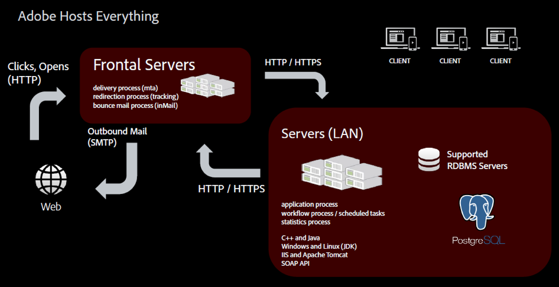
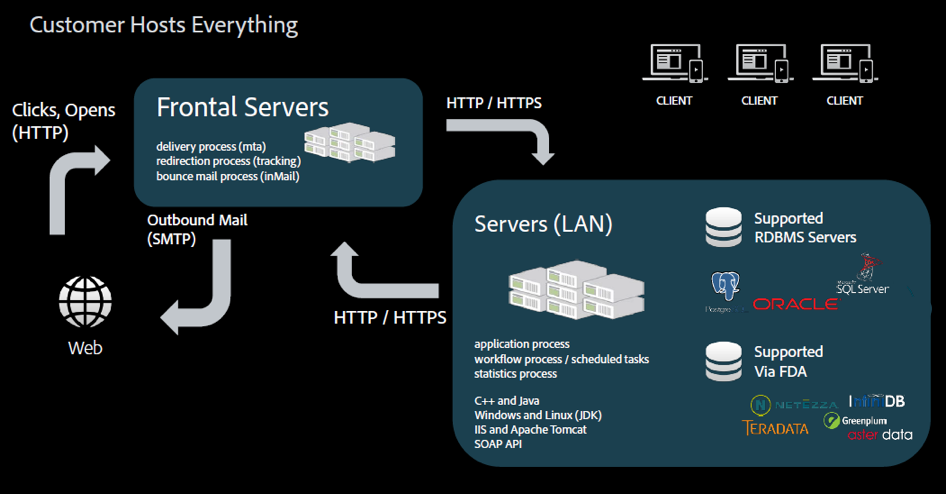
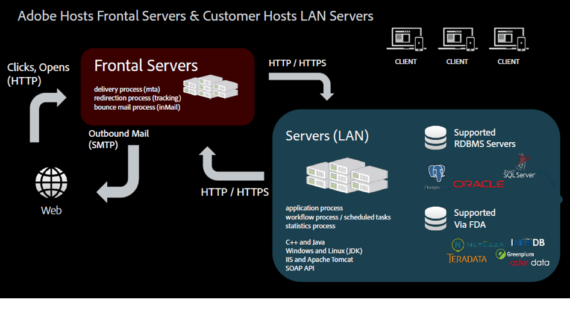

# Hosting-Modelle{#hosting-models}

Adobe Campaign bietet eine Auswahl von drei Hosting-Modellen, die Flexibilität und Freiheit bei der Auswahl des besten Modells bieten, oder von Modellen, die geschäftlichen Anforderungen entsprechen.

>[!NOTE]
>
>Für von Adobe gehostete Umgebungen können die Hauptinstallations- und -konfigurationsschritte nur von Adobe ausgeführt werden, z. B. das Konfigurieren des Servers und das Anpassen der Konfigurationsdateien der Instanz. Weitere Informationen zu den wichtigsten Unterschieden zwischen Bereitstellungsmodi finden Sie auf [dieser Seite](../../installation/using/capability-matrix.md).

## Managed Services / gehostet

Adobe Campaign kann in as a Managed Service bereitgestellt werden: Alle Komponenten von Adobe Campaign, einschließlich der Benutzeroberfläche, der Ausführungsverwaltungs-Engine und der Campaign-Datenbank des Kunden, werden vollständig von Adobe gehostet, einschließlich E-Mail-Ausführung, Mirror-Seiten, Tracking-Server und nach außen gerichtete Web-Komponenten wie Abmeldeseite/Präferenzcenter und Landingpages.

Als gehosteter Kunde werden die meisten Installations- und Konfigurationsschritte von Adobe ausgeführt. Sie können auf die folgenden Abschnitte zugreifen, um Ihre Implementierung anzupassen:

* Konfigurieren Sie Tracking- und Mirrorseiten-URLs pro Marke. Informationen zu Transaktionsnachrichten finden Sie [in diesem Abschnitt](../../message-center/using/additional-configurations.md#configuring-multibranding).
* Installieren Sie die Client-Konsole: siehe [diesen Abschnitt](../../installation/using/installing-the-client-console.md).
* Weitere Informationen zu den Zustellbarkeits-Tools und Best Practices finden Sie in der [ausführlichen Dokumentation](../../delivery/using/about-deliverability.md).
* Konfigurieren der Kampagnenoptionen: siehe [diesen Abschnitt](../../installation/using/configuring-campaign-options.md).
* Konfigurieren von CRM-Connectoren: [siehe diesen Abschnitt](../../platform/using/crm-connectors.md).

## On-Premise

Adobe Campaign kann On-Premise bereitgestellt werden: Alle Komponenten von Adobe Campaign, einschließlich der Benutzeroberfläche, der Ausführungsverwaltungs-Engine und der Datenbank, befinden sich vor Ort im Rechenzentrum des Kunden. Bei diesem Bereitstellungsmodell verwaltet der Kunde alle Software- und Hardware-Updates und -Upgrades, und ein dedizierter Datenbankadministrator muss Wartungs- und Optimierungsaufgaben durchführen, um die Verwaltung der Campaign-Instanz sicherzustellen.

Bevor Sie als On-Premise-Kunde mit der Bereitstellung von Campaign Classic beginnen, beachten Sie die folgenden Voraussetzungen und Empfehlungen:

* Lesen Sie die [Kompatibilitätsmatrix“, &#x200B;](../../rn/using/compatibility-matrix.md) alle Versionen der für Adobe Campaign unterstützten Systeme und Komponenten auflistet.
* Lesen Sie je nach Umgebung die [Voraussetzungen für Windows](../../installation/using/prerequisites-of-campaign-installation-in-windows.md) und [Voraussetzungen für Linux](../../installation/using/prerequisites-of-campaign-installation-in-linux.md).
* Weitere Informationen zu Empfehlungen zu Datenbank-Engines [in diesem Abschnitt](../../installation/using/database.md).
* Überprüfen Sie, ob die erforderlichen Datenbankzugriffsebenen auf dem Server installiert sind und über das Adobe Campaign-Konto zugänglich sind. [Weitere Informationen](../../installation/using/application-server.md).
* Konfigurieren Sie Ihre Netzwerke, da einige Prozesse mit anderen kommunizieren oder auf das LAN und das Internet zugreifen müssen. Dies bedeutet, dass einige TCP-Ports für diese Prozesse offen sein müssen. [Weitere Informationen](../../installation/using/network-configuration.md) über die Anforderungen an die Netzwerkkonfiguration.
* Lesen Sie [Campaign-Sicherheits- und Datenschutz-Checkliste](https://helpx.adobe.com/de/campaign/kb/acc-security.html).
* Lesen Sie die allgemeinen Richtlinien für die Schätzung der Hardwareanforderungen für die On-Premise-Bereitstellung [in diesem Artikel](https://helpx.adobe.com/de/campaign/kb/hardware-sizing-guide.html).

## Hybrid

Bei der Bereitstellung als Hybridmodell befindet sich die Adobe Campaign-Lösungssoftware am Standort des Kunden vor Ort, und die Ausführungsverwaltung wird von Adobe als Cloud-Service bereitgestellt. Die Adobe Campaign-Marketing-Instanz wird in der Firewall eines Kunden installiert, sodass personenbezogene Daten (PII) intern bleiben und nur die Daten, die zum Personalisieren von E-Mails erforderlich sind, zur E-Mail-Ausführung an die Cloud gesendet werden. Die in der Cloud gehostete Ausführungsinstanz empfängt die Anfragen von der On-Premise-Instanz zum Versand von E-Mails. Diese Instanz personalisiert alle E-Mails und stellt sie bereit. Keine Daten irgendeiner Art werden dauerhaft in der Cloud gespeichert.

Als Hybrid-Kunde werden die meisten Installations- und Konfigurationsschritte von Adobe ausgeführt. Sie können auf die folgenden Abschnitte zugreifen, um Ihre Implementierung anzupassen:

* Transaktionsnachrichten konfigurieren: siehe [diesen Abschnitt](../../message-center/using/transactional-messaging-architecture.md).
* Konfigurieren Sie Tracking- und Mirrorseiten-URLs pro Marke. Informationen zu Transaktionsnachrichten finden Sie [in diesem Abschnitt](../../message-center/using/additional-configurations.md#configuring-multibranding).
* Installieren Sie die Client-Konsole: siehe [diesen Abschnitt](../../installation/using/installing-the-client-console.md).
* Installieren von integrierten Packages: siehe [diesen Abschnitt](../../installation/using/installing-campaign-standard-packages.md).
* Zustellbarkeit: Konfigurieren von [MX](../../installation/using/email-deliverability.md#mx-configuration)Regeln und [E-Mail-Formaten](../../installation/using/email-deliverability.md#managing-email-formats). Weitere Informationen zu den Zustellbarkeits-Tools und Best Practices finden Sie in der [ausführlichen Dokumentation](../../delivery/using/about-deliverability.md).
* Konfigurieren der Kampagnenoptionen: siehe [diesen Abschnitt](../../installation/using/configuring-campaign-options.md).
* Konfigurieren einer externen Datenbank (Federated Data Access): siehe [diesen Abschnitt](../../installation/using/about-fda.md).
* Konfigurieren von CRM-Connectoren: siehe [diesen Abschnitt](../../platform/using/crm-connectors.md).
* Weitere Informationen zu den Grundsätzen der Mid-Sourcing-Bereitstellung finden Sie [diesem Abschnitt](../../installation/using/mid-sourcing-deployment.md).
