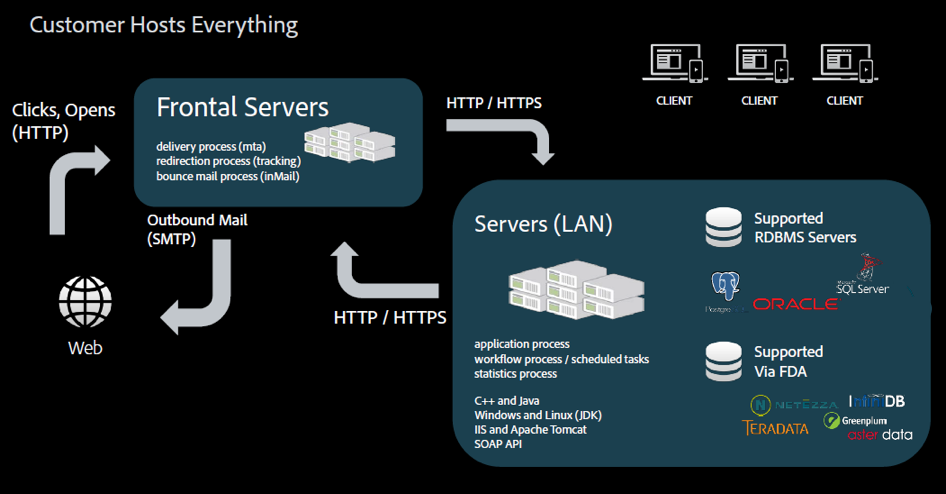

# Hosting-Modelle{#hosting-models}

Adobe Campaign bietet drei Hosting-Modelle, die Flexibilität und Freiheit bieten, das beste Modell auszuwählen, oder Modelle, die den Geschäftsanforderungen entsprechen.

>[!NOTE]
>
>Bei Adobe gehosteten Umgebungen können die Haupt-Installations- und Konfigurationsschritte nur von Adobe ausgeführt werden, z. B. durch Konfigurieren des Servers und Anpassen der Konfigurationsdateien der Instanz. Weitere Informationen zu den Hauptunterschieden zwischen den Implementierungsmodi finden Sie unter [diese Seite](../../installation/using/capability-matrix.md).

## Managed Services/gehostet

Adobe Campaign kann as a Managed Service bereitgestellt werden: Alle Komponenten von Adobe Campaign, einschließlich der Benutzeroberfläche, der Ausführungsverwaltungsmaschine und der Campaign-Datenbank des Kunden, werden vollständig von Adobe gehostet, einschließlich E-Mail-Ausführung, Mirrorseiten, Tracking-Server und extern orientierten Webkomponenten wie dem Abmelde-Seiten-/Präferenzzentrum und Landingpages.

Als gehosteter Kunde werden die meisten Installations- und Konfigurationsschritte von Adobe ausgeführt. Sie können auf die folgenden Abschnitte zugreifen, um Ihre Implementierung anzupassen:

* Konfigurieren Sie Tracking- und Mirrorseiten-URLs pro Marke. Transaktionsnachrichten, siehe [in diesem Abschnitt](../../message-center/using/additional-configurations.md#configuring-multibranding).
* Installieren Sie die Clientkonsole: reference [in diesem Abschnitt](../../installation/using/installing-the-client-console.md).
* Erfahren Sie mehr über die Zustellbarkeits-Tools und Best Practices im Abschnitt [Detaillierte Dokumentation](../../delivery/using/about-deliverability.md).
* Campaign-Optionen konfigurieren: reference [in diesem Abschnitt](../../installation/using/configuring-campaign-options.md).
* CRM-Connectoren konfigurieren: reference [in diesem Abschnitt](../../platform/using/crm-connectors.md).

## On-Premise

Adobe Campaign kann lokal bereitgestellt werden: Alle Komponenten von Adobe Campaign, einschließlich Benutzeroberfläche, Ausführungsmanagement-Engine und Datenbank, befinden sich im Rechenzentrum des Kunden. In diesem Bereitstellungsmodell verwaltet der Kunde alle Software- und Hardwareaktualisierungen und -aktualisierungen. Ein dedizierter Datenbankadministrator muss Wartungs- und Optimierungsaufgaben durchführen, um die Verwaltung der Campaign-Instanz sicherzustellen.

Als On-Premise-Kunde müssen Sie vor der Bereitstellung von Campaign Classic folgende Voraussetzungen und Empfehlungen erfüllen:

* Lesen Sie die [Kompatibilitätsmatrix](../../rn/using/compatibility-matrix.md) , in dem alle für Adobe Campaign unterstützten Systemversionen und Komponenten aufgeführt sind.
* Lesen Sie je nach Umgebung die Informationen unter [Voraussetzungen für Windows](../../installation/using/prerequisites-of-campaign-installation-in-windows.md) und [Voraussetzungen für Linux](../../installation/using/prerequisites-of-campaign-installation-in-linux.md).
* Empfehlungen zu Datenbank-Engines [in diesem Abschnitt](../../installation/using/database.md).
* Überprüfen Sie, ob die erforderlichen Datenbankzugriffsebenen auf dem Server installiert sind und über das Adobe Campaign-Konto darauf zugegriffen werden kann. [Weitere Informationen](../../installation/using/application-server.md).
* Konfigurieren Sie Ihre Netzwerke, da einige Prozesse mit anderen kommunizieren oder auf LAN und Internet zugreifen müssen. Dies bedeutet, dass einige TCP-Ports für diese Prozesse offen sein müssen. [Weitere Infos](../../installation/using/network-configuration.md) Informationen zu den Netzkonfigurationsanforderungen.
* Lesen [Checkliste für Sicherheit und Datenschutz in Campaign](https://helpx.adobe.com/de/campaign/kb/acc-security.html).
* Allgemeine Richtlinien zur Schätzung der Hardwareanforderungen für die On-Premise-Implementierung [in diesem Artikel](https://helpx.adobe.com/de/campaign/kb/hardware-sizing-guide.html).

## Hybrid

Bei der Bereitstellung als Hybridmodell befindet sich die Adobe Campaign-Lösungssoftware lokal auf der Kundenseite und die Ausführungsverwaltung wird von Adobe als Cloud-Service bereitgestellt. Die Adobe Campaign-Marketinginstanz wird innerhalb der Firewall eines Kunden installiert, sodass personenbezogene Daten (PII) intern aufbewahrt werden und nur Daten zur Personalisierung von E-Mails an die Cloud zur Ausführung von E-Mails gesendet werden. Die in der Cloud gehostete Ausführungsinstanz empfängt die Anfragen von der On-Premise-Instanz zum Versand von E-Mails. Diese Instanz personalisiert alle E-Mails und stellt sie bereit. In der Cloud werden keine Daten jeglicher Art dauerhaft gespeichert.

Als Hybrid-Kunde werden die meisten Installations- und Konfigurationsschritte von Adobe ausgeführt. Sie können auf die folgenden Abschnitte zugreifen, um Ihre Implementierung anzupassen:

* Transaktionsnachrichten konfigurieren: reference [in diesem Abschnitt](../../message-center/using/transactional-messaging-architecture.md).
* Konfigurieren Sie Tracking- und Mirrorseiten-URLs pro Marke. Transaktionsnachrichten, siehe [in diesem Abschnitt](../../message-center/using/additional-configurations.md#configuring-multibranding).
* Installieren Sie die Clientkonsole: reference [in diesem Abschnitt](../../installation/using/installing-the-client-console.md).
* Installieren Sie integrierte Pakete: reference [in diesem Abschnitt](../../installation/using/installing-campaign-standard-packages.md).
* Zustellbarkeit: konfigurieren [MX-Regeln](../../installation/using/email-deliverability.md#mx-configuration) und [E-Mail-Formate](../../installation/using/email-deliverability.md#managing-email-formats). Erfahren Sie mehr über die Zustellbarkeits-Tools und Best Practices im Abschnitt [Detaillierte Dokumentation](../../delivery/using/about-deliverability.md).
* Campaign-Optionen konfigurieren: reference [in diesem Abschnitt](../../installation/using/configuring-campaign-options.md).
* Externe Datenbank konfigurieren (Federated Data Access): reference [in diesem Abschnitt](../../installation/using/about-fda.md).
* CRM-Connectoren konfigurieren: reference [in diesem Abschnitt](../../platform/using/crm-connectors.md).
* Weitere Informationen zu Mid-Sourcing-Implementierungsprinzipien finden Sie unter [in diesem Abschnitt](../../installation/using/mid-sourcing-deployment.md).
