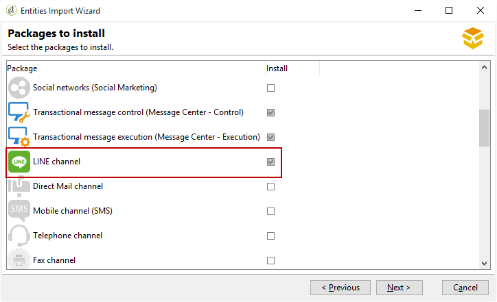

# Installieren von Campaign Classic-Standardpaketen{#installing-campaign-standard-packages}

## Informationen zu Standardpaketen {#campaign-standard-packages}

Pakete sind eine Reihe von Funktionen, die je nach Bedarf installiert werden können. Dadurch können Sie Ihrer Instanz weitere Optionen hinzufügen.

>[!CAUTION]
>
>Sie dürfen nur Pakete installieren, die den in Ihrem Lizenzvertrag erwähnten Optionen entsprechen.
>
>Nachdem ein Paket installiert wurde, können Sie es nicht deinstallieren. Die Installation eines neuen Pakets kann sich auf Ihre gesamte Plattform auswirken: sie muss vor der endgültigen Bereitstellung getestet und validiert werden.

So installieren Sie ein Standardpaket:

1. Greifen Sie über **[!UICONTROL Tools > Advanced > Package import...]** die Adobe Campaign-Client-Konsole auf den Package Import-Assistent zu.
1. Auswählen **[!UICONTROL Install a standard package]**.
1. Überprüfen Sie in der Liste, die angezeigt wird, die zu installierenden Pakete.
   >[!NOTE]
   >
   >Wenn ein Paket ausgegraut ist, können Sie es nicht installieren. Dies bedeutet, dass diese bereits installiert ist oder nicht mit Ihrer Instanz kompatibel ist. Beispielsweise können Sie das **Mid-Sourcing-Plattformpaket** nicht auf einer Marketing-Instanz installieren. Diese Informationen finden Sie in der unten stehenden Tabelle.
1. Klicken Sie auf **[!UICONTROL Next]** und dann **[!UICONTROL Start]** , um die Paketinstallation Beginn.

   Sobald die Pakete installiert sind, wird in der Fortschrittsleiste **100%** angezeigt. Die folgende Meldung wird in den Installationsprotokollen angezeigt: **[!UICONTROL Installation of packages successful]**.

1. **[!UICONTROL Close]** das Installationsfenster.

Die Pakete sind jetzt installiert.

### List of out-of-the-box Packages {#list-of-standard-packages}

In der folgenden Tabelle werden alle Standardpakete mit ihrer Beschreibung und dem Instanztyp, auf dem sie installiert werden können (Marketing, Mittel usw.), Liste. und zusätzliche Informationen.

<table> 
 <thead> 
  <tr> 
   <th> Paket </th> 
   <th> Description </th> 
   <th> Instanzentyp </th> 
   <th> Weitere Informationen </th> 
  </tr> 
 </thead> 
 <tbody> 
  <tr> 
   <td> Versand<br /> </td> 
   <td> Überwacht Versand und eventuell aufgetretene Probleme beim Senden von Nachrichten.<br /> </td> 
   <td> Alle</td> 
   <td> <a href="../../delivery/using/monitoring-a-delivery.md">mehr dazu</a></td> 
  </tr> 
  <tr> 
   <td> Marketing-Kampagnen (Kampagne)<br /> </td> 
   <td> Definiert, optimiert, führt und analysiert Kommunikations- und Marketing-Kampagnen.<br /> </td> 
   <td> Marketing</td> 
   <td> <a href="../../campaign/using/designing-marketing-campaigns.md">Mehr erfahren</a> </td> 
  </tr> 
  <tr> 
   <td> Marketing resources (MRM)<br /> </td> 
   <td> Steuert Marketingaktionen im kollaborativen Modus, indem sie die Verwaltung und Verfolgung der Aufgaben, Budgets und Marketing-Ressourcen bereitstellt.<br /> </td> 
   <td> Marketing</td> 
   <td> <a href="../../campaign/using/about-marketing-resource-management.md">Mehr erfahren</a> </td> 
  </tr> 
  <tr> 
   <td> Angebot Engine (Interaktion)<br /> </td> 
   <td> Reagiert in Echtzeit auf eine Interaktion mit einem bestimmten Ansprechpartner (Kunde oder Zielgruppe), indem er diese zu einem oder mehreren angepassten Angeboten macht. <br /> </td> 
   <td> Alle<br /> </td> 
   <td> Optional, <a href="../../interaction/using/interaction-and-offer-management.md">weitere Informationen</a></td> 
  </tr> 
  <tr> 
   <td> Steuerung des Angebot-Motors mit Ausführungsinstanz<br /> </td> 
   <td> </td> 
   <td> Marketing<br /> </td> 
   <td> Optional</td> 
  </tr> 
  <tr> 
   <td> Angebot-Engine für Ausführungsinstanzen<br /> </td> 
   <td> </td> 
   <td> Mid, Ausführung <br /> </td> 
   <td> Optional</td> 
  </tr> 
  <!--tr> 
   <td> Lead Management (Leads) (deprecated)<br /> </td> 
   <td> Simplifies the process of building and maintaining the entire leads management life cycle. <br /> </td> 
   <td> Yes<br /> </td> 
   <td> Optional, <a href="https://helpx.adobe.com/campaign/kb/deprecated-and-removed-features.html">Learn More</a> </td> 
  </tr--> 
  <tr> 
   <td> Soziale Netzwerke (Social Marketing) <br /> </td> 
   <td> Synchronisiert Adobe Campaign mit Twitter und Facebook.<br /> </td> 
   <td> Alle</td> 
   <td> <a href="../../social/using/about-social-marketing.md">Mehr erfahren</a> </td> 
  </tr> 
  <tr> 
   <td> Kontrolle der Transaktionsnachricht (Message Center - Control)<br /> </td> 
   <td> Verwaltet Auslösermeldungen, die aus Ereignissen generiert wurden, die aus Informationssystemen ausgelöst wurden.<br /> </td> 
   <td> Marketing<br /> </td> 
   <td> Optional, <a href="../../message-center/using/about-transactional-messaging.md">weitere Informationen</a> </td> 
  </tr> 
  <tr> 
   <td> Ausführung der Transaktionsnachricht (Nachrichtencenter - Ausführung) <br /> </td> 
   <td> Stellt eine höhere Verfügbarkeit und ein besseres Lastmanagement sicher.<br /> </td> 
   <td> Ausführung<br /> </td> 
   <td> Optional, <a href="../../message-center/using/about-transactional-messaging.md">weitere Informationen</a> </td> 
  </tr> 
  <tr> 
   <td> LINE-Kanal<br /> </td> 
   <td> Sendet Versand mithilfe des LINE-Kanals mit Adobe Campaign,<br /> </td> 
   <td> Alle<br /> </td> 
   <td> Optional, Meldungscenter obligatorisch</td> 
  </tr> 
  <tr> 
   <td> Direct Mail channel<br /> </td> 
   <td> Sendet Versand mit dem Direct-Mail-Kanal mit Adobe Campaign.<br /> </td> 
   <td> Alle<br /> </td> 
   <td> Optional, <a href="../../delivery/using/about-direct-mail-channel.md">weitere Informationen</a> </td> 
  </tr> 
  <tr> 
   <td> Mobile-Kanal (SMS) <br /> </td> 
   <td> Sendet Versand mit dem Mobile/SMS-Kanal mit Adobe Campaign.<br /> </td> 
   <td> Alle<br /> </td> 
   <td> Optional, <a href="../../delivery/using/sms-channel.md">weitere Informationen</a> </td> 
  </tr> 
  <tr> 
   <td> Telefonischer Kanal<br /> </td> 
   <td> Sendet Versand mit dem Telefonnummer-Kanal mit Adobe Campaign.<br /> </td> 
   <td> Alle<br /> </td> 
   <td> Optional</td> 
  </tr> 
  <tr> 
   <td> Fax-Kanal<br /> </td> 
   <td> Sendet Versand mit dem Fax-Kanal mit Adobe Campaign.<br /> </td> 
   <td> Alle<br /> </td> 
   <td> Optional</td> 
  </tr> 
  <tr> 
   <td> Mobile-App-Kanal (Mobile App Channel)<br /> </td> 
   <td> Verwendet die Adobe Campaign-Plattform, um personalisierte Benachrichtigungen über Apps an iOS- und Android-Terminals zu senden. <br /> </td> 
   <td> Alle<br /> </td> 
   <td> Optional, <a href="../../delivery/using/about-mobile-app-channel.md">weitere Informationen</a> </td> 
  </tr> 
  <tr> 
   <td> Content Manager<br /> </td> 
   <td> Erstellt wiederkehrende Newsletter oder Websites und überprüft und veröffentlicht dann Ihre Nachrichten.<br /> </td> 
   <td> </td> 
   <td> <a href="../../delivery/using/about-content-management.md">Mehr erfahren</a> </td> 
  </tr> 
  <tr> 
   <td> Online-Umfragen (Umfrage Manager)<br /> </td> 
   <td> Erstellt und verwaltet Online-Formulare zum Hinzufügen oder Ändern von Profil-Informationen, zum Abonnieren, zum Abmelden oder einem Konkurrenzformular.<br /> </td> 
   <td> Marketing<br /> </td> 
   <td> Optional, <a href="../../web/using/about-surveys.md">weitere Informationen</a> </td> 
  </tr> 
  <tr> 
   <td> Marketing Analytics<br /> </td> 
   <td> Ermöglicht die Analyse und Messung von Daten, die Berechnung von Statistiken, die Vereinfachung und Optimierung der Berichterstellung und -berechnung. Außerdem können Sie Berichte erstellen und Populationen zu Zielgruppen erstellen. <br /> </td> 
   <td> Marketing<br /> </td> 
   <td> Optional, <a href="../../reporting/using/about-cubes.md">weitere Informationen</a> </td> 
  </tr> 
  <tr> 
   <td> Reaktionsverwaltung<br /> </td> 
   <td> Misst den Erfolg und die Rentabilität von Marketing-Kampagnen oder Angebotsvorschlägen für alle Kommunikations-Kanal.<br /> </td> 
   <td> Marketing<br /> </td> 
   <td> Optional, <a href="../../campaign/using/about-response-manager.md">weitere Informationen</a> </td> 
  </tr> 
  <tr> 
   <td> Zugriff auf externe Daten (Federated Data Access)<br /> </td> 
   <td> Provides the Federated Data Access (FDA) option in order to process information stored in one or more external databases so that you can access external data without changing the structure of Adobe Campaign data.<br /> </td> 
   <td> Alle<br /> </td> 
   <td> Optional, <a href="../../workflow/using/accessing-an-external-database--fda-.md">weitere Informationen</a> </td> 
  </tr> 
  <tr> 
   <td> Kampagnenoptimierung (Campaign Optimization)<br /> </td> 
   <td> Kontrolliert, Filter und überwacht den Versand von Versänden, damit die gesendeten Nachrichten den Bedürfnissen und Erwartungen der Kunden am besten entsprechen, im Einklang mit den Kommunikationsrichtlinien der Firma. <br /> </td> 
   <td> Marketing<br /> </td> 
   <td> Optional, <a href="../../campaign/using/about-campaign-typologies.md">weitere Informationen</a> </td> 
  </tr> 
  <tr> 
   <td> Zustellbarkeits-Monitoring (Email Deliverability)<br /> </td> 
   <td> Measures the success of your campaigns reaching your recipients' inbox without bouncing, or being marked as spam.<br /> </td> 
   <td> Alle </td> 
   <td> Optional, <a href="https://docs.campaign.adobe.com/doc/AC/getting_started/EN/deliverability.html">weitere Informationen</a> </td> 
  </tr> 
  <tr> 
   <td> Gutscheinverwaltung<br /> </td> 
   <td> Erstellt eine Reihe von Coupons, die zu kommenden Marketing-Angeboten hinzugefügt werden sollen.<br /> </td> 
   <td> Marketing<br /> </td> 
   <td> Optional, <a href="../../delivery/using/personalized-coupons.md">weitere Informationen</a> </td> 
  </tr> 
  <tr> 
   <td> Inbox Rendering (IR)<br /> </td> 
   <td> Ermöglicht die Vorschau der Nachricht, die in den verschiedenen Kontexten gesendet wird, in denen sie empfangen werden kann, und die Überprüfung der Kompatibilität von Desktop-PCs und Anwendungen. Du brauchst ein Litmus-Konto.<br /> </td> 
   <td> Marketing<br /> </td> 
   <td> Optional, <a href="../../delivery/using/inbox-rendering.md">weitere Informationen</a> </td> 
  </tr> 
  <tr> 
   <td> Zentrales/lokales Marketing (Dezentrale Marketing)<br /> </td> 
   <td> Implementiert kooperative Kampagnen zwischen Zentralstellen (Hauptsitz, Marketingabteilungen usw.) und Lokalstellen (Verkaufsstellen, Regionalbüros usw.).<br /> </td> 
   <td> Marketing </td> 
   <td> Optional, <a href="../../campaign/using/about-distributed-marketing.md">weitere Informationen</a> </td> 
  </tr> 
  <tr> 
   <td> CRM-Connectoren<br /> </td> 
   <td> Bietet verschiedene CRM-Connectors zum Verknüpfen Ihrer Adobe Campaign-Plattform mit Ihren Drittanbietersystemen.<br /> </td> 
   <td> Marketing</td> 
   <td> <a href="../../platform/using/crm-connectors.md">Mehr erfahren</a> </td> 
  </tr> 
  <tr> 
   <td> Web-Analytics-Connectoren<br /> </td> 
   <td> Ermöglicht Adobe Campaign und Adobe Analytics die Interaktion über das Web Analytics Connectors-Paket.<br /> </td> 
   <td> Marketing </td> 
   <td> Nicht kompatibel mit Transaktionsnachrichten, <a href="../../platform/using/adobe-analytics-data-connector.md">weitere Informationen</a> </td> 
  </tr> 
  <tr> 
   <td> AEM integration<br /> </td> 
   <td> Ermöglicht die direkte Verwaltung des Inhalts Ihrer E-Mail-Versand sowie Ihrer Formulare in Adobe Experience Manager, um die Funktionen zur Inhaltsbearbeitung von AEM sowie die Versand-Kapazitäten von Adobe Campaign nutzen zu können.<br /> </td> 
   <td> Marketing</td> 
   <td> <a href="../../integrations/using/about-adobe-experience-manager.md">Mehr erfahren</a> </td> 
  </tr> 
  <tr> 
   <td> Adobe Marketing Cloud Shared Audiences Integration<br /> </td> 
   <td> Ermöglicht den Austausch und die Freigabe von Audiencen/Segmenten mit Adobe Experience Cloud-Lösungen und Hauptdiensten.<br /> </td> 
   <td> Marketing<br /> </td> 
   <td> Erfordert IMS, <a href="../../integrations/using/sharing-audiences-with-adobe-experience-cloud.md">weitere Informationen</a> </td> 
  </tr> 
  <tr> 
   <td> Integration in Adobe Marketing Cloud<br /> </td> 
   <td> Ermöglicht Ihnen den Import und Export von Audiencen/Segmenten aus verschiedenen Adobe Marketing Cloud-Lösungen in Adobe Campaign. </td> 
   <td> Marketing</td> 
   <td> Optional, <a href="../../integrations/using/configuring-ims.md#installing-the-package">weitere Informationen</a> </td> 
  </tr> 
  <tr> 
   <td> Datenschutzbestimmung<br /> </td> 
   <td> Enthält zusätzliche Funktionen, die Ihnen bei der Einhaltung Ihrer Datenschutzbestimmungen in Campaign Classic helfen.<br /> </td> 
   <td> Alle</td> 
   <td> <a href="https://helpx.adobe.com/campaign/kb/acc-privacy.html">Mehr erfahren</a> </td> 
  </tr> 
  <tr> 
   <td> Transfer to Mid-Sourcing <br /> </td> 
   <td> Details zur Installation und Konfiguration eines Mid-Sourcing-Servers sowie zur Bereitstellung einer Instanz, die es Dritten ermöglicht, Nachrichten im Mid-Sourcing-Modus zu senden.<br /> </td> 
   <td> Marketing </td> 
   <td> Optional, <a href="../../installation/using/mid-sourcing-server.md">weitere Informationen</a> </td> 
  </tr> 
  <tr> 
   <td> Mid-Sourcing-Plattform<br /> </td> 
   <td> Diese Konfiguration ist eine optimale Zwischenlösung zwischen einer gehosteten (ASP) Konfiguration und Internalisierung. Die nach außen gerichteten Ausführungskomponenten werden auf einem "Mid-Sourcing"-Server ausgeführt, der bei Adobe Campaign gehostet wird.<br /> </td> 
   <td> Mid-Sourcing </td> 
   <td> Optional, <a href="../../installation/using/mid-sourcing-server.md">weitere Informationen</a> </td> 
  </tr> 
  <tr> 
   <td> ACS Connector<br /> </td> 
   <td> Brilliert Adobe Campaign v7 und Adobe Campaign Standard. Es handelt sich um eine integrierte Funktion in Kampagne v7, die Daten automatisch an Campaign Standard repliziert und die besten beider Anwendungen zusammenführt. <br /> </td> 
   <td> Marketing </td> 
   <td> Optional, <a href="../../integrations/using/acs-connector-principles-and-data-cycle.md">weitere Informationen</a> </td> 
  </tr> 
 </tbody> 
</table>

### Message Center-Paket {#message-center-package}

Um einen Versand-Kanal hinzuzufügen (Mobile Kanal, Mobile App Kanal usw.), muss dieser vor der Installation des Message Center-Pakets ausgeführt werden. Wenn Sie ein Message Center-Projekt auf dem E-Mail-Kanal gestartet haben und sich dann mitten im Projekt entscheiden, einen neuen Kanal hinzuzufügen, müssen Sie folgende Schritte ausführen:

1. Installieren Sie den gewünschten Kanal, z. B. den **Mobile Kanal**, mit dem Package Import-Assistent ( **[!UICONTROL Tools > Advanced > Import package > Adobe Campaign package]**).
1. Importieren Sie die Datei ( **[!UICONTROL Tools > Advanced > Import package > File]**) und wählen Sie:

   ```
   \datakit\nms\[Your language]\package\messageCenter.xml
   ```

1. Behalten Sie im **[!UICONTROL XML data content to import]** Menü nur die Message Center-Versandvorlage bei, die dem angehängten Kanal entspricht. Wenn Sie beispielsweise den **Mobile Kanal** hinzugefügt haben, sollten Sie nur das **Entitätselement** beibehalten, das der Vorlage (smsTriggerMessage) entspricht **[!UICONTROL Mobile transactional message]** . Wenn Sie den **Mobile App Kanal** hinzugefügt haben, sollten Sie nur die **iOS-Transaktionsnachrichten** -Vorlagen (iosTriggerMessage) und die **Android-Transaktionsnachricht** (androidTriggerMessage) beibehalten.

   

### LINE-Paket {#line-package}

Um Versand mit dem LINE-Kanal mit Adobe Campaign senden zu können, müssen Sie das LINE-Paket installieren.

Die Installation des LINE-Pakets ist eine Standardinstallation, die im Abschnitt [Pakete](../../platform/using/working-with-data-packages.md#importing-packages) importieren beschrieben wird.



>[!CAUTION]
>
>Die Message Center-Versandvorlagen für LINE sind nicht verfügbar, wenn die Message Center-Pakete vor LINE installiert wurden.
