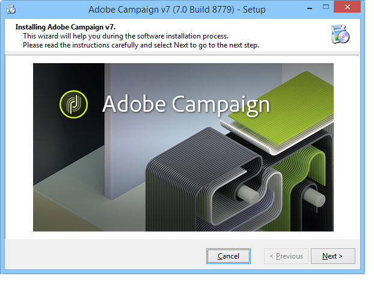

# Installieren des Servers{#installing-the-server}

## Ausführen des Programms Installation {#executing-the-installation-program}

Installieren Sie für eine Windows 32-Bit-Plattform Adobe Campaign 32 Bit. Installieren Sie für eine Windows 64-Bit-Plattform Adobe Campaign 64 Bit.

Die Installationsschritte für den Adobe Campaign-Server lauten wie folgt:

1. Führen Sie die Datei **setup.exe** aus.

   

1. Wählen Sie den Installationstyp.

   

   Es stehen verschiedene Installationstypen zur Verfügung:

   * **[!UICONTROL Installation eines Anwendungsservers]** : Installieren Sie den Adobe Campaign-Anwendungsserver und die Client-Konsole.
   * **[!UICONTROL Minimale Installation (Netzwerk)]** : Installation des Client-Computers über das Netzwerk. Falls nötig, wird nur eine begrenzte Anzahl von DLLs auf dem Computer installiert, und alle anderen Komponenten werden von einem Netzlaufwerk verwendet.
   * **[!UICONTROL Installation eines Clients]** : Installation der erforderlichen Komponenten für den Adobe Campaign-Client.
   * **[!UICONTROL Benutzerdefinierte Installation]** : Der Benutzer wählt die zu installierenden Elemente aus.

   Wählen Sie **Installation eines Anwendungsservers** und gehen Sie wie folgt vor:

   

1. Wählen Sie den Installationsordner aus:

   

1. Click **[!UICONTROL Finish]** to start the installation:

   

   Die Fortschrittsleiste zeigt an, wie weit die Installation fortgeschritten ist:

   

   Nach Abschluss der Installation wird eine Meldung angezeigt, die Sie darüber informiert:

   

   >[!NOTE]
   >
   >Sobald die Serverinstallation abgeschlossen ist, muss der Server neu gestartet werden, um ein mögliches Netzwerkproblem zu vermeiden.

   Nachdem die Installation abgeschlossen ist, erstellen Sie die Konfigurationsdateien in Beginn Adobe Campaign. Weitere Informationen finden Sie unter [Erster Beginn des Servers](#first-start-up-of-the-server).

## Übersicht über die Installation {#summary-installation-testing}

Sie können die Erstinstallation mit dem folgenden Befehl testen:

```
nlserver pdump
```

Wenn das Adobe Campaign nicht gestartet wird, lautet die Antwort:

```
No task
```

## Erster Beginn des Servers {#first-start-up-of-the-server}

Nachdem der Installationstest abgeschlossen ist, öffnen Sie eine Eingabeaufforderung über das Menü **[!UICONTROL Beginn > Programme > Adobe Campaign]** und geben Sie den folgenden Befehl ein:

```
nlserver web
```


Die Dateien im Installationsordner werden zum Konfigurieren der Adobe Campaign-Servermodule verwendet.

Die folgenden Informationen werden angezeigt:

```
15:30:12 >   Application server for Adobe Campaign Classic (7.X YY.R build XXX@SHA1) of DD/MM/YYYY
15:30:12 >   Web server start (pid=664, tid=4188)...
15:30:12 >   Creation of server configuration file '[INSTALL]bin..confserverConf.xml' server via '[INSTALL]bin..conffraserverConf.xml.sample
15:30:12 >   Creation of server configuration file '[INSTALL]bin..confconfig-default.xml' server via '[INSTALL]bin..confmodelsconfig-default.xml
15:30:12 >   Server started
15:30:12 >   Stop requested (pid=664)
15:30:12 >   Web server stop (pid=664, tid=4188)...
```

Drücken Sie **Strg+C** , um den Prozess zu beenden, und geben Sie dann den folgenden Befehl ein:

```
nlserver start web
```

Die folgenden Informationen werden angezeigt:

```
12:17:21 >   Application server for Adobe Campaign Classic (7.X YY.R build XXX@SHA1) of DD/MM/YYYY
12:17:21 >   Start of the 'web@default' ('nlserver web -tracefile:web@default -instance:default -detach -tomcat -autorepair') task in a new process 
12:17:21 >   Application server for Adobe Campaign Classic (7.X YY.R build XXX@SHA1) of DD/MM/YYYY
12:17:21 >   Web server start (pid=29188, tid=-1224824320)...
12:17:21 >   Generation of configuration changes '[INSTALL]bin..confserverConf.xml.diff' between '[INSTALL]bin..confserverConf.xml' and '[INSTALL]bin..conffraserverConf.xml.sample'
12:17:22 >   Tomcat started
12:17:22 >   Server started
```

Geben Sie zum Beenden Folgendes ein:

```
nlserver stop web
```

Die folgenden Informationen werden angezeigt:

```
12:18:31 >   Application server for Adobe Campaign Classic (7.X YY.R build XXX@SHA1) of DD/MM/YYYY
12:18:31 >   Stop requested for 'web@default' ('nlserver web -tracefile:web@default -instance:default -detach -tomcat -autorepair', pid=29188, tid=-1224824320)...
12:18:31 >   Stop requested (pid=29188)
12:18:31 >   Web server stopped (pid=29188, tid=-1224824320)...
```

## Kennwort für die interne ID {#password-for-the-internal-identifier}

Der Adobe Campaign-Server definiert eine technische Anmeldung mit der Bezeichnung **internal** , die alle Berechtigungen für alle Instanzen besitzt. Kurz nach der Installation hat die Anmeldung kein Passwort. Es ist obligatorisch, eine zu definieren.

Siehe Abschnitt [Interne Kennung](../../installation/using/campaign-server-configuration.md#internal-identifier).

## Starting Adobe Campaign services {#starting-adobe-campaign-services}

Um die Adobe Campaign-Dienste Beginn, können Sie den Service Manager verwenden oder Folgendes an der Befehlszeile eingeben (mit den entsprechenden Rechten):

```
net start nlserver6
```

Wenn Sie die Adobe Campaign-Prozesse später beenden müssen, verwenden Sie den folgenden Befehl:

```
net stop nlserver6
```

## Installieren von LibreOffice {#installing-libreoffice}

Laden Sie LibreOffice herunter, z. B. von [https://www.libreoffice.org/download/libreoffice-fresh/](https://www.libreoffice.org/download/libreoffice-fresh/) , und befolgen Sie die regulären Installationsschritte.

hinzufügen der folgenden Umgebung:

```
OOO_BASIS_INSTALL_DIR="C:\Program Files (x86)\LibreOffice 6\"
```

