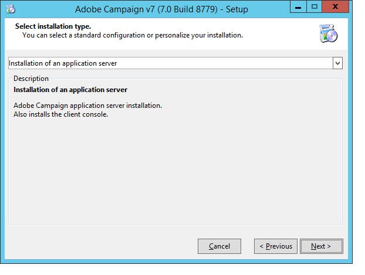
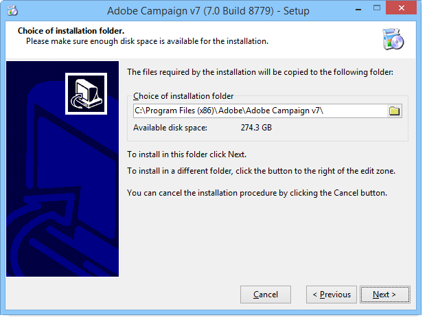

# Server installieren{#installing-the-server}

## Ausführen des Installationsprogramms {#executing-the-installation-program}

Die Installationsschritte für den Adobe Campaign-Server sind:

1. Führen Sie die Datei &quot;**.exe“**.

   

1. Installationstyp auswählen.

   

   Es stehen verschiedene Installationstypen zur Verfügung:

   * **[!UICONTROL Installation eines Anwendungsservers]** : Installieren Sie den Adobe Campaign-Anwendungsserver und die Client-Konsole.
   * **[!UICONTROL Minimale Installation (Netzwerk)]** : Installation des Client-Computers über das Netzwerk. Auf dem Computer wird bei Bedarf nur eine begrenzte Anzahl von DLLs installiert, und alle anderen Komponenten werden von einem Netzlaufwerk aus verwendet.
   * **[!UICONTROL Client-Installation]** : Installation der erforderlichen Komponenten für den Adobe Campaign-Client.
   * **[!UICONTROL Benutzerdefinierte Installation]** : Der Benutzer wählt die zu installierenden Elemente aus.

   Wählen Sie **Installation eines Anwendungs-Servers** aus und führen Sie die verschiedenen Schritte wie unten dargestellt durch:

   

1. Wählen Sie das Installationsverzeichnis aus:

   

1. Klicken Sie **[!UICONTROL Beenden]**, um die Installation zu starten:

   

   Die Fortschrittsleiste zeigt an, wie weit die Installation fortgeschritten ist:

   

   Nach Abschluss der Installation werden Sie in einer Meldung darüber informiert:

   

   >[!NOTE]
   >
   >Nach Abschluss der Server-Installation ist ein Neustart des Servers erforderlich, um mögliche Netzwerkprobleme zu vermeiden.

   Starten Sie Adobe Campaign nach Abschluss der Installation, um die Konfigurationsdateien zu erstellen. Siehe [Erster Serverstart](#first-start-up-of-the-server).

## Zusammenfassende Installationstests {#summary-installation-testing}

Sie können die Erstinstallation mit dem folgenden Befehl testen:

```sql
nlserver pdump
```

Wenn Adobe Campaign nicht gestartet wird, lautet die Antwort:

```sql
No task
```

## Erstes Hochfahren des Servers {#first-start-up-of-the-server}

Öffnen Sie nach Abschluss des Installationstests eine Eingabeaufforderung über das Menü **[!UICONTROL Start > Programme > Adobe Campaign]** und geben Sie den folgenden Befehl ein:

```sql
nlserver web
```

Die Dateien im Installationsverzeichnis werden zur Konfiguration der Adobe Campaign-Servermodule verwendet.

Daraufhin werden die folgenden Informationen angezeigt:

```sql
15:30:12 >   Application server for Adobe Campaign Classic (7.X YY.R build XXX@SHA1) of DD/MM/YYYY
15:30:12 >   Web server start (pid=664, tid=4188)...
15:30:12 >   Creation of server configuration file '[INSTALL]bin..confserverConf.xml' server via '[INSTALL]bin..conffraserverConf.xml.sample
15:30:12 >   Creation of server configuration file '[INSTALL]bin..confconfig-default.xml' server via '[INSTALL]bin..confmodelsconfig-default.xml
15:30:12 >   Server started
15:30:12 >   Stop requested (pid=664)
15:30:12 >   Web server stop (pid=664, tid=4188)...
```

Drücken Sie **Strg+C**, um den Vorgang zu stoppen, und geben Sie dann den folgenden Befehl ein:

```sql
nlserver start web
```

Daraufhin werden die folgenden Informationen angezeigt:

```sql
12:17:21 >   Application server for Adobe Campaign Classic (7.X YY.R build XXX@SHA1) of DD/MM/YYYY
12:17:21 >   Start of the 'web@default' ('nlserver web -tracefile:web@default -instance:default -detach -tomcat -autorepair') task in a new process 
12:17:21 >   Application server for Adobe Campaign Classic (7.X YY.R build XXX@SHA1) of DD/MM/YYYY
12:17:21 >   Web server start (pid=29188, tid=-1224824320)...
12:17:21 >   Generation of configuration changes '[INSTALL]bin..confserverConf.xml.diff' between '[INSTALL]bin..confserverConf.xml' and '[INSTALL]bin..conffraserverConf.xml.sample'
12:17:22 >   Tomcat started
12:17:22 >   Server started
```

Geben Sie Folgendes ein, um sie zu stoppen:

```sql
nlserver stop web
```

Daraufhin werden die folgenden Informationen angezeigt:

```sql
12:18:31 >   Application server for Adobe Campaign Classic (7.X YY.R build XXX@SHA1) of DD/MM/YYYY
12:18:31 >   Stop requested for 'web@default' ('nlserver web -tracefile:web@default -instance:default -detach -tomcat -autorepair', pid=29188, tid=-1224824320)...
12:18:31 >   Stop requested (pid=29188)
12:18:31 >   Web server stopped (pid=29188, tid=-1224824320)...
```

## Passwort für die interne Kennung {#password-for-the-internal-identifier}

Der Adobe Campaign-Server definiert eine technische Anmeldung mit dem Namen **internal**, die für alle Instanzen über alle Rechte verfügt. Unmittelbar nach der Installation verfügt die Anmeldung über kein Passwort. Es ist zwingend erforderlich, eine zu definieren.

Weiterführende Informationen finden Sie in [diesem Abschnitt](../../installation/using/configuring-campaign-server.md#internal-identifier).

## Starten von Adobe Campaign Services {#starting-adobe-campaign-services}

Um die Adobe Campaign-Services zu starten, können Sie den Service Manager verwenden oder Folgendes in die Befehlszeile eingeben (mit den entsprechenden Berechtigungen):

```sql
net start nlserver6
```

Wenn Sie die Adobe Campaign-Prozesse später anhalten müssen, verwenden Sie den Befehl :

```sql
net stop nlserver6
```

## Installieren von LibreOffice {#installing-libreoffice}

Laden Sie LibreOffice herunter und befolgen Sie die regulären Installationsschritte.

Fügen Sie die folgende Umgebungsvariable hinzu:

```sql
OOO_BASIS_INSTALL_DIR="C:\Program Files (x86)\LibreOffice 6\"
```
