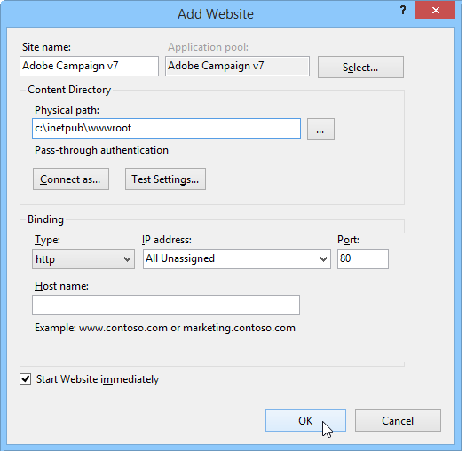

# Integration in einen Web-Server für Windows{#integration-into-a-web-server-for-windows}


Adobe Campaign enthält Apache Tomcat, der über HTTP (und SOAP) als Einstiegspunkt im Anwendungsserver fungiert.

Sie können diesen integrierten Tomcat-Server verwenden, um HTTP-Anforderungen zu erfüllen.

In diesem Fall:

* Der standardmäßige Listening-Anschluss ist 8080. Informationen zu ihrer Änderung finden Sie unter [diesem Abschnitt](../../installation/using/configure-tomcat.md).
* Die Clientkonsole Konsolen und dann die Verbindung über eine URL wie ```https:// `<computer>`:8080```.

Aus Sicherheits- und Verwaltungsgründen empfehlen wir jedoch die Verwendung eines dedizierten Webservers als Haupteinstiegspunkt für HTTP-Traffic, wenn der Computer, auf dem Adobe Campaign ausgeführt wird, im Internet verfügbar ist und Sie den Zugriff auf die Konsole außerhalb Ihres Netzwerks öffnen möchten.

Mit einem Webserver können Sie auch die Vertraulichkeit von Daten mit dem HTTP-Protokoll gewährleisten.

Ebenso müssen Sie einen Webserver verwenden, wenn Sie die Tracking-Funktion verwenden möchten, die nur als Webserver-Erweiterungsmodul verfügbar ist.

>[!NOTE]
>
>Wenn Sie die Tracking-Funktion nicht verwenden, können Sie eine Standardinstallation von Apache oder IIS mit einer Umleitung zu Campaign durchführen. Das Tracking-Webserver-Erweiterungsmodul ist nicht erforderlich.

## Konfigurieren des IIS-Webservers {#configuring-the-iis-web-server}

Das Konfigurationsverfahren für einen IIS-Webserver ist größtenteils grafisch. Dazu gehört die Verwendung einer (bereits erstellten oder noch nicht erstellten) Website für den Zugriff auf die Ressourcen des Adobe Campaign-Servers: Java-Dateien (.jsp), Stylesheets (.css, .xsl), Bilder (.png), die ISAPI-DLL für die Umleitung usw.

Die folgenden Abschnitte beschreiben die Konfiguration in IIS 7. Die Konfiguration für IIS8 ist im Grunde identisch.

Wenn der Web IIS-Server noch nicht auf Ihrem Computer installiert ist, können Sie ihn über die **[!UICONTROL Hinzufügen > Programme entfernen > Windows-Funktionen aktivieren oder deaktivieren]** Menü.

In IIS 7 müssen Sie zusätzlich zu den Standarddiensten die ISAPI-Erweiterungen und ISAPI-Filter installieren.


### Konfigurationsschritte {#configuration-steps}

Befolgen Sie zur Konfiguration die nachstehenden Etappen:

1. Öffnen Sie den IIS über die **[!UICONTROL Control Panel > Administrative Tools > Services]** Menü.
1. Erstellen und konfigurieren Sie die Site (z. B. Adobe Campaign) entsprechend den Netzwerkparametern (TCP-Verbindungsport, DNS-Host, IP-Adresse).

   

   Sie müssen mindestens den Namen der Site und den Zugriffspfad zum virtuellen Verzeichnis angeben. Da der Pfad für den Zugriff auf das Website-Verzeichnis nicht verwendet wird, können Sie das folgende Verzeichnis verwenden.

   ```
   C:\inetpub\wwwroot
   ```

   

1. A **VBS** -Skript ermöglicht es Ihnen, die vom Adobe Campaign-Server verwendeten Ressourcen automatisch in dem virtuellen Verzeichnis zu konfigurieren, das wir gerade erstellt haben. Doppelklicken Sie auf das **is_neolane_setup.vbs** Datei im `[INSTALL]\conf` Ordner, wobei `[INSTALL]` ist der Pfad für den Zugriff auf den Adobe Campaign-Installationsordner.

   

   >[!NOTE]
   >
   >Bei einer Installation auf Windows Server 2008/IIS7 müssen Sie als Administrator angemeldet sein, um das VBS-Skript auszuführen oder das Skript als Administrator auszuführen.

   Klicken **[!UICONTROL OK]** Wenn der Webserver als Tracking-Weiterleitungsserver verwendet wird, klicken Sie andernfalls auf **[!UICONTROL Abbrechen]**.

   Wenn auf dem Webserver bereits mehrere Sites konfiguriert sind, wird eine Zwischenseite angezeigt, auf der angegeben wird, für welche Website die Installation gilt: Geben Sie die mit der Site verknüpfte Nummer ein und klicken Sie auf **[!UICONTROL OK]**.

   

   Eine Bestätigungsnachricht sollte angezeigt werden:

   

1. Im **[!UICONTROL Inhaltsansicht]** überprüfen Sie, ob die Website korrekt mit den Adobe Campaign-Ressourcen konfiguriert ist:

   

   Wenn die Baumstruktur nicht angezeigt wird, starten Sie den IIS neu.

### Rechte {#managing-rights}

Als Nächstes müssen Sie die Sicherheitseinstellungen für die ISAPI-DLL und die Ressourcen im Adobe Campaign-Installationsverzeichnis konfigurieren.

Gehen Sie hierzu wie folgt vor:

1. Wählen Sie die **[!UICONTROL Funktionsansicht]** und doppelklicken Sie auf die **Authentifizierung** Link.

   

1. Im **Verzeichnissicherheit** auf der Website ein, stellen Sie sicher, dass der anonyme Zugriff aktiviert ist. Klicken Sie bei Bedarf auf das **[!UICONTROL Bearbeiten]** -Link, um die Einstellungen zu ändern.

   

### Webserver starten und Konfiguration testen {#launching-the-web-server-and-testing-the-configuration}

Sie müssen nun testen, ob die Konfiguration korrekt ist.

Gehen Sie dazu wie folgt vor:

1. Starten Sie den IIS-Server mit dem **iisreset** Befehlszeile.

1. Starten Sie den Adobe Campaign-Dienst und stellen Sie sicher, dass er ausgeführt wird.

1. Testen Sie das Tracking-Modul, indem Sie die folgende URL in einen Webbrowser einfügen:

   ```
   https://<computer>/r/test
   ```

   Der Browser sollte die folgende Antwort anzeigen:

   ```
   <redir status='OK' date='YYYY/MM/DD HH:MM:SS' build='XXXX' host='myserver.mydomain.com' localHost='localhost'/>
   ```

Führen Sie die folgende Befehlszeile aus, um auf das Vorhandensein des Weiterleitungsmoduls zu testen:

```
nlserver pdump
```

Sie muss die folgenden Informationen zurückgeben:

```
12:00:33 >   Application server for Adobe Campaign Classic (7.X YY.R build XXX@SHA1) of DD/MM/YYYY
webmdl@default (1644) - 18.2 Mo
```

Sie können auch sicherstellen, dass die ISAPI-DLL richtig geladen ist.

Gehen Sie hierzu wie folgt vor:

1. Bearbeiten Sie die ISAPI-Filter für die Adobe Campaign-Site, indem Sie auf die **[!UICONTROL Treiberzuordnung]** Symbol.
1. Überprüfen Sie den Inhalt des ISAPI-Filters:

   

## Ergänzende Konfigurationen {#additional-configurations}

### Größenbeschränkung für Upload-Dateien ändern {#changing-the-upload-file-size-limit}

Beim Konfigurieren des IIS-Webservers wird für bestimmte Dateien, die auf den Server hochgeladen werden, automatisch eine Beschränkung von ca. 28 MB festgelegt.

Dies kann sich auf Adobe Campaign auswirken, insbesondere wenn Sie Dateien hochladen möchten, die diese Beschränkung überschreiten.

Wenn Sie beispielsweise eine **Laden (Datei)** Aktivität in einen Workflow eingeben, um eine 50 MB große Datei zu importieren. Ein Fehler verhindert die ordnungsgemäße Ausführung des Workflows.

In diesem Fall müssen Sie diese Grenze erhöhen:

1. Öffnen Sie den IIS über die **[!UICONTROL Start > (Control Panel) > Administrationstools]** Menü.
1. Im **Verbindungen** , wählen Sie die für Ihre Adobe erstellte Site aus und doppelklicken Sie auf **Anforderungsfilterung** im Hauptbereich.
1. Im **Aktionen** Bereich, wählen Sie **Funktionseinstellungen bearbeiten** , um den Wert im **Maximale zulässige Inhaltsgröße (Byte)** -Feld.

   Um beispielsweise das Hochladen von Dateien mit 50 MB zu genehmigen, müssen Sie einen Wert von mehr als &quot;52428800&quot;Byte angeben.

>[!NOTE]
>
>Weitere Informationen zu dieser IIS-Option finden Sie im Abschnitt &quot;Anleitung&quot;des [amtliche Dokumentation](https://www.iis.net/configreference/system.webserver/security/requestfiltering/requestlimits).

### Anzeige der HTTP-Fehlermeldung konfigurieren {#configuring-http-error-message-display}

Wenn Sie einen IIS-Server der Version 6.1 verwenden, können die erzeugten Fehlermeldungen aufgrund eines unerwünschten HTML-Codes, der in der Nachricht angezeigt wird, schwierig zu lesen sein.

Um dies zu beheben und den Fehler korrekt anzuzeigen, wenden Sie die folgende Konfiguration an:

1. Öffnen Sie den IIS über die **[!UICONTROL Start > Systemsteuerung > Verwaltung]** Menü.
1. Im **Verbindungen** , wählen Sie die für Ihre Adobe Campaign-Installation erstellte Site aus und doppelklicken Sie dann auf **Konfigurationseditor** im Hauptbereich.
1. Im **Abschnitt** Dropdown-Liste auswählen **system.webServer** > **httpErrors**.
1. Wählen Sie die **PassThrough** Wert am **existingResponse** Linie.


