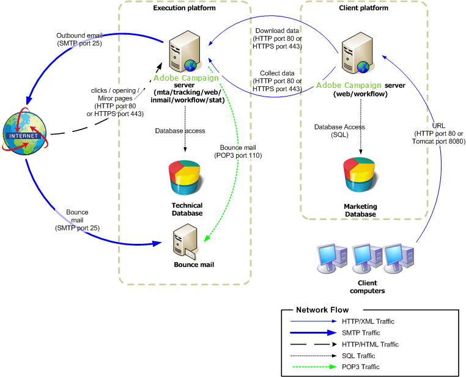

# Mid-Sourcing-Bereitstellung{#mid-sourcing-deployment}

Diese Konfiguration ist eine optimale Zwischenlösung zwischen einer gehosteten (ASP) Konfiguration und Internalisierung. Die nach außen gerichteten Ausführungskomponenten werden auf einem &quot;Mid-Sourcing&quot;-Server ausgeführt, der bei Adobe Campaign gehostet wird.

>[!NOTE]
>
>Um diese Art der Bereitstellung einzurichten, müssen Sie die entsprechende Option erwerben. Bitte überprüfen Sie Ihren Lizenzvertrag.

Die allgemeine Kommunikation zwischen Servern und Prozessen erfolgt gemäß dem folgenden Schema:

* Die Management-Module für Ausführung und Absprung sind in der Instanz deaktiviert.
* Die Anwendung ist so konfiguriert, dass eine Nachrichtenausführung auf einem Remote-Server mit mittlerer Quelle durchgeführt wird, der mit SOAP-Aufrufen (über HTTP oder HTTPS) angetrieben wird.

## Funktionen {#features}

### Vorteile {#advantages}

* Vereinfachte Serverkonfiguration: Es ist nicht erforderlich, dass der Kunde nach außen gerichtete Module (mta und inMail) konfiguriert.
* Eingeschränkte Nutzung der Bandbreite: Da die Ausführung vom Mid-Sourcing-Server erfolgt, ist nur eine ausreichende Bandbreite erforderlich, um Personalisierungsdaten an den Mid-Sourcing-Server zu senden.
* Hohe Verfügbarkeit ist kein internes Problem mehr: Das Problem wird auf den Mid-Sourcing-Server verschoben (Umleitung, Mirrorseiten, Ausführungsserver usw.).
* Die Firma wird nicht verlassen: Nur Daten, die zum Zusammenführen der Meldungen erforderlich sind, werden an den Mid-Sourcing-Server gesendet (dazu kann HTTPS verwendet werden).
* Diese Art der Bereitstellung kann eine Lösung für Architekturen mit hohem Volumen (viele Empfänger in der Datenbank) mit einem erheblichen Durchsatz an Versänden sein.

### Nachteile {#disadvantages}

* Leichte Verzögerung bei der Anzeige von Informationen zur Nachrichtenausführung und für die Funktionalität des Berichte aufgrund der Zeit, die benötigt wird, um Informationen vom Mid-Sourcing-Server zurückzuerhalten.
* Umfragen und Webformulare bleiben auf der Clientplattform erhalten.

### Empfohlene Ausrüstung {#recommended-equipment}

* Anwendungsserver: 2 GHz Quadcore-CPU, 4 GB RAM, Software RAID 1 80 GB SATA-Festplatte.
* Datenbankserver: 3 GHz-Kern-CPUs mit zwei Quadraten, mindestens 4 GB RAM, Hardware-RAID 10 15000RPM SAS-Festplatte, die Anzahl je nach Größe und erwarteter Leistung der Datenbank.

>[!NOTE]
>
>Umleitung und Mid-Sourcing sind separate Elemente, der Tracking-Server wird jedoch im Allgemeinen für die Mid-Sourcing-Server freigegeben.

## Installationsschritte und Konfigurationsschritte {#installation-and-configuration-steps-}

### Voraussetzungen {#prerequisites}

* JDK auf dem Anwendungsserver.
* Zugriff auf einen Datenbankserver auf dem Anwendungsserver.
* Firewall, die zum Öffnen von HTTP (80)- oder HTTPS (443)-Anschlüssen auf dem Mid-Sourcing-Server konfiguriert ist.

### Installieren und Konfigurieren (Mid-Sourcing-Bereitstellung) {#installing-and-configuring--mid-sourcing-deployment-}

Siehe [Mid-Sourcing-Server](../../installation/using/mid-sourcing-server.md).
