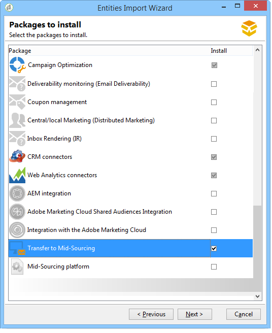

# Mid-Sourcing-Server{#mid-sourcing-server}


In diesem Abschnitt werden die Installation und Konfiguration eines Mid-Sourcing-Servers sowie die Bereitstellung einer Instanz beschrieben, die es Drittanbietern ermöglicht, Nachrichten in **Mid-Sourcing** -Modus.

Die Mid-Sourcing-Architektur wird im Abschnitt [Mid-Sourcing-Bereitstellung](../../installation/using/mid-sourcing-deployment.md).

Die Installation eines Mid-Sourcing-Servers erfolgt auf die gleiche Weise wie die normale Installation eines Servers (siehe Standardkonfiguration). Es handelt sich um eine unabhängige Instanz mit einer eigenen Datenbank, die für die Durchführung von Sendungen verwendet werden kann. Einfach ausgedrückt, enthält es eine zusätzliche Konfiguration, mit der Remote-Instanzen Sendungen im Mid-Sourcing-Modus ausführen können.

>[!CAUTION]
>
>Sobald der Mid-Sourcing-Server eingerichtet wurde und die [Synchronisations-Workflows](../../workflow/using/about-technical-workflows.md) zum ersten Mal ausgeführt haben, stellen Sie sicher, dass Sie den internen Namen der externen Mid-Sourcing-Konten nicht aktualisieren.

## Schritte zum Installieren und Konfigurieren einer Instanz {#steps-for-installing-and-configuring-an-instance}

### Voraussetzungen für die Installation und Konfiguration einer Instanz {#prerequisites-for-installing-and-configuring-an-instance}

* JDK auf dem Anwendungsserver.
* Zugriff auf einen Datenbankserver auf dem Anwendungsserver.
* Firewall konfiguriert, um HTTP (80)- oder HTTPS (443)-Ports zum Mid-Sourcing-Server zu öffnen.

Im folgenden Verfahren wird eine Konfiguration mit einem einzelnen Mid-Sourcing-Server beschrieben. Es ist auch möglich, mehrere Server zu verwenden. Ebenso ist es auch möglich, bestimmte Nachrichten (z. B. Workflow-Benachrichtigungen) aus einer internen Konfiguration zu senden.

### Installation und Konfiguration des Anwendungsservers für die Mid-Sourcing-Bereitstellung {#installing-and-configuring-the-application-server-for-mid-sourcing-deployment}

Das Installationsverfahren entspricht dem der eigenständigen Instanz. Siehe Abschnitt [Installation und Konfiguration (ein Computer)](../../installation/using/standalone-deployment.md#installing-and-configuring--single-machine-).

Sie müssen jedoch Folgendes anwenden:

* Schritt **5**, müssen Sie die **mta** (Versand) und **inMail** (Bounce Messages) -Modulen. Die **wfserver** (Workflow) aktiviert bleiben.

  ```
  <?xml version='1.0'?>
  <serverconf>  
    <shared>    
      <!-- add lang="eng" to dataStore to force English for the instance -->    
      <dataStore hosts="console.campaign.net*">      
        <mapping logical="*" physical="default"/>    
      </dataStore>  </shared>  
      <mta autoStart="false"/>  
      <wfserver autoStart="true"/>  
      <inMail autoStart="false"/>  
      <sms autoStart="false"/>  
      <listProtect autoStart="false"/>
  </serverconf>
  ```

  Weiterführende Informationen hierzu finden Sie in [diesem Abschnitt](../../installation/using/configuring-campaign-server.md#enabling-processes).

* Schritte **6**, **9** und **10** nicht erforderlich sind.
* Schritte **12** und **13** müssen Sie den 8080-Port in der Verbindungs-URL angeben (da die Konsole direkt mit Tomcat und nicht über den Webserver kommuniziert). Die URL wird zu `http://console.campaign.net:8080`. Schritt **13**, wählen Sie die **[!UICONTROL Problem bei Mid-Sourcing]** -Paket sowie die zu installierenden Pakete.

  

  >[!CAUTION]
  >
  >Das Standard-Routing technischer Sendungen wird automatisch durch E-Mail-Routing über Mid-Sourcing ersetzt.

### Mid-Sourcing-Server installieren und konfigurieren {#installing-and-configuring-the-mid-sourcing-server}

Suchen Sie in der Client-Konsole die **E-Mail-Routing mit Mid-Sourcing** Mid-Sourcing-Konto (im **/Administration/Externe Konten/** -Ordner). Füllen Sie die **URL des Servers**, **account**, **password** und **URL der Mirrorseite** Einstellungen mit den Informationen, die vom Server-Provider bereitgestellt werden, der den Mid-Sourcing-Server hostet. Testet die Verbindung

>[!NOTE]
>
>Die **mid-sourcingEmitter** Option erstellt zwei **Mid-Sourcing** Workflows. Dieser Prozess wird standardmäßig alle 1 Stunde und 20 Minuten ausgeführt und erfasst Versandinformationen auf dem Mid-Sourcing-Server.

## Bereitstellen eines Mid-Sourcing-Servers {#deploying-a-mid-sourcing-server}

1. Installieren des Anwendungsservers:

   >[!CAUTION]
   >
   >Wenn Sie den Mid-Sourcing-Server installieren und zusätzliche Adobe Campaign-Module installieren möchten, empfehlen wir die Verwendung des Versandmoduls und nicht des Campaign-Moduls.

   Gehen Sie wie bei der Standardbereitstellung vor und wählen Sie nur die **[!UICONTROL Mid-Sourcing-Plattform]** -Option.

   

1. Konfiguration für den Empfang im Mid-Sourcing-Modus

   Legen Sie das Passwort des Sendekontos fest: Im **/Mid-Sourcing/Access Management/Operatoren/** Ordner, die **mid** -Operator wird von der Remote-Instanz für Übermittlungen im Mid-Sourcing-Modus verwendet. Sie müssen ein Kennwort für diesen Benutzer festlegen und es dem Administrator der Sendeinstanz geben.

   Die **Mid-Sourcing-Plattform** erstellt die Standardordner für die Speicherung der gesendeten Sendungen und den Standardoperator für die Übermittlung.

## Multiplexing des Mid-Sourcing-Servers {#multiplexing-the-mid-sourcing-server}

>[!CAUTION]
>
>Multiplexing wird nur für On-Premise-Umgebungen unterstützt.

Es ist möglich, dass eine Mid-Sourcing-Instanz von mehreren Sendeinstanzen gemeinsam genutzt wird. Jede dieser Instanzen muss mit einem Benutzer in der Mid-Sourcing-Datenbank verknüpft werden. So erstellen Sie ein zweites Konto auf dem Mid-Sourcing-Server:

1. Erstellen Sie einen Ordner im **[!UICONTROL Mid-Sourcing > Sendungen]** -Knoten, der mit dem standardmäßigen Mid-Sourcing-Konto verknüpft wird (z. B. prod).
1. Erstellen Sie einen Ordner im **[!UICONTROL Mid-Sourcing > Sendungen]** Knoten mit demselben Namen wie das Konto (z. B.: accept_test).

   

1. In **[!UICONTROL Mid-Sourcing > Zugriffsverwaltung > Benutzer]**, erstellen Sie ein neues Konto.

   

1. Im **[!UICONTROL Zugriffsberechtigungen]** dem Benutzer die Rechte der **Mid-Sourcing-Übermittlungen** hinzugefügt. Diese Zugriffsberechtigung ist verfügbar unter **[!UICONTROL Mid-Sourcing > Zugriffsverwaltung > Benutzergruppen]**.

   

1. Wählen Sie die **[!UICONTROL Beschränken Sie sich auf Daten in den Unterordnern von]** und wählen Sie den Ordner Sendungen aus, um diesen Benutzer auf den Ordner Mid-Sourcing-Sendungen zu beschränken.

   

1. Starten Sie das Webmodul mit dem folgenden Befehl neu: **nlserver Neustart Web**.

Sie müssen die Mid-Sourcing-Server-Einstellung in der Datei serverConf.xml ändern. Die folgende Zeile muss im Abschnitt &quot;Verwaltung von Affinitäten mit IP-Adressen&quot;unter der vorhandenen Zeile hinzugefügt werden:

```
<IPAffinity IPMask="" localDomain="" name=""/>
```

Das Attribut &#39;@name&#39; muss die folgenden Regeln beachten:

**&#39;marketing_account_operator_name&#39;.&#39;affinity_name&#39;.&#39;affinity_group&#39;**

&#39;marketing_account_operator_name&#39; bezieht sich auf den internen Namen des Mid-Sourcing-Kontos, der in der Mid-Sourcing-Instanz deklariert wurde.

&#39;affinity_name&#39; bezieht sich auf den willkürlichen Namen, der der Affinität gegeben wird. Dieser Name muss eindeutig sein. Zulässige Zeichen sind `[a-z]``[A-Z]``[0-9]`. Ziel ist es, eine Gruppe öffentlicher IP-Adressen zu deklarieren.

&#39;affinity_group&#39; bezieht sich auf die Subaffinität, die im Zielgruppen-Mapping deklariert wurde, das in jedem Versand verwendet wird. Der letzte Teil, der &quot;.&quot;enthält wird ignoriert, wenn keine Unter-Affinität vorhanden ist. Zulässige Zeichen sind `[a-z]``[A-Z]``[0-9]`.

Sie müssen den Server anhalten und dann neu starten, damit die Änderung übernommen wird.

## Tracking auf einem Mid-Sourcing-Server konfigurieren {#configuring-tracking-on-a-mid-sourcing-server}

**Mid-Sourcing-Server konfigurieren**

1. Markieren Sie im Explorer den Operator **[!UICONTROL mid]**.
1. Im **[!UICONTROL Frontalserver]** Geben Sie die Verbindungsparameter des Tracking-Servers ein.

   Um eine Tracking-Instanz zu erstellen, geben Sie die URL des Tracking-Servers, das Passwort des internen Trackingservers und den Namen der Instanz, ihr Passwort und die damit verknüpften DNS-Masken ein.

   

1. Klicken Sie nach Eingabe der Verbindungsparameter auf **[!UICONTROL Konfiguration bestätigen]**.
1. Geben Sie bei Bedarf den Speicherort an, an dem die in Sendungen enthaltenen Bilder gespeichert werden sollen. Wählen Sie dazu einen der Veröffentlichungsmodi aus der Dropdown-Liste aus.

   

   Wenn Sie die **[!UICONTROL Tracking-Server]** -Option, werden die Bilder auf den Mid-Sourcing-Server kopiert.

**Konfiguration der Kundenplattform**

1. Gehen Sie zum externen Mid-Sourcing-Routing-Konto.
1. Im **[!UICONTROL Mid-Sourcing]** auf, geben Sie die Mid-Sourcing-Server-Verbindungsparameter an.

   

1. Bestätigen Sie Ihre Konfiguration durch Klicken auf **[!UICONTROL Verbindung testen]**.
1. Deklarieren Sie die auf dem Mid-Sourcing-Server referenzierte Tracking-Instanz:

   Klicken Sie auf den Link **[!UICONTROL Verwenden Sie diese Plattform als Proxy für den Zugriff auf Tracking-Server]**,

   Geben Sie den Namen der Tracking-Instanz an und bestätigen Sie dann die Verbindung mit dem Tracking-Server.

   

Wenn der Nachrichtenversand von mehreren Mid-Sourcing-Servern verwaltet werden soll, wählen Sie die Option **[!UICONTROL Routing mit abwechselnden Mid-Sourcing-Konten]** und geben Sie die verschiedenen Server an.


