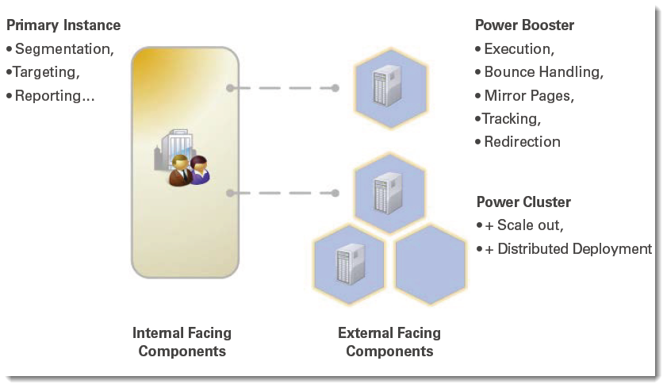

# Power Booster und Power Cluster{#power-booster-and-power-cluster}

## Übersicht {#overview}

Adobe Campaign bietet zwei vorkonfigurierte Architekturoptionen für die Dimensionierung Ihrer Bereitstellung:

* **Power Booster**

  Diese Option bietet Unterstützung für eine einzelne zusätzliche Ausführungsinstanz, die von der primären Adobe Campaign-Anwendungsinstanz entkoppelt ist. Dedizierte Ausführungsinstanzen können remote oder von einem Dritten gehostet werden. Nach der Implementierung werden E-Mail-Ausführung, Tracking, Mirror-Seiten und Bounce-Nachrichten unabhängig von den zentralen Anwendungsfunktionen verarbeitet.

* **Power Cluster**

  Diese Option bietet Unterstützung für 2 bis N geclusterte Ausführungsinstanzen, die von der primären Adobe Campaign-Anwendungsinstanz in Bezug auf eine bestimmte Anwendung entkoppelt sind. Cluster können remote, in verteilten Bereitstellungen und von Dritten gehostet werden. Zusätzlich zu den Vorteilen der Prozessisolierung ermöglicht die Option Adobe Campaign Power Cluster Redundanz- und Scale-Out-Strategien mit Standard-Hardware für eine vereinfachte Weiterentwicklung von SLA oder Performance.

## Geeignete Anwendungen {#eligible-applications}

Die Optionen „Power Booster“ und „Power Cluster“ können von den folgenden Anwendungen verwendet werden:

* Campaign
* Versand
* Message Center

## Matrix von Architekturempfehlungen {#matrix-of-architectural-recommendations}

<table> 
 <tbody> 
  <tr> 
   <td> </td> 
   <td> <strong>Standardarchitektur</strong>  </td> 
   <td> <strong>Power Booster</strong>  </td> 
   <td> <strong>Power Cluster</strong>  </td> 
  </tr> 
  <tr> 
   <td> E-Mail-Kampagnen und ausgehende Interaktionen  </td> 
   <td> Bis zu 30 Millionen E-Mails pro Monat  </td> 
   <td> 30 bis 100 Millionen E-Mails pro Monat  </td> 
   <td> Über 100 Millionen E-Mails pro Monat  </td> 
  </tr> 
  <tr> 
   <td> Transaktionsnachrichten  </td> 
   <td> 50.000 pro Stunde und Ausführungsserver  </td> 
   <td> 50.000 pro Stunde und Ausführungsserver  </td> 
   <td> 50.000 pro Stunde und Ausführungsserver  </td> 
  </tr> 
  <tr> 
   <td> Verfügbarkeit  </td> 
   <td> Die der primären Datenbank  </td> 
   <td> 24/7 außer Wartungsfenstern und Ausfallzeiten für die Ausführungsinstanz  </td> 
   <td> 24/7/365 Service möglich  </td> 
  </tr> 
  <tr> 
   <td>   </td> 
   <td> Data Mart ist potenziell über das öffentliche Internet zugänglich  </td> 
   <td> Data Mart ist von frontalen, auf das Internet ausgerichteten Komponenten isoliert  </td> 
   <td> Data Mart ist von frontalen, auf das Internet ausgerichteten Komponenten isoliert  </td> 
  </tr> 
  <tr> 
   <td> Bereitstellungsvorlage  </td> 
   <td> Alles auf einer Site (kann On-Premise oder in der Cloud sein)  </td> 
   <td> Marketing On-Premise mit Ausführung in der Cloud möglich  </td> 
   <td> Marketing On-Premise mit Ausführung in der Cloud; Ausführung in verschiedenen Orten möglich  </td> 
  </tr> 
 </tbody> 
</table>

## Empfehlungen {#recommendations}

* Eine Ausführungsinstanz muss einem Service vorbehalten sein. Sie können kein Paket für einen Dienst installieren, den Sie nicht abonniert haben. Wenn Sie beispielsweise die Option **Power Booster** für den Service **Message Center** abonnieren, können Sie das Package **[!UICONTROL Ausführung von Transaktionsnachrichten]** nur auf der dedizierten Ausführungsinstanz installieren. Prüfen Sie diesbezüglich Ihren Lizenzvertrag.
* Da dedizierte Instanzen (oder Cluster) Adobe Campaign-Instanzen sind, sind die Empfehlungen dieselben wie für eine Hauptinstanz. Weiterführende Informationen hierzu finden Sie in [diesem Dokument](../../production/using/foreword.md).
* Wenden Sie sich an Adobe Campaign Professional Services, um die Instanz aus Sicht der Datenbank-/Hardwarekomponenten ordnungsgemäß zu konfigurieren.
