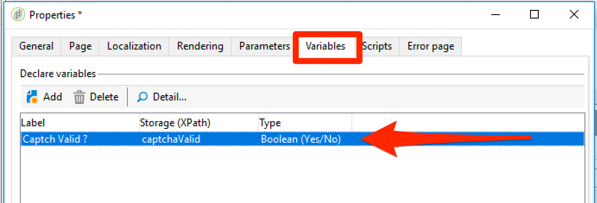

# Richtlinien für Script-Erstellung und Codierung {#scripting-coding-guidelines}


## Scripts

Weiterführende Informationen finden Sie in der [JSAPI-Dokumentation für Campaign](https://experienceleague.adobe.com/developer/campaign-api/api/index.html?lang=de).

Wenn Sie Scripts mit Workflows, Webanwendungen und JSSP verwenden, folgen Sie diesen Best Practices:

* Vermeiden Sie möglichst SQL-Anweisungen.

* Verwenden Sie bei Bedarf parametrierte Funktionen (prepare-Anweisung) anstelle von String-Konkatenation.

  Ungültige Praxis:

  ```
  sqlGetInt( "select iRecipientId from NmsRecipient where sEmail ='" + request.getParameter('email') +  "'  limit 1" )
  ```

  Bewährte Verfahren:

  ```
  sqlGetInt( "select iRecipientId from NmsRecipient where sEmail = $(sz) limit 1", request.getParameter('email'));
  ```

  >[!IMPORTANT]
  >
  >sqlSelect unterstützt diese Funktion nicht. Daher müssen Sie die Abfragefunktion der DBEngine-Klasse verwenden:

  ```
  var cnx = application.getConnection()
  var stmt = cnx.query("SELECT sFirstName, sLastName FROM NmsRecipient where sEmail = $(sz)", request.getParameter('email'))
  for each(var row in stmt) logInfo(row[0] + " : " + row[1])
  cnx.dispose()
  ```

Um SQL-Injections zu vermeiden, müssen SQL-Funktionen zu der in Adobe Campaign zu verwendenden Zulassungsliste hinzugefügt werden. Nachdem sie der Zulassungsliste hinzugefügt wurden, werden sie für Ihre Operatoren im Ausdruckseditor sichtbar. Mehr dazu erfahren Sie auf [dieser Seite](../../configuration/using/adding-additional-sql-functions.md).

>[!IMPORTANT]
>
>Wenn Sie einen Build verwenden, der älter als 8140 ist, kann **Option „XtkPassUnknownSQLFunctionsToRDBMS** auf „1“ festgelegt werden. Wenn Sie Ihre Datenbank schützen möchten, löschen Sie diese Option (oder setzen Sie sie auf „0„).

Wenn Sie Benutzereingaben zum Erstellen von Filtern in Abfragen oder SQL-Anweisungen verwenden, müssen Sie diese immer mit Escape-Zeichen versehen (siehe [Campaign JSAPI-Dokumentation](https://experienceleague.adobe.com/developer/campaign-api/api/index.html?lang=de) - Datenschutz: Escaping-Funktionen). Diese Funktionen sind:

* NL.XML.escape(data)
* NL.SQL.escape(data)
* NL.JS.escape(data)
* NL.XML.escapeAttribute(data)

## Schutz Ihres neuen Datenmodells

### Ordnerbasis

Mehr dazu erfahren Sie auf diesen Seiten:

* [Ordnerzugriffseigenschaften](../../platform/using/access-management.md)
* [Verknüpfte Ordner](../../configuration/using/configuration.md#linked-folder)

### Spezifische Berechtigungen

Zusätzlich zum ordnerbasierten Sicherheitsmodell können Sie Benutzeraktionen auch mit spezifischen Berechtigungen einschränken:

* Sie können einige Systemfilter (sysFilter) hinzufügen, um das Lesen/Schreiben Ihrer Daten zu verhindern (siehe [diese Seite](../../configuration/using/filtering-schemas.md)).

  ```
  <sysFilter name="writeAccess">    
      <condition enabledIf="hasNamedRight('myNewRole')=false" expr="FALSE"/>  
  </sysFilter>
  ```

* Sie können auch einige Aktionen (SOAP-Methode) schützen, die in Schemata definiert sind. Legen Sie einfach das Zugriffsattribut mit der entsprechenden spezifischen Berechtigung als Wert fest.

  ```
  <method name="grantVIPAccess" access="myNewRole">
      <parameters>
  ...
      </parameters>
  </method>
  ```

  Weitere Informationen hierzu finden Sie auf [dieser Seite](../../configuration/using/implementing-soap-methods.md).

>[!IMPORTANT]
>
>Sie können spezifische Berechtigungen im Befehlsknoten in einem Navigationsbaum verwenden. Es bietet ein besseres Benutzererlebnis, bietet jedoch keinen Schutz (verwenden Sie nur die Client-Seite, um sie auszublenden/zu deaktivieren). Sie müssen das Zugriffsattribut verwenden.

### Überlauftabelle

Wenn Sie vertrauliche Daten (Teil eines Schemas) je nach Zugriffsebene des Benutzers schützen müssen, blenden Sie diese nicht in der Formulardefinition aus (enabledIf/visibleIf-Bedingungen).

Die vollständige Entität wird vom Bildschirm geladen. Sie können sie auch in der Spaltendefinition anzeigen. Dazu müssen Sie eine Überlauftabelle erstellen. Siehe [diese Seite](../../configuration/using/examples-of-schemas-edition.md#overflow-table).

## Hinzufügen von Captchas in Webanwendungen

Es ist empfehlenswert, öffentlichen Landingpages und Anmeldeseiten ein Captcha hinzuzufügen. Leider ist dies in DCE-Seiten (Digital Content Editor) nicht einfach. Wir zeigen Ihnen, wie Sie ein v5 Captcha oder ein Google reCAPTCHA hinzufügen.

Im Allgemeinen können Sie ein CAPTCHA im DCE hinzufügen, indem Sie einen Gestaltungsbaustein erstellen, um ihn einfach in den Seiteninhalt einzufügen. Sie müssen eine &quot;**&quot;-Aktivität** einen &quot;**&quot;**.

### Gestaltungsbaustein

1. Gehen Sie zu **[!UICONTROL Ressourcen]** > **[!UICONTROL Kampagnenverwaltung]** > **[!UICONTROL Gestaltungsbausteine]** und erstellen Sie einen neuen Gestaltungsbaustein.

1. Verwenden Sie den **[!UICONTROL Webanwendung]** Inhaltstyp und aktivieren Sie **[!UICONTROL In den Anpassungsmenüs sichtbar]**.

   Weitere Informationen dazu finden Sie auf [dieser Seite](../../delivery/using/personalization-blocks.md).

   Dies ist ein Beispiel für ein **Kampagnen-Captcha**:

   ```javascript
   <%
   var captchaID = CaptchaIDGen();
   %>
   &width=200&height=50&minWordSize=8&maxWordSize=8"/>
   <input id="captchaValue" name="captchaValue" <%= String(ctx.vars.captchaValid) === "false" ? class="ui-state-error" : "" %>>
   <input type="hidden" name="captchaID" value="<%=captchaID%>"/>
   <%
   if( serverForm.isInputErroneous("captchaValue") ) {
   %>
   <script type="text/javascript"> 
   $("#captchaValue").addClass("ui-state-error")
   </script>
   <%
   }
   %>
   ```

   * Mit den Zeilen 1 bis 6 werden alle erforderlichen Eingaben erzeugt.
   * Mit den Zeilen 7 bis zum Ende werden Fehler gehandhabt.
   * In Zeile 4 können Sie die Größe des grauen Captcha-Feldes (Breite/Höhe) und die Länge des generierten Worts (minWordSize/maxWordSize) ändern.
   * Vor der Verwendung von Google reCAPTCHA müssen Sie sich bei Google registrieren und eine neue reCAPTCHA-Site erstellen.

     `<div class="g-recaptcha" data-sitekey="YOUR_SITE_KEY"></div>`

   Sie sollten die Validierungs-Schaltfläche deaktivieren können, aber da wir keine Standardschaltfläche/keinen Standardlink haben, ist es besser, dies auf der HTML selbst zu tun. Informationen hierzu finden Sie auf [dieser Seite](https://developers.google.com/recaptcha/).

### Webanwendung aktualisieren

1. Greifen Sie auf die Eigenschaften Ihrer Web-Anwendung zu, um eine boolesche Variable mit dem Namen **captchaValid** hinzuzufügen.

   

1. Fügen Sie zwischen der letzten Seite und der **[!UICONTROL Speicher]**-Aktivität ein **[!UICONTROL Script]** und einen **[!UICONTROL Test]** hinzu.

   Schließen Sie die Verzweigung **[!UICONTROL True]** an **[!UICONTROL Storage]** und die andere an die Seite an, die das Captcha enthält.

   

1. Bearbeiten Sie die Bedingung der Verzweigung True , wenn `"[vars/captchaValid]"` True gleich True ist.

   

1. Bearbeiten Sie die **[!UICONTROL Script]**-Aktivität. Der Inhalt hängt von der ausgewählten CAPTCHA-Engine ab.

1. Schließlich können Sie Ihren personalisierten Block auf der Seite hinzufügen: siehe [diese Seite](../../web/using/editing-content.md).

   

   

>[!IMPORTANT]
>
>Für die reCAPTCHA-Integration müssen Sie Client-seitige JavaScript auf der HTML hinzufügen (in `<head>...</head>`):
>
>`<script src="https://www.google.com/recaptcha/api.js" async defer></script>`

### Campaign Captcha

```javascript
var captchaID = request.getParameter("captchaID");
var captchaValue = request.getParameter("captchaValue");
  
if( !CaptchaValidate(captchaID, captchaValue) ) {
  serverForm.logInputError("captchaValue",
                           "The characters you typed for the captcha must match the image ones.",
                           "captchaValue")
  ctx.vars.captchaValid = false
}
else
  ctx.vars.captchaValid = true
```

Zeile 6: Sie können eine beliebige Fehlermeldung eingeben.

### Google reCAPTCHA

Siehe die [offizielle Dokumentation](https://developers.google.com/recaptcha/docs/verify).

```javascript
ctx.vars.captchaValid = false
var gReCaptchaResponse = request.getParameter("g-recaptcha-response");
  
// Call reCaptcha API to validate it
var req = new HttpClientRequest("https://www.google.com/recaptcha/api/siteverify")
req.method = "POST"
req.header["Content-Type"] = "application/x-www-form-urlencoded"
req.body = "secret=YOUR_SECRET_HERE&response=" + encodeURIComponent(gReCaptchaResponse)
req.execute()
var response = req.response
if( response.code == 200 ) {
  captchaRes = JSON.parse(response.body.toString(response.codePage));
  ctx.vars.captchaValid = captchaRes.success
}
  
if( ctx.vars.captchaValid == false ) {
  serverForm.logInputError("reCaptcha",
                           "Please validate the captcha",
                           "reCaptcha")
  logInfo("reCaptcha not validated")
}
```

Um JSON.parse zu verwenden, müssen Sie &quot;shared/json2.js&quot; in Ihre Webapp integrieren:


Auf die Zulassungsliste setzen Um die Verifizierungs-API-URL verwenden zu können, müssen Sie sie seit Build 8797 der Datei &quot;&quot; in der Datei „serverConf“ hinzufügen, indem Sie im Knoten „urlPermission“ hinzufügen:

`<url dnsSuffix="www.google.com" urlRegEx="https://www.google.com/recaptcha/api/siteverify"/>`
