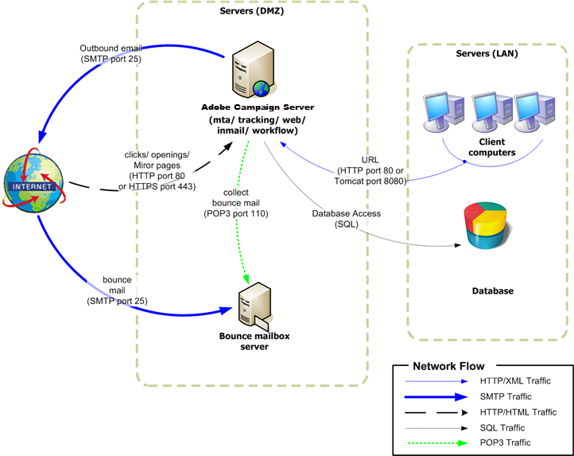

# Eigenständige Bereitstellung{#standalone-deployment}

Diese Konfiguration umfasst alle Komponenten auf demselben Computer:

* Antragsprozess (Web),
* versand (Metadaten),
* Umleitungsprozess (Verfolgung),
* Workflow-Prozess und geplante Aufgaben (wfserver),
* Absprung-Mail-Prozess (inMail),
* statistischer Prozess (STAT).

Die Gesamtkommunikation zwischen den Prozessen erfolgt nach folgendem Schema:



Diese Art der Konfiguration kann bei der Verwaltung von Listen mit weniger als 100.000 Empfängern und beispielsweise mit den folgenden Softwareschichten ausgeführt werden:

* Linux,
* Apache,
* PostgreSQL,
* Qmail.

Mit zunehmendem Volumen wird der Datenbankserver durch eine Variante dieser Architektur auf einen anderen Computer übertragen, um die Leistung zu verbessern.

>[!NOTE]
>
>Ein bestehender Datenbankserver kann auch verwendet werden, wenn er über ausreichende Ressourcen verfügt.

## Funktionen {#features}

### Vorteile {#advantages}

* Vollständig eigenständige und niedrige Konfigurationskosten (keine abrechnungsfähigen Lizenzen erforderlich, wenn die unten aufgeführte Open-Source-Software verwendet wird).
* Vereinfachte Installation und Netzwerkkonfiguration.

### Nachteile {#disadvantages}

* Ein kritischer Computer im Falle eines Vorfalls.
* Begrenzte Bandbreite bei der Übertragung von Nachrichten (nach unserer Erfahrung etwa mehrere zehntausend Mails pro Stunde).
* Potenzielle Verlangsamung der Anwendung bei der Übertragung.
* Der Anwendungsserver muss von außen verfügbar sein (z. B. während er sich in der DMZ befindet), da er den Umleitungsserver hostet.

## Installationsschritte und Konfigurationsschritte {#installation-and-configuration-steps}

### Voraussetzungen {#prerequisites}

* JDK,
* Webserver (IIS, Apache),
* Zugriff auf einen Datenbankserver,
* Absprungkasten, der über POP3 erreichbar ist,
* Erstellung von zwei DNS-Aliasen:

   * die erstmalige Exposition gegenüber der Öffentlichkeit zur Verfolgung und zum Hinweis auf den Computer über sein öffentliches IP;
   * der zweite Alias, der internen Benutzern für den Konsolenzugriff zur Verfügung steht und auf denselben Computer verweist.

* Firewall zum Öffnen von SMTP (25), DNS (53), HTTP (80), HTTPS (443), SQL (1521 für Oracle, 5432 für PostgreSQL usw.) Ports. Weitere Informationen finden Sie unter [Netzwerkkonfiguration](../../installation/using/network-configuration.md).

In den folgenden Beispielen sind die Parameter der Instanz:

* Name der Instanz: **demo**
* DNS-Maske: **console.Kampagne.net*** (nur für Client-Konsolenverbindungen und für Berichte)
* Datenbank: **kampagne:demo@dbsrv**

### Installieren und Konfigurieren (Einzelcomputer) {#installing-and-configuring--single-machine-}

Gehen Sie wie folgt vor:

1. Befolgen Sie die Installationsanweisungen für den Adobe Campaign-Server: **nlserver** -Paket unter Linux oder **setup.exe** unter Windows.

   Weitere Informationen dazu finden Sie unter [Voraussetzungen für die Installation der Kampagne unter Linux](../../installation/using/prerequisites-of-campaign-installation-in-linux.md) (Linux) und [Voraussetzungen für die Kampagne unter Windows](../../installation/using/prerequisites-of-campaign-installation-in-windows.md) (Windows).

1. Sobald der Adobe Campaign-Server installiert ist, führen Sie einen Beginn des Anwendungsservers (Web) mit dem Befehl **nlserver web -tomcat** durch (das Webmodul ermöglicht Ihnen, den Beginn von Tomcat im eigenständigen Webservermodus, der auf Port 8080 überwacht, durchzuführen) und stellen Sie sicher, dass die Tomcat-Beginn korrekt sind:

   ```
   12:08:18 >   Application server for Adobe Campaign Classic (7.X YY.R build XXX@SHA1) of DD/MM/YYYY
   12:08:18 >   Starting Web server module (pid=28505, tid=-1225184768)...
   12:08:18 >   Tomcat started
   12:08:18 >   Server started
   ```

   >[!NOTE]
   >
   >Beim ersten Ausführen des Webmoduls werden die Dateien &quot; **config-default.xml** &quot;und &quot; **serverConf.xml** &quot;im Ordner &quot; **conf** &quot;im Installationsordner erstellt. Alle in der Datei **serverConf.xml** verfügbaren Parameter sind in diesem [Abschnitt](../../installation/using/the-server-configuration-file.md)aufgeführt.

   Drücken Sie **Strg+C** , um den Server zu beenden.

   Weitere Informationen finden Sie in den folgenden Abschnitten:

   * Für Linux: [Erster Beginn des Servers](../../installation/using/installing-packages-with-linux.md#first-start-up-of-the-server),
   * Windows: [Erster Beginn des Servers](../../installation/using/installing-the-server.md#first-start-up-of-the-server).

1. Ändern Sie das **interne** Kennwort mithilfe des Befehls:

   ```
   nlserver config -internalpassword
   ```

   For more on this, refer to [Internal identifier](../../installation/using/campaign-server-configuration.md#internal-identifier).

1. Erstellen Sie die **Demo** -Instanz mit den DNS-Masken zur Verfolgung (in diesem Fall **tracking.Kampagne.net**) und Zugriff auf Client-Konsolen (in diesem Fall **console.Kampagne.net**). Es gibt zwei Möglichkeiten, dies zu tun:

   * Erstellen Sie die Instanz über die Konsole:

      

      Weitere Informationen finden Sie unter [Erstellen einer Instanz und Anmelden](../../installation/using/creating-an-instance-and-logging-on.md).

      oder

   * Erstellen Sie die Instanz mithilfe der Befehlszeilen:

      ```
      nlserver config -addinstance:demo/tracking.campaign.net*,console.campaign.net*
      ```

      For more on this, refer to [Creating an instance](../../installation/using/command-lines.md#creating-an-instance).

1. Bearbeiten Sie die Datei &quot; **config-demo.xml** &quot;(die im vorherigen Schritt neben &quot; **config-default.xml**&quot;erstellt wurde) und stellen Sie sicher, dass die Prozesse &quot; **mta** &quot;(Versand), &quot; **wfserver** &quot;(Workflow), &quot; **inMail&quot;(Absprungmails) und &quot;** InMail **** &quot;aktiviert sind. Konfigurieren Sie dann die Adresse des Statistikservers:

   ```
   <?xml version='1.0'?>
   <serverconf>  
     <shared>    
       <!-- add lang="eng" to dataStore to force English for the instance -->    
       <dataStore hosts="tracking.campaign.net*,console.campaign.net*">      
         <mapping logical="*" physical="default"/>    
       </dataStore>  </shared>  
       <mta autoStart="true" statServerAddress="localhost"/>
       <wfserver autoStart="true"/>  
       <inMail autoStart="true"/>  
       <sms autoStart="false"/>  
       <listProtect autoStart="false"/>
   </serverconf>
   ```

   For more on this, refer to [Enabling processes](../../installation/using/campaign-server-configuration.md#enabling-processes).

1. Bearbeiten Sie die **Datei &quot;serverConf.xml** &quot;und geben Sie die Domäne des Versands an. Geben Sie dann die IP- (oder Host-)Adressen der DNS-Server an, die vom MTA-Modul verwendet werden, um die DNS-Abfragen des MX-Typs zu beantworten.

   ```
   <dnsConfig localDomain="campaign.com" nameServers="192.0.0.1, 192.0.0.2"/>
   ```

   >[!NOTE]
   >
   >Der Parameter **nameServers** wird nur unter Windows verwendet.

   For more on this, refer to [Campaign server configuration](../../installation/using/campaign-server-configuration.md).

1. Kopieren Sie das Programm zum Einrichten der Clientkonsole (**setup-client-7.XX**, **YYYY.exe** für v7 oder **setup-client-6.XX**, **YYYY.exe** für v6.1) in den Ordner **/datakit/nl/eng/jsp** .

   Weitere Informationen finden Sie in den folgenden Abschnitten:

   * Für Linux: [Client-Konsolenverfügbarkeit unter Linux](../../installation/using/client-console-availability-for-linux.md)
   * Windows: [Client-Konsolenverfügbarkeit für Windows](../../installation/using/client-console-availability-for-windows.md)

1. Folgen Sie dem Webserver-Integrationsverfahren (IIS, Apache), das in den folgenden Abschnitten beschrieben wird:

   * For Linux: [Integration into a Web server for Linux](../../installation/using/integration-into-a-web-server-for-linux.md)
   * For Windows: [Integration into a Web server for Windows](../../installation/using/integration-into-a-web-server-for-windows.md)

1. Beginn der Website und Testumleitung mithilfe der URL: https://tracking.campaign.net/r/test.

   Der Browser muss die folgende Meldung anzeigen:

   ```
   <redir status="OK" date="AAAA/MM/JJ HH:MM:SS" build="XXXX" host="tracking.campaign.net" localHost="localhost"/>
   ```

   Weitere Informationen finden Sie in den folgenden Abschnitten:

   * Für Linux: [Webserver starten und Konfiguration testen](../../installation/using/integration-into-a-web-server-for-linux.md#launching-the-web-server-and-testing-the-configuration)
   * Windows: [Webserver starten und Konfiguration testen](../../installation/using/integration-into-a-web-server-for-windows.md#launching-the-web-server-and-testing-the-configuration)

1. Beginn des Adobe Campaign-Servers (**net Beginn nlserver6** in Windows, **/etc/init.d/nlserver6 Beginn** in Linux) und führen Sie den Befehl **nlserver pdump** erneut aus, um zu überprüfen, ob alle aktivierten Module vorhanden sind.

   >[!NOTE]
   >
   >Ab 20.1 wird empfohlen, stattdessen den folgenden Befehl zu verwenden (für Linux): **systemctl Beginn nlserver**

   ```
   12:09:54 >   Application server for Adobe Campaign Classic (7.X YY.R build XXX@SHA1) of DD/MM/YYYY
   syslogd@default (7611) - 9.2 MB
   stat@demo (5988) - 1.5 MB
   inMail@demo (7830) - 11.9 MB
   watchdog (27369) - 3.1 MB
   mta@demo (7831) - 15.6 MB
   wfserver@demo (7832) - 11.5 MB
   web@default (28671) - 40.5 MB
   ```

   Mit diesem Befehl können Sie auch die Versionsnummer und die Build-Nummer des auf dem Adobe Campaign installierten Servers kennen.

1. Testen Sie das **nlserver-Webmodul** unter Verwendung der URL: https://console.campaign.net/nl/jsp/logon.jsp

   Mit dieser URL können Sie auf die Downloadseite für das Client-Setup-Programm zugreifen.

   Geben Sie die **interne** Anmeldung und das zugehörige Kennwort ein, wenn Sie die Seite &quot;Zugriffskontrolle&quot;aufrufen.

   

   Weitere Informationen finden Sie in den folgenden Abschnitten:

   * Für Linux: [Client-Konsolenverfügbarkeit unter Linux](../../installation/using/client-console-availability-for-linux.md)
   * Windows: [Client-Konsolenverfügbarkeit für Windows](../../installation/using/client-console-availability-for-windows.md)

1. Beginn der Adobe Campaign-Client-Konsole (von der vorherigen Downloadseite oder bei einer Windows-Installation direkt auf dem Server gestartet), stellen Sie die Server-Verbindungs-URL auf https://console.campaign.net ein und stellen Sie mithilfe der **internen** Anmeldung eine Verbindung her.

   Weitere Informationen finden Sie unter [Erstellen einer Instanz und Anmelden](../../installation/using/creating-an-instance-and-logging-on.md) und [Interne ID](../../installation/using/campaign-server-configuration.md#internal-identifier).

   Der Assistent zum Erstellen der Datenbank wird angezeigt, wenn Sie sich zum ersten Mal anmelden:

   

   Führen Sie die Schritte im Assistenten aus und erstellen Sie die mit der Verbindungsinstanz verknüpfte Datenbank.

   For more on this, refer to [Creating and configuring the database](../../installation/using/creating-and-configuring-the-database.md).

   Sobald die Datenbank erstellt wurde, melden Sie sich ab.

1. Melden Sie sich mit der **Admin** -Anmeldung ohne Kennwort wieder bei der Client-Konsole an und Beginn Sie mit dem Implementierungsassistenten (&quot; **[!UICONTROL Extras&quot;> &quot;Erweitertes]** Menü&quot;), um die Konfiguration der Instanz abzuschließen.

   For more on this, refer to [Deploying an instance](../../installation/using/deploying-an-instance.md).

   Die folgenden Hauptparameter sind festzulegen:

   * E-Mail-Versand: Absender- und Antwortadressen und das Fehlerpostfach für Absprungmail.
   * Verfolgung: Füllen Sie die externe URL, die für die Umleitung verwendet wird, und die interne URL, klicken Sie auf **Registrierung auf dem/den Tracking-Server(en)** und validieren Sie sie dann in der **Demo** -Instanz des Tracking-Servers.

      For more on this, refer to [Tracking configuration](../../installation/using/deploying-an-instance.md#tracking-configuration).

      

      Da der Adobe Campaign-Server sowohl als Anwendungsserver als auch als Umleitungsserver verwendet wird, ist die zur Erfassung von Trackinglogs und Transfer-URLs verwendete interne URL eine direkte interne Verbindung zu Tomcat (https://localhost:8080).

   * Absprungverwaltung: Geben Sie die Parameter für die Verarbeitung der Absprungmail ein (berücksichtigen Sie nicht den Abschnitt **Unverarbeitete Absprungmeldungen** ).
   * Zugriff von: Geben Sie die beiden URLs für Berichte, Webformulare und Mirrorseiten an.

      

