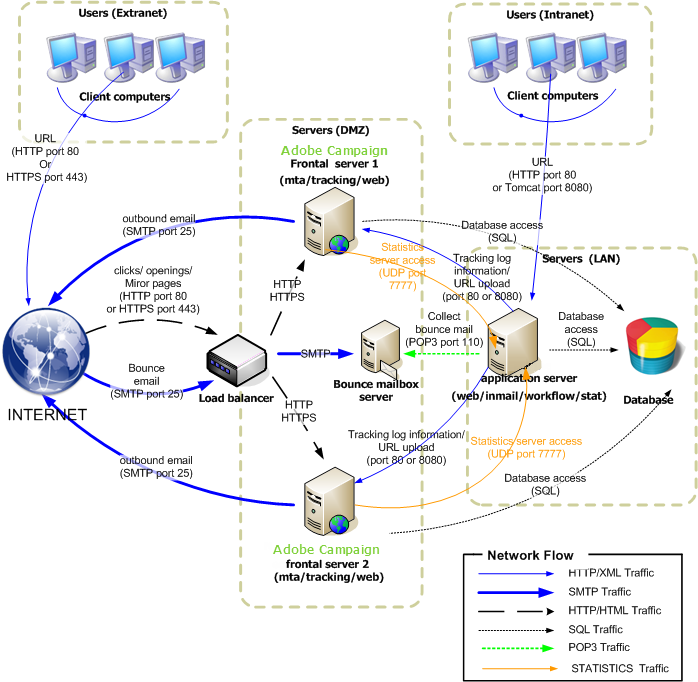

# Standardbereitstellung{#standard-deployment}

Für diese Konfiguration sind drei Computer erforderlich:

* Ein Anwendungsserver im LAN für die Endbenutzer (Vorbereitung von Kampagnen, Berichterstellung usw.),
* Zwei frontale Server in der DMZ hinter einem Lastenausgleich.

Die beiden Server im DMZ verarbeiten Tracking, Spiegelseiten und Auslieferung und sind für hohe Verfügbarkeit redundant.

Der Anwendungsserver im LAN dient den Endbenutzern und führt alle wiederkehrenden Prozesse (Workflow-Engine) durch. Wenn also Spitzenlasten auf den Frontservern erreicht werden, sind die Anwendungsbenutzer nicht betroffen.

Der Datenbankserver kann auf einem anderen Computer als diesen drei gehostet werden. Andernfalls ist es Sache des Anwendungsservers und des Datenbankservers, denselben Computer im LAN freizugeben, solange das Betriebssystem von Adobe Campaign (Linux oder Windows) unterstützt wird.

Die allgemeine Kommunikation zwischen Servern und Prozessen erfolgt gemäß dem folgenden Schema:



Diese Konfiguration kann eine große Anzahl von Empfängern (500.000 bis 1.000.000) verarbeiten, da der Datenbankserver (und die verfügbare Bandbreite) der Hauptbegrenzungsfaktor ist.

## Funktionen {#features}

### Vorteile {#advantages}

* Failover-Funktion: die Möglichkeit, Prozesse bei Hardwareproblemen auf einem anderen Computer zu wechseln.
* Bessere Gesamtleistung, da die MTA- und Umleitungsfunktionen auf beiden Computern hinter einem Lastenausgleich bereitgestellt werden können. Mit zwei aktiven MTAs und ausreichender Bandbreite ist es möglich, Übertragungsraten von etwa 100.000 Mails pro Stunde zu erreichen.

## Installation und Konfigurationsschritte {#installation-and-configuration-steps}

### Voraussetzungen {#prerequisites}

* JDK auf allen drei Computern,
* Webserver (IIS, Apache) an beiden Frontalstellen,
* Zugriff auf einen Datenbankserver auf allen drei Computern,
* Absprungkasten, der über POP3 erreichbar ist,
* Erstellung von zwei DNS-Aliasen:

   * die erste, die der Öffentlichkeit zur Verfolgung und zum Verweis auf den Lastenausgleich an einer virtuellen IP-Adresse (VIP) zur Verfügung gestellt wird und die dann an die beiden Frontserver verteilt wird,
   * die zweite Instanz, die internen Benutzern für den Zugriff über die Konsole zur Verfügung steht und auf denselben Anwendungsserver zeigt.

* Firewall zum Öffnen von STMP (25), DNS (53), HTTP (80), HTTPS (443), SQL (1521 für Oracle, 5432 für PostgreSQL usw.) Ports. Weitere Informationen finden Sie im Abschnitt [Datenbankzugriff](../../installation/using/network-configuration.md#database-access).

### Anwendungsserver installieren {#installing-the-application-server}

Führen Sie die Schritte aus, um eine eigenständige Instanz vom Adobe Campaign-Anwendungsserver bis zur Erstellung der Datenbank zu installieren (Schritt 12). Siehe [Installieren und Konfigurieren (Einzelcomputer)](#installing-and-configuring--single-machine-).

Da der Computer kein Tracking-Server ist, sollten Sie die Integration mit dem Webserver nicht berücksichtigen.

In den folgenden Beispielen sind die Parameter der Instanz:

* Name der Instanz: **Demo**
* DNS-Maske: **console.campaign.net*** (nur für Client-Konsolenverbindungen und für Berichte)
* Sprache: englisch
* Datenbank: **Kampagne:demo@dbsrv**

### Installieren der beiden Frontserver {#installing-the-two-frontal-servers}

Der Installations- und Konfigurationsvorgang ist auf beiden Computern identisch.

Zusammenfassend sind folgende Etappen zu durchlaufen:

1. Installieren Sie den Adobe Campaign-Server.

   Weitere Informationen finden Sie unter [Voraussetzungen für die Campaign-Installation unter Linux](../../installation/using/prerequisites-of-campaign-installation-in-linux.md) (Linux) und [Voraussetzungen für die Campaign-Installation unter Windows](../../installation/using/prerequisites-of-campaign-installation-in-windows.md) (Windows).

1. Folgen Sie dem Webserver-Integrationsverfahren (IIS, Apache), das in den folgenden Abschnitten beschrieben wird:

   * Für Linux: Integration [in einen Webserver für Linux](../../installation/using/integration-into-a-web-server-for-linux.md)
   * Windows: Integration [in einen Webserver für Windows](../../installation/using/integration-into-a-web-server-for-windows.md)

1. Erstellen Sie die **Demo** -Instanz. Es gibt zwei Möglichkeiten:

   * Erstellen Sie die Instanz über die Konsole:

      

      Weitere Informationen finden Sie unter [Erstellen einer Instanz und Anmelden](../../installation/using/creating-an-instance-and-logging-on.md).

      oder

   * Erstellen Sie die Instanz mithilfe der Befehlszeilen:

      ```
      nlserver config -addinstance:demo/tracking.campaign.net*
      ```

      For more on this, refer to [Creating an instance](../../installation/using/command-lines.md#creating-an-instance).
   Der Name der Instanz ist identisch mit dem des Anwendungsservers.

   Die Verbindung zum Server mit dem **nlserver-Web** -Modul (Spiegelseiten, Abmeldung) erfolgt über die URL des Lastenausgleichs (tracking.campaign.net).

1. Ändern Sie die **interne** Einstellung auf die Einstellung des Anwendungsservers.

   For more on this, refer to [Internal identifier](../../installation/using/campaign-server-configuration.md#internal-identifier).

1. Verknüpfen Sie die Datenbank mit der Instanz:

   ```
   nlserver config -setdblogin:PostgreSQL:campaign:demo@dbsrv -instance:demo
   ```

1. Aktivieren Sie in den Dateien **config-default.xml** und **config-demo.xml** die Module **web**, **trackinglogd** und **mta** .

   For more on this, refer to [Enabling processes](../../installation/using/campaign-server-configuration.md#enabling-processes).

1. Bearbeiten Sie die Datei &quot; **serverConf.xml** &quot;und füllen Sie Folgendes aus:

   * die DNS-Konfiguration des MTA-Moduls:

      ```
      <dnsConfig localDomain="campaign.com" nameServers="192.0.0.1, 192.0.0.2"/>
      ```

      >[!NOTE]
      >
      >Der Parameter **nameServers** wird nur unter Windows verwendet.

      For more on this, refer to [Delivery settings](../../installation/using/campaign-server-configuration.md#delivery-settings).

   * die redundanten Tracking-Server in den Umleitungsparametern:

      ```
      <spareServer enabledIf="$(hostname)!='front_srv1'" id="1" url="https://front_srv1:8080"/>
      <spareServer enabledIf="$(hostname)!='front_srv2'" id="2" url="https://front_srv2:8080"/>
      ```

      For more on this, refer to [Redundant tracking](../../installation/using/configuring-campaign-server.md#redundant-tracking).

1. Starten Sie die Website und testen Sie die Umleitung von der URL: [https://tracking.campaign.net/r/test](https://tracking.campaign.net/r/test).

   Der Browser sollte die folgenden Meldungen anzeigen (je nach URL, die vom Lastenausgleich umgeleitet wird):

   ```
   <redir status="OK" date="AAAA/MM/JJ HH:MM:SS" build="XXXX" host="tracking.campaign.net" localHost="front_srv1"/>
   ```

   oder

   ```
   <redir status="OK" date="AAAA/MM/JJ HH:MM:SS" build="XXXX" host="tracking.campaign.net" localHost="front_srv2"/>
   ```

   Weitere Informationen finden Sie in den folgenden Abschnitten:

   * Für Linux: Webserver [starten und Konfiguration testen](../../installation/using/integration-into-a-web-server-for-linux.md#launching-the-web-server-and-testing-the-configuration)
   * Windows: Webserver [starten und Konfiguration testen](../../installation/using/integration-into-a-web-server-for-windows.md#launching-the-web-server-and-testing-the-configuration)

1. Starten Sie den Adobe Campaign-Server.
1. Stellen Sie in der Adobe Campaign-Konsole eine Verbindung mit der **Administratoranmeldung** ohne Kennwort her und starten Sie den Bereitstellungsassistenten.

   Weitere Informationen finden Sie unter [Bereitstellen einer Instanz](../../installation/using/deploying-an-instance.md).

   Die Konfiguration ist mit einer eigenständigen Instanz identisch, abgesehen von der Konfiguration des Verfolgungsmoduls.

1. Füllen Sie die externe URL (die des Lastenausgleichs) für die Umleitung und die internen URLs der beiden Frontserver.

   For more on this, refer to [Tracking configuration](../../installation/using/deploying-an-instance.md#tracking-configuration).

   

   >[!NOTE]
   >
   >Wir verwenden die vorhandene Instanz der beiden zuvor erstellten Tracking-Server und verwenden die **interne** Anmeldung.

