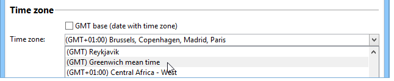

# Zeitzonen-Management{#time-zone-management}

## Grundprinzip {#operating-principle}

Mit Adobe Campaign können Sie Datumsangaben in Abhängigkeit ihrer Zeitzone angeben: Dadurch können internationale Benutzer weltweit an verschiedenen Zeitzonen arbeiten. Jedes Land, das dieselbe Instanz verwendet, kann die Ausführung von Kampagnen, die Verfolgung, Archivierung usw. verwalten. je nach Ortszeit.

Um die Nutzung der Adobe Campaign-Plattform auf internationaler Ebene zu ermöglichen, müssen alle von den Systemen verwendeten Daten mit einer Zeitzone verknüpft werden können. Ein Datum, dessen Zeitzone bekannt ist, kann daher unabhängig von der Zeitzone in eine andere Zeitzone importiert werden.

Mit Adobe Campaign können Sie Daten/Uhrzeiten im UTC-Format (Coordinated Universal Time) speichern. Wenn Daten offen gelegt werden, werden sie in das lokale Datum/die lokale Uhrzeit des Operators konvertiert. Die Konvertierung erfolgt automatisch, wenn die Datenbank in UTC konfiguriert ist (siehe [Konfiguration](#configuration)). Wenn die Datenbank nicht in UTC konfiguriert ist, werden Informationen zur Zeitzone der Daten in der Plattform in einer Option gespeichert.

Die wichtigsten Plattformfunktionalitäten im Zeitzonenmanagement sind: Import-/Export-Daten sowie Operator- und Workflow-Management. Das **Erbschaftskonzept** steht für Import/Export oder Workflows zur Verfügung. Standardmäßig sind sie für die Zeitzone des Datenbankservers konfiguriert. Sie können jedoch neue Zeitzonen für einen Workflow und sogar für eine Aktivität neu definieren.

**Operatoren** können Zeitzonen während der Konfiguration **des** Versands ändern und die Zeitzone angeben, in der der Versand ausgeführt wird.

>[!IMPORTANT]
>
>Wenn die Datenbank nicht mehrere Zeitzonen verwaltet, müssen für alle Datenfiltermanipulationen SQL-Abfragen in der Zeitzone des Datenbankservers ausgeführt werden.

Jeder Adobe Campaign-Operator ist mit einer Zeitzone verknüpft: diese Informationen in ihrem Profil konfiguriert sind. For more on this, refer to [this document](../../platform/using/access-management.md).

Wenn die Zeitzonenverwaltung für die Adobe Campaign-Plattform nicht erforderlich ist, können Sie einen Datenspeicherung-Modus im lokalen Format mit einer bestimmten verknüpften Zeitzone beibehalten.

## Empfehlungen {#recommendations}

Zeitzonen vereinen mehrere Realitäten: Der Ausdruck kann eine konstante Zeitverzögerung mit dem UTC-Datum oder der Uhrzeit einer Region beschreiben, die zweimal im Jahr geändert werden kann (Sommerzeit).

In postgreSQL beispielsweise die **SET-ZONE &quot;Europa/Paris&quot;;** Dabei werden Sommer- und Winterzeiten berücksichtigt: das Datum wird in UTC+1 oder UTC+2 je nach Jahreszeit angegeben.

Wenn Sie jedoch die **SET TIME ZONE 0200 verwenden;** angegeben ist, ist die Zeitverzögerung immer UTC+2.

## Konfiguration {#configuration}

Der Modus &quot;Datenspeicherung&quot;für Datum und Uhrzeit wird während der Datenbankerstellung ausgewählt (siehe [Erstellen einer neuen Instanz](#creating-a-new-instance)). Bei einer Migration werden die mit Daten verknüpften Stunden in lokale Daten und Stunden konvertiert (siehe [Migration](#migration)).

Aus technischer Ansicht gibt es zwei Möglichkeiten, **Datums- und Uhrzeitangaben** in der Datenbank zu speichern:

1. TIMESTAMP MIT TIMEZONE-Format: Die Datenbank-Engine speichert Daten in UTC. Jede geöffnete Sitzung verfügt über eine Zeitzone und die Daten werden entsprechend konvertiert.
1. Lokales Format + lokale Zeitzone: Alle Daten werden im lokalen Format gespeichert (keine Zeitverzögerung) und ihnen wird eine Zeitzone zugewiesen. Die Zeitzone wird in der **WdbcTimeZone** -Option der Adobe Campaign-Instanz gespeichert und kann über das Menü **[!UICONTROL Administration > Plattform > Optionen]** geändert werden.

>[!IMPORTANT]
>
>Bitte beachten Sie, dass diese Änderung zu Problemen mit der Datenkonsistenz und Synchronisierung führen kann.

### Creating a new instance {#creating-a-new-instance}

Damit mehrere internationale Benutzer an demselben Beispiel arbeiten können, müssen Sie Zeitzonen konfigurieren, wenn Sie die Instanz erstellen, um Zeitverzögerungen zwischen Ländern zu verwalten. Wählen Sie bei der Instanzerstellung den Datums- und Uhrzeitmanagementmodus im Abschnitt **[!UICONTROL Zeitzone]** des Datenbankkonfigurationsprozesses aus.

Aktivieren Sie die Option **[!UICONTROL UTC-Datenbank (Datumsfelder mit Zeitzone)]** , um alle Daten mit Datum und Uhrzeit im UTC-Format (SQL-Felder und XML-Felder) zu speichern.

>[!IMPORTANT]
>
>Wenn Sie **Oracle** verwenden, müssen die Zeitzonendateien (.dat) der Oracle-Clientebenen mit den auf dem Server installierten Zeitzonendateien kompatibel sein.

Ist die Datenbank nicht UTC, können Sie eine der Zeitzonen auswählen, die in der Dropdown-Liste angeboten werden. Sie können auch die Zeitzone des Servers verwenden oder die Option UTC (Coordinated Universal Time) wählen.

Wenn die Option **[!UICONTROL UTC-Datenbank (Datumsfelder mit Zeitzone)]** ausgewählt ist, werden die SQL-Felder im TIMEZONE-Format gespeichert.

Andernfalls werden sie im lokalen Format gespeichert und Sie müssen die Zeitzone auswählen, die auf die Datenbank angewendet werden soll.

### Migration {#migration}

Bei der Migration zu einer früheren Version (ohne Zeitzonenverwaltung) müssen Sie den Datumsdatenbankmodus definieren, in dem die Datenspeicherung erfolgt.

Um die Kompatibilität mit externen Tools beim Zugriff auf die Adobe Campaign-Datenbank zu gewährleisten, bleiben die SQL-Felder vom Typ **Date+time** standardmäßig im lokalen Format gespeichert.

XML-Felder mit Datumsangaben werden jetzt in UTC gespeichert. Beim Laden werden Felder, die nicht im UTC-Format vorliegen, automatisch mithilfe der Zeitzone des Servers konvertiert. Das bedeutet, dass alle XML-Felder schrittweise in das UTC-Format konvertiert werden.

Um eine vorhandene Instanz zu verwenden, fügen Sie die Option **WdbcTimeZone** hinzu und geben Sie die Zeitzone der Instanz ein.

>[!IMPORTANT]
>
>Stellen Sie sicher, dass der richtige Wert für die Option WdbcTimeZone konfiguriert ist: später vorgenommene Änderungen können zu Inkonsistenzen führen.

Beispiel für mögliche Werte:

* Europa/Paris,
* Europa/London,
* Amerika/New_York usw.

   Diese Werte werden aus der Datenbank tz (Olson) entnommen. Weitere Informationen finden Sie unter [https://en.wikipedia.org/wiki/List_of_tz_database_time_zones](https://en.wikipedia.org/wiki/List_of_tz_database_time_zones).

