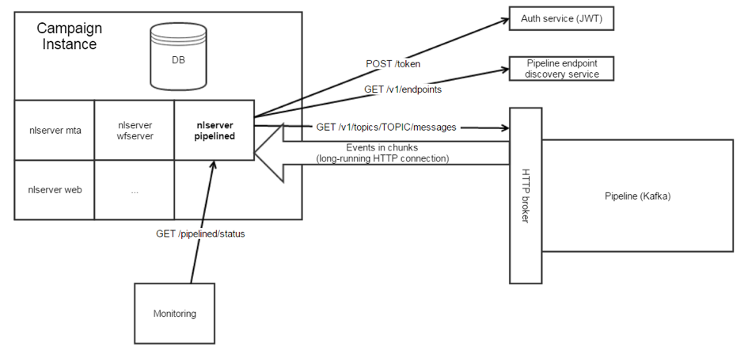

# Verwenden von Campaign und Experience Cloud Triggers{#about-adobe-experience-triggers}

[!DNL Triggers] ist eine Integration zwischen Adobe Campaign und Adobe Analytics mithilfe der Pipeline. Die Pipeline ruft Aktionen oder Auslöser der Benutzer von Ihrer Website ab. Ein Beispiel für einen Auslöser ist ein Warenkorbabbruch. Trigger werden in Adobe Campaign verarbeitet, um in nahezu Echtzeit E-Mails zu senden.

>[!CAUTION]
>
>Diese Funktion ist nicht im Produkt vorkonfiguriert. Wenden Sie sich für diese Implementierung an den Adobe-Support/die Kundenunterstützung. Sie können dann die auf [dieser Seite](../../integrations/using/configuring-pipeline.md#prerequisites) beschriebenen Schritte durchführen.

[!DNL Triggers] führen nach der Aktion einer Benutzerin oder eines Benutzers in einem kurzen Zeitraum Marketing-Aktionen aus. Die typische Reaktionszeit beträgt weniger als eine Stunde.

Dadurch werden flexiblere Integrationen möglich, da der Konfigurationsaufwand minimal ist und keine Drittanbieter beteiligt sind.
Unterstützt werden auch große Traffic-Volumen, ohne dass die Performance von Marketing-Aktivitäten leidet. Beispielsweise kann die Integration eine Million Auslöser pro Stunde verarbeiten.

 Entdecken Sie, wie Sie [einen Experience Cloud-Trigger erstellen](https://experienceleague.adobe.com/docs/experience-cloud/triggers/create.html?lang=de) und kritische Verbraucherverhaltensweisen identifizieren, definieren und überwachen können.

## [!DNL Triggers]-Architektur {#triggers-architecture}

Der [!DNL pipelined]-Prozess wird auf dem Adobe Campaign-Marketing-Server kontinuierlich ausgeführt. Er stellt eine Verbindung zur Pipeline her, ruft die Ereignisse ab und verarbeitet sie sofort.



Der [!DNL pipelined]-Prozess meldet sich mit einem Authentifizierungsdienst bei Experience Cloud an und sendet einen privaten Schlüssel. Der Authentifizierungsdienst gibt ein Token zurück. Das Token dient beim Abrufen der Ereignisse zum Authentifizieren.

## Voraussetzungen {#adobe-io-prerequisites}

Bevor Sie mit dieser Implementierung beginnen, überprüfen Sie, ob Folgendes vorhanden ist:

* eine gültige **Organisationskennung**: Die Organisations-ID ist die eindeutige Kennung innerhalb der Adobe Experience Cloud, die zum Beispiel für den VisitorID-Dienst und das IMS Single-Sign On (SSO) verwendet wird. [Weitere Informationen](https://experienceleague.adobe.com/docs/core-services/interface/administration/organizations.html?lang=de)
* ein **Entwicklerzugriff** auf Ihr Unternehmen. Der Systemadministrator der Organisation muss das Verfahren zum **Hinzufügen von Entwicklern zu einem einzelnen Produktprofil** befolgen, das [auf dieser Seite](https://helpx.adobe.com/de/enterprise/using/manage-developers.html) beschrieben wird. Damit ermöglicht er den Entwicklerzugriff für das `Analytics - {tenantID}` Produktprofil des Adobe Analytics-Produkts, das mit Triggers verbunden ist.

## Implementierungsschritte {#implement}

Gehen Sie wie folgt vor, um Campaign und Experience Cloud Triggers zu implementieren:

1. Erstellen Sie ein OAuth-Projekt. [Weitere Informationen](oauth-technical-account.md#oauth-service)

1. Fügen Sie Ihre OAuth-Projektanmeldedaten in Adobe Campaign hinzu. [Weitere Informationen](oauth-technical-account.md#add-credentials)

1. Aktualisieren Sie den Authentifizierungstyp für das Developer Console-Projekt in der Konfigurationsdatei **config-&lt; Instanzname >.xml** wie folgt:

   ```
   <pipelined ... authType="imsJwtToken"  ... />
   ```

   Führen Sie dann einen `config -reload` und einen Neustart von [!DNL pipelined] aus, damit die Änderungen berücksichtigt werden.

