# Grundlagen und Datenzyklus von ACS Connector{#acs-connector-principles-and-data-cycle}

## Einleitung {#introduction}

ACS Connector ist das Bindeglied zwischen Adobe Campaign v7 und Adobe Campaign Standard. Diese in Campaign v7 integrierte Funktion repliziert automatisch Daten nach Campaign Standard und vereint somit das Beste beider Anwendungen. Campaign v7 verfügt über fortschrittliche Tools zur Verwaltung der primären Marketing-Datenbank. Durch die Replikation der Daten von Campaign v7 nach Campaign Standard können diese in einer benutzerfreundlichen Umgebung verwendet werden.

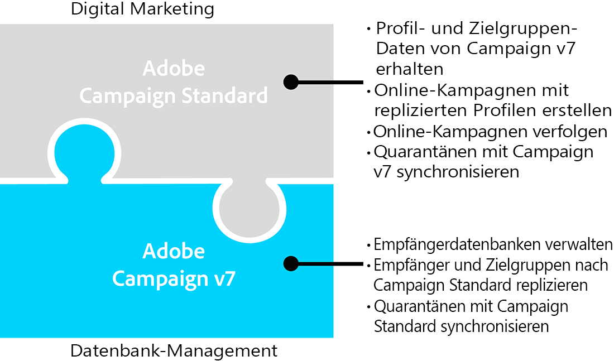

In Kombination mit ACS Connector richtet sich Campaign Standard wie bisher an Digital Marketer, die damit Kampagnen konzipieren, ausrichten und durchführen können, während Campaign v7 auf datenorientierte Benutzer wie Datenbankmarketer zugeschnitten ist.

>[!IMPORTANT]
>
>ACS Connector ist nur als Teil des Adobe Campaign Prime-Angebots erhältlich. Mehr zur Lizenzierung von Adobe Campaign Prime erfahren Sie bei Ihrem Kundenbetreuer.
>
>ACS Connector ist nur für gehostete und Hybridarchitekturen verfügbar, nicht aber für vollständige On-Premise-Installationen.
>
>Um diese Funktion verwenden zu können, stellen Sie mithilfe einer Adobe ID (IMS) eine Verbindung zu Campaign her. Siehe [Verbindung mit Adobe ID](../../integrations/using/about-adobe-id.md).

In diesem Dokument wird ACS Connector beschrieben. In den folgenden Abschnitten erhalten Sie Informationen über die Replikation von Daten und eine Anleitung zur Verwendung replizierter Profile.

* [Prozesse](#process): Überblick über ACS Connector und die Verwaltung der Datenreplikation
* [Implementierung](#implementation): Erste Schritte mit ACS Connector und eine Anleitung zur Replikation einfacher und erweiterter Datensätze
* [Synchronisieren von Profilen](../../integrations/using/synchronizing-profiles.md): Anleitung zur Replikation von Profilen und zur Erstellung von Sendungen mit diesen Profilen
* [Synchronisieren von Zielgruppen](../../integrations/using/synchronizing-audiences.md): Anleitung zum Auswählen einer Empfängerliste in Campaign v7 und zur Replikation dieser Liste als Zielgruppe in Campaign Standard
* [Synchronisieren von Webanwendungen](../../integrations/using/synchronizing-web-applications.md): Anleitung zur Verknüpfung von Webanwendungen in Campaign v7 mit Campaign Standard
* [Fehlerbehebung bei ACS Connector](../../integrations/using/troubleshooting-the-acs-connector.md): Antworten auf häufige Probleme.

>[!NOTE]
>
>ACS Connector ist Teil der Campaign v7-Lizenz. Um ACS Connector verwenden zu können, müssen Sie zwischen Campaign v7 und Campaign Standard wechseln können. Wenn Sie sich unsicher bezüglich Ihrer Version und deren Funktionen sind, kontaktieren Sie bitte Ihren Administrator.

## Vorgang {#process}

### Datenreplikation {#data-replication}

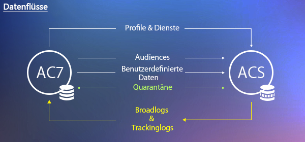

ACS Connector repliziert regelmäßig die folgenden Elemente von Campaign v7 nach Campaign Standard:

* **Bereich Empfänger**
* **Abonnements**
* **Dienste**
* **Landingpages**

Standardmäßig erfolgt die periodische Replikation für ACS Connector alle 15 Minuten. Dieser Zeitraum kann auf Ihre Bedürfnisse angepasst werden. Wenn Sie diese Einstellung ändern möchten, kontaktieren Sie Ihren Consultant.

Die Datenreplikation von Empfängern, Abonnements, Diensten und Landingpages ist inkrementell, d. h. dass nur neue Empfänger und Änderungen an vorhandenen Empfängern von Campaign v7 nach Campaign Standard repliziert werden. Die Replikation einer Zielgruppe findet jedoch in einer einzigen Instanz statt. Sie können eine Zielgruppe in Campaign v7 erstellen und sie einmal nach Campaign Standard replizieren. Die Replikation erfolgt sofort und kann nicht so konfiguriert werden, dass regelmäßig Aktualisierungen durchgeführt werden. Anweisungen finden Sie unter [Zielgruppen synchronisieren](../../integrations/using/synchronizing-audiences.md).

>[!NOTE]
>
>Die erstmalige Replikation einer großen Datenbank erfordert Geduld, da sie mehrere Stunden dauern kann. Die darauf folgenden Replikationen sind jedoch inkrementell und erfolgen wesentlich schneller.

ACS Connector repliziert regelmäßig die folgenden Elemente von Campaign Standard nach Campaign v7:

* **[!UICONTROL Versandkennungen]**
* **[!UICONTROL E-Mail-Broadlogs]**
* **[!UICONTROL E-Mail-Trackinglogs]**

Die Replikation von Versandkennungen und E-Mail-Logs ermöglicht den Zugriff auf den Verlauf von Sendungen und Tracking-Daten für Ihre v7-Empfänger von Campaign v7.

>[!IMPORTANT]
>
>Nur E-Mail-Broadlogs und -Trackinglogs werden von Campaign Standard nach Campaign v7 repliziert.

### Datensynchronisation {#data-synchronization}

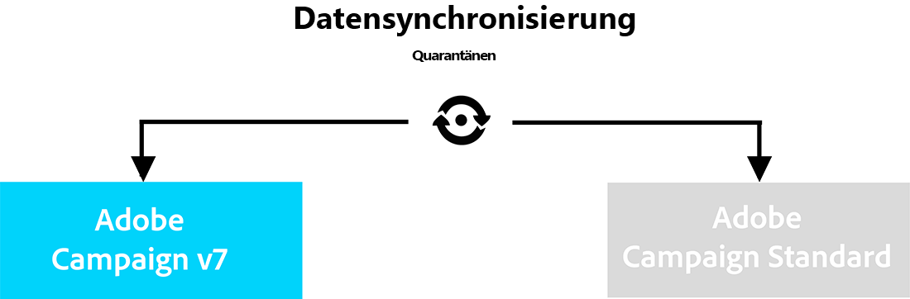

ACS Connector synchronisiert Quarantänen zwischen Campaign v7 und Campaign Standard.

Beispiel: Ein von Campaign v7 nach Campaign Standard repliziertes Profil enthält eine E-Mail-Adresse. Wenn diese E-Mail-Adresse von Campaign Standard unter Quarantäne gestellt wird, werden diese Daten bei der nächsten Synchronisation an Campaign v7 weitergegeben. Weiterführende Informationen zu Quarantänen finden Sie unter [Quarantäne-Verwaltung](../../delivery/using/understanding-quarantine-management.md) und [Quarantäne in Campaign Standard](https://docs.adobe.com/content/help/de-DE/campaign-standard/using/testing-and-sending/monitoring-messages/understanding-quarantine-management.html).

### Replizierte Profile verwenden {#using-replicated-profiles}

Replizierte Profile können von Campaign Standard und Campaign v7 für Zielgruppen-Workflows in Marketing-Kampagnen verwendet werden.

Anweisungen zum Durchführen eines Versands in Campaign Standard mit replizierten Profilen finden Sie unter [Profile synchronisieren](../../integrations/using/synchronizing-profiles.md). Außerdem erhalten Sie Anweisungen zum Teilen der Abmeldedaten zwischen Campaign v7 und Campaign Standard.

### Einschränkungen {#limitations}

Replizierte Profile sind zwar unmittelbar für Sendungen verfügbar, unterliegen aber gewissen Einschränkungen in Campaign Standard. Beachten Sie die unten aufgeführten Informationen, um entsprechende Fälle ordnungsgemäß zu handhaben.

* **Schreibgeschützte Profile für Campaign Standard**: Replizierte Profile können in Campaign Standard nicht geändert werden. Die Empfänger können jedoch in Campaign v7 bearbeitet werden. Diese Änderungen werden dann automatisch von ACS Connector nach Campaign Standard übertragen.
* **In Campaign Standard erstellte Profile**: ACS Connector repliziert Empfängerdaten in nur eine Richtung, nämlich von Campaign v7 nach Campaign Standard. Deshalb werden von Campaign Standard stammende Profile nicht nach Campaign v7 repliziert.
* **Grundlegende Empfängerdaten für Campaign Standard**: ACS Connector repliziert für Campaign Standard geeignete Daten. Dazu zählen der Empfängername, die Adresse, die E-Mail-Adresse, die Mobiltelefonnummer, die Privatnummer und sonstige relevante Kontaktinformationen. Wenn Sie für Ihren Workflow zusätzliche in Campaign v7 verfügbare Empfängerfelder und benutzerdefinierte Tabellen für die Zielgruppenbestimmung benötigen, wenden Sie sich bitte an Ihren Consultant.
* **Importieren unter Quarantäne gestellter Profile**: Listen mit Profilen, die nicht kontaktiert werden möchten, können in Campaign v7 oder Campaign Standard als unter Quarantäne gestellte Profile importiert werden. Der Status der Profile ist in der Quarantänesynchronisation zwischen den Anwendungen enthalten, weshalb diese Profile nicht in Sendungen eingeschlossen werden.
* **Abmelden von einem Dienst in Campaign Standard**: Abmeldungen von einem Dienst werden nicht von Campaign Standard nach Campaign v7 synchronisiert. Sie können jedoch einen Versand in Campaign Standard so konfigurieren, dass der Abmelde-Link zu Campaign v7 weist. Dann wird das Profil eines Empfängers, der auf den Abmelde-Link klickt, in Campaign v7 aktualisiert und diese Daten werden anschließend nach Campaign Standard repliziert. Siehe [Abmelde-Link ändern](../../integrations/using/synchronizing-profiles.md#changing-the-unsubscription-link).
* Nur E-Mail-Broadlogs und -Trackinglogs werden von Campaign Standard nach Campaign v7 repliziert.

### Fakturierung {#billing}

Die Fakturierung ist von Ihrer Wahl der Anwendung für den Versand – Campaign v7 oder Campaign Standard – nicht betroffen. Rechnungsinformationen werden zwischen Campaign v7 und Campaign Standard abgestimmt, d. h. wenn Sie über beide Anwendungen Sendungen an denselben Empfänger durchführen, wird er dennoch nur als ein aktives Profil gewertet.

## Umsetzung {#implementation}

Für ACS Connector gibt es zwei Arten von Implementierungen. Beide müssen unbedingt vom Adobe Campaign-Team durchgeführt werden.

>[!IMPORTANT]
>
>Dieser Abschnitt richtet sich ausschließlich an Spezialisten, die einen allgemeinen Überblick über den Implementierungsvorgang und seine wichtigsten Schritte erhalten sollen.
>
>Versuchen Sie unter keinen Umständen, diese Schritte selbst durchzuführen. Sie dürfen ausschließlich von Adobe-Campaign-Consultants vorgenommen werden.

Mit der **einfachen Implementierung** können Sie Empfänger (vordefinierte Felder), Dienste und Abonnements, Webanwendungen und Zielgruppen replizieren. Diese Replikation erfolgt in nur einer Richtung von Campaign v7 nach Campaign Standard.

Die **erweiterte Implementierung** kann für komplexere Anwendungsfälle verwendet werden, beispielsweise wenn Sie zusätzliche Empfängerfelder oder benutzerdefinierte Empfängertabellen verwenden (z. B. eine Transaktionstabelle). Siehe [Erweiterte Implementierung](#advanced-implementation).

### Package-Installation {#installing-the-package}

Damit Sie diese Funktion verwenden können, muss das **[!UICONTROL ACS Connector]** Package installiert sein. Dies wird vom technischen Adobe-Administrator oder Consultant vorgenommen.

Alle mit dem ACS Connector in Verbindung stehenden technischen Elemente sind im Knoten **[!UICONTROL Administration > ACS Connector]** verfügbar.

### Technische und Replikations-Workflows {#technical-and-replication-workflows}

Nach der Installation des Packages sind zwei technische Workflows unter **[!UICONTROL Administration > ACS Connector > Prozesse]** verfügbar.

>[!IMPORTANT]
>
>Versuchen Sie niemals, diese Workflows zu verändern. Diese Workflows sollten niemals eine Fehlermeldung aufweisen oder ausgesetzt werden. Wenden Sie sich in diesem Fall an Ihren Adobe Campaign-Consultant.

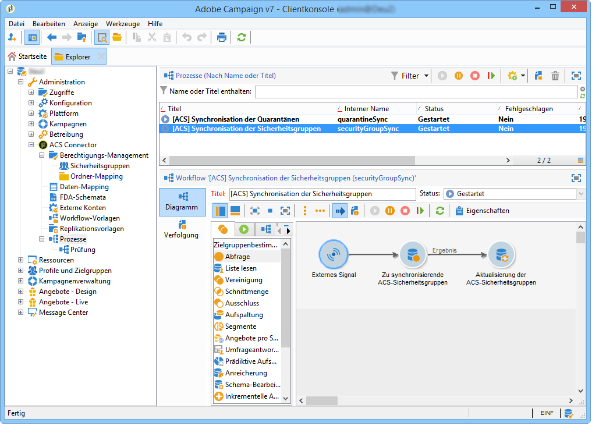

* **[!UICONTROL `[ACS] Quarantine synchronization`]** (quarantineSync): Dieser Workflow synchronisiert alle Quarantäneinformationen. Alle neuen Quarantänen in Campaign v7 werden nach Campaign Standard repliziert. Alle neuen Quarantänen in Campaign Standard werden nach Campaign v7 repliziert. Dadurch wird sichergestellt, dass alle Ausschlussregeln zwischen Campaign v7 und Campaign Standard synchronisiert werden.
* **[!UICONTROL `[ACS] Security group synchronization`]** (securityGroupSync): Dieser Workflow dient der Konvertierung von Berechtigungen. Siehe [Konvertierung der Berechtigungen](#rights-conversion).

Die folgenden Replikations-Workflows sind als gebrauchsfertige Vorlagen verfügbar. Sie müssen von Ihrem Adobe Campaign-Consultant implementiert werden.

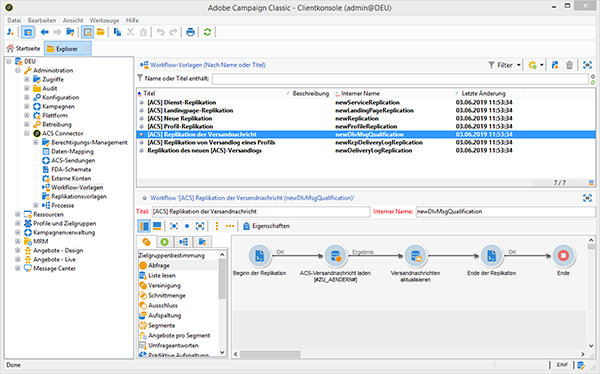

* **[!UICONTROL `[ACS] Profile replication`]** (newProfileReplication): Dieser inkrementelle Workflow repliziert Empfänger nach Campaign Standard. Standardmäßig werden alle nativen Empfängerfelder repliziert. Siehe [Standard-Empfängerfelder](#default-recipient-fields).
* **[!UICONTROL `[ACS] Service replication`]** (newServiceReplication): Dieser inkrementelle Workflow repliziert die ausgewählten Dienste nach Campaign Standard. Siehe Anwendungsfall [Webanwendungen synchronisieren](../../integrations/using/synchronizing-web-applications.md).
* **[!UICONTROL `[ACS] Landing pages replication`]** (newLandingPageReplication): Dieser inkrementelle Workflow repliziert die ausgewählten Webanwendungen nach Campaign Standard. Die Campaign v7-Webanwendungen werden als Landingpages in Campaign Standard angezeigt. Siehe Anwendungsfall [Webanwendungen synchronisieren](../../integrations/using/synchronizing-web-applications.md).
* **[!UICONTROL `[ACS] New replication`]** (newReplication): Dieser inkrementelle Workflow ist ein Beispiel, das zur Replikation einer benutzerdefinierten Tabelle verwendet werden kann. Siehe [Erweiterte Implementierung](#advanced-implementation).
* **[!UICONTROL `[ACS] Delivery-mesage replication`]** (newDlvMsgQualification): Dieser inkrementelle Workflow repliziert Versandnachrichten von Campaign Standard nach Campaign v7.
* **[!UICONTROL `[ACS] Profile delivery log replication`]** (newRcpDeliveryLogReplication): Dieser inkrementelle Workflow repliziert Versandkennungen, E-Mail-Broadlogs und E-Mail-Trackinglogs von Campaign Standard nach Campaign v7. Dabei werden nur Sendungen berücksichtigt, die von Campaign Standard an Profile gesendet werden, die in der Tabelle „nms:recipients“ von Campaign v7 enthalten sind.
* **[!UICONTROL `[ACS] New delivery log replication`]** (newRcpDeliveryLogReplication): Dieser inkrementelle Workflow repliziert Versandkennungen, E-Mail-Broadlogs und E-Mail-Trackinglogs von Campaign Standard nach Campaign v7. Dabei werden nur Sendungen berücksichtigt, die von Campaign Standard an Profile gesendet werden, die in einer bestimmten Tabelle (zu definieren, nicht „nms:recipients“) von Campaign v7 enthalten sind.

### Standard-Empfängerfelder {#default-recipient-fields}

Etwaige zusätzliche Felder oder benutzerdefinierte Tabellen (z. B. Transaktionstabelle) werden nicht standardmäßig repliziert. Dazu ist eine erweiterte Konfiguration erforderlich. Siehe [Erweiterte Implementierung](#advanced-implementation).

Unten finden Sie die Liste mit den vordefinierten Empfängerfeldern, die bei der einfachen Implementierung repliziert werden:

<table> 
 <tbody> 
  <tr> 
   <td> <strong>Titel</strong>  </td> 
   <td> <strong>Interner Name</strong>  </td> 
  </tr> 
  <tr> 
   <td> Source Id  </td> 
   <td> @sourceId  </td> 
  </tr> 
  <tr> 
   <td> Erstellungsdatum  </td> 
   <td> @created  </td> 
  </tr> 
  <tr> 
   <td> Änderungsdatum  </td> 
   <td> @lastModified  </td> 
  </tr> 
  <tr> 
   <td> E-Mail  </td> 
   <td> @email  </td> 
  </tr> 
  <tr> 
   <td> Last name  </td> 
   <td> @lastName  </td> 
  </tr> 
  <tr> 
   <td> First name  </td> 
   <td> @firstName  </td> 
  </tr> 
  <tr> 
   <td> Middle name  </td> 
   <td> @middleName  </td> 
  </tr> 
  <tr> 
   <td> Mobile  </td> 
   <td> @mobilePhone  </td> 
  </tr> 
  <tr> 
   <td> Geburtsdatum  </td> 
   <td> @birthDate  </td> 
  </tr> 
  <tr> 
   <td> Geschlecht  </td> 
   <td> @gender  </td> 
  </tr> 
  <tr> 
   <td> Anrede  </td> 
   <td> @salutation  </td> 
  </tr> 
  <tr> 
   <td> No longer contact (by any channel)  </td> 
   <td> @blackList  </td> 
  </tr> 
  <tr> 
   <td> No longer contact by email  </td> 
   <td> @blackListEmail  </td> 
  </tr> 
  <tr> 
   <td> No longer contact by SMS  </td> 
   <td> @blackListMobile  </td> 
  </tr> 
  <tr> 
   <td> Phone  </td> 
   <td> @phone  </td> 
  </tr> 
  <tr> 
   <td> Fax  </td> 
   <td> @fax  </td> 
  </tr> 
  <tr> 
   <td> Adresse 1 (Wohnung)  </td> 
   <td> [location/@address1]  </td> 
  </tr> 
  <tr> 
   <td> Adresse 2  </td> 
   <td> [location/@address2]  </td> 
  </tr> 
  <tr> 
   <td> Adresse 3 (Straße und Hausnr.)  </td> 
   <td> [location/@address3]  </td> 
  </tr> 
  <tr> 
   <td> Adresse 4 (Ortszusatz)  </td> 
   <td> [location/@address4]  </td> 
  </tr> 
  <tr> 
   <td> Postleitzahl  </td> 
   <td> [location/@zipCode]  </td> 
  </tr> 
  <tr> 
   <td> Ort  </td> 
   <td> [location/@city]  </td> 
  </tr> 
  <tr> 
   <td> Code Bundesland/Region  </td> 
   <td> [location/@stateCode]  </td> 
  </tr> 
  <tr> 
   <td> Ländercode  </td> 
   <td> [location/@countryCode]  </td> 
  </tr> 
 </tbody> 
</table>

### Konvertierung der Berechtigungen {#rights-conversion}

Berechtigungen werden in Campaign v7 und Campaign Standard unterschiedlich gehandhabt. In Campaign v7 erfolgt die Berechtigungsverwaltung ordnerbasiert, während sie in Campaign Standard auf Zugriffsrechten auf Einheiten basiert (Unternehmens-/geografische Einheiten). Jeder Benutzer von Campaign Standard gehört einer bestimmten Sicherheitsgruppe an, in der die jeweiligen Einschränkungsinformationen enthalten sind. Deshalb muss das Berechtigungssystem von Campaign v7 in jenes von Campaign Standard konvertiert werden. Für die Durchführung dieser Berechtigungskonvertierung gibt es mehrere Möglichkeiten. Unten finden Sie ein Beispiel dafür.

1. Verwenden Sie unter **[!UICONTROL Administration > ACS Connector > Berechtigungs-Management > Sicherheitsgruppen]** die Schaltfläche **[!UICONTROL Synchronisieren]**, um alle Sicherheitsgruppen in Campaign Standard abzurufen. Native Gruppen von Campaign Standard sind dabei ausgeschlossen.

   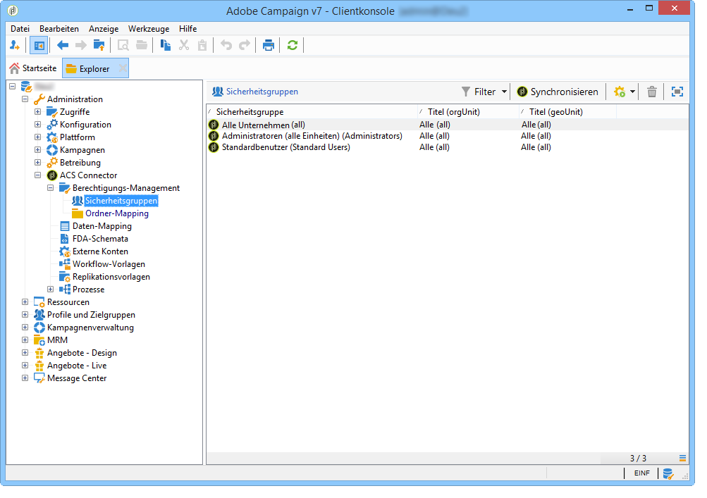

1. Wenn Ihr Berechtigungs-Management ordnerbasiert ist, gehen Sie zu **[!UICONTROL Administration > ACS Connector > Berechtigungs-Management > Ordner-Mapping]** und ordnen Sie jeden erforderlichen Ordner einer Sicherheitsgruppe zu.

   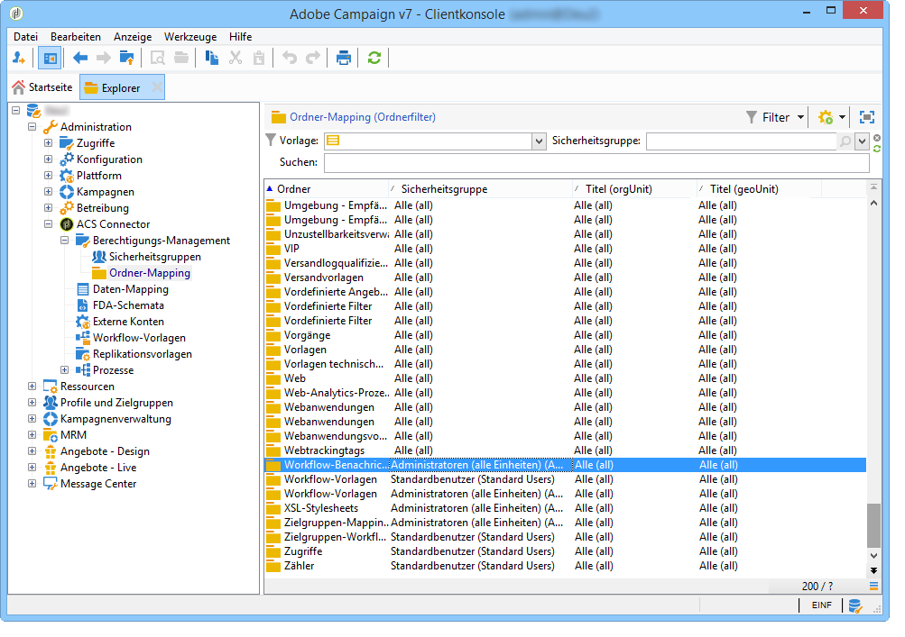

1. Diese Informationen werden dann in den Replikations-Workflows verwendet, um jedem zu replizierenden Objekt die entsprechenden Unternehmens-/geografischen Einheiten hinzuzufügen.

### Erweiterte Implementierung {#advanced-implementation}

In diesem Abschnitt werden einige Möglichkeiten beschrieben, die die erweiterte Implementierung bietet.

>[!IMPORTANT]
>
>Diese Informationen sind nur als allgemeine Richtlinien zu verstehen. Wenden Sie sich bitte bezüglich der Implementierung an Ihren Adobe Campaign-Consultant.

Mit der erweiterten Implementierung werden entsprechend den Kundenbedürfnissen benutzerdefinierte Replikations-Workflows hinzugefügt. Hier sind einige Beispiele:

* Versandreplikation
* Kampagnenreplikation
* Programmreplikation
* Testadressenreplikation
* Transaktionsreplikation
* etc.

**Replizieren erweiterter Empfängerfelder**

Mit der einfachen Implementierung werden die vordefinierten Empfängerfelder repliziert. Wenn Sie benutzerdefinierte, zum Empfängerschema hinzugefügte Felder replizieren möchten, müssen Sie diese identifizieren.

1. Erstellen Sie unter **[!UICONTROL Administration > ACS Connector > Daten-Mapping]** ein Zielgruppen-Mapping auf die **[!UICONTROL nms:recipient]**-Tabelle.

   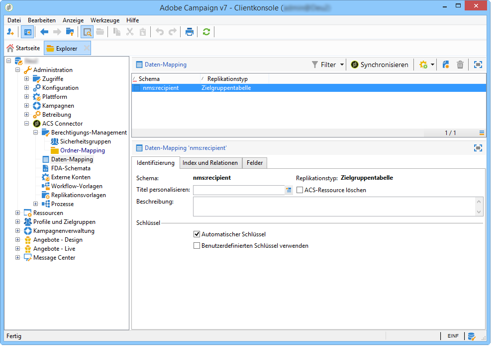

1. Wählen Sie die zusätzlichen zu replizierenden Felder und sonstige benötigte Informationen aus (Index, Links, Identifizierungsschlüssel).

   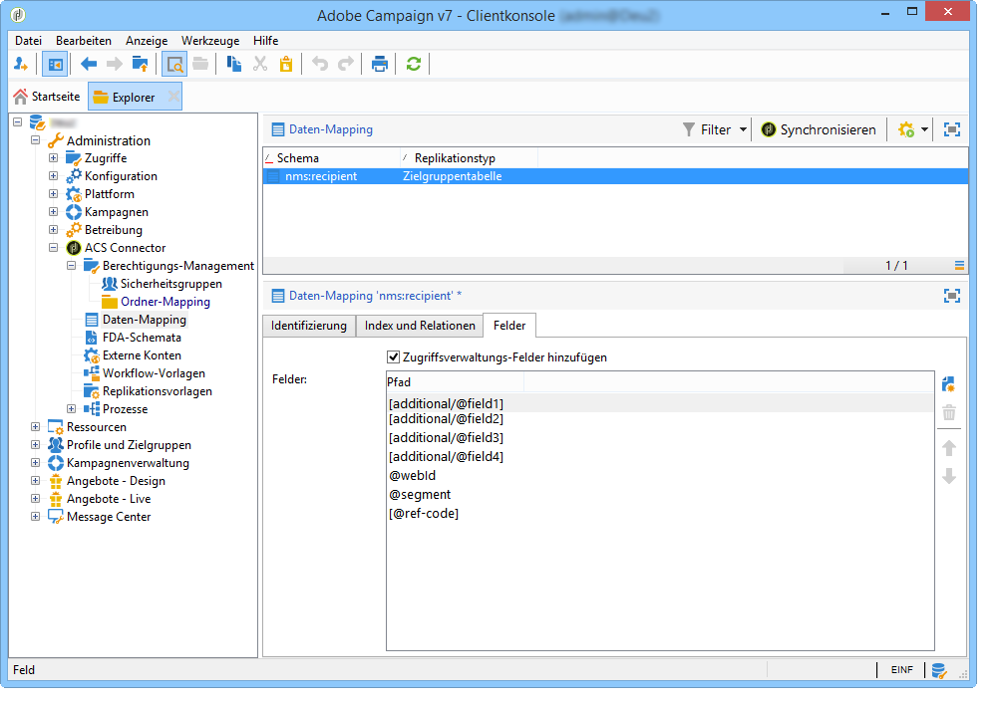

1. Öffnen Sie den Profilreplikations-Workflow (nicht die Vorlage, sondern die Workflow-Instanz selbst). Ändern Sie die Aktivitäten **[!UICONTROL Abfrage]** und **[!UICONTROL Daten-Update]** so, dass diese Felder eingeschlossen sind. Siehe [Technische und Replikations-Workflows](#technical-and-replication-workflows).

   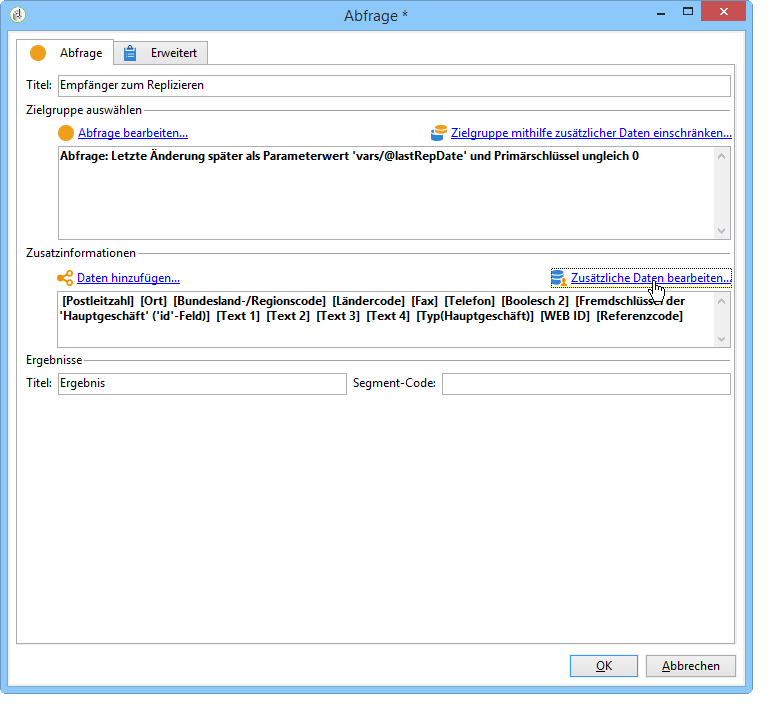

   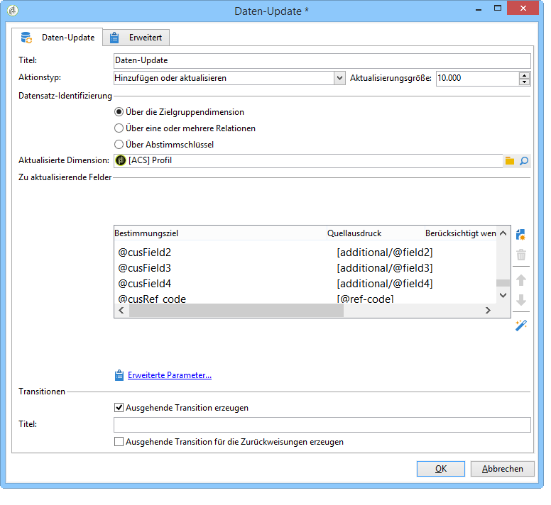

**Replizieren benutzerdefinierter Profiltabellen**

Mit der einfachen Implementierung wird die vordefinierte Empfängertabelle repliziert. Wenn Sie benutzerdefinierte Empfängertabellen hinzugefügt haben, identifizieren Sie sie folgendermaßen:

1. Erstellen Sie unter **[!UICONTROL Administration > ACS Connector > Daten-Mapping]** ein Zielgruppen-Mapping auf Ihre benutzerdefinierte Profiltabelle.

   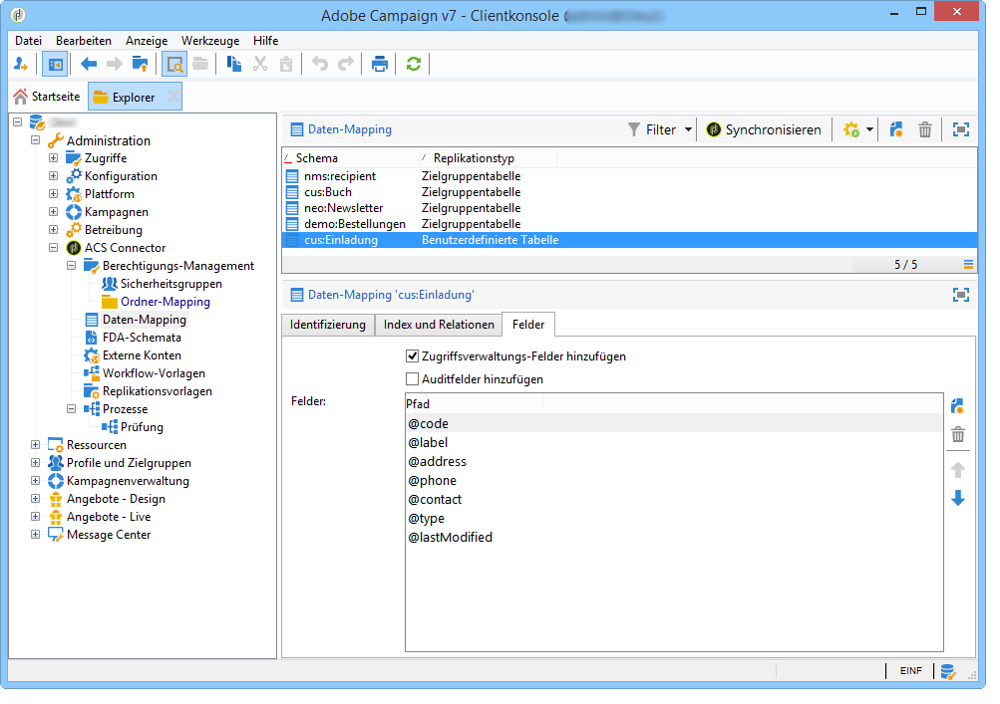

1. Definieren Sie die Identifizierungsdaten, den Index, die Links und die Felder, die Sie replizieren möchten.

   

1. Wenn Ihr Berechtigungs-Management ordnerbasiert ist, gehen Sie zu **[!UICONTROL Administration > ACS Connector > Berechtigungs-Management > Ordner-Mapping]** und definieren Sie eine Sicherheitsgruppe für die mit Ihren benutzerdefinierten Tabellen verknüpften Ordner. Siehe [Konvertierung der Berechtigungen](#rights-conversion).
1. Verwenden Sie den Workflow **[!UICONTROL Neue Replikation]** (nicht die Vorlage, sondern die Workflow-Instanz selbst), um die benutzerdefinierte Tabelle und die zu replizierenden Felder einzuschließen. Siehe [Technische und Replikations-Workflows](#technical-and-replication-workflows).

