# Erste Schritte mit dem ACS-Connector{#acs-connector-gs}

Der ACS-Connector ist eine Brücke zwischen Adobe Campaign v7 und Adobe Campaign Standard. Hierbei handelt es sich um eine integrierte Funktion in Campaign v7, mit der Daten automatisch in Campaign Standard repliziert werden, sodass die Vorzüge beider Anwendungen kombiniert werden können. Campaign v7 verfügt über erweiterte Tools zur Verwaltung der primären Marketing-Datenbank. Die Datenreplikation von Campaign v7 ermöglicht es Campaign Standard, die umfangreichen Daten in einer benutzerfreundlichen Umgebung zu nutzen.

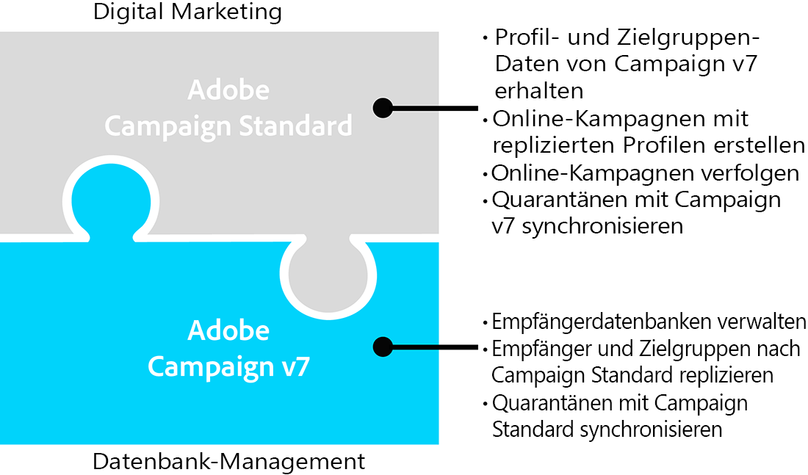

In Kombination mit dem ACS-Connector richtet sich Campaign Standard wie bisher an Digital Marketer, die damit Kampagnen konzipieren, ausrichten und durchführen können, während Campaign v7 auf datenorientierte Benutzer wie Datenbankmarketer zugeschnitten ist.

>[!IMPORTANT]
>
>Der ACS-Connector ist nur als Teil des Adobe Campaign Prime-Angebots verfügbar. Weitere Informationen zur Lizenzierung von Adobe Campaign Prime erhalten Sie von Ihrem Account Manager.
>
>Der ACS-Connector ist nur für gehostete und hybride Architekturen verfügbar. Sie ist nicht für vollständige On-Premise-Installationen verfügbar.
>
>Um diese Funktion verwenden zu können, müssen Sie eine Verbindung zu Campaign mit einer Adobe ID (IMS) herstellen. Siehe [Herstellen einer Verbindung über eine Adobe ID](../../integrations/using/about-adobe-id.md).

In diesem Dokument werden die Funktionen des ACS-Connectors vorgestellt. Die folgenden Abschnitte enthalten Informationen zur Replikation von Daten durch die Funktion und Anweisungen zur Arbeit mit replizierten Profilen.

* [Prozesse](#process): Überblick über den ACS-Connector und die Verwaltung der Datenreplikation
* [Implementierung](#implementation): Erste Schritte mit dem ACS-Connector und eine Anleitung zur Replikation einfacher und erweiterter Datensätze
* [Synchronisieren von Profilen](../../integrations/using/synchronizing-profiles.md): Anleitung zur Replikation von Profilen und zur Erstellung von Sendungen mit diesen Profilen.
* [Synchronisieren von Zielgruppen](../../integrations/using/synchronizing-audiences.md): Anleitung zum Auswählen einer Empfängerliste in Campaign v7 und zur Replikation dieser Liste als Zielgruppe in Campaign Standard.
* [Synchronisieren von Web-Programmen](../../integrations/using/synchronizing-web-applications.md): Anleitung zur Verknüpfung von Web-Programmen in Campaign v7 mit Campaign Standard.
* [Fehlerbehebung bei ACS-Connectoren](../../integrations/using/troubleshooting-the-acs-connector.md): Antworten auf häufige Probleme.

>[!NOTE]
>
>Der ACS-Connector ist in Campaign v7 im Rahmen einer Lizenzvereinbarung enthalten. Um den ACS-Connector zu verwenden, stellen Sie sicher, dass Sie zwischen Campaign v7 und Campaign Standard wechseln können. Wenden Sie sich an Ihren Administrator, wenn Sie sich bezüglich Ihrer Version und der zugehörigen Funktionen nicht sicher sind.

## Vorgang {#process}

### Datenreplikation {#data-replication}

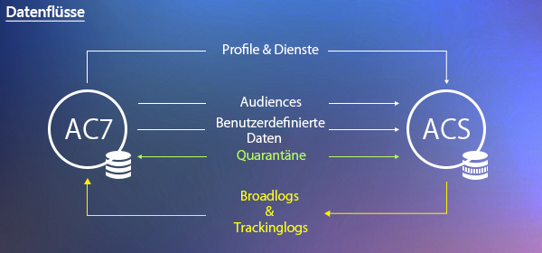

Der ACS-Connector repliziert regelmäßig die folgenden Elemente von Campaign v7 nach Campaign Standard:

* **Bereich Empfänger**
* **Abonnements**
* **Dienste**
* **Landingpages**

Standardmäßig wird für den ACS-Connector alle 15 Minuten eine Replikation durchgeführt. Die Zeitspanne der periodischen Replikation kann Ihren Anforderungen entsprechend angepasst werden. Wenden Sie sich an Ihren Berater, wenn Änderungen erforderlich sind.

Die Datenreplikation für Empfänger, Abonnements, Services und Landingpages ist inkrementell, d. h. nur neue Empfänger und Änderungen an bestehenden Empfängern werden von Campaign v7 nach Campaign Standard repliziert. Die Replikation für eine Zielgruppe erfolgt jedoch in einer einzigen Instanz. Sie können eine Zielgruppe in Campaign v7 erstellen und sie dann einmal in Campaign Standard replizieren. Die Replikation erfolgt sofort und kann nicht für regelmäßige Aktualisierungen konfiguriert werden. Anweisungen finden Sie unter [Synchronisieren von Zielgruppen](../../integrations/using/synchronizing-audiences.md).

>[!NOTE]
>
>Bitte haben Sie etwas Geduld mit der ersten Replikation einer großen Datenbank, da dies mehrere Stunden dauern kann. Nachfolgende Replikationen sind jedoch inkrementell und viel schneller.

Der ACS-Connector repliziert regelmäßig die folgenden Elemente von Campaign Standard nach Campaign v7:

* **[!UICONTROL Versandkennungen]**
* **[!UICONTROL E-Mail-Broadlogs]**
* **[!UICONTROL E-Mail-Trackinglogs]**

Die Replikation von Versandkennungen und E-Mail-Logs ermöglicht den Zugriff auf den Verlauf von Sendungen und Tracking-Daten für Ihre v7-Empfänger von Campaign v7.

>[!IMPORTANT]
>
>Nur E-Mail-Broadlogs und -Trackinglogs werden von Campaign Standard nach Campaign v7 repliziert.

### Datensynchronisation {#data-synchronization}

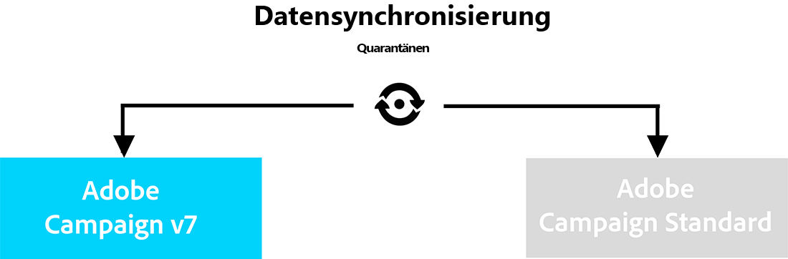

Der ACS-Connector synchronisiert Quarantänen zwischen Campaign v7 und Campaign Standard.

Ein Profil, das von Campaign v7 nach Campaign Standard repliziert wurde, enthält beispielsweise eine E-Mail-Adresse. Wenn die E-Mail-Adresse von Campaign Standard unter Quarantäne gestellt wird, werden die Daten bei der nächsten Synchronisierung an Campaign v7 übergeben. Weiterführende Informationen zu Quarantänen finden Sie unter [Quarantäne-Verwaltung](../../delivery/using/delivery-failures-quarantine.md) und [Quarantäne in Campaign Standard](https://experienceleague.adobe.com/docs/campaign-standard/using/testing-and-sending/monitoring-messages/understanding-quarantine-management.html?lang=de).

### Verwenden von replizierten Profilen {#using-replicated-profiles}

Replizierte Profile können von Campaign Standard und Campaign v7 für Zielgruppen-Workflows in Marketing-Kampagnen verwendet werden.

Anweisungen zum Durchführen eines Versands in Campaign Standard mit replizierten Profilen finden Sie unter [Profile synchronisieren](../../integrations/using/synchronizing-profiles.md). Außerdem erhalten Sie Anweisungen zum Teilen der Abmeldedaten zwischen Campaign v7 und Campaign Standard.

### Einschränkungen {#limitations}

Replizierte Profile stehen für Sendungen jederzeit zur Verfügung, weisen jedoch in Campaign Standard gewisse Einschränkungen auf. Sehen Sie sich die folgenden Elemente an, um zu erfahren, wie Sie sie am besten verwalten.

* **Schreibgeschützte Profile für Campaign Standard**: Replizierte Profile sind in Campaign Standard schreibgeschützt. Sie können jedoch Empfänger in Campaign v7 bearbeiten, und die Änderungen werden in Campaign Standard automatisch vom ACS-Connector aktualisiert.
* **In Campaign Standard erstellte Profile**: Der ACS-Connector repliziert Empfängerdaten in eine Richtung, von Campaign v7 nach Campaign Standard. Daher werden Profile, die aus Campaign Standard stammen, nicht nach Campaign v7 repliziert.
* **Grundlegende Empfängerdaten für Campaign Standard**: Der ACS-Connector repliziert Empfängerdaten, die für Campaign Standard geeignet sind. Dazu gehören Namen, Adressen, E-Mail-Adressen, Mobiltelefonnummern, private Telefonnummern und andere relevante Kontaktinformationen der Empfänger. Wenn zusätzliche Empfängerfelder und benutzerdefinierte Zielgruppentabellen, die in Campaign v7 verfügbar sind, für Ihren Workflow von entscheidender Bedeutung sind, wenden Sie sich an Ihren Berater.
* **Importieren von unter Quarantäne gestellten Profilen**: Listen von Profilen, die nicht kontaktiert werden möchten, können als unter Quarantäne gestellte Profile in Campaign v7 oder Campaign Standard importiert werden. Der Status der Profile wird bei der Quarantänesynchronisierung zwischen den Anwendungen berücksichtigt und wird nicht in Sendungen verwendet.
* **Abo eines Services in Campaign Standard kündigen**: Die Möglichkeit, das Abo eines Versands zu kündigen, wird nicht von Campaign Standard mit Campaign v7 synchronisiert. Sie können jedoch einen Campaign Standard-Versand so konfigurieren, dass sein Abmelde-Link an Campaign v7 weitergeleitet wird. Das Profil eines Empfängers, der auf den Abmelde-Link klickt, wird in Campaign v7 aktualisiert und die Daten werden nach Campaign Standard repliziert. Siehe [Ändern des Abmelde-Links](../../integrations/using/synchronizing-profiles.md#changing-the-unsubscription-link).
* Nur E-Mail-Broadlogs und -Trackinglogs werden von Campaign Standard nach Campaign v7 repliziert.

### Fakturierung {#billing}

Die Fakturierung ist von Ihrer Wahl des Programms für den Versand, Campaign v7 oder Campaign Standard, nicht betroffen. Rechnungsinformationen werden zwischen Campaign v7 und Campaign Standard abgestimmt. Wenn Sie also über beide Programme Sendungen an denselben Empfänger durchführen, wird er dennoch als ein aktives Profil gezählt.

## Umsetzung {#implementation}

Für den ACS-Connector gibt es zwei Arten von Implementierungen. Beide werden immer vom Adobe Campaign Consulting-Team durchgeführt.

>[!IMPORTANT]
>
>Dieser Abschnitt richtet sich ausschließlich an Spezialisten, die einen allgemeinen Überblick über den Implementierungsvorgang und seine wichtigsten Schritte erhalten sollen.
>
>Versuchen Sie auf keinen Fall, diese Implementierungen selbst durchzuführen. Es ist ausschließlich den Adobe Campaign-Beratern vorbehalten.

Mit **einfachen Implementierung** können Sie Empfänger (vordefinierte Felder), Services und Abonnements, Web-Anwendungen und Zielgruppen replizieren. Dies ist eine unidirektionale Replikation von Campaign v7 nach Campaign Standard.

Die **erweiterte Implementierung** kann für komplexere Anwendungsfälle verwendet werden, beispielsweise wenn Sie zusätzliche Empfängerfelder oder benutzerdefinierte Empfängertabellen verwenden (z. B. eine Transaktionstabelle). Siehe [Erweiterte Implementierung](#advanced-implementation).

### Installieren des Package {#installing-the-package}

Um die Funktion verwenden zu können **[!UICONTROL muss das Paket]** ACS-Connector“ installiert sein. Dies wird immer vom technischen Administrator oder Berater von Adobe durchgeführt.

Alle mit dem ACS-Connector in Verbindung stehenden technischen Elemente sind im Knoten **[!UICONTROL Administration > ACS-Connector]** des Explorers verfügbar.

### Technische und Replikations-Workflows {#technical-and-replication-workflows}

Nach der Installation des Pakets sind zwei technische Workflows unter **[!UICONTROL Administration > ACS-Connector > Prozesse]** verfügbar.

>[!IMPORTANT]
>
>Versuchen Sie niemals, diese Workflows zu ändern. Sie sollten nie einen Fehler machen oder angehalten werden. Wenden Sie sich in diesem Fall an Ihren Adobe Campaign-Berater.

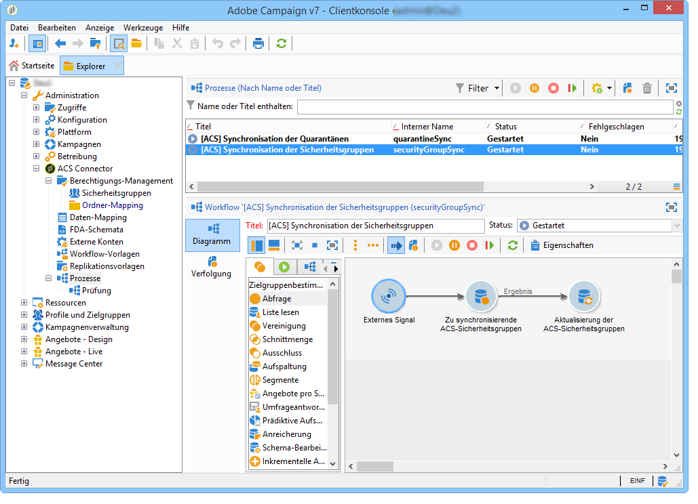

* **[!UICONTROL `[ACS] Quarantine synchronization`]** (quarantineSync): Dieser Workflow synchronisiert alle Quarantäneinformationen. Alle neuen Quarantänen in Campaign v7 werden nach Campaign Standard repliziert. Alle neuen Quarantänen in Campaign Standard werden nach Campaign v7 repliziert. Dadurch wird sichergestellt, dass alle Ausschlussregeln zwischen Campaign v7 und Campaign Standard synchronisiert werden.
* **[!UICONTROL `[ACS] Security group synchronization`]** (securityGroupSync): Dieser Workflow dient der Konvertierung von Berechtigungen. Siehe [Konvertierung der Berechtigungen](#rights-conversion).

Die folgenden Replikations-Workflows sind als „ready to be used“-Vorlagen verfügbar. Sie müssen von Ihrem Adobe Campaign-Berater implementiert werden.

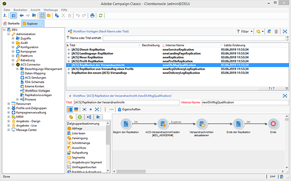

* **[!UICONTROL `[ACS] Profile replication`]** (newProfileReplication): Dieser inkrementelle Workflow repliziert Empfänger nach Campaign Standard. Standardmäßig werden alle nativen Empfängerfelder repliziert. Siehe [Standard-Empfängerfelder](#default-recipient-fields).
* **[!UICONTROL `[ACS] Service replication`]** (newServiceReplication): Dieser inkrementelle Workflow repliziert die ausgewählten Dienste nach Campaign Standard. Siehe Anwendungsfall [Webanwendungen synchronisieren](../../integrations/using/synchronizing-web-applications.md).
* **[!UICONTROL `[ACS] Landing pages replication`]** (newLandingPageReplication): Dieser inkrementelle Workflow repliziert die ausgewählten Webanwendungen nach Campaign Standard. Die Campaign v7-Webanwendungen werden als Landingpages in Campaign Standard angezeigt. Siehe Anwendungsfall [Webanwendungen synchronisieren](../../integrations/using/synchronizing-web-applications.md).
* **[!UICONTROL `[ACS] New replication`]** (newReplication): Dieser inkrementelle Workflow ist ein Beispiel, das zur Replikation einer benutzerdefinierten Tabelle verwendet werden kann. Siehe [Erweiterte Implementierung](#advanced-implementation).
* **[!UICONTROL `[ACS] Delivery-message replication`]** (newDlvMsgQualification): Dieser inkrementelle Workflow repliziert Versandnachrichten von Campaign Standard nach Campaign v7.
* **[!UICONTROL `[ACS] Profile delivery log replication`]** (newRcpDeliveryLogReplication): Dieser inkrementelle Workflow repliziert Versandkennungen, E-Mail-Broadlogs und E-Mail-Trackinglogs von Campaign Standard nach Campaign v7. Dabei werden nur Sendungen berücksichtigt, die von Campaign Standard an Profile gesendet werden, die in der Tabelle „nms:recipients“ von Campaign v7 enthalten sind.

  >[!NOTE]
  >
  > Wenn sowohl Campaign Classic- als auch Campaign Standard-Instanzen zum Senden von E-Mails mit getrackten URLs verwendet werden, kann während der Synchronisierung ein Problem mit doppelten URL-Tag-IDs auftreten. Um dies zu verhindern, aktualisieren Sie die Aktivität **Tracking-URLs aktualisieren** (writerTrackingUrls) im Workflow und fügen Sie dem Quellausdruck @tagId das Präfix &quot;ACS&quot; hinzu.

* **[!UICONTROL `[ACS] New delivery log replication`]** (newRcpDeliveryLogReplication): Dieser inkrementelle Workflow repliziert Versandkennungen, E-Mail-Broadlogs und E-Mail-Trackinglogs von Campaign Standard nach Campaign v7. Dabei werden nur Sendungen berücksichtigt, die von Campaign Standard an Profile gesendet werden, die in einer bestimmten Tabelle (zu definieren, nicht „nms:recipients“) von Campaign v7 enthalten sind.

### Standard-Empfängerfelder {#default-recipient-fields}

Wenn Sie zusätzliche Felder oder benutzerdefinierte Tabellen (z. B. Transaktionstabelle) haben, werden diese standardmäßig nicht repliziert. Es muss eine erweiterte Konfiguration durchgeführt werden. Siehe [Erweiterte Implementierung](#advanced-implementation).

Unten finden Sie die Liste der Empfängerfelder, die mit der Basisimplementierung repliziert werden. Dies sind die vordefinierten Felder:

<table> 
 <tbody> 
  <tr> 
   <td> <strong>Titel</strong>  </td> 
   <td> <strong>Interner Name</strong>  </td> 
  </tr> 
  <tr> 
   <td> Source Id  </td> 
   <td> @sourceId  </td> 
  </tr> 
  <tr> 
   <td> Erstellungsdatum  </td> 
   <td> @created  </td> 
  </tr> 
  <tr> 
   <td> Änderungsdatum  </td> 
   <td> @lastModified  </td> 
  </tr> 
  <tr> 
   <td> E-Mail  </td> 
   <td> @email  </td> 
  </tr> 
  <tr> 
   <td> Last name  </td> 
   <td> @lastName  </td> 
  </tr> 
  <tr> 
   <td> First name  </td> 
   <td> @firstName  </td> 
  </tr> 
  <tr> 
   <td> Middle name  </td> 
   <td> @middleName  </td> 
  </tr> 
  <tr> 
   <td> Mobile  </td> 
   <td> @mobilePhone  </td> 
  </tr> 
  <tr> 
   <td> Geburtsdatum  </td> 
   <td> @birthDate  </td> 
  </tr> 
  <tr> 
   <td> Geschlecht  </td> 
   <td> @gender  </td> 
  </tr> 
  <tr> 
   <td> Anrede  </td> 
   <td> @salutation  </td> 
  </tr> 
  <tr> 
   <td> No longer contact (by any channel)  </td> 
   <td> @blackList  </td> 
  </tr> 
  <tr> 
   <td> No longer contact by email  </td> 
   <td> @blackListEmail  </td> 
  </tr> 
  <tr> 
   <td> No longer contact by SMS  </td> 
   <td> @blackListMobile  </td> 
  </tr> 
  <tr> 
   <td> Phone  </td> 
   <td> @phone  </td> 
  </tr> 
  <tr> 
   <td> Fax  </td> 
   <td> @fax  </td> 
  </tr> 
  <tr> 
   <td> Adresse 1 (Wohnung)  </td> 
   <td> [location/@address1]  </td> 
  </tr> 
  <tr> 
   <td> Adresse 2  </td> 
   <td> [location/@address2]  </td> 
  </tr> 
  <tr> 
   <td> Adresse 3 (Straße und Hausnr.)  </td> 
   <td> [location/@address3]  </td> 
  </tr> 
  <tr> 
   <td> Adresse 4 (Ortszusatz)  </td> 
   <td> [location/@address4]  </td> 
  </tr> 
  <tr> 
   <td> Postleitzahl  </td> 
   <td> [location/@zipCode]  </td> 
  </tr> 
  <tr> 
   <td> Ort  </td> 
   <td> [location/@city]  </td> 
  </tr> 
  <tr> 
   <td> Code Bundesland/Region  </td> 
   <td> [location/@stateCode]  </td> 
  </tr> 
  <tr> 
   <td> Ländercode  </td> 
   <td> [location/@countryCode]  </td> 
  </tr> 
 </tbody> 
</table>

### Konvertierung der Berechtigungen {#rights-conversion}

Die Rechte werden in Campaign v7 und Campaign Standard unterschiedlich gehandhabt. In Campaign v7 basiert die Rechteverwaltung auf Ordnern, während sie in Campaign Standard auf Einheitenzugriff basiert (organisatorische/geografische Einheiten). Ein Campaign Standard-Benutzer gehört zur Sicherheitsgruppe, die den Einschränkungskontext enthält. Daher muss das Rechtesystem von Campaign v7 konvertiert werden, damit es dem von Campaign Standard entspricht. Es gibt mehrere Möglichkeiten, die Rechtekonvertierung durchzuführen. Nachfolgend finden Sie ein Beispiel für die Implementierung.

1. Verwenden Sie unter **[!UICONTROL Administration > ACS Connector > Rights Management >]** die Schaltfläche **[!UICONTROL Synchronisieren]**, um alle Campaign Standard-Sicherheitsgruppen abzurufen. Vorkonfigurierte Campaign Standard-Gruppen sind ausgeschlossen.

   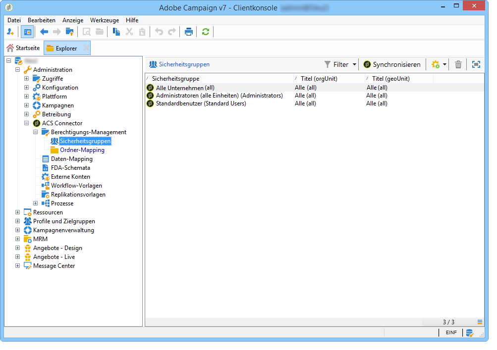

1. Wenn Ihr Berechtigungs-Management ordnerbasiert ist, gehen Sie zu **[!UICONTROL Administration > ACS-Connector > Berechtigungs-Management > Ordner-Mapping]** und ordnen Sie jeden erforderlichen Ordner einer Sicherheitsgruppe zu.

   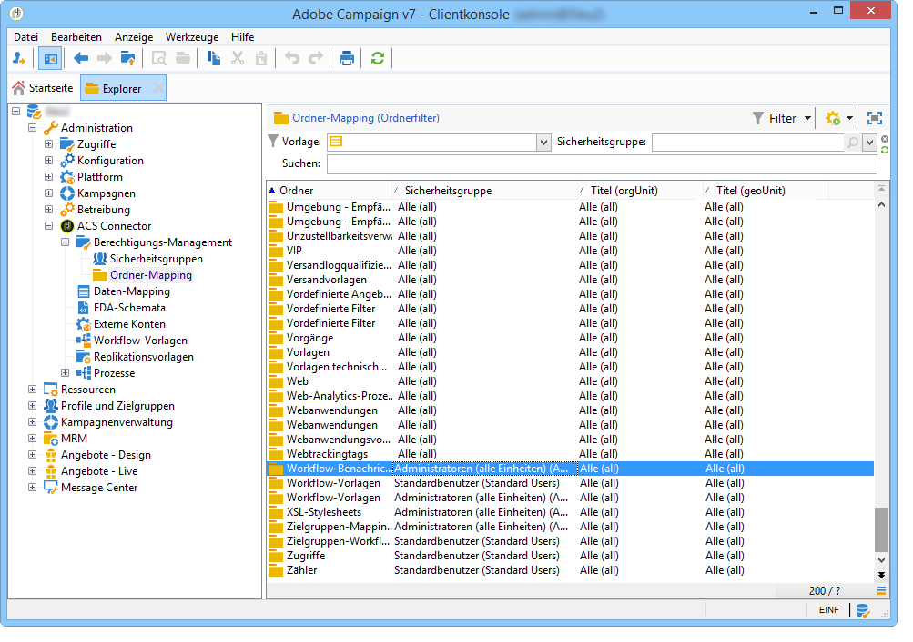

1. Diese Informationen werden dann in den Replikations-Workflows verwendet, um jedem zu replizierenden Objekt die entsprechenden Unternehmens-/geografischen Einheiten hinzuzufügen.

### Erweiterte Implementierung {#advanced-implementation}

In diesem Abschnitt werden einige Möglichkeiten beschrieben, die die erweiterte Implementierung bietet.

>[!IMPORTANT]
>
>Diese Informationen können nur als allgemeine Richtlinien verwendet werden. Wenden Sie sich für die Implementierung an Ihren Adobe Campaign-Berater.

Die erweiterte Implementierung fügt je nach Kundenanforderungen benutzerdefinierte Replikations-Workflows hinzu. Im Folgenden finden Sie einige Beispiele:

* Versandreplikation
* Kampagnenreplikation
* Programmreplikation
* Testadressenreplikation
* Transaktionsreplikation
* etc.

**Replizieren erweiterter Empfängerfelder**

Bei der einfachen Implementierung werden die vordefinierten Empfängerfelder repliziert. Wenn Sie benutzerdefinierte Felder replizieren möchten, die Sie dem Empfängerschema hinzugefügt haben, müssen Sie sie identifizieren.

1. Erstellen Sie unter **[!UICONTROL Administration > ACS-Connector > Daten-Mapping]** ein Zielgruppenbestimmungs-Mapping auf die Tabelle **[!UICONTROL nms:recipient]**.

   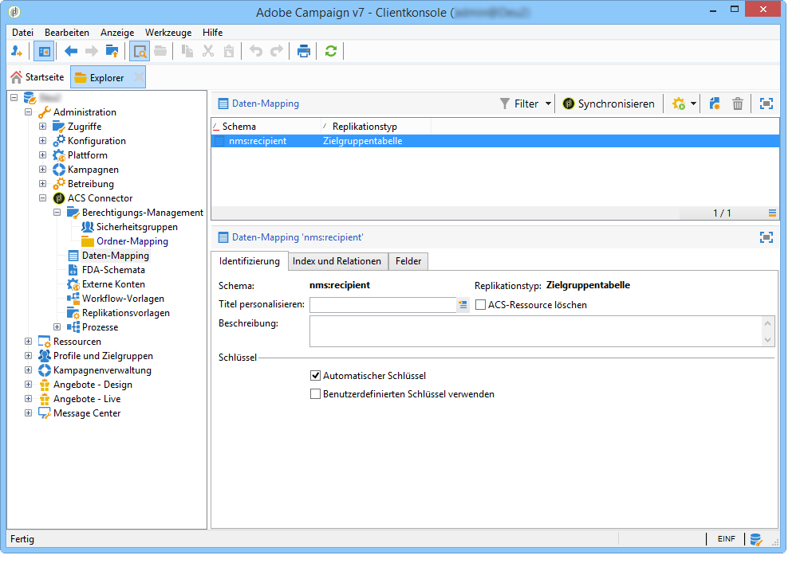

1. Wählen Sie die zusätzlichen zu replizierenden Felder und sonstige benötigte Informationen aus (Index, Links, Identifizierungsschlüssel).

   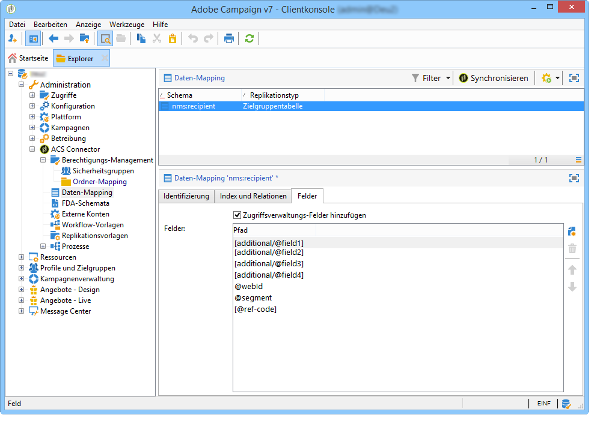

1. Öffnen Sie den Profilreplikations-Workflow (nicht die Vorlage, sondern die Workflow-Instanz selbst). Ändern Sie die Aktivitäten **[!UICONTROL Abfrage]** und **[!UICONTROL Daten-Update]** so, dass diese Felder eingeschlossen sind. Siehe [Technische und Replikations-Workflows](#technical-and-replication-workflows).

   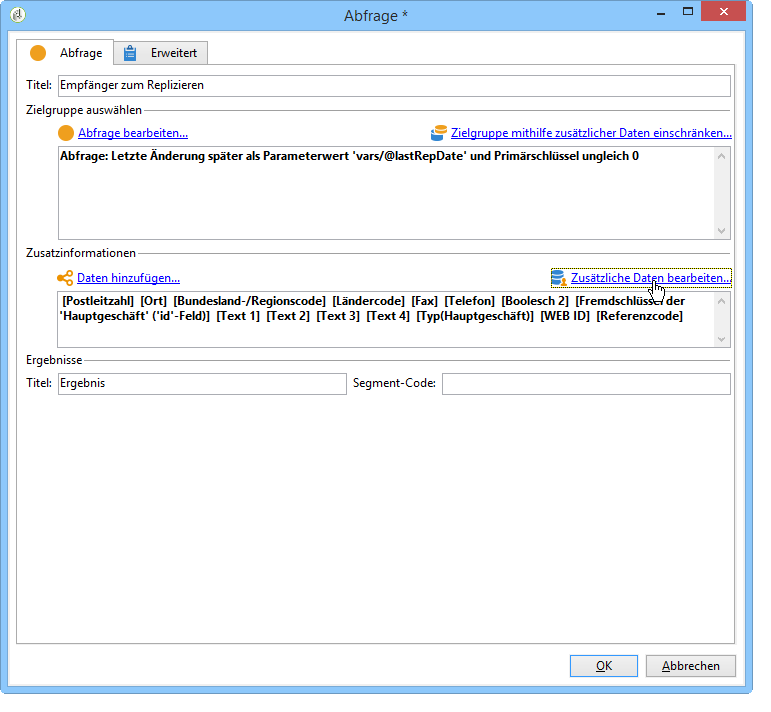

   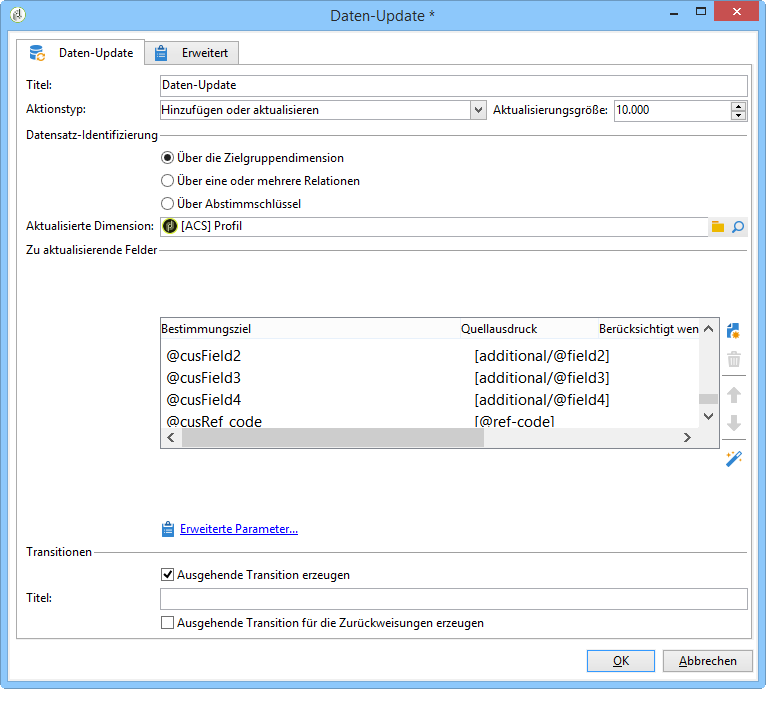

**Replizieren benutzerdefinierter Profiltabellen**

Mit der Basisimplementierung wird die vordefinierte Empfängertabelle repliziert. Wenn Sie benutzerdefinierte Empfängertabellen hinzugefügt haben, können Sie sie folgendermaßen identifizieren.

1. Erstellen Sie unter **[!UICONTROL Administration > ACS-Connector > Daten-Mapping]** ein Zielgruppenbestimmungs-Mapping auf Ihre benutzerdefinierte Profiltabelle.

   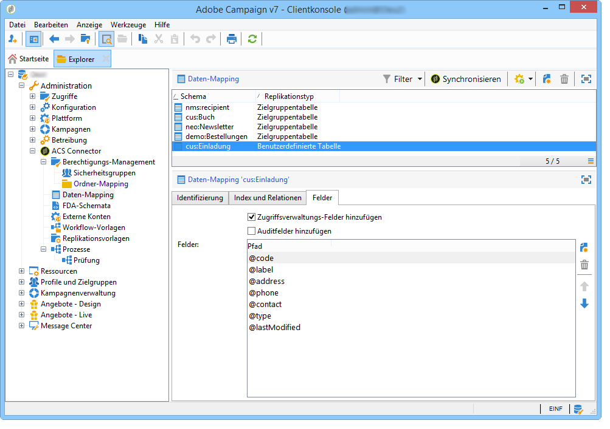

1. Definieren Sie die Identifizierungsdaten, den Index, die Links und die Felder, die Sie replizieren möchten.

   

1. Wenn Ihr Berechtigungs-Management ordnerbasiert ist, gehen Sie zu **[!UICONTROL Administration > ACS-Connector > Berechtigungs-Management > Ordner-Mapping]** und definieren Sie eine Sicherheitsgruppe für die mit Ihren benutzerdefinierten Tabellen verknüpften Ordner. Siehe [Konvertierung der Berechtigungen](#rights-conversion).
1. Verwenden Sie den Workflow **[!UICONTROL Neue Replikation]** (nicht die Vorlage, sondern die Workflow-Instanz selbst), um die benutzerdefinierte Tabelle und die zu replizierenden Felder einzuschließen. Siehe [Technische und Replikations-Workflows](#technical-and-replication-workflows).
