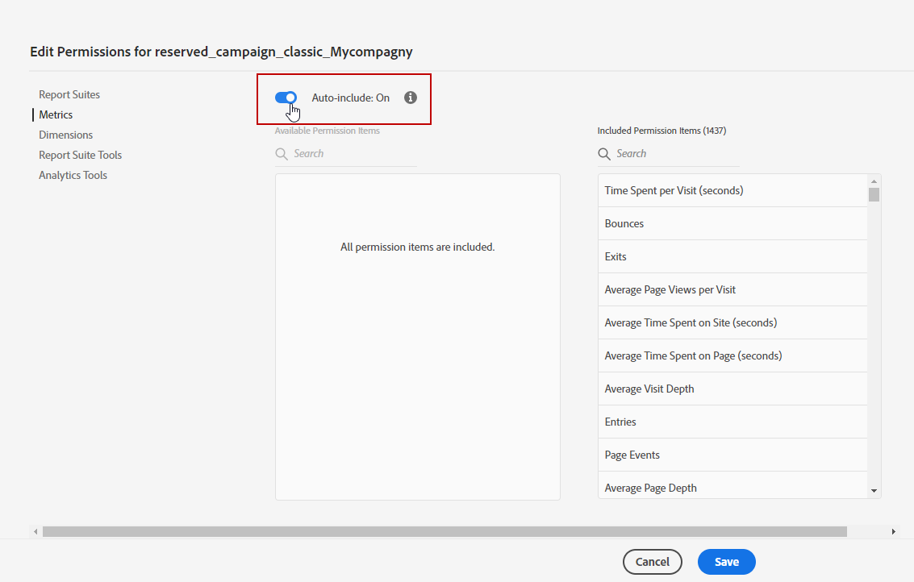

# Bereitstellung des Adobe Analytics Connectors {#adobe-analytics-connector-provisioning}

>[!CAUTION]
>
> Diese Schritte sollten nur bei Hybrid- und On-Premise-Implementierungen durchgeführt werden.
>
>Bei gehosteten und Campaign Managed Services-Implementierungen wenden Sie sich bitte die [Adobe-Kundenunterstützung](https://helpx.adobe.com/de/enterprise/admin-guide.html/enterprise/using/support-for-experience-cloud.ug.html).

Die Integration zwischen Adobe Campaign Classic und der Adobe Analytics-Authentifizierung unterstützt Adobe Identity Management Service (IMS):

* Wenn Sie ein migriertes externes Konto verwalten, müssen Sie Adobe IMS implementieren und über eine Adobe ID eine Verbindung zu Adobe Campaign herstellen.

  Bitte beachten Sie, dass eine über Adobe ID IMS angemeldete Person die Eigentümerin bzw. der Eigentümer des **Daten-Connector**-Kontos in Adobe Analytics sein muss und über die Berechtigungen für das [unten](#analytics-product-profile) aufgeführte **Produktprofil** verfügen muss.

Das Problem bestand darin, dass die Eigentümerin bzw. der Eigentümer des Daten-Connectors eine andere Person war als die, die bei Campaign angemeldet war und die Integration mit Analytics ausprobiert hatte.

* Wenn Sie einen neuen Connector implementieren, ist die Implementierung von Adobe IMS optional. Ohne einen Adobe ID-Benutzer verwendet Adobe Campaign einen technischen Anwender zur Synchronisierung mit Adobe Analytics.

Damit diese Integration funktioniert, müssen Sie ein Adobe Analytics-Produktprofil erstellen, das ausschließlich für den Analytics-Connector verwendet wird. Anschließend müssen Sie ein Developer Console-Projekt erstellen.

>[!AVAILABILITY]
>
> Die Anmeldedaten für Service-Konten (JWT) werden von Adobe demnächst eingestellt. Campaign-Integrationen mit Adobe-Lösungen und -Apps müssen jetzt mit OAuth-Server-to-Server-Anmeldedaten arbeiten.  
>
> * Wenn Sie eingehende Integrationen in Campaign implementiert haben, müssen Sie Ihr technisches Konto migrieren, wie in [dieser Dokumentation](https://developer.adobe.com/developer-console/docs/guides/authentication/ServerToServerAuthentication/migration/#_blank) beschrieben. Bestehende [Anmeldedaten für Service-Konten (JWT)](oauth-technical-account.md) sind noch bis zum 27. Januar 2025 gültig. 
>
> * Wenn Sie ausgehende Integrationen implementiert haben, z. B. die Integration von Campaign mit Analytics oder Experience Cloud Triggers, funktionieren diese noch bis zum 27. Januar 2025. Vor diesem Datum müssen Sie jedoch Ihre Campaign-Umgebung auf v7.4.1 aktualisieren und Ihr technisches Konto auf OAuth migrieren.

## Erstellen eines Adobe Analytics-Produktprofils {#analytics-product-profile}

Das Produktprofil bestimmt die Zugriffsebene eines Benutzers auf Ihre verschiedenen Analytics-Komponenten.

Wenn Sie bereits über ein Analytics-Produktprofil verfügen, sollten Sie dennoch ein neues Adobe Analytics-Produktprofil erstellen, das ausschließlich für den Analytics-Connector verwendet wird. Dadurch wird sichergestellt, dass Ihr Produktprofil mit den richtigen Berechtigungen für diese Integration ausgestattet ist.

Weiterführende Informationen zu Produktprofilen finden Sie in der [Dokumentation zur Admin Console](https://helpx.adobe.com/de/enterprise/admin-guide.html).

1. Wählen Sie in der [Admin Console](https://adminconsole.adobe.com/) Ihr Adobe Analytics-**[!UICONTROL Produkt]** aus.

   

1. Klicken Sie auf **[!UICONTROL Neues Profil]**.

   

1. Fügen Sie einen **[!UICONTROL Produktprofilnamen]** hinzu. Wir empfehlen, die folgende Syntax zu verwenden: `reserved_campaign_classic_<Company Name>`. Klicken Sie dann auf **[!UICONTROL Weiter]**.

   Dieses **[!UICONTROL Produktprofil]** sollte ausschließlich für den Analytics-Connector verwendet werden, um Konfigurationsfehler zu vermeiden.

1. Öffnen Sie das neu erstellte **[!UICONTROL Produktprofil]** und wählen Sie die Registerkarte **[!UICONTROL Berechtigungen]** aus.

   

1. Konfigurieren Sie die verschiedenen Funktionen, indem Sie auf **[!UICONTROL Bearbeiten]** klicken, und wählen Sie die Berechtigungen aus, die Sie Ihrem **[!UICONTROL Produktprofil]** zuweisen möchten, indem Sie auf das Pluszeichen (+) klicken.

   Weitere Informationen zum Verwalten von Berechtigungen finden Sie in der [Dokumentation zur Admin Console](https://helpx.adobe.com/de/enterprise/using/manage-permissions-and-roles.html).

1. Fügen Sie für die Funktion **[!UICONTROL Report Suites]** die **[!UICONTROL Report Suites]** hinzu, die Sie später verwenden müssen.

   Wenn Sie über keine Report Suites verfügen, können Sie diese mit [diesen Schritten](../../integrations/using/gs-aa.md) erstellen.

   

1. Fügen Sie für die Funktion **[!UICONTROL Metriken]** die **[!UICONTROL Metriken]** hinzu, die Sie später konfigurieren müssen.

   Bei Bedarf können Sie die Option &quot;Automatisch einschließen&quot; aktivieren, mit der jedes Berechtigungselement zur eingeschlossenen Liste hinzugefügt wird und automatisch neue Berechtigungselemente hinzugefügt werden.

   

1. Fügen Sie für die Funktion **[!UICONTROL Dimensionen]** die für zukünftige Konfigurationen benötigten **[!UICONTROL Dimensionen]** hinzu.

   Stellen Sie sicher, dass die ausgewählten Dimensionen mit den unter dem externen Konto konfigurierten Dimensionen übereinstimmen, und stimmen Sie sie mit den entsprechenden Nummern der eVars aus Adobe Analytics ab.

1. Fügen Sie für die Funktion **[!UICONTROL Report Suite-Tools]** die folgenden Berechtigungen hinzu:

   * **[!UICONTROL Report Suite-Verwaltung]**
   * **[!UICONTROL Konversionsvariablen]**
   * **[!UICONTROL Erfolgsereignisse]**
   * **[!UICONTROL Benutzerdefinierter Data Warehouse-Bericht]**
   * **[!UICONTROL Datenquellen-Manager]**
   * **[!UICONTROL Klassifizierungen]**

1. Fügen Sie für die Funktion **[!UICONTROL Analytics-Tools]** die folgenden Berechtigungen hinzu:

   * **[!UICONTROL Code-Manager - Web-Services]**
   * **[!UICONTROL Protokolle - Web-Services]**
   * **[!UICONTROL Web-Services]**
   * **[!UICONTROL Web-Service-Zugriff]**
   * **[!UICONTROL Erstellung berechneter Metriken]**
   * **[!UICONTROL Segmenterstellung]**

Ihr Produktprofil ist jetzt konfiguriert. Anschließend müssen Sie das OAuth-Projekt erstellen.

## Erstellen eines OAuth-Projekts {#create-adobe-io}

Um mit der Konfiguration Ihres Adobe Analytics-Connectors fortzufahren, greifen Sie auf die Adobe Developer Console zu und erstellen Sie Ihr OAuth-Server-zu-Server-Projekt.

Auf [dieser Seite](oauth-technical-account.md#oauth-service) finden Sie die ausführliche Dokumentation.

## Konfiguration und Verwendung {#adobe-analytics-connector-usage}

Weitere Informationen dazu, wie Sie mit Adobe Campaign und Adobe Analytics arbeiten können, finden Sie in der [Dokumentation zu Adobe Campaign v8](https://experienceleague.adobe.com/de/docs/campaign/campaign-v8/connect/ac-aa){target="_blank"}.