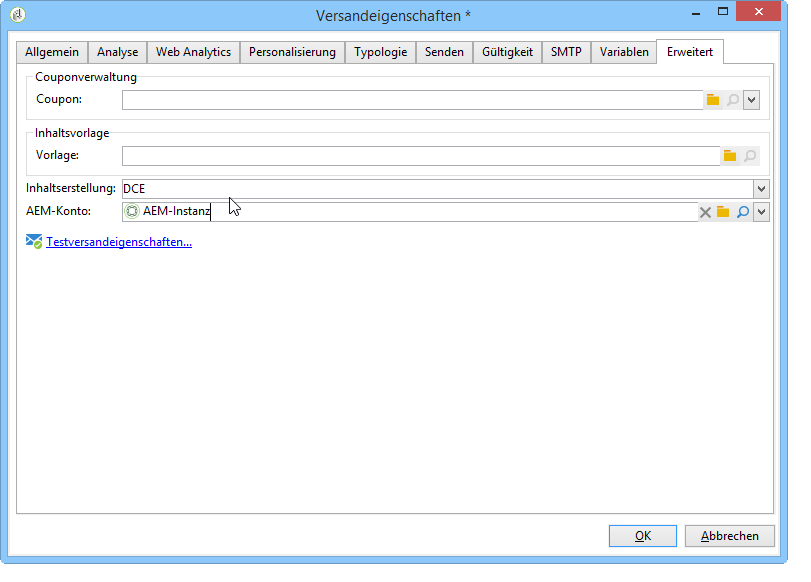

# Zugriff auf Assets konfigurieren{#configuring-access-to-assets}

Der folgende Abschnitt beschreibt die in Adobe Campaign erforderlichen Konfigurationsschritte, um die Funktionen der Integration mit Assets Core Service bzw. der Adobe-Experience-Manager-Assets-Bibliothek nutzen zu können.

>[!CAUTION]
>
>Die Integrationen können sich mitunter gegenseitig beeinflussen. Lesen Sie deshalb aufmerksam folgende Informationen, bevor Sie irgendeine Konfiguration vornehmen.

* Integration mit **Experience Cloud Assets**: Bei dieser Integration besteht die Möglichkeit, Bilder aus Ihrer Adobe Experience Cloud-Bibliothek zu verwenden. Abhängig von Ihrer Konfiguration und Ihrem Lizenzmodell kann diese Bibliothek &quot;Assets Core Service&quot; oder &quot;Assets on Demand&quot; sein. Diese Integration muss durch die Installation des integrierten Packages **[!UICONTROL Integration mit Adobe Marketing Cloud]** in Adobe Campaign eingerichtet werden.
* Bei der Integration mit **AEM Assets** besteht die Möglichkeit, Bilder aus Ihrer Adobe-Experience-Manager-Bibliothek zu verwenden. Diese Integration muss eingerichtet werden, indem das integrierte Package **[!UICONTROL Integration mit Adobe Experience Manager]** in Adobe Campaign installiert wird.

>[!NOTE]
>
>Wenn beide Packages (**[!UICONTROL Integration mit Adobe Experience Manager]** und **[!UICONTROL Integration mit Adobe Experience Cloud]**) installiert sind, können standardmäßig nur die Assets aus der Adobe Experience Cloud-Bibliothek verwendet werden. Um dennoch Zugriff zur AEM-Assets-Bibliothek zu erhalten, ist die Synchronisation von AEM Assets mit Adobe Experience Cloud zu konfigurieren. Auf diese Weise werden die AEM-Assets in der Adobe Experience Cloud-Bibliothek zugänglich. Weiterführende Hinweise bezüglich der Synchronisation von AEM Assets mit Adobe Experience Cloud finden Sie im [entsprechenden Handbuch](https://docs.adobe.com/docs/en/aod/overview/collaborating/aem-assets-aod-sync.html).

## Integration mit Experience Cloud Assets {#integrating-with-experience-cloud-assets}

Um die aus der Integration von Adobe Campaign und Experience Cloud Assets resultierenden Funktionen nutzen zu können, benötigen Sie folgende Elemente:

* Adobe-Experience-Cloud-Organisation,
* Aktivierten IMS-Authentifizierungsmodus von Adobe

Um die Verbindung zwischen Adobe Campaign und Adobe Experience Cloud zu aktivieren, konfigurieren Sie die Verbindung über IMS (Adobe-ID-Verbindungsservice). Weiterführende Informationen zu dieser Konfiguration finden Sie im Dokument [Verbindung mit Adobe ID](../../integrations/using/about-adobe-id.md). Sie umfasst:

* Die Installation des Packages **[!UICONTROL Integration mit Adobe Experience Cloud]**,
* die Konfiguration eines externen Adobe-Experience-Cloud-Kontos.

>[!NOTE]
>
>Auf die mit dieser Integration einhergehenden Funktionen können ausschließlich Benutzer zugreifen, die sich über IMS mit ihrer Adobe ID anmelden.

## Integration mit AEM Assets {#integrating-with-aem-assets}

Vor der Integration von AEM Assets mit Adobe Campaign ist zunächst die Integration von Adobe Experience Manager und Adobe Campaign zu konfigurieren. Diese Konfiguration umfasst insbesondere:

* Installation des integrierten Packages **[!UICONTROL Integration mit Adobe Experience Manager]**
* Konfiguration eines externen Kontos speziell für Adobe Experience Manager

Über die Integration von Adobe Campaign und Adobe Experience Manager erfahren Sie im [entsprechenden Handbuch](../../integrations/using/about-adobe-experience-manager.md).

Nach der Integration können Sie eine neue Versandvorlage in Adobe Campaign konfigurieren, um die AEM-Assets-Bibliothek zu verwenden. Gehen Sie dazu folgendermaßen vor:

1. Erstellen Sie eine neue Versandvorlage oder duplizieren Sie eine vorhandene. Weiterführende Informationen zu Versandvorlagen finden Sie auf [dieser Seite](../../delivery/using/about-templates.md).
1. Bearbeiten Sie die **Eigenschaften** dieser Vorlage.
1. Wählen Sie im Tab **[!UICONTROL Erweitert]** für **[!UICONTROL Inhaltserstellung]** die Option **DCE**.
1. Wählen Sie das externe **[!UICONTROL AEM-Konto]**, mit dem Sie auf Ihre AEM-Assets-Bibliothek zugreifen.

   

Beim Einfügen von Bildern in Versandinhalte auf der Basis dieser Vorlage haben Sie nun die Möglichkeit, über die Option **[!UICONTROL Freigegebenes Asset auswählen]** die AEM-Assets-Bibliothek nach Bildern zu durchsuchen. Weiterführende Informationen dazu finden Sie in [diesem Abschnitt](../../integrations/using/inserting-a-shared-asset.md).

>[!NOTE]
>
>Wenn das Package **[!UICONTROL Integration mit Adobe Experience Cloud]** installiert ist, können standardmäßig nur die Assets aus der Adobe Experience Cloud-Bibliothek verwendet werden. Um dennoch Zugriff zur AEM-Assets-Bibliothek zu erhalten, ist die Synchronisation von AEM Assets mit Adobe Experience Cloud zu konfigurieren. Auf diese Weise werden die AEM-Assets in der Adobe Experience Cloud-Bibliothek zugänglich. In diesem besonderen Fall ist die Erstellung einer spezifischen Versandvorlage nicht erforderlich. Weiterführende Hinweise bezüglich der Synchronisation von AEM Assets mit Adobe Experience Cloud finden Sie im [entsprechenden Handbuch](https://docs.adobe.com/docs/en/aod/overview/collaborating/aem-assets-aod-sync.html).

