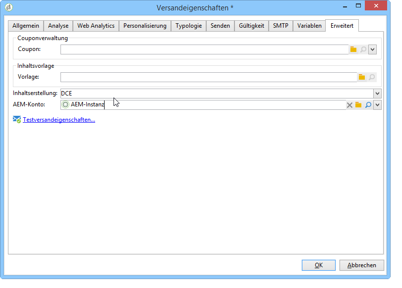

# Konfigurieren des Zugriffs auf Assets {#configuring-access-to-assets}

Dieser Abschnitt beschreibt die in Adobe Campaign erforderlichen Konfigurationsschritte, um die Funktionen der Integration mit Assets bzw. der Adobe Experience Manager Assets-Bibliothek (AEM Assets) nutzen zu können.

>[!CAUTION]
>
>Diese Integrationen sind gleichzeitig. Lesen Sie die folgenden Informationen sorgfältig durch, bevor Sie eine Konfiguration vornehmen.

* Integration mit **Experience Cloud Assets**: Bei dieser Integration können Sie Bilder aus Ihrer Adobe Experience Cloud-Bibliothek einfügen. Diese Integration muss eingerichtet werden, indem das integrierte Paket **[!UICONTROL Integration mit dem Adobe Experience Cloud]** in Adobe Campaign installiert wird.
* Bei der Integration mit **AEM Assets** besteht die Möglichkeit, Bilder aus Ihrer Adobe Experience Manager Assets-Bibliothek zu verwenden. Diese Integration muss eingerichtet werden, indem das integrierte Package **[!UICONTROL Integration mit Adobe Experience Manager]** in Adobe Campaign installiert wird. Beachten Sie, dass diese Integration ab Adobe Experience Manager 6.4 nicht mehr verfügbar ist.

>[!NOTE]
>
>Wenn die beiden Packages (**[!UICONTROL Integration mit Adobe Experience Manager]** und **[!UICONTROL Integration mit Adobe Experience Cloud]**) installiert sind, können nur die in der Adobe Experience Cloud-Bibliothek verfügbaren Assets verwendet werden.

## Integration mit Experience Cloud Assets {#integrating-with-experience-cloud-assets}

Um die aus der Integration von Adobe Campaign und Experience Cloud Assets resultierenden Funktionen nutzen zu können, benötigen Sie folgende Elemente:

* Adobe Experience Cloud-Organisation,
* Aktivierten IMS-Authentifizierungsmodus von Adobe

Um die Verbindung zwischen Adobe Campaign und Adobe Experience Cloud zu aktivieren, konfigurieren Sie die Verbindung über IMS (Adobe-ID-Verbindungsservice). Weiterführende Informationen zu dieser Konfiguration finden Sie im Dokument [Verbindung mit Adobe ID](../../integrations/using/about-adobe-id.md). Sie umfasst:

* Die Installation des Packages **[!UICONTROL Integration mit Adobe Experience Cloud]**,
* die Konfiguration eines externen Adobe Experience Cloud-Kontos.

>[!NOTE]
>
>Auf die mit dieser Integration einhergehenden Funktionen können ausschließlich Benutzer zugreifen, die sich über IMS mit ihrer Adobe ID anmelden.

## Integration mit AEM Assets {#integrating-with-aem-assets}

>[!CAUTION]
>
>Diese Funktion wurde ab Adobe Experience Manager 6.4 eingestellt. [Weitere Informationen](https://experienceleague.adobe.com/docs/experience-manager-64/release-notes/deprecated-removed-features.html?lang=de#removed-features)

Um AEM Assets mit Adobe Campaign zu integrieren, müssen Sie zunächst die Integration zwischen Adobe Experience Manager und Adobe Campaign konfigurieren. Diese Konfiguration erfordert hauptsächlich:

* Installation des integrierten Packages **[!UICONTROL Integration mit Adobe Experience Manager]**
* Konfiguration eines externen Kontos speziell für Adobe Experience Manager

Über die Integration von Adobe Campaign und Adobe Experience Manager erfahren Sie im [entsprechenden Handbuch](../../integrations/using/about-adobe-experience-manager.md).

Sobald diese Integration eingerichtet ist, können Sie eine neue Versandvorlage in Adobe Campaign so konfigurieren, dass sie die AEM Assets-Bibliothek verwendet. Gehen Sie dazu wie folgt vor:

1. Erstellen Sie eine neue Versandvorlage oder duplizieren Sie eine vorhandene. Weitere Informationen finden Sie in der [Dokumentation zu Campaign v8](https://experienceleague.adobe.com/docs/campaign/campaign-v8/send/create-templates.html?lang=de){target="_blank"}.
1. Bearbeiten Sie die **Eigenschaften** dieser Vorlage.
1. Wählen Sie im Tab **[!UICONTROL Erweitert]** für **[!UICONTROL Inhaltserstellung]** die Option **DCE**.
1. Wählen Sie das externe **[!UICONTROL AEM-Konto]**, mit dem Sie auf Ihre AEM-Assets-Bibliothek zugreifen.

   

Beim Einfügen von Bildern in Versandinhalte auf der Basis dieser Vorlage haben Sie nun die Möglichkeit, über die Option **[!UICONTROL Freigegebenes Asset auswählen]** die AEM-Assets-Bibliothek nach Bildern zu durchsuchen. Weiterführende Informationen finden Sie in [diesem Abschnitt](../../integrations/using/inserting-a-shared-asset.md).

>[!NOTE]
>
>Wenn das **[!UICONTROL Integration mit Adobe Experience Cloud]**-Paket auch auf Ihrer Adobe Campaign-Instanz installiert ist, können Sie nur die in der Adobe Experience Cloud-Bibliothek verfügbaren Assets verwenden. Um auch auf die Assets in Ihrer AEM Assets-Bibliothek zugreifen zu können, müssen Sie AEM Assets und Adobe Experience Cloud synchronisieren. Die Assets in AEM Assets sind dann auch in der Adobe Experience Cloud-Bibliothek verfügbar. In diesem Fall müssen Sie keine spezifische Versandvorlage erstellen.
