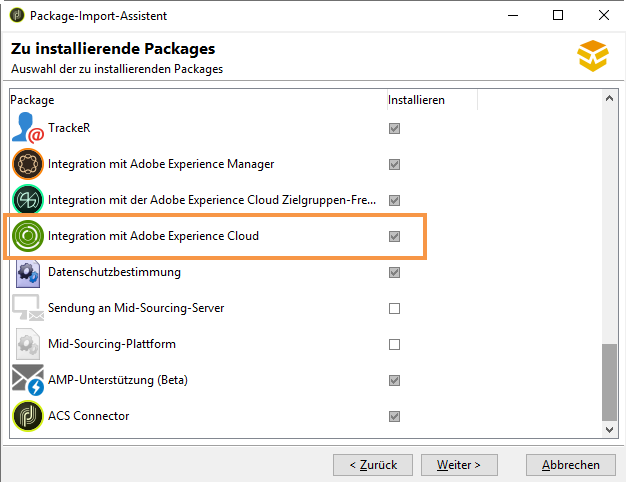
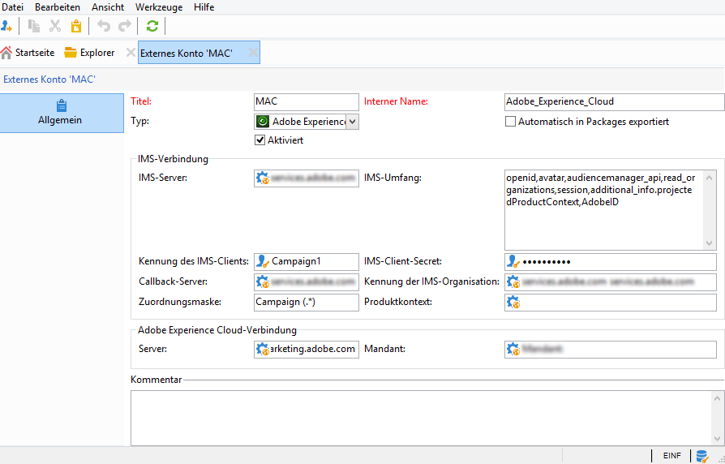

# IMS konfigurieren{#configuring-ims}

## Voraussetzungen {#prerequisites}

Für die Integration mit IMS:

* benötigen Sie eine Adobe Experience Cloud-Organisation und IMS-Kennungen (werden bereitgestellt, wenn sie Ihre erste Verbindung zu Adobe Experience Cloud herstellen).
* müssen Sie in Experience Cloud Benutzer hinzufügen. Weiterführende Informationen hierzu finden Sie auf dieser [Seite](https://docs.adobe.com/content/help/de-DE/core-services/interface/manage-users-and-products/admin-getting-started.html).

>[!NOTE]
>
>Vergewissern Sie sich, dass Ihre Benutzer mit Adobe Experience Cloud-Gruppen verknüpft sind, die mit Adobe Campaign synchronisiert werden. Siehe [Konfiguration des externen Kontos](#configuring-the-external-account).

## Konsole aktualisieren {#updating-the-console}

Die Nutzung dieser Funktion setzt die Installation der neuesten Version der Konsole voraus.

## Package-Installation {#installing-the-package}

Sie müssen das Package **[!UICONTROL Integration mit Adobe Experience Cloud]** installieren. Die Integration-Package-Installation entspricht der Installation eines Standard-Packages, die auf [dieser Seite](../../installation/using/installing-campaign-standard-packages.md) beschrieben wird.

## Konfiguration des externen Kontos {#configuring-the-external-account}

Konfigurieren Sie das externe Konto für **Adobe Experience Cloud** im Knoten **[!UICONTROL Administration > Plattform > Externe Konten]**.

>[!CAUTION]
>
>Diese Konfiguration ist dem technischen Administrator vorbehalten.

Folgende Angaben sind erforderlich:

* Informationen zur Verbindung mit dem verwendeten IMS-Server (Kennung und Secret). Wenden Sie sich diesbezüglich bitte an den Adobe-Support. Weiterführende Informationen finden Sie im Abschnitt [Häufig gestellte Fragen für Experience Cloud-Administratoren](https://docs.adobe.com/content/help/de-DE/core-services/interface/manage-users-and-products/faq.html).

   Die **[!UICONTROL Callback-Server]**-Adresse muss in **https** angegeben werden. Dieses Feld enthält die URL zum Zugriff auf Ihre Adobe-Campaign-Instanz.

* Kennung der IMS-Organisations-ID (organization ID): Sie ist in Adobe Experience Cloud verfügbar (über **[!UICONTROL Administration > Experience Cloud Details]**). Diese Informationen erhalten Sie bei der Anmeldung zu Adobe Experience Cloud.
* Zuordnungsmaske: Dieses Feld dient dazu, die Syntax zu definieren, die die Synchronisation der Konfigurationsnamen aus dem Enterprise Dashboard mit den Adobe-Campaign-Gruppen ermöglicht. Wenn Sie die Syntax &quot;Campaign - tenant_id - (.*)&quot; verwenden, wird die in Adobe Campaign erstellte Sicherheitsgruppe dem Konfigurationsnamen &quot;Campaign - tenant_id - internal_name&quot; im Enterprise Dashboard zugeordnet.

   >[!CAUTION]
   >
   >Die Zuordnungsmaske ist für die fehlerfreie Herstellung der Verbindung über die Adobe ID unerlässlich.

* Informationen zur Verbindung mit Adobe Experience Cloud, insbesondere der Name des Adobe-Experience-Cloud-Mandanten.

