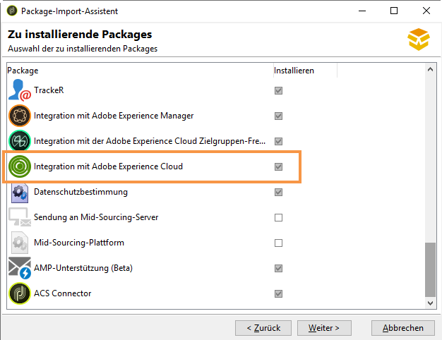
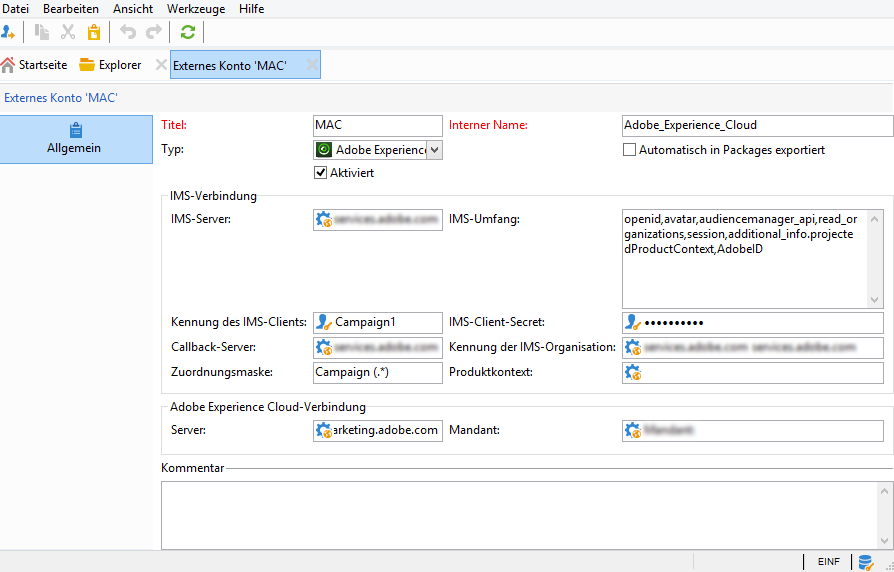

# Konfigurieren von IMS{#configuring-ims}

>[!IMPORTANT]
>
>Als von Campaign gehostete Benutzerin bzw. gehosteter Benutzer oder Managed Services-Benutzerin bzw. -Benutzer gehört Ihre Adobe IMS-Implementierung Adobe. Die unten beschriebenen Schritte gelten nur für On-Premise- und Hybrid-Kundinnen und -Kunden.
> Die Adobe IMS-Implementierung darf nur von technischen Adobe-Admins durchgeführt werden. Wenden Sie sich an den Adobe-Support, um den Implementierungsprozess einzuleiten.

## Voraussetzungen {#prerequisites}

* Müssen Sie über einen Organisationsnamen und eine Organisations-ID für Adobe Experience Cloud verfügen. Auf [dieser Seite](https://experienceleague.adobe.com/docs/core-services/interface/administration/organizations.html?lang=de){_blank} finden Sie Ihre Organisations-ID.
* müssen Sie in Experience Cloud Benutzer hinzufügen. Weiterführende Informationen hierzu finden Sie auf dieser [Seite](https://experienceleague.adobe.com/docs/core-services/interface/administration/admin-getting-started.html?lang=de){_blank}.

>[!NOTE]
>
>Vergewissern Sie sich, dass Ihre Benutzer mit Adobe Experience Cloud-Gruppen verknüpft sind, die mit Adobe Campaign synchronisiert werden. [Weitere Informationen](#configuring-the-external-account).

## Aktualisieren der Konsole {#updating-the-console}

Die Nutzung dieser Funktion setzt die Installation der neuesten Version der Client-Konsole voraus.

## Package-Installation {#installing-the-package}

Sie müssen das integrierte Paket **[!UICONTROL Integration mit Adobe Experience Cloud]** installieren. Die Installation eines Integrationspakets erfolgt auf die gleiche Weise wie die Installation eines Standardpakets, was auf [dieser Seite](../../installation/using/installing-campaign-standard-packages.md) beschrieben wird.

## Konfiguration des externen Kontos {#configuring-the-external-account}

Konfigurieren Sie das externe Konto für **Adobe Experience Cloud** im Knoten **[!UICONTROL Administration > Plattform > Externe Konten]**.

Folgende Angaben sind erforderlich:

* Verbindungsdaten des verwendeten IMS-Servers (ID und Geheimnis). Diese Daten werden vom Adobe-Kundenunterstützungs-Team bereitgestellt. Weitere Informationen finden Sie im Abschnitt [Häufig gestellte Fragen für Adobe Experience Cloud-Admins](https://experienceleague.adobe.com/docs/core-services/interface/manage-users-and-products/faq.html?lang=de).

  Die Adresse des **[!UICONTROL Callback-Servers]** muss mit **https** angegeben werden. Dieses Feld enthält die URL zum Zugriff auf Ihre Adobe Campaign-Instanz.

* Organisations-ID: Auf [dieser Seite](https://experienceleague.adobe.com/docs/core-services/interface/administration/organizations.html?lang=de){_blank} finden Sie Ihre Organisations-ID.

* Zuordnungsmaske: In diesem Feld können Sie die Syntax definieren, mit der Konfigurationsnamen im Enterprise-Dashboard mit den Gruppen in Adobe Campaign synchronisiert werden. Wenn Sie die Syntax „Campaign – tenant_id – (.&#42;)“ verwenden, wird die in Adobe Campaign erstellte Sicherheitsgruppe dem Konfigurationsnamen „Campaign – tenant_id – internal_name“ im Enterprise-Dashboard zugeordnet.

* Verbindungsdaten für Adobe Experience Cloud, insbesondere der Name des Adobe Experience Cloud-Mandanten.
