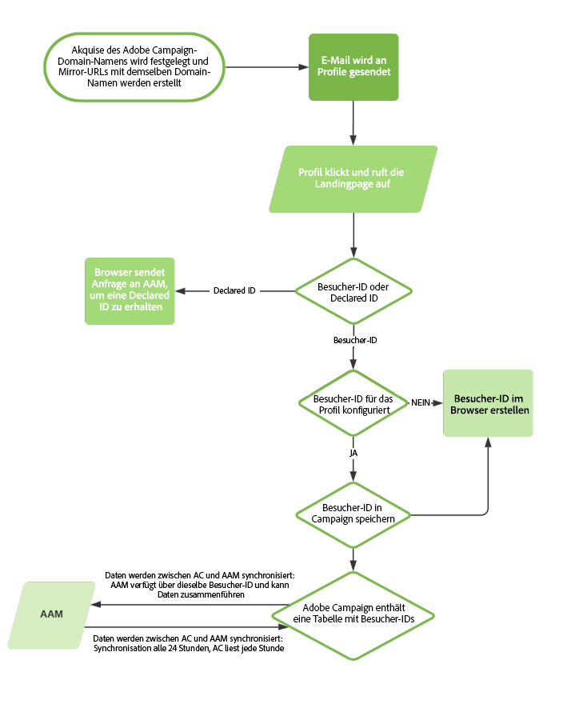
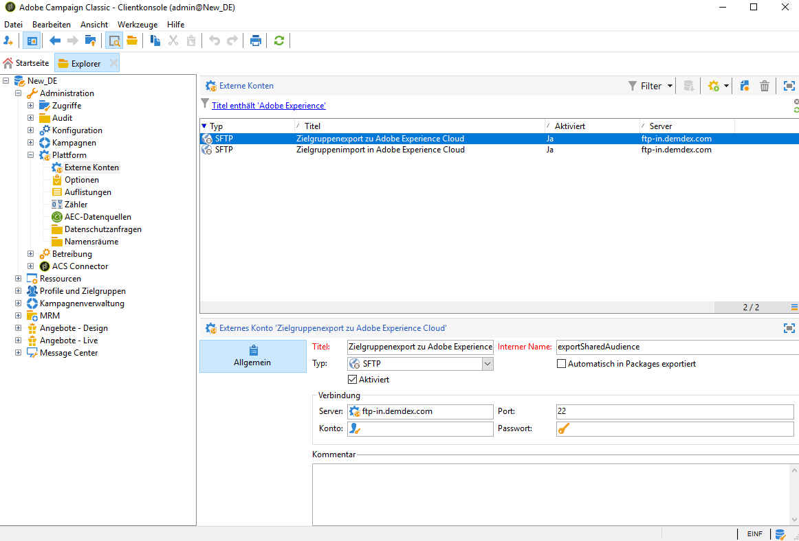
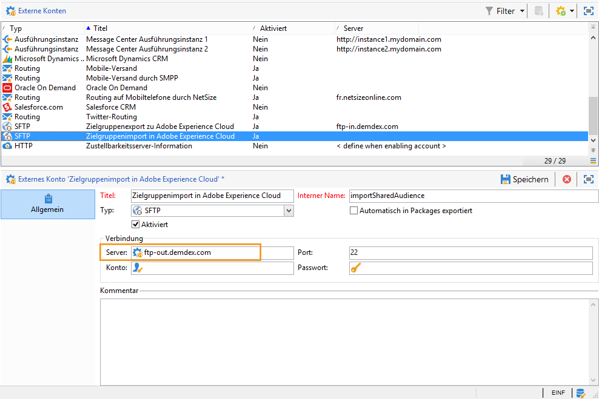
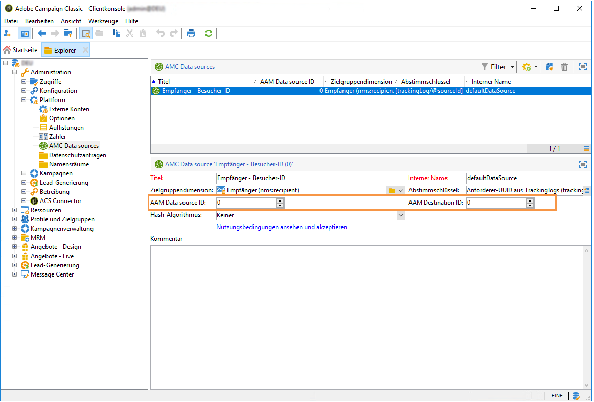

# Integration mit freigegebenen Zielgruppen in Adobe Campaign konfigurieren{#configuring-shared-audiences-integration-in-adobe-campaign}


Nach Übermittlung dieses Antrags wird dieser von Adobe bearbeitet. Sie werden ersucht, Informationen bereitzustellen, und darauf hingewiesen, dass Sie die Konfiguration abschließen müssen:

1. [Schritt 1: Konfigurieren bzw. überprüfen Sie die externen Konten in Adobe Campaign.](#step-1--configure-or-check-the-external-accounts-in-adobe-campaign)
1. [Schritt 2: Konfigurieren Sie die Datenquellen.](#step-2--configure-the-data-source)
1. [Schritt 3: Konfigurieren Sie den Campaign Tracking Server.](#step-3--configure-campaign-tracking-server)
1. [Schritt 4: Konfigurieren Sie den Visitor-ID-Dienst.](#step-4--configure-the-visitor-id-service)

>[!IMPORTANT]
>
>Wenn Sie die demdex-Domain verwenden und die Syntax **ftp-out.demdex.com** für das externe Importkonto und **ftp-in.demdex.com** für das externe Exportkonto befolgen, müssen Sie Ihre Implementierung entsprechend anpassen und zum Amazon S3-Connector (Simple Storage Service) wechseln, um Daten zu importieren oder zu exportieren. Weitere Informationen zur Konfiguration von externen Konten mit Amazon S3 finden Sie in [diesem Abschnitt](../../integrations/using/configuring-shared-audiences-integration-in-adobe-campaign.md#step-1--configure-or-check-the-external-accounts-in-adobe-campaign).

Im folgenden Diagramm wird beschrieben, wie diese Integration funktioniert. Hier steht AAM für Adobe Audience Manager und AC für Adobe Campaign.

{align="center"}

## Schritt 1: Konfigurieren bzw. überprüfen Sie die externen Konten in Adobe Campaign. {#step-1--configure-or-check-the-external-accounts-in-adobe-campaign}

Gehen Sie folgendermaßen vor, um die externen Konten in Adobe Campaign zu konfigurieren bzw. zu überprüfen:

1. Wählen Sie das **[!UICONTROL Explorer]**-Symbol aus.
1. Gehen Sie zu **[!UICONTROL Administration > Plattform > Externe Konten]**. Die entsprechenden SFTP-Konten sollten von Adobe konfiguriert und die erforderlichen Informationen sollten Ihnen übermittelt worden sein.

   * **[!UICONTROL importSharedAudience]**: Konto für den Zielgruppe-Import.
   * **[!UICONTROL exportSharedAudience]**: Konto für den Zielgruppe-Export.

   

1. Wählen Sie das externe Konto **[!UICONTROL Zielgruppenexport in Adobe Experience Cloud]** aus.

1. Wählen Sie aus der Dropdown-Liste **[!UICONTROL Typ]** die Option **[!UICONTROL AWS S3]** aus.

1. Geben Sie die folgenden Details an:

   * **[!UICONTROL AWS-S3-Konto-Server]**
Die URL Ihres Servers sollte wie folgt ausgefüllt werden:

     ```
     <S3bucket name>.s3.amazonaws.com/<s3object path>
     ```

   * **[!UICONTROL AWS-Zugriffsschlüssel-ID]**
Informationen darüber, wo Sie die AWS-Zugriffsschlüssel-ID finden, erhalten Sie [auf dieser Seite](https://docs.aws.amazon.com/general/latest/gr/aws-sec-cred-types.html#access-keys-and-secret-access-keys).

   * **[!UICONTROL Geheimer Zugriffsschlüssel für AWS]**
Informationen darüber, wo Sie Ihren geheimen AWS-Zugriffsschlüssel finden, erhalten Sie [auf dieser Seite](https://aws.amazon.com/fr/blogs/security/wheres-my-secret-access-key/).

   * **[!UICONTROL AWS-Region]**
Weiterführende Informationen zur AWS-Region finden Sie [auf dieser Seite](https://aws.amazon.com/about-aws/global-infrastructure/regions_az/).

   

1. Klicken Sie auf **[!UICONTROL Speichern]** und konfigurieren Sie das externe Konto **[!UICONTROL Freigegebene Zielgruppen importieren]**, wie in den vorherigen Schritten beschrieben.

Ihre externen Konten sind somit konfiguriert.

## Schritt 2: Konfigurieren Sie die Datenquellen. {#step-2--configure-the-data-source}

**Empfänger – Besucher-ID** wird in Audience Manager erstellt. Dies ist eine native Datenquelle, die standardmäßig für die Besucher-ID konfiguriert ist. Die in Campaign erstellten Segmente werden Teil dieser Datenquelle sein.

So konfigurieren Sie die Datenquelle **[!UICONTROL Empfänger - Besucher-ID]**:

1. Wählen Sie im Knoten **[!UICONTROL Explorer]** **[!UICONTROL Administration > Plattform > AMC Data sources]** aus.
1. Wählen Sie **[!UICONTROL Empfänger - Besucher-ID]** aus.
1. Geben Sie die von Adobe bereitgestellte **[!UICONTROL ID der Datenquelle]** und die **[!UICONTROL AAM Destination ID]** ein.

   

## Schritt 3: Konfigurieren Sie den Campaign Tracking Server. {#step-3--configure-campaign-tracking-server}

Für die Konfiguration der Integration mit Audience Manager muss auch der Campaign Tracking Server konfiguriert werden.

Damit freigegebene Zielgruppen mit der Besucher-ID funktionieren, sollte die Tracking-Server-Domain eine Subdomain der angeklickten URL oder der Haupt-Website sein.

>[!IMPORTANT]
>
>Stellen Sie sicher, dass der Campaign Tracking Server auf der Domain (CNAME) registriert ist. Weitere Informationen zur Delegierung von Domains finden Sie in [diesem Artikel](https://experienceleague.adobe.com/docs/control-panel/using/subdomains-and-certificates/setting-up-new-subdomain.html?lang=de).

## Schritt 4: Konfigurieren Sie den Visitor-ID-Dienst. {#step-4--configure-the-visitor-id-service}

Falls Ihr Visitor-ID-Dienst nie in Ihren Web-Parametern und Webseiten konfiguriert wurde, finden Sie im folgenden [Dokument](https://experienceleague.adobe.com/docs/id-service/using/implementation/setup-aam-analytics.html?lang=de) oder im folgenden [Video](https://helpx.adobe.com/de/marketing-cloud/how-to/email-marketing.html#step-two) nähere Informationen dazu.

Synchronisieren Sie Kunden-IDs mit der Declared ID mithilfe der `setCustomerID`-Funktion im ID-Dienst von Experience Cloud mit dem Integrations-Code: `AdobeCampaignID`. Die `AdobeCampaignID` sollte mit dem Wert des Abgleichsschlüssels übereinstimmen, der in der Empfängerdatenquelle festgelegt ist, die in [Schritt 2: Konfigurieren Sie die Datenquellen](#step-2--configure-the-data-sources) festgelegt wurde.

Die Konfiguration und Bereitstellung sind jetzt abgeschlossen. Die Integration kann somit zum Import und Export von Zielgruppen und Segmenten verwendet werden.
