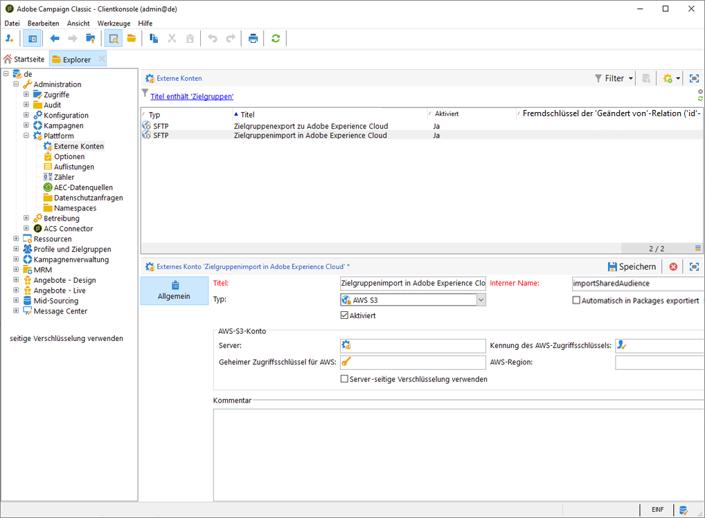
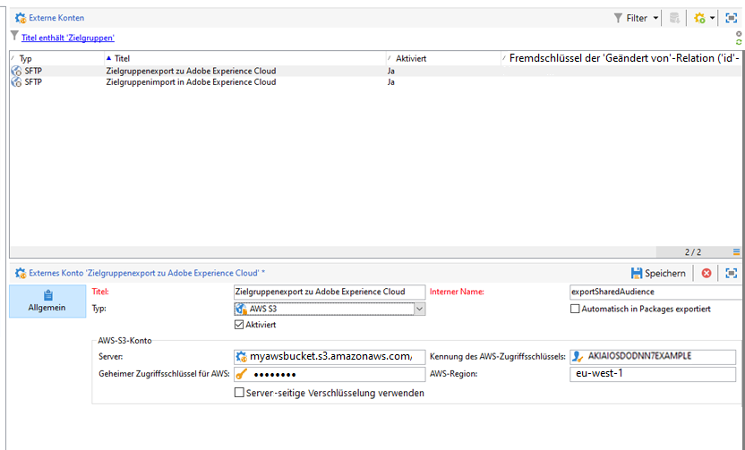

# Integration mit freigegebenen Zielgruppen in Adobe Campaign konfigurieren{#configuring-shared-audiences-integration-in-adobe-campaign}

Nach Übermittlung dieses Antrags wird dieser von Adobe bearbeitet. Sie werden ersucht, Informationen bereitzustellen, und darauf hingewiesen, dass Sie die Konfiguration abschließen müssen:

1. [Schritt 1: Konfigurieren bzw. überprüfen Sie die externen Konten in Adobe Campaign.](#step-1--configure-or-check-the-external-accounts-in-adobe-campaign)
1. [Schritt 2: Konfigurieren Sie die Datenquellen.](#step-2--configure-the-data-source)
1. [Schritt 3: Konfigurieren Sie den Campaign Tracking Server.](#step-3--configure-campaign-tracking-server)
1. [Schritt 4: Konfigurieren Sie den Visitor-ID-Dienst.](#step-4--configure-the-visitor-id-service)

## Schritt 1: Konfigurieren bzw. überprüfen Sie die externen Konten in Adobe Campaign.  {#step-1--configure-or-check-the-external-accounts-in-adobe-campaign}

Gehen Sie folgendermaßen vor, um die externen Konten in Adobe Campaign zu konfigurieren bzw. zu überprüfen:

1. Wählen Sie das **[!UICONTROL Explorer]**-Symbol aus.
1. Gehen Sie zu **[!UICONTROL Administration > Plattform > Externe Konten]**. Die entsprechenden SFTP-Konten sollten von Adobe konfiguriert und die erforderlichen Informationen sollten Ihnen übermittelt worden sein.

   * **[!UICONTROL importSharedAudience]**: SFTP-Konto für den Zielgruppen-Import.
   * **[!UICONTROL exportSharedAudience]**: SFTP-Konto für den Zielgruppen-Export.

   

1. Füllen Sie das **[!UICONTROL Server]**-Feld aus: die Domain **ftp-out.demdex.com** für das externe Importkonto und die Domain **ftp-in.demdex.com** für das externe Exportkonto.

   Beachten Sie dabei, dass ein Export aus Campaign ein Import in Audience Manager oder People core service ist.

   >[!NOTE]
   >
   >Wenn Sie S3 verwenden, geben Sie Ihren **[!UICONTROL AWS S3-Konto-Server]** wie folgt ein:\
   `<S3bucket name>.s3.amazonaws.com/<s3object path>`\
   Weitere Informationen zur Konfiguration Ihres S3-Kontos finden Sie auf [dieser Seite](../../platform/using/external-accounts.md#amazon-simple-storage-service--s3--external-account).

   

1. Geben Sie das von Adobe bereitgestellte **[!UICONTROL Konto]** und **[!UICONTROL Passwort]** ein.

Ihre externen Konten sind somit konfiguriert.

## Schritt 2: Konfigurieren Sie die Datenquellen.{#step-2--configure-the-data-source}

Die **Empfänger - Besucher-ID** wird innerhalb von Audience Manager erstellt. Dies ist eine native Datenquelle, die standardmäßig für die Besucher-ID konfiguriert wird. In Campaign erstellte Segmente werden ebenfalls Teil dieser Datenquelle sein.

So konfigurieren Sie die Datenquelle **[!UICONTROL Empfänger - Besucher-ID]**:

1. Wählen Sie im Knoten **[!UICONTROL Explorer]** **[!UICONTROL Administration > Plattform > AMC Data sources]** aus.
1. Wählen Sie **[!UICONTROL Empfänger - Besucher-ID]** aus.
1. Geben Sie die von Adobe bereitgestellte **[!UICONTROL ID der Datenquelle]** und die **[!UICONTROL AAM Destination ID]** ein.

   

## Schritt 3: Konfigurieren Sie den Campaign Tracking Server.  {#step-3--configure-campaign-tracking-server}

Für die Konfiguration der Integration mit People Core Service oder Audience Manager muss auch der Campaign Tracking Server konfiguriert werden.

Der Campaign Tracking Server muss in der Domain (CNAME) registriert sein. Weitere Informationen zur Delegation von Domains finden Sie in [diesem Artikel](https://helpx.adobe.com/de/campaign/kb/domain-name-delegation.html).

## Schritt 4: Konfigurieren Sie den Visitor-ID-Dienst.{#step-4--configure-the-visitor-id-service}

Falls Ihr Visitor-ID-Dienst nie in Ihren Web-Parametern und Webseiten konfiguriert wurde, finden Sie im folgenden [Dokument](https://docs.adobe.com/content/help/en/id-service/using/implementation/setup-aam-analytics.html) oder im folgenden [Video](https://helpx.adobe.com/de/marketing-cloud/how-to/email-marketing.html#step-two) nähere Informationen dazu .

Die Konfiguration und Einrichtung sind jetzt abgeschlossen. Die Integration kann somit zum Import und Export von Audiences und Segmenten verwendet werden.
