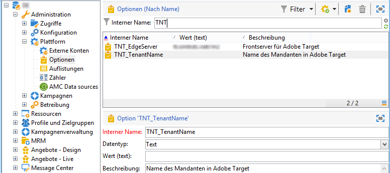

# Integration mit Adobe Target konfigurieren{#configuring-the-integration-with-adobe-target}

## Voraussetzungen {#prerequisites}

Um die aus der Integration von Adobe Campaign und Adobe Target resultierenden Funktionen nutzen zu können, benötigen Sie folgende Elemente:

* Organisationen für Adobe Experience Cloud und Adobe Target;
* Adobe-Target-Rawbox für Adobe Campaign.

## Konfigurationen in Adobe Campaign {#configuring-adobe-campaign}

Gehen Sie wie folgt vor:

1. Installieren Sie das **[!UICONTROL Integration with the Adobe Experience Cloud]** Standardpaket. Das Installieren eines Integrationspakets entspricht dem Installieren eines Standardpakets, das im Abschnitt [Paketimport](../../platform/using/working-with-data-packages.md#importing-packages) beschrieben wird. Dadurch erhalten Sie Zugriff auf die freigegebenen Assets über Digital Asset Manager.
1. Aktivieren Sie die Verbindung über IMS (Adobe-ID-Verbindungsservice), wenn Sie in Ihren E-Mails freigegebene Bilder von Adobe Experience Cloud verwenden möchten. Lesen Sie diesbezüglich den Abschnitt [IMS](../../integrations/using/about-adobe-id.md).
1. In **[!UICONTROL Administration > Platform > Options]**, configure the server and organization (Tenant) options for Adobe Target:

   * **[!UICONTROL TNT_EdgeServer]** :Adobe Target-Server, der für die Integration verwendet wird. Diese Option ist bereits standardmäßig ausgewählt. Dieser Wert entspricht dem Adobe Target-Wert **[!UICONTROL Domain Server]**, gefolgt vom Wert **/m2**. Beispiel: **tt.omtrdc.net/m2**.
   * **[!UICONTROL TNT_TenantName]** :Name der Adobe Target-Organisation. Dieser Wert entspricht dem Adobe-Target-**[!UICONTROL Client]**-Namen .
   

