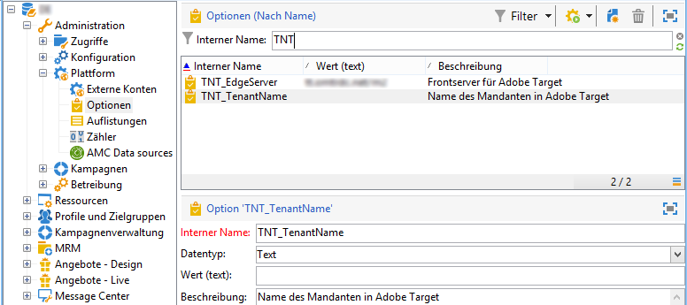

# Konfigurieren der Integration mit Adobe Target{#configuring-the-integration-with-adobe-target}

>[!CAUTION]
>
> Wenden Sie sich als Kunde mit gehostetem oder hybridem System an Ihren Adobe-Support-Mitarbeiter, um diese Integration zu konfigurieren. Die folgenden Schritte gelten nur für On-Premise-Kunden.

Diese Integration erfordert:

* Organisationen für Adobe Experience Cloud und Adobe Target;
* Adobe-Target-Rawbox für Adobe Campaign.

Gehen Sie wie folgt vor, um diese Integration in Adobe Campaign zu konfigurieren:

1. Installieren Sie das integrierte Paket **[!UICONTROL Integration mit Adobe Experience Cloud]**. [Weitere Informationen](../../platform/using/working-with-data-packages.md#importing-packages)

   Mit diesem Paket erhalten Sie über Digital Asset Manager Zugriff auf die freigegebenen Assets.

1. Aktivieren Sie die Verbindung über IMS (Adobe ID-Verbindungs-Service), wenn Sie in Ihren E-Mails freigegebene Bilder von Adobe Experience Cloud verwenden möchten. [Weitere Informationen](../../integrations/using/about-adobe-id.md)
1. Navigieren Sie zu **[!UICONTROL Administration > Plattform > Optionen]** und konfigurieren Sie die Server- und Organisations (Mandanten)-Optionen für Adobe Target:

   

   * **[!UICONTROL TNT_EdgeServer]** : Für die Integration verwendeter Adobe Target-Server. Diese Option ist standardmäßig ausgefüllt. Dieser Wert entspricht der Adobe-Target-**[!UICONTROL Server-Domain]** und wird vom Wert **/m2** gefolgt. Beispiel: **tt.omtrdc.net/m2**.
   * **[!UICONTROL TNT_TenantName]** - Name der Adobe-Target-Organisation. Dieser Wert entspricht dem Adobe-Target-**[!UICONTROL Client-Namen]**.

>[!CAUTION]
>
>Bei hybriden und gehosteten Architekturen müssen diese Optionen auf allen Servern eingestellt werden, einschließlich [Mid-Sourcing-Server](../../installation/using/mid-sourcing-server.md) und [Ausführungsinstanz](../../message-center/using/configuring-instances.md#execution-instance).