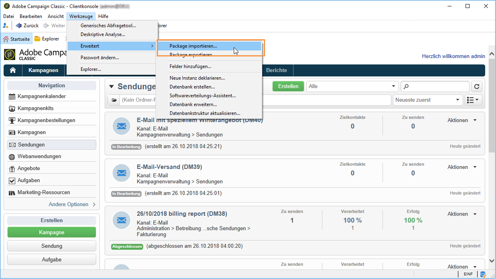
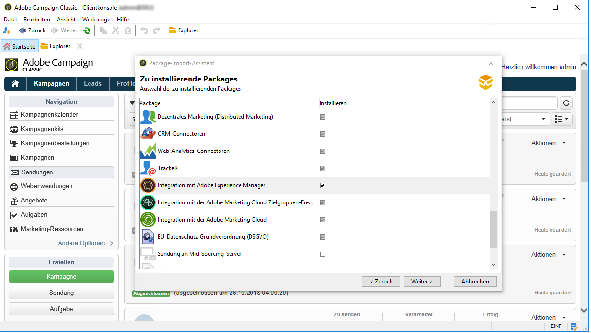
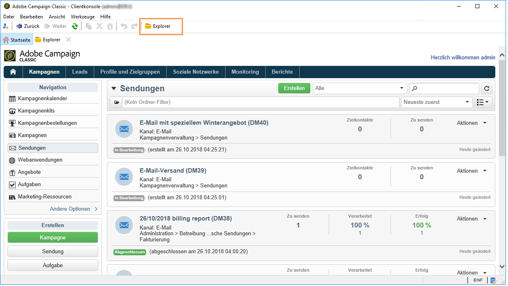
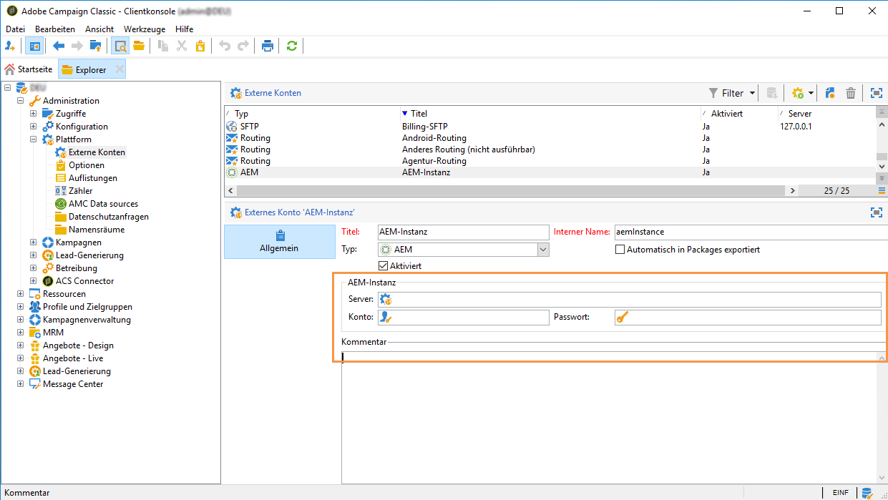
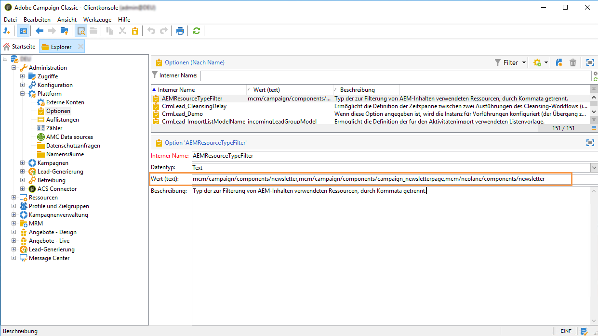

# Integration konfigurieren{#configuring-the-integration}

## Konfigurationen in Adobe Campaign {#configuring-in-adobe-campaign}

Um die kombinierte Nutzung von Adobe Campaign und Adobe Experience Manager zu ermöglichen, ist zunächst eine Konfiguration beider Lösungen erforderlich.

Führen Sie die unten aufgeführten Schritte aus, um die Konfiguration in Adobe Campaign zu beginnen:

1. [Installieren Sie das AEM-Integrations-Package in Adobe Campaign.](#install-the-aem-integration-package-in-adobe-campaign)
1. [Konfigurieren Sie das externe Konto](#configure-the-external-account)
1. [AEM-Ressourcenfilter konfigurieren](#configure-aem-resources-filtering)

Erweiterte Konfigurationen wie die Verwaltung von Personalisierungsfeldern und -bausteinen finden Sie im [Handbuch](https://helpx.adobe.com/de/experience-manager/6-5/sites/administering/using/campaignonpremise.html) von Adobe Experience Manager.

### Installieren Sie das AEM-Integrations-Package in Adobe Campaign.{#install-the-aem-integration-package-in-adobe-campaign}

Installieren Sie zunächst das **[!UICONTROL AEM-Integrations]**-Package.

1. Wählen Sie in Ihrer Adobe-Campaign-Instanz aus der oberen Symbolleiste die Option **[!UICONTROL Werkzeuge]** aus.
1. Wählen Sie **[!UICONTROL Tools > Erweitert > Package-Import...]** aus.

   

1. Wählen Sie **[!UICONTROL Standard-Package installieren]** aus.
1. Aktivieren Sie die Option **[!UICONTROL Integration mit Adobe Experience Manager]** und wählen Sie dann die Schaltfläche **[!UICONTROL Weiter]** aus.

   

1. Wählen Sie im nächsten Fenster die Schaltfläche **[!UICONTROL Starten]** aus, um mit der Installation des Package zu beginnen. Schließen Sie das Fenster, nachdem die Installation beendet wurde.

### Sicherheitszone für AEM-Operator konfigurieren {#configure-the-security-zone-for-aem-operator}

Das Package **[!UICONTROL Integration mit Adobe Experience Manager]** definiert den **[!UICONTROL aemserver]**-Operator in Campaign. Mit diesem Operator wird der Adobe-Experience-Manager-Server mit Adobe Campaign verbunden.

Sie müssen für diesen Operator eine Sicherheitszone konfigurieren, um über Adobe Experience Manager eine Verbindung mit Adobe Campaign herzustellen.

>[!CAUTION]
>
>Wir empfehlen dringend die Erstellung einer Sicherheitszone für AEM, um Sicherheitsprobleme zu vermeiden. Weiterführende Informationen dazu finden Sie im [Installationshandbuch](../../installation/using/configuring-campaign-server.md#defining-security-zones).

Wenn Ihre Campaign-Instanz von Adobe gehostet wird, kontaktieren Sie das Adobe-Supportteam. Wenn Sie Adobe Campaign On-Premise benutzen, gehen Sie folgendermaßen vor:

1. Öffnen Sie die Konfigurationsdatei **serverConf.xml**.
1. Gehen Sie zum Attribut **allowUserPassword** der ausgewählten Sicherheitszone und setzen Sie es auf **true**.

   Dadurch kann Adobe Experience Manager mit Adobe Campaign per Anmeldung/Passwort eine Verbindung herstellen.

### Konfigurieren Sie das externe Konto {#configure-the-external-account}

Mit dem Package **[!UICONTROL Integration mit Adobe Experience Manager]** wurde das externe Konto für Adobe Experience Cloud erstellt. Jetzt muss es konfiguriert werden, um eine Verbindung mit Ihrer Adobe-Experience-Manager-Instanz herzustellen.

Gehen Sie zur Konfiguration des externen AEM-Kontos folgendermaßen vor:

1. Wählen Sie die **[!UICONTROL Explorer]**-Schaltfläche aus.

   

1. Wählen Sie **[!UICONTROL Administration > Plattform > Externe Konten]** aus.
1. Wählen Sie in der Liste **[!UICONTROL Externes Konto]** die Option **[!UICONTROL AEM-Instanz]** aus.
1. Geben Sie die Parameter für Ihre AEM-Authoring-Instanz ein:

   * **[!UICONTROL Server]**
   * **[!UICONTROL Konto]**
   * **[!UICONTROL Passwort]**

   >[!NOTE]
   >
   >Achten Sie darauf, dass Ihre **[!UICONTROL Server]**-Adresse nicht mit einem Schrägstrich endet.

   

1. Kreuzen Sie die Option **[!UICONTROL Aktiviert]** an.
1. Wählen Sie die Schaltfläche **[!UICONTROL Speichern]** aus.

### AEM-Ressourcenfilter konfigurieren {#configure-aem-resources-filtering}

Mit der Option **AEMResourceTypeFilter** werden die Typen von Experience-Manager-Ressourcen herausgefiltert, die in Adobe Campaign verwendet werden können. Dadurch kann Adobe Campaign Inhalte von Experience Manager abrufen, die speziell für die Verwendung in Adobe Campaign konzipiert sind.

So prüfen Sie, ob die Option **[!UICONTROL AEMResourceTypeFilter]** konfiguriert ist:

1. Wählen Sie die **[!UICONTROL Explorer]**-Schaltfläche aus.
1. Wählen Sie **[!UICONTROL Administration > Plattform > Optionen]** aus.
1. Wählen Sie in der Liste **[!UICONTROL Optionen]** die Option **[!UICONTROL AEMResourceTypeFilter]** aus.
1. Im Feld **[!UICONTROL Wert (text)]** sollte der Pfad folgendermaßen dargestellt sein:

   ```
   mcm/campaign/components/newsletter,mcm/campaign/components/campaign_newsletterpage,mcm/neolane/components/newsletter
   ```

   In manchen Fällen sieht er auch so aus:

   ```
   mcm/campaign/components/newsletter
   ```

   

## Konfigurieren Sie Adobe Experience Manager {#configuring-in-adobe-experience-manager}

Führen Sie die unten aufgeführten Schritte aus, um die Konfiguration in Adobe Experience Manager zu beginnen:

1. Konfigurieren Sie die **Replikation** zwischen der AEM-Authoring-Instanz und der AEM-Publishing-Instanz.

   Weiterführende Informationen zur Konfiguration der Replikation finden Sie im [Handbuch](https://helpx.adobe.com/de/experience-manager/6-5/sites/deploying/using/replication.html) von Adobe Experience Manager.

1. Installieren Sie die Integration **FeaturePack** auf Ihrer Authoring-Instanz und replizieren Sie dann die Installation auf Ihrer Publishing-Instanz. (Nur für AEM-Versionen 5.6.1 und 6.0).

   Weiterführende Informationen zur Installation von FeaturePack finden Sie im [Handbuch](https://helpx.adobe.com/de/experience-manager/aem-previous-versions.html) von Adobe Experience Manager.

1. Stellen Sie die Verbindung zwischen Adobe Experience Manager und Adobe Campaign her, indem Sie einen dedizierten **Cloud Service** konfigurieren.

   Weiterführende Informationen zur Verbindung beider Lösungen über Cloud Services finden Sie im [Handbuch](https://helpx.adobe.com/de/experience-manager/6-5/sites/administering/using/campaignonpremise.html#ConfiguringAdobeExperienceManager) von Adobe Experience Manager .

1. Konfigurieren Sie den **Externalizer-Dienst**.

   Weiterführende Informationen zur Konfiguration finden Sie im [Handbuch](https://helpx.adobe.com/de/experience-manager/6-5/sites/developing/using/externalizer.html) von Adobe Experience Manager.

