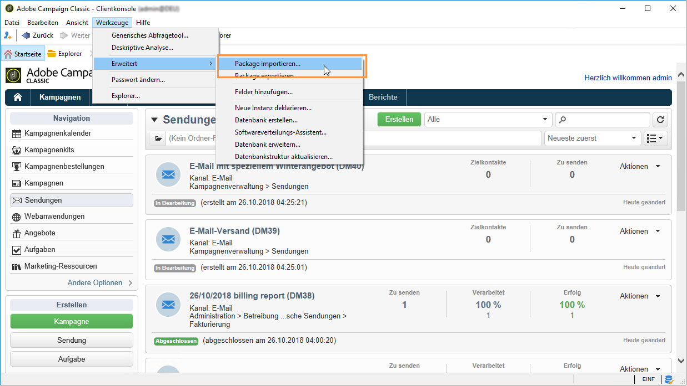
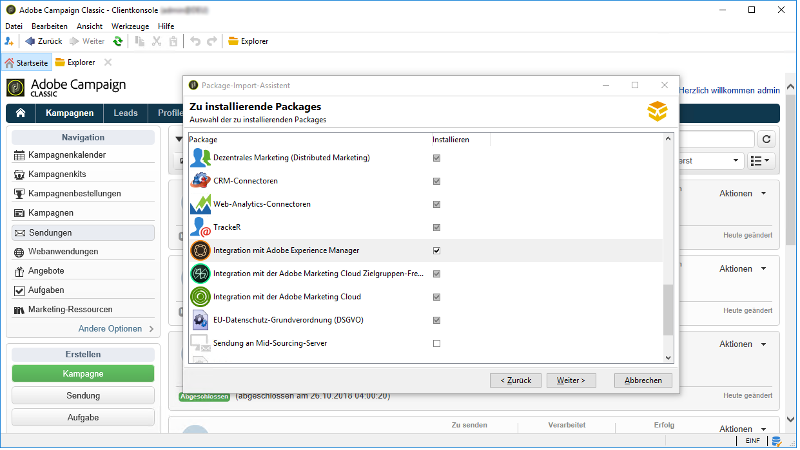
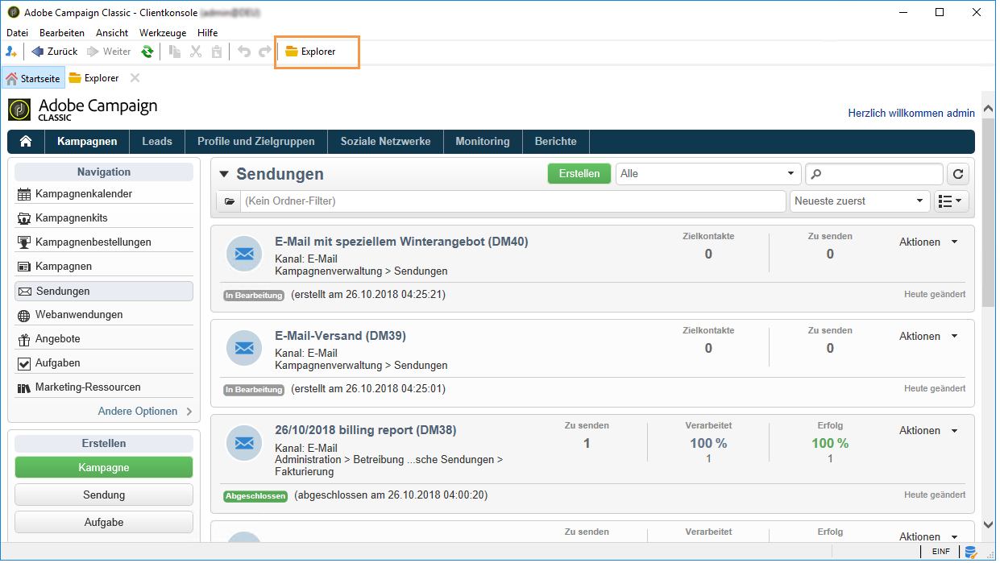
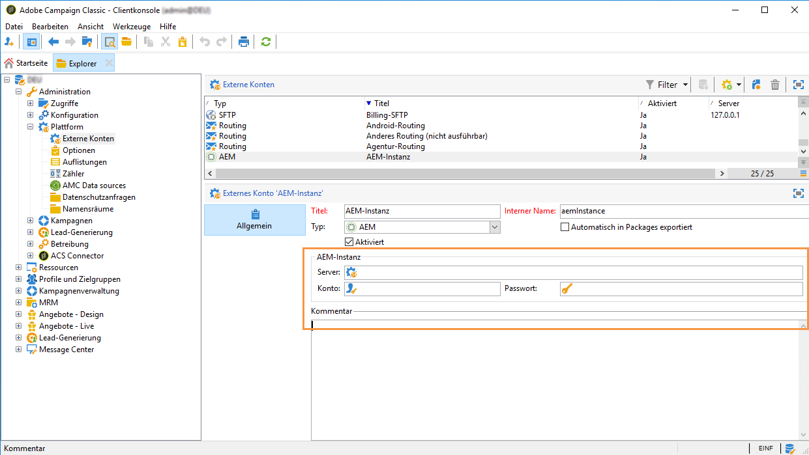
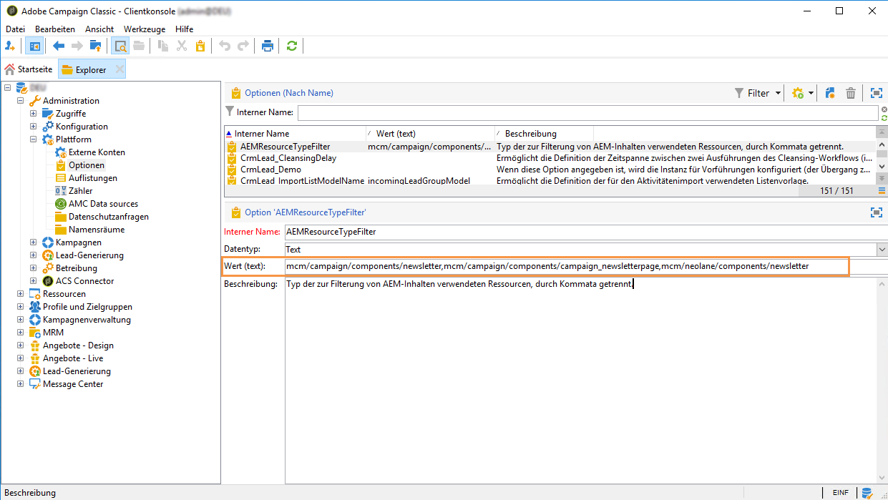

# Konfigurieren der Integration von Campaign mit AEM{#configuring-the-integration}


## Konfigurationsschritte in Adobe Campaign {#configuring-in-adobe-campaign}

Um die kombinierte Nutzung von Adobe Campaign und Adobe Experience Manager zu ermöglichen, ist zunächst eine Konfiguration beider Lösungen erforderlich.

Führen Sie die unten aufgeführten Schritte aus, um die Konfiguration in Adobe Campaign zu beginnen:

1. [Installieren Sie das AEM-Integrations-Package in Adobe Campaign.](#install-the-aem-integration-package-in-adobe-campaign)
1. [Konfigurieren Sie das externe Konto.](#configure-the-external-account)
1. [Konfigurieren Sie AEM-Ressourcenfilter.](#configure-aem-resources-filtering)

Für erweiterte Konfigurationen wie die Verwaltung von Personalisierungsfeldern und -bausteinen. Siehe Adobe Experience Manager [Dokumentation](https://helpx.adobe.com/de/experience-manager/6-5/sites/administering/using/campaignonpremise.html).

### Installieren Sie das AEM-Integrations-Package in Adobe Campaign. {#install-the-aem-integration-package-in-adobe-campaign}

Installieren Sie zunächst das **[!UICONTROL AEM-Integrations]**-Package.

1. Wählen Sie in Ihrer Adobe Campaign-Instanz aus der oberen Symbolleiste die Option **[!UICONTROL Werkzeuge]** aus.
1. Wählen Sie **[!UICONTROL Tools > Erweitert > Package-Import...]** aus.

   

1. Wählen Sie **[!UICONTROL Standard-Package installieren]** aus.
1. Aktivieren Sie die Option **[!UICONTROL Integration mit Adobe Experience Manager]** und wählen Sie dann die Schaltfläche **[!UICONTROL Weiter]** aus.

   

1. Klicken Sie im nächsten Fenster auf die Schaltfläche **[!UICONTROL Starten]**, um die Installation Ihres Pakets zu starten. Schließen Sie das Fenster, sobald die Installation abgeschlossen ist.

### Sicherheitszone für AEM-Operator konfigurieren {#configure-the-security-zone-for-aem-operator}

Das Package Integration mit AEM **&#x200B;**&#x200B;legt den **[!UICONTROL aemserver]**-Operator in Campaign fest. Dieser Operator wird verwendet, um den Adobe Experience Manager-Server mit Adobe Campaign zu verbinden.

Sie müssen für diesen Operator eine Sicherheitszone konfigurieren, um über Adobe Experience Manager eine Verbindung mit Adobe Campaign herzustellen.

>[!CAUTION]
>
>Wir empfehlen dringend die Erstellung einer Sicherheitszone für AEM, um Sicherheitsprobleme zu vermeiden. Weiterführende Informationen dazu finden Sie im [Installationshandbuch](../../installation/using/security-zones.md).

Wenn Ihre Campaign-Instanz von Adobe gehostet wird, wenden Sie sich an das Team der [Adobe-Kundenunterstützung](https://helpx.adobe.com/de/enterprise/admin-guide.html/enterprise/using/support-for-experience-cloud.ug.html). Gehen Sie wie folgt vor, wenn Sie eine On-Premise-Bereitstellung von Campaign verwenden:

1. Öffnen Sie die Konfigurationsdatei **serverConf.xml**.
1. Gehen Sie zum Attribut **allowUserPassword** der ausgewählten Sicherheitszone und setzen Sie es auf **true**.

   Dadurch kann Adobe Experience Manager mit Adobe Campaign per Anmeldung/Passwort eine Verbindung herstellen.

### Externes Konto konfigurieren {#configure-the-external-account}

Mit dem Package **[!UICONTROL AEM-Integration]** wurde das externe Konto für Adobe Experience Cloud erstellt. Jetzt müssen Sie es konfigurieren, um eine Verbindung mit Ihrer Adobe Experience Manager-Instanz herzustellen.

Gehen Sie zur Konfiguration des externen AEM-Kontos folgendermaßen vor:

1. Wählen Sie die **[!UICONTROL Explorer]**-Schaltfläche aus.

   

1. Wählen Sie **[!UICONTROL Administration > Plattform > Externe Konten]** aus.
1. Wählen Sie in der Liste **[!UICONTROL Externes Konto]** die Option **[!UICONTROL AEM-Instanz]** aus.
1. Geben Sie die Parameter für Ihre AEM-Authoring-Instanz ein:

   * **[!UICONTROL Server]**
   * **[!UICONTROL Konto]**
   * **[!UICONTROL Passwort]**

   >[!NOTE]
   >
   >Achten Sie darauf, dass Ihre **[!UICONTROL Server]**-Adresse nicht mit einem Schrägstrich endet.

   

1. Kreuzen Sie die Option **[!UICONTROL Aktiviert]** an.
1. Wählen Sie die Schaltfläche **[!UICONTROL Speichern]** aus.

### AEM-Ressourcenfilter konfigurieren {#configure-aem-resources-filtering}

Die Option **AEMResourceTypeFilter** wird verwendet, um Typen von Experience Manager-Ressourcen zu filtern, die in Adobe Campaign verwendet werden können. Dadurch kann Adobe Campaign Experience Manager-Inhalte abrufen, die speziell für die Verwendung in Adobe Campaign entwickelt wurden.

So prüfen Sie, ob die Option **[!UICONTROL AEMResourceTypeFilter]** konfiguriert ist:

1. Wählen Sie die **[!UICONTROL Explorer]**-Schaltfläche aus.
1. Wählen Sie **[!UICONTROL Administration > Plattform > Optionen]** aus.
1. Wählen Sie in der Liste **[!UICONTROL Optionen]** die Option **[!UICONTROL AEMResourceTypeFilter]** aus.
1. Im Feld **[!UICONTROL Wert (text)]** sollte der Pfad folgendermaßen dargestellt sein:

   ```
   mcm/campaign/components/newsletter,mcm/campaign/components/campaign_newsletterpage,mcm/neolane/components/newsletter
   ```

   In manchen Fällen sieht er auch so aus:

   ```
   mcm/campaign/components/newsletter
   ```

   

## Konfigurationsschritte in Adobe Experience Manager {#configuring-in-adobe-experience-manager}

Führen Sie die unten aufgeführten Schritte aus, um die Konfiguration in Adobe Experience Manager zu beginnen:

1. Konfigurieren Sie die **Replikation** zwischen der AEM-Autoreninstanz und der AEM-Veröffentlichungsinstanz.

   Weiterführende Informationen zur Konfiguration der Replikation finden Sie im [Handbuch](https://helpx.adobe.com/de/experience-manager/6-5/sites/deploying/using/replication.html) von Adobe Experience Manager.

1. Stellen Sie die Verbindung zwischen Adobe Experience Manager und Adobe Campaign her, indem Sie einen dedizierten **Cloud Service** konfigurieren.

   Weiterführende Informationen zur Verbindung beider Lösungen über Cloud Services finden Sie im [Handbuch](https://helpx.adobe.com/de/experience-manager/6-5/sites/administering/using/campaignonpremise.html#ConfiguringAdobeExperienceManager) von Adobe Experience Manager .

1. Konfigurieren Sie den **Externalizer-Dienst**.

   Weiterführende Informationen zur Konfiguration finden Sie im [Handbuch](https://helpx.adobe.com/de/experience-manager/6-5/sites/developing/using/externalizer.html) von Adobe Experience Manager.
