# Experience-Manager-Newsletter erstellen{#creating-an-experience-manager-newsletter}

Mit dieser Integration kann beispielsweise ein Newsletter in Adobe Experience Manager erstellt werden, der danach in Adobe Campaign als Teil einer E-Mail-Kampagne verwendet wird.

Ein detailliertes Beispiel für die Verwendung dieser Integration finden Sie in dieser [schrittweisen Anleitung](https://helpx.adobe.com/campaign/kb/acc-aem.html).

**In Adobe Experience Manager:**

1. Wählen Sie in der AEM-Authoring-Instanz das **Adobe-Experience**-Logo oben links und danach **[!UICONTROL Sites]**.

   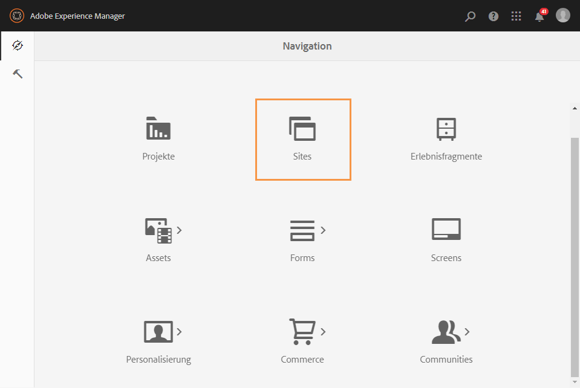

1. Wählen Sie **[!UICONTROL Kampagnen > Name Ihres Unternehmens (hier We.Retail) > Hauptbereich > E-Mail-Kampagnen]** aus.
1. Wählen Sie rechts oben **[!UICONTROL Erstellen]** und danach **[!UICONTROL Seite]** aus.

   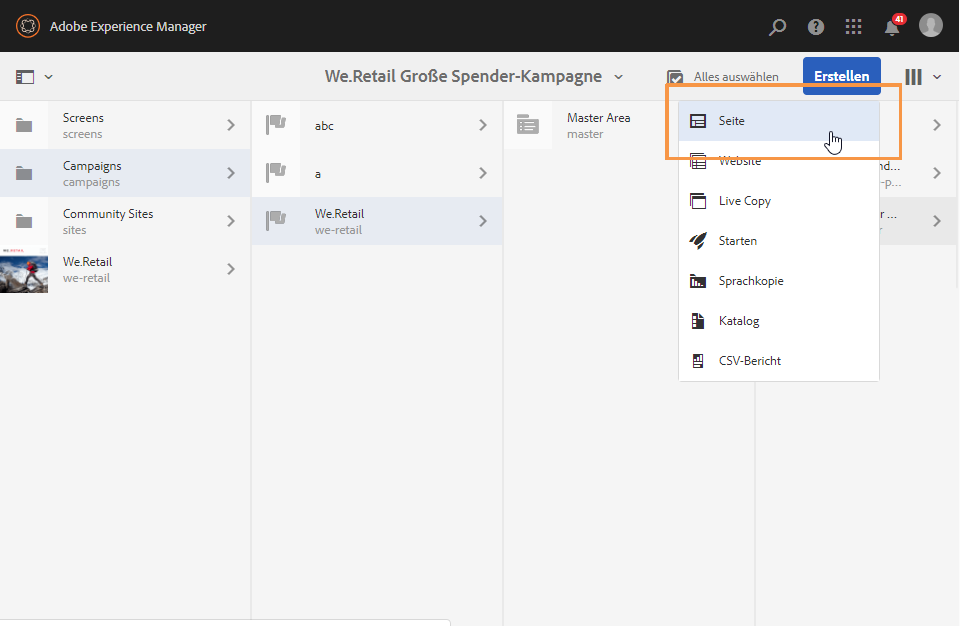

1. Wählen Sie die Vorlage **[!UICONTROL Adobe Campaign Email (AC 6.1)]** aus und benennen Sie Ihren Newsletter.
1. Öffnen Sie nach der Erstellung Ihrer Seite das Menü **[!UICONTROL Seiteninformationen]** und danach **[!UICONTROL Eigenschaften öffnen]**.

   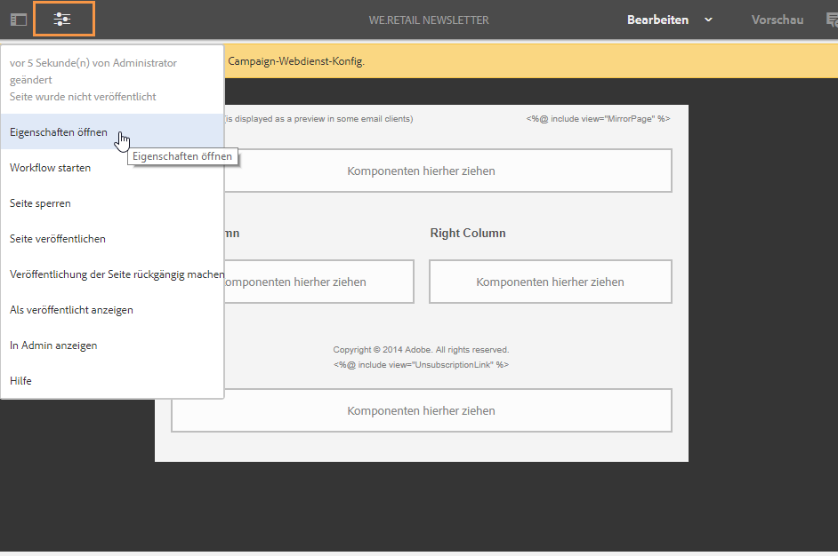

1. Wählen Sie im Tab **[!UICONTROL Cloud-Services]** die Option **[!UICONTROL Adobe Campaign]** für **[!UICONTROL Cloud-Service-Konfigurationen]** und in der zweiten Dropdown-Liste Ihre Adobe-Campaign-Instanz.

   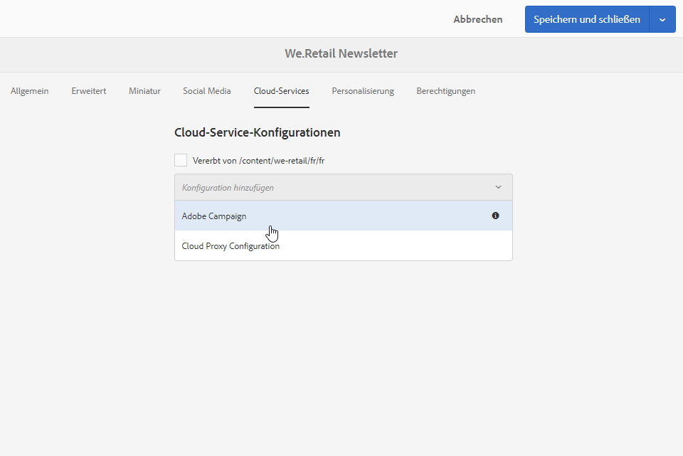

1. Bearbeiten Sie den E-Mail-Inhalt, indem Sie Komponenten hinzufügen, z. B. Personalisierungsfelder aus Adobe Campaign.
1. Wenn Ihre E-Mail fertig ist, öffnen Sie das Menü **[!UICONTROL Seiteninformationen]** und wählen sie danach **[!UICONTROL Workflow starten]** aus.

   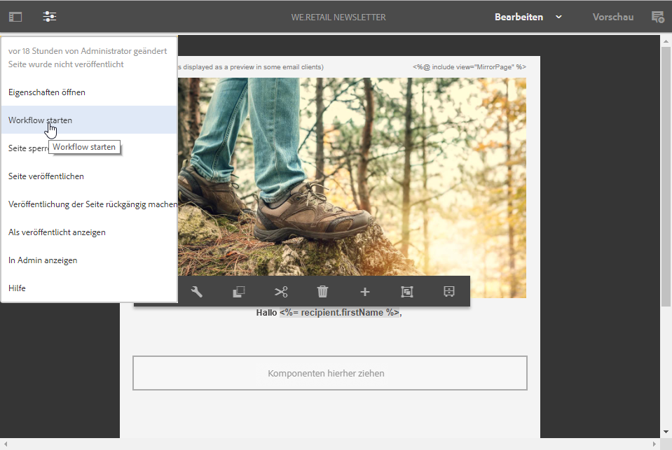

1. Wählen Sie aus der ersten Dropdown-Liste als Workflow-Modell **[!UICONTROL In Adobe Campaign veröffentlichen]** aus und danach **[!UICONTROL Workflow starten]**.

   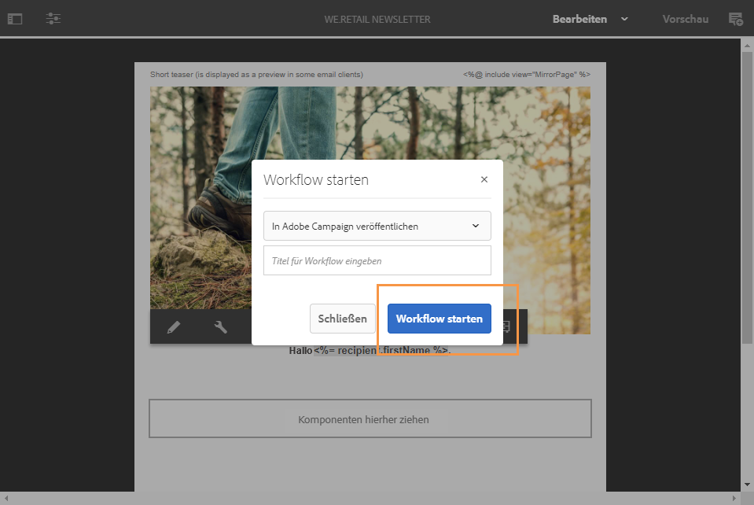

1. Starten Sie dann wie im vorherigen Schritt den Workflow **[!UICONTROL Für Adobe Campaign genehmigen]**.
1. Am oberen Seitenrand wird ein Hinweis zum Haftungsausschluss angezeigt. Wählen Sie **[!UICONTROL Abgeschlossen]** aus, um die Überprüfung zu bestätigen, und danach **[!UICONTROL Ok]**.

   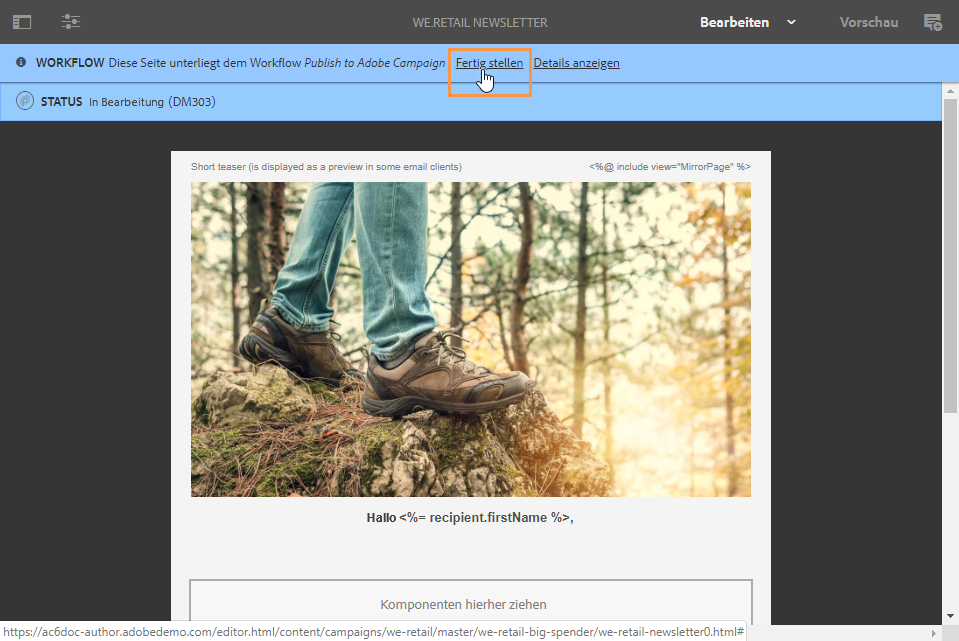

1. Wählen Sie erneut **[!UICONTROL Abgeschlossen]** aus und danach **[!UICONTROL Newsletter-Genehmigung]** in der Dropdown-Liste **[!UICONTROL Nächster Schritt]**.

   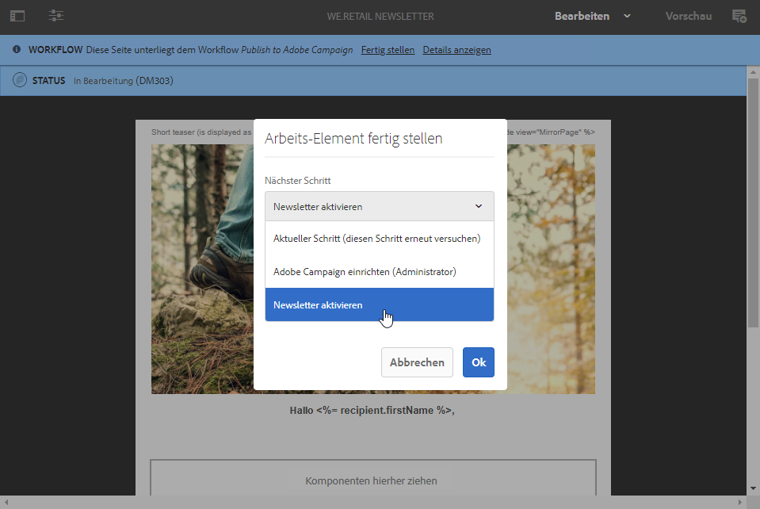

Ihr Newsletter ist jetzt fertig und in Adobe Campaign synchronisiert.

**In Adobe Campaign:**

1. Wählen Sie im Tab **[!UICONTROL Kampagnen]** die Option **[!UICONTROL Sendungen]** und danach die Schaltfläche **[!UICONTROL Erstellen]** aus.

   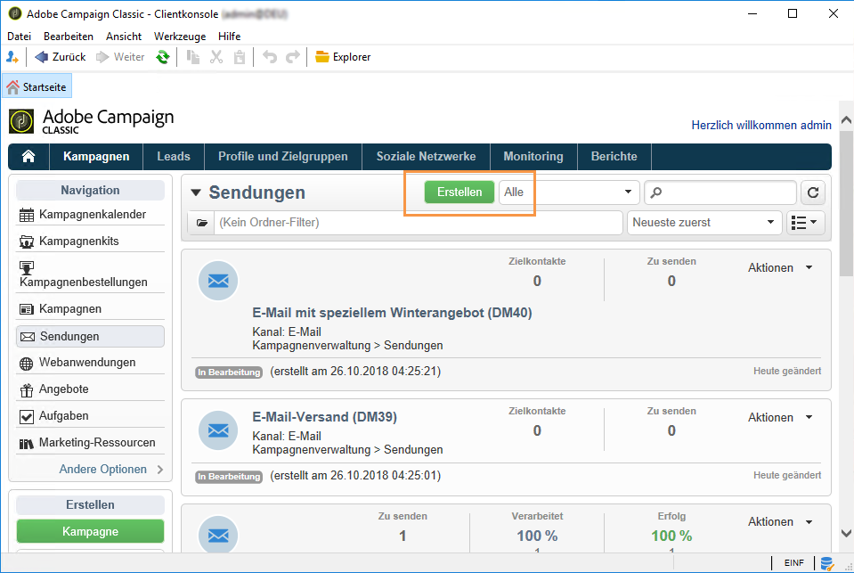

1. Wählen Sie in der Dropdown-Liste **[!UICONTROL Versandvorlage]** die Vorlage **[!UICONTROL E-Mail-Versand mit AEM-Inhalt (mailAEMContent)]** aus.

   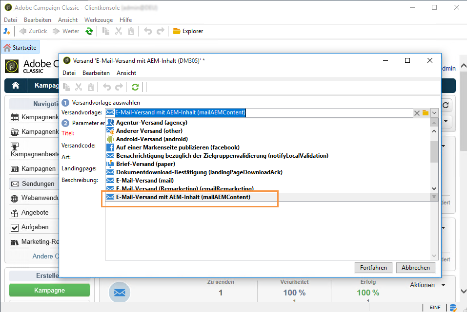

1. Fügen Sie zu Ihrem Versand einen **[!UICONTROL Titel]** hinzu und wählen Sie dann **[!UICONTROL Fortfahren]** aus.
1. Wählen Sie die Schaltfläche **[!UICONTROL Synchronisieren]** aus.

   Wenn diese Schaltfläche nicht in der Benutzeroberfläche zu sehen ist, wählen Sie die Schaltfläche **[!UICONTROL Eigenschaften]** und danach den Tab **[!UICONTROL Erweitert]** aus. Im Feld **[!UICONTROL Inhaltserstellung]** sollte **[!UICONTROL AEM]** und im Feld **[!UICONTROL AEM-Konto]** sollte Ihre AEM-Instanz stehen.

   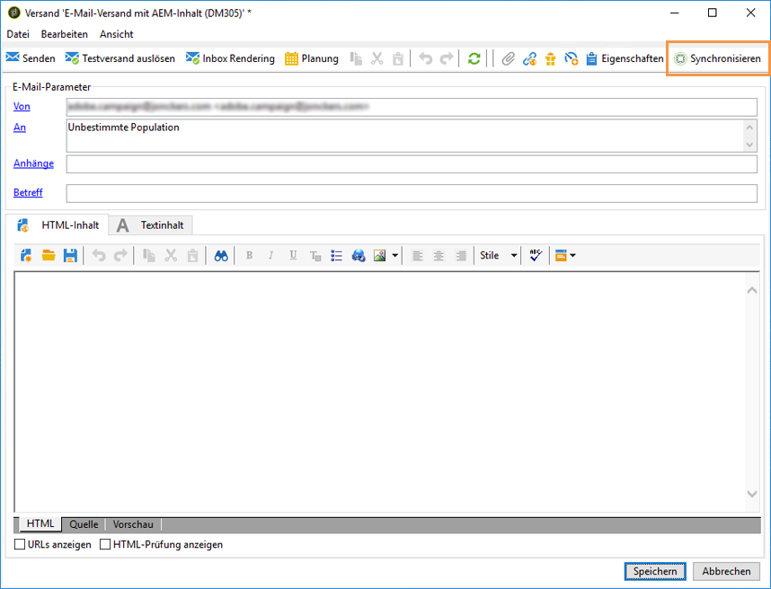

1. Wählen Sie den zuvor in Adobe Experience Manager erstellten Versand und anschließend **[!UICONTROL Ok]** aus.
1. Wenn Änderungen am AEM-Versand vorgenommen werden, wählen Sie die Schaltfläche **[!UICONTROL Inhalt aktualisieren]**.

   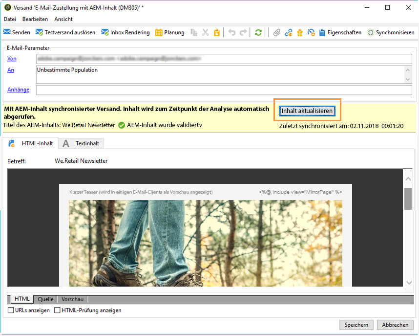

Ihre E-Mail kann jetzt an Ihre Audience gesendet werden.
