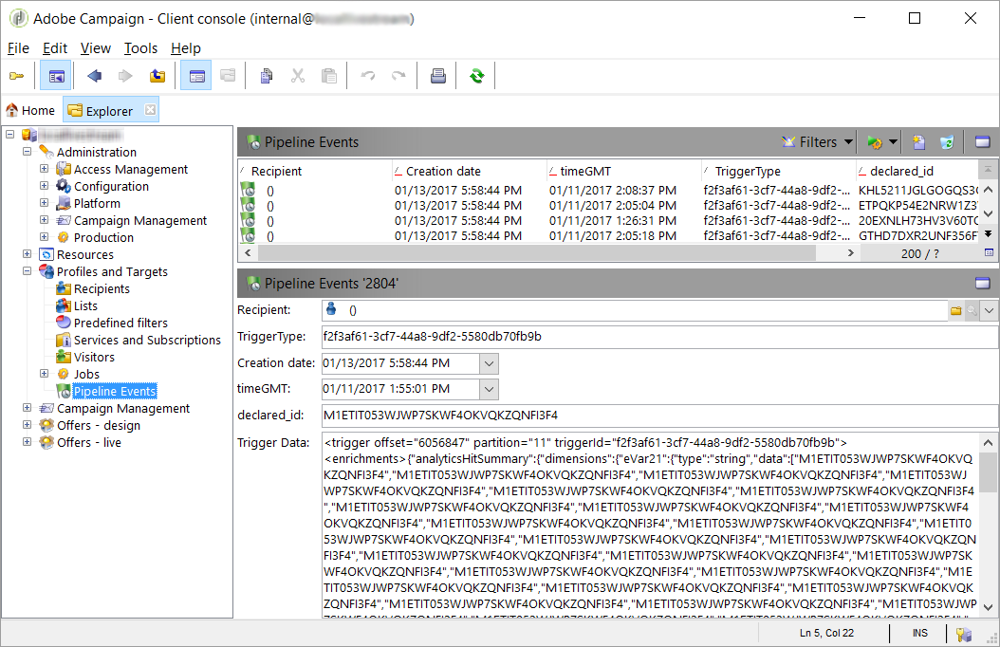

# Konfigurieren von Ereignissen für eine benutzerdefinierte Implementierung {#events}


Diese Konfiguration enthält benutzerspezifische Anpassungen. Sie erfordert:

* Grundkenntnisse der JSON-, XML- und JavaScript-Analyse in Adobe Campaign.
* Grundkenntnisse der QueryDef- und Writer-APIs.
* Grundverständnis der Verschlüsselung und Authentifizierung mit privaten Schlüsseln.

Für das Bearbeiten des JavaScript-Codes sind technische Kenntnisse vonnöten. Daher sollten Sie dies nur vornehmen, wenn Sie über entsprechende Kenntnisse verfügen.

## Verarbeiten von Ereignissen in JavaScript {#events-javascript}

### JavaScript-Datei {#file-js}

Die Pipeline verwendet eine JavaScript-Funktion, um jede Nachricht zu verarbeiten. Diese Funktion ist benutzerdefiniert.

Sie wird in der Option **[!UICONTROL NmsPipeline_Config]** unter dem Attribut &quot;JSConnector&quot; konfiguriert. Dieses JavaScript wird jedes Mal aufgerufen, wenn ein Ereignis empfangen wird. Es wird vom [!DNL pipelined]-Prozess ausgeführt.

Die JavaScript-Beispieldatei ist cus:triggers.js.

### JavaScript-Funktion {#function-js}

Das [!DNL pipelined]-JavaScript muss mit einer bestimmten Funktion beginnen.

Diese Funktion wird für jedes Ereignis einmal aufgerufen:

```
function processPipelineMessage(xmlTrigger) {}
```

Sie sollte zurückgegeben werden als

```
<undefined/>
```

Nach der Bearbeitung des JavaScript sollten Sie [!DNL pipelined] neu starten.

### Datenformat des Auslösers {#trigger-format}

Die [!DNL trigger]-Daten werden im XML-Format an die JS-Funktion übergeben.

* Das **[!UICONTROL @triggerId]**-Attribut enthält den Namen des [!DNL trigger].
* Das Element **Anreicherungen** im JSON-Format enthält die von Adobe Analytics generierten Daten und wird an den Auslöser angehängt.
* **[!UICONTROL @offset]** ist der &quot;Zeiger&quot; auf die Nachricht. Er gibt die Reihenfolge der Nachrichten in der Warteschlange an.
* **[!UICONTROL @partition]** ist ein Container mit Nachrichten, die sich in der Warteschlange befinden. Der Versatz ist relativ zu einer Partition. <br>Es gibt etwa 15 Partitionen in der Warteschlange.

Beispiel:

```
<trigger offset="1500435" partition="4" triggerId="LogoUpload_1_Visits_from_specific_Channel_or_ppp">
 <enrichments>{"analyticsHitSummary":{"dimensions":{" eVar01":{"type":"string","data":["PI4INE1ETDF6UK35GO13X7HO2ITLJHVH"],"name":" eVar01","source":"session summary"}, "timeGMT":{"type":"int","data":[1469164186,1469164195],"name":"timeGMT","source":"session summary"}},"products":{}}}</enrichments>
 <aliases/>
 </trigger>
```

### Anreicherung von Datenformaten {#enrichment-format}

>[!NOTE]
>
>Es handelt sich hierbei um ein spezifisches Beispiel aus verschiedenen möglichen Implementierungen.

Der Inhalt wird für jeden Trigger im JSON-Format in Adobe Analytics definiert.
Beispiel: In einem Trigger „LogoUpload_Upload_Visits“:

* **[!UICONTROL eVar01]** kann die Käufer-ID im Zeichenfolgenformat (&quot;String&quot;) enthalten, die zur Abstimmung mit Adobe Campaign-Empfängern verwendet wird. <br>Sie muss abgestimmt werden, um die Käufer-ID zu ermitteln, die den Primärschlüssel darstellt.

* **[!UICONTROL timeGMT]** kann die Uhrzeit des Auslösers auf Seite von Adobe Analytics im UTC Epoch-Format enthalten (Sekunden seit 1.1.1970 UTC).

Beispiel:

```
{
 "analyticsHitSummary": {
 "dimensions": {
 "eVar01": {
 "type": "string",
 "data": ["PI4INE1ETDF6UK35GO13X7HO2ITLJHVH"],
 "name": " eVar01",
 "source": "session summary"
 },
 "timeGMT": {
 "type": "int",
 "data": [1469164186, 1469164195],
 "name": "timeGMT",
 "source": "session summary"
 }
 },
 "products": {}
 }
 }
```

### Reihenfolge der Verarbeitung von Ereignissen{#order-events}

Die Ereignisse werden nacheinander in der Reihenfolge des Versatzes verarbeitet. Jeder Thread des [!DNL pipelined]-Prozesses verarbeitet eine andere Partition.

Der „Versatz“ des letzten abgerufenen Ereignisses wird in der Datenbank gespeichert. Wenn der Prozess angehalten wird, startet er daher bei der letzten Nachricht neu. Diese Daten werden im nativen Schema „xtk::pipelineOffset“ gespeichert.

Dieser Zeiger ist für jede Instanz und jeden Verbraucher spezifisch. Wenn verschiedene Instanzen auf dieselbe Pipeline mit unterschiedlichen Verbrauchern zugreifen, erhalten diese also alle Nachrichten in derselben Reihenfolge.

Der Parameter **consumer** der Pipeline-Option identifiziert die aufrufende Instanz.

Derzeit gibt es keine Möglichkeit, unterschiedliche Warteschlangen für separate Umgebungen wie &quot;staging&quot; oder &quot;dev&quot; zu nutzen.

### Protokollierung und Fehlerbehandlung {#logging-error-handling}

Protokolle wie logInfo() werden an das [!DNL pipelined] weitergeleitet. Fehler wie logError() werden in das [!DNL pipelined]-Protokoll geschrieben und führen dazu, dass das Ereignis in eine Warteschlange für weitere Zustellversuche gestellt wird. In diesem Fall sollten Sie das Pipeline-Protokoll überprüfen.
Bei fehlerhaften Nachrichten wird in der in den [!DNL pipelined] Optionen festgelegten Dauer mehrmals ein neuer Zustellversuch unternommen.

Zu Debugging- und Überwachungszwecken werden die vollständigen Auslöserdaten im Feld &quot;data&quot; der Auslösertabelle im XML-Format geschrieben. Alternativ dazu sind die Auslöserdaten auch in &quot;logInfo()&quot; verfügbar.

### Analysieren der Daten {#data-parsing}

Dieser JavaScript-Beispielcode analysiert die eVar01 in den Anreicherungen.

```
function processPipelineMessage(xmlTrigger)
 {
 (…)
 var shopper_id = ""
 if (xmlTrigger.enrichments.length() > 0)
 {
 if (xmlTrigger.enrichments.toString().match(/eVar01/) != undefined)
 {
 var enrichments = JSON.parse(xmlTrigger.enrichments.toString())
 shopper_id = enrichments.analyticsHitSummary.dimensions. eVar01.data[0]
 }
 }
 (…)
 }
```

Seien Sie beim Analysieren vorsichtig, um Fehler zu vermeiden.
Da dieser Code für alle Trigger verwendet wird, sind die meisten Daten nicht erforderlich. Daher kann es leer gelassen werden, wenn es nicht vorhanden ist.

### Speichern des Auslösers {#storing-triggers-js}

>[!NOTE]
>
>Es handelt sich hierbei um ein spezifisches Beispiel aus verschiedenen möglichen Implementierungen.

Dieser JS-Beispielcode speichert den Auslöser in der Datenbank.

```
function processPipelineMessage(xmlTrigger)
 {
 (…)
 var event = 
 <pipelineEvent
 xtkschema = "cus:pipelineEvent"
 _operation = "insert"
 created = {timeNow}
 lastModified = {timeNow}
 triggerType = {triggerType}
 timeGMT = {timeGMT}
 shopper_id = {shopper_id}
 data = {xmlTrigger.toXMLString()}
 />
 xtk.session.Write(event)
 return <undef/>;
 }
```

### Einschränkungen {#constraints}

Dieser Code erfordert optimale Performance, da er mit hoher Frequenz ausgeführt wird, was sich u. U. negativ auf andere Marketing-Aktivitäten auswirken kann. Das gilt insbesondere, wenn mehr als 1 Million Auslöserereignisse pro Stunde auf dem Marketing-Server verarbeitet werden oder wenn der Server nicht entsprechend angepasst ist.

Der Kontext dieses JavaScripts ist begrenzt. Es sind nicht alle Funktionen der API verfügbar. Beispielsweise funktionieren &quot;getOption()&quot; und &quot;getCurrentdate()&quot; nicht.

Um eine schnellere Verarbeitung zu ermöglichen, werden mehrere Threads des Skripts gleichzeitig ausgeführt. Der Code muss Thread-sicher sein.

## Speichern der Ereignisse {#store-events}

>[!NOTE]
>
>Es handelt sich hierbei um ein spezifisches Beispiel aus verschiedenen möglichen Implementierungen.

### Pipeline-Ereignisschema {#pipeline-event-schema}

Ereignisse werden in einer Datenbanktabelle gespeichert. Er wird von Marketing-Kampagnen verwendet, um Kundinnen und Kunden anzusprechen und E-Mails mithilfe von Triggern anzureichern.
Obwohl jeder Trigger eine eigene Datenstruktur haben kann, können alle Trigger in einer einzigen Tabelle zusammengefasst werden.
Das Feld triggerType gibt an, von welchem Trigger die Daten stammen.

Hier ist ein Beispiel für einen Schema-Code für diese Tabelle:

| Attribut | Typ | Titel | Beschreibung |
|:-:|:-:|:-:|:-:|
| pipelineEventId | Lang | Primärschlüssel | Der interne Primärschlüssel des Auslösers. |
| data | Memo | Auslöserdaten | Der vollständige Inhalt der Auslöserdaten im XML-Format. Für Debugging- und Audit-Zwecke. |
| triggerType | String 50 | TriggerType | Der Name des Auslösers. Identifiziert das Verhalten des Kunden auf der Website. |
| shopper_id | String 32 | shopper_id | Die interne Kennung des Käufers. Wird durch den Abstimmungs-Workflow festgelegt. &quot;zero&quot; bedeutet, dass der Kunde in Campaign unbekannt ist. |
| shopper_key | Lang | shopper_key | Die externe Kennung des Käufers, wie von Analytics erfasst. |
| Erstellt | Datum/Uhrzeit | Erstellt | Der Zeitpunkt, zu dem das Ereignis in Campaign erstellt wurde. |
| lastModified | Datum/Uhrzeit | Zuletzt geändert | Der letzte Zeitpunkt, zu dem das Ereignis in Adobe geändert wurde. |
| timeGMT | Datum/Uhrzeit | Zeitstempel | Der Zeitpunkt, zu dem das Ereignis in Analytics erstellt wurde. |

### Anzeigen der Ereignisse {#display-events}

Die Ereignisse können mit einem einfachen Formular, das auf dem Ereignisschema basiert, angezeigt werden.

>[!NOTE]
>
>Der Knoten &quot;Pipeline Event&quot; ist nicht nativ und muss hinzugefügt werden. Außerdem muss in Campaign das zugehörige Formular erstellt werden. Diese Aufgaben sind erfahrenen Benutzern vorbehalten. Weitere Informationen hierzu finden Sie unter [Bearbeiten von Formularen](../../configuration/using/editing-forms.md).



## Verarbeiten der Ereignisse {#processing-the-events}

### Abstimmungs-Workflow {#reconciliation-workflow}

Bei der Abstimmung gleicht Adobe Analytics den Kunden mit der Adobe Campaign-Datenbank ab. Das Kriterium für die Abstimmung kann beispielsweise &quot;shopper_id&quot; sein.

Aus Leistungsgründen muss der Abgleich im Batch-Modus durch einen Workflow erfolgen.
Die Häufigkeit muss auf 15 Minuten eingestellt sein, um die Arbeitslast zu optimieren. Infolgedessen beträgt die Verzögerung zwischen dem Ereignisempfang in Adobe Campaign und der Verarbeitung durch einen Marketing-Workflow bis zu 15 Minuten.

### Optionen zur Abstimmung von Einheiten in JavaScript {#options-unit-reconciliation}

Es ist möglich, die Abstimmungsabfrage für jeden Auslöser im JavaScript auszuführen. Das sorgt für eine höhere Performance und schnellere Ergebnisse. Dies kann für spezifische Anwendungsfälle erforderlich sein, wenn eine Reaktionsrate erforderlich ist.

Ist jedoch kein Index für &quot;shopper_id&quot; festgelegt, lässt sich dies nur schwer umsetzen. Wenn sich die Kriterien auf einem anderen Datenbank-Server als dem Marketing-Server befinden, wird ein Datenbank-Link mit geringer Performance verwendet.

### Workflow bereinigen {#purge-workflow}

Trigger werden innerhalb der jeweiligen Stunde verarbeitet. Das Volumen kann etwa 1 Million Auslöser pro Stunde betragen. Aus diesem Grund muss ein Bereinigungs-Workflow eingerichtet werden. Die Bereinigung wird einmal pro Tag ausgeführt und löscht alle Auslöser, die älter als drei Tage sind.

### Kampagnen-Workflow {#campaign-workflow}

Der Kampagnen-Workflow für Trigger ähnelt häufig anderen wiederkehrenden Kampagnen, die verwendet wurden.
Sie kann beispielsweise mit einer Abfrage der Trigger beginnen, die im letzten Tag nach bestimmten Ereignissen suchen. Diese Zielgruppe wird zum Senden der E-Mail verwendet. Anreicherungen oder Daten können vom Trigger stammen. Es kann vom Marketing sicher verwendet werden, da es keine Konfiguration erfordert.
