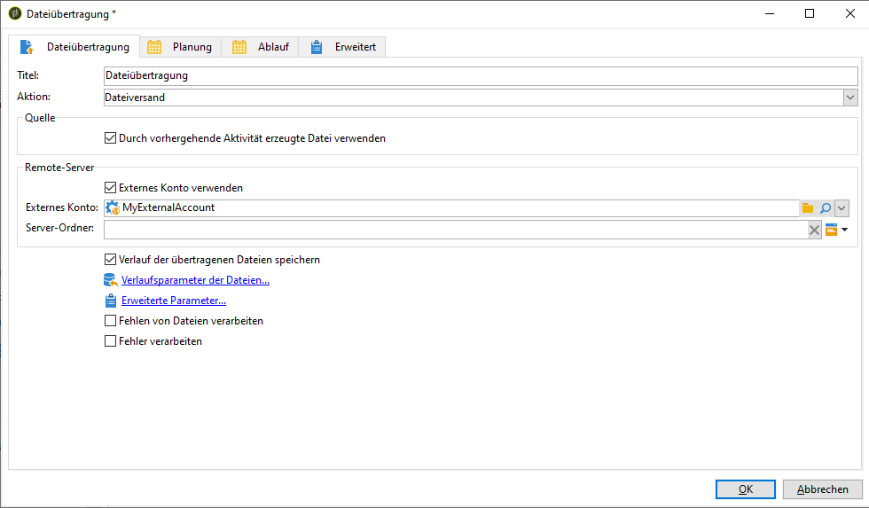

# Daten von Campaign nach Adobe Experience Platform exportieren {#sources}

Um Campaign Classic-Daten in die Adobe Echtzeit-Kundendatenplattform (RTCDP) zu exportieren, müssen Sie zunächst einen Workflow in Campaign Classic erstellen, um die Daten, die Sie austauschen möchten, in Ihren S3- oder Azure-Blob-Speicherort zu exportieren.

Nachdem der Workflow konfiguriert und Daten an Ihren Speicherort gesendet wurden, müssen Sie Ihren S3- oder Azure-Blob-Speicherort in Adobe Experience Platform als **Quelle** verbinden.

>[!NOTE]
>
>Wir empfehlen, nur in Campaign generierte Daten (z. B. Sendungen, Öffnungen, Klicks usw.) nach Adobe Experience Platform zu exportieren. Daten, die in einer Drittanbieter-Quelle (wie Ihrem CRM-System) aufgenommen werden, sollten direkt in Adobe Experience Platform importiert werden.

## Export-Workflow in Campaign Classic erstellen

Um Daten von Campaign Classic in Ihren S3- oder Azure-Blob-Speicher zu exportieren, müssen Sie einen Workflow erstellen, mit dem die zu exportierenden Daten bestimmt und an Ihren Speicherort gesendet werden.

Hierzu müssen Sie Folgendes hinzufügen und konfigurieren:

* Die Aktivität **[!UICONTROL Extraktion (Datei)]**, um die Zieldaten in eine CSV-Datei zu extrahieren. Weitere Informationen zur Konfiguration dieser Aktivität finden Sie in der [&#x200B; zu Campaign v8](https://experienceleague.adobe.com/docs/campaign/automation/workflows/wf-activities/action-activities/extraction-file.html){target="_blank"}.

  

* Die Aktivität **[!UICONTROL Dateiübertragung]**, um die CSV-Datei an Ihren Speicherort zu übertragen. Weitere Informationen zur Konfiguration dieser Aktivität finden Sie in der [&#x200B; zu Campaign v8](https://experienceleague.adobe.com/docs/campaign/automation/workflows/wf-activities/event-activities/file-transfer.html?lang=de){target="_blank"}.

  

Im folgenden Workflow werden beispielsweise regelmäßig Protokolle in eine CSV-Datei extrahiert und anschließend an einen Speicherort übertragen.

## Speicherort als Quelle verbinden

Die wichtigsten Schritte zum Verbinden Ihres S3- oder Azure-Blob-Speicherorts als **Quelle** in Adobe Experience Platform sind unten aufgeführt. Ausführliche Informationen zu jedem dieser Schritte finden Sie in der [Dokumentation zu Quell-Connectoren](https://experienceleague.adobe.com/docs/experience-platform/sources/home.html?lang=de).

1. Erstellen Sie in Adobe Experience Platform im Menü **[!UICONTROL Quellen]** eine Verbindung zu Ihrem Speicherort:

   * [Amazon S3-Quellverbindung erstellen](https://experienceleague.adobe.com/docs/experience-platform/sources/ui-tutorials/create/cloud-storage/s3.html?lang=de)
   * [Azure-Blob-Connector](https://experienceleague.adobe.com/docs/experience-platform/sources/connectors/cloud-storage/blob.html?lang=de)

   >[!NOTE]
   >
   >Beim Speicherort kann es sich um Amazon S3, SFTP mit Kennwort, SFTP mit SSH-Schlüssel oder Azure Blob handeln. Die bevorzugte Methode zum Senden von Daten an Adobe Campaign ist Amazon S3 oder Azure Blob:

   

1. Konfigurieren Sie einen Datenfluss für eine Cloud-Speicherplatz-Batch-Verbindung. Ein Datenfluss ist eine geplante Aufgabe, mit der Daten vom Speicherort abgerufen und in einen Adobe Experience Platform-Datensatz aufgenommen werden. Mit diesen Schritten können Sie die Datenaufnahme an Ihrem Speicherort konfigurieren, einschließlich der Datenauswahl und der Zuordnung der CSV-Felder zu einem XDM-Schema.

   Ausführliche Informationen finden Sie auf [dieser Seite](https://experienceleague.adobe.com/docs/experience-platform/sources/ui-tutorials/dataflow/cloud-storage.html?lang=de).

   

1. Nachdem die Quelle konfiguriert wurde, importiert Adobe Experience Platform die Datei von dem von Ihnen angegebenen Speicherort.

   Dieser Vorgang kann je nach Bedarf geplant werden. Es wird empfohlen, den Export abhängig von der Auslastung der Instanz bis zu 6-mal täglich durchzuführen.
