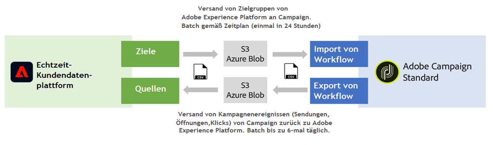

# Arbeiten mit Quellen und Zielen {#rtcdp}

## Über Quellen und Ziele

Mit Adobe Experience Platform können Sie Daten zwischen Campaign Classic und der Adobe Echtzeit-Kundendatenplattform (RTCDP) austauschen. Auf diese Weise können Sie Adobe Experience Platform-Zielgruppen in Ihren Campaign-Workflows auswählen und dann Daten, die sich auf diese Zielgruppen beziehen, wie Sendungen, Öffnungen und Klicks, an Adobe Real-Time Customer Data Platform zurücksenden.

* Mit **Zielen** können Sie Adobe Experience Platform-Zielgruppen in Campaign Classic aufnehmen. Auf diese Weise können Sie bekannte und unbekannte Daten für Ihre Marketing-Kampagnen aktivieren.
* Mit **Quellen** exportieren Sie Campaign Classic-Daten (z. B. Sendungen, Öffnungen und Klicks) nach Adobe Experience Platform. Auf diese Weise können Sie Daten, die Sie aus unterschiedlichen Quellen erfassen, an einem Ort zusammenfassen und die daraus gewonnenen Erkenntnisse nutzen.

>[!IMPORTANT]
>
>Beachten Sie bei dieser Integration die Einschränkungen für die SFTP-Datenspeicherung, für die Datenbank-Datenspeicherung und für aktive Profile gemäß Ihrem Adobe Campaign-Vertrag.

Eine detaillierte Übersicht über die Adobe Echtzeit-Kundendatenplattform, Ziele und Quellen finden Sie auf diesen Seiten:

* [Adobe Echtzeit-Kundendatenplattform](https://experienceleague.adobe.com/docs/experience-platform/rtcdp/overview.html?lang=de)
* [Dokumentation zu Zielen](https://experienceleague.adobe.com/docs/experience-platform/destinations/home.html?lang=de)
* [Dokumentation zu Quellen](https://experienceleague.adobe.com/docs/experience-platform/sources/home.html?lang=de)

## Campaign Classic mit Adobe Experience Platform verbinden

Um Daten zwischen Adobe Experience Platform und Campaign Classic austauschen zu können, müssen Sie zunächst Adobe Campaign als **Ziel** und in Adobe Experience Platform Ihren AWS-S3- oder Azure-Blob-Speicherort als **Quelle** verbinden.

Nachdem die Connectoren konfiguriert wurden, können Sie mithilfe von Workflows einen Datenimport oder -export in Campaign Classic einrichten.

Weitere Informationen zum Einrichten dieser Import- und Exportprozesse finden Sie in den folgenden Abschnitten:

* [Adobe Experience Platform-Segmente in Campaign aufnehmen](../../integrations/using/ingest-aep-data.md)
* [Daten von Campaign nach Adobe Experience Platform exportieren](../../integrations/using/export-campaign-data.md)
