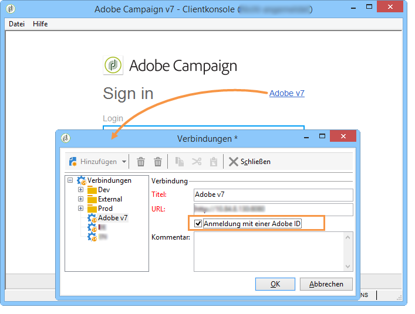

# Implementieren von IMS{#implementing-ims}

Nachdem die [IMS-Konfiguration](configuring-ims.md) abgeschlossen ist, können Sie die Verbindung aktivieren.

Gehen Sie wie folgt vor, um den IMS-Authentifizierungsmodus in Adobe Campaign zu aktivieren:

1. Öffnen Sie das Verbindungsfenster der Client-Konsole.
1. Wählen Sie die Umgebung aus, für die die Verbindung aktiviert werden soll.
1. Aktivieren Sie die Option **[!UICONTROL Anmeldung mit einer Adobe ID]** und speichern Sie Ihre Änderungen.

   

1. Verwenden Sie beim Herstellen einer Verbindung mit dieser Umgebung Ihre Adobe ID und Ihr Passwort.
